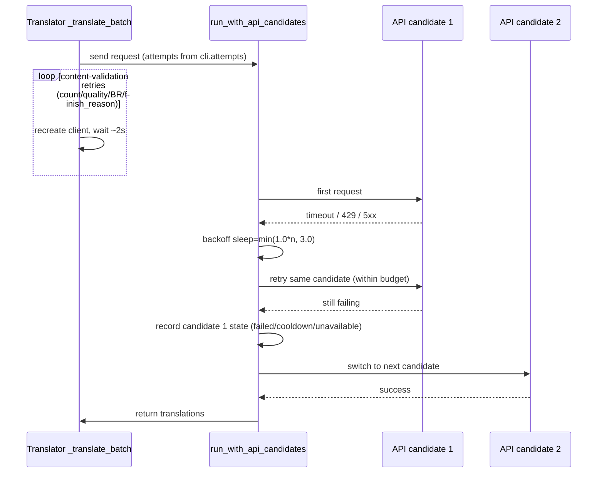
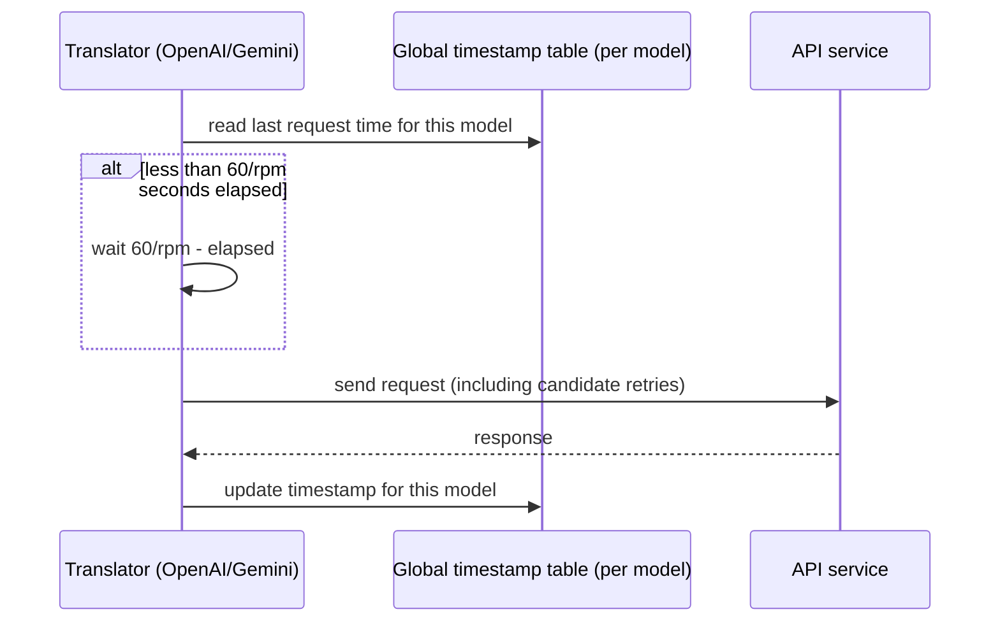
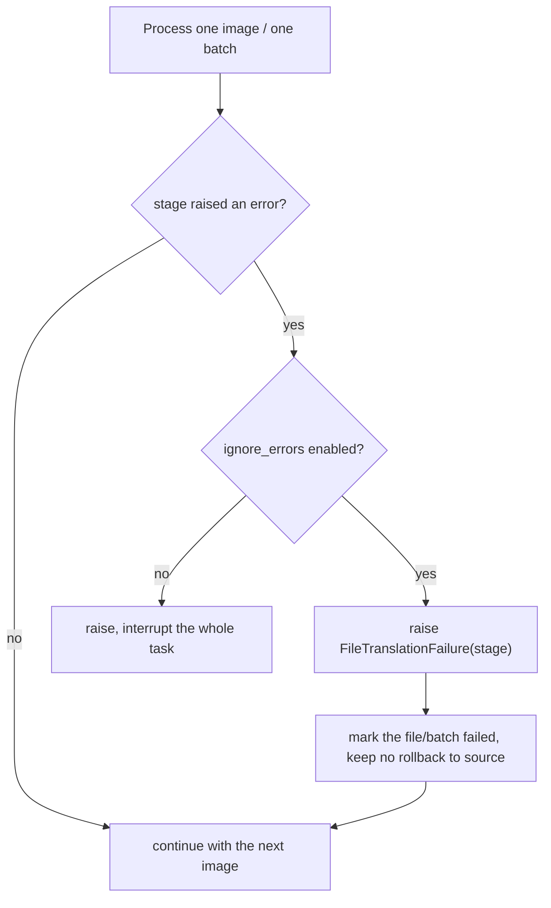
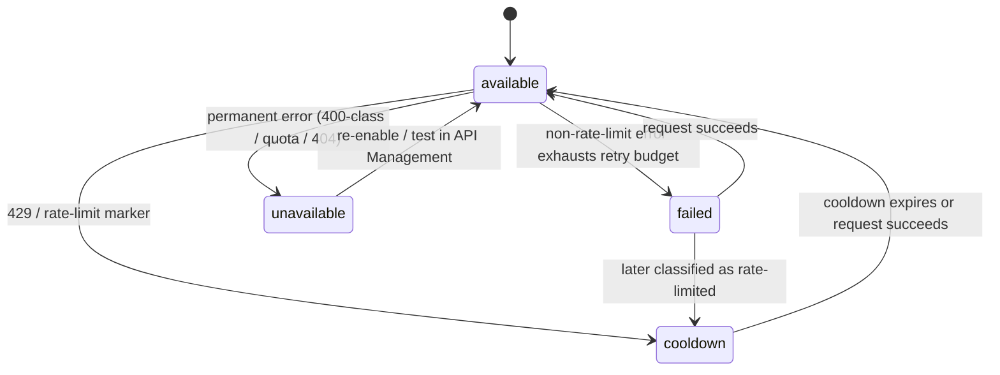
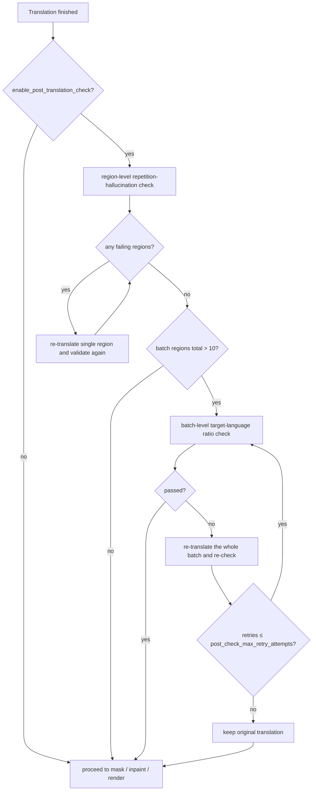

# Retry, Rate Limits, and Translation Quality

Use this page when translation requests occasionally time out or hit rate limits, or when you need to control API cost and how failures affect an entire batch. It covers retry attempts (`cli.attempts`), the per-minute request cap (`translator.max_requests_per_minute`), error ignoring (`cli.ignore_errors`), and post-translation quality checks. It does not cover translator selection (see [Translator selection and languages](./selection-and-languages.md)), prompt and context composition (see [Context and prompts](./context-and-prompts.md)), or API candidate slot management, `failover`/`round_robin` strategy, cooldown, and recovery (see the API-management pages).

## Feature boundary

- **Owned here**: `cli.attempts` decides the retry budget for request transport and content validation; `translator.max_requests_per_minute` decides the actual request pacing; `cli.ignore_errors` decides how failures are isolated at the file/batch level; `translator.enable_post_translation_check` and the three `post_check_*` thresholds decide post-translation quality checks.
- **Not owned here**: adding/removing candidate slots such as `OPENAI_API_KEY`/`_2`/`_3`, rotation strategy, cooldown, and unavailable states belong to API management; `cli.save_quality` (Image Save Quality) is output-file compression quality, not translation quality.
- High-quality translators (`openai_hq`/`gemini_hq`) and custom prompts affect translation quality but belong to the translator-selection and prompt pages; this page only notes that they are not part of the retry budget.
- `cli.attempts` and `translator.post_check_max_retry_attempts` are two independent retry budgets: the former covers request sending, the latter covers post-translation checks. They do not replace each other.

## UI operations

### Configure retry and error handling in Settings

1. Open “Settings” (`Settings`) and select the “General” (`General`) group.
2. Enter an integer in “Retry Attempts” (`Retry Attempts`): `-1` means unlimited retries, `0` means no retry after the first failure, and a positive integer is the number of extra retries.
3. Turning on “Ignore Errors” (`Ignore Errors`) marks a failed image or batch and continues with the remaining images; turning it off makes any stage exception interrupt the whole task.

### Configure request pacing in Settings

1. In “Settings”, select the “Translation” (`Translation`) group.
2. Enter a non-negative integer in “Max Requests Per Minute” (`Max Requests Per Minute`): `0` means no limit, and a positive integer is the maximum number of requests per minute.

### Post-translation quality check options

The current desktop settings layout `desktop_qt_ui/ui/main_page/settings_tab_layout.json` does not include the post-translation check toggle or its threshold rows in the “Translation” group. `translator.enable_post_translation_check`, `translator.post_check_max_retry_attempts`, `translator.post_check_repetition_threshold`, and `translator.post_check_target_lang_threshold` are read by the backend `Config` and take effect only through CLI/JSON configuration. Corresponding labels already exist in i18n (for example `label_enable_post_translation_check`), but the current Qt model `TranslatorSettings` and the settings layout do not bind these fields, so they must not be described as visible UI controls.

| UI call key | English actual value | Simplified Chinese actual value |
| --- | --- | --- |
| `Settings` | Settings | 设置 |
| `General` | General | 通用 |
| `Translation` | Translation | 翻译 |
| `label_attempts` | Retry Attempts | 重试次数 |
| `desc_cli_attempts` | Retry count when an API call fails. Set to -1 for unlimited retries. | 调用 API 出错时的重试次数。设为 -1 表示无限重试。 |
| `label_ignore_errors` | Ignore Errors | 忽略错误 |
| `desc_cli_ignore_errors` | Ignore errors and continue processing remaining images without interrupting the task. | 遇到错误时忽略并继续处理后续图片，不中断整个任务。 |
| `label_max_requests_per_minute` | Max Requests Per Minute | 每分钟最大请求数 |
| `desc_translator_max_requests_per_minute` | Maximum requests per minute. Set to 0 for no limit. Used to avoid API rate limits. | 每分钟最大请求数。设为 0 表示不限制。用于避免触发 API 速率限制。 |
| `label_enable_post_translation_check` | Enable Post-Translation Check | 启用翻译后检查 |
| `label_post_check_max_retry_attempts` | Max Retry Attempts | 翻译检查最大重试次数 |
| `label_post_check_repetition_threshold` | Repetition Detection Threshold | 重复检测阈值 |
| `label_post_check_target_lang_threshold` | Target Language Ratio Threshold | 目标语言比例阈值 |
| `label_save_quality` | Image Save Quality | 图像保存质量 |

## Parameters and options

#### `cli.attempts` — 重试次数 / Retry Attempts {#cli-attempts}

- Control: integer input.
- Location: Settings → General; UI call key `label_attempts`, description key `desc_cli_attempts`.
- Stored value: integer; `-1` means unlimited retries, `0` means no retry, and a positive integer is the number of extra retries. Values below `-1` are normalized to `0` (no retry) by `utils/retry.py`.
- Options: integer; there is no enum dropdown.
- Defaults: core `manga_translator/config.py#CliConfig.attempts` is `-1`; Qt model `desktop_qt_ui/core/config_models.py#CliSettings.attempts` is `-1`; release `config/config-example.json` is `3`.
- Effective stages: sending translation requests and validating their content.
- Mechanism: the value is normalized and then converted to a “total attempts” count (`attempts + 1`, while `-1` stays unlimited). The same budget applies at two nested layers: `api_key_rotation.run_with_api_candidates` retries retryable errors (timeout, 429, 5xx, and so on) on each candidate with a backoff of `min(1.0 * attempt_index, 3.0)` seconds, and `_translate_batch` in OpenAI/Gemini retries count mismatches, failed quality checks, missing BR markers, and unexpected `finish_reason` values under the same cap, recreating the client and waiting about 2 seconds before retrying. Because the two layers nest, the actual number of HTTP requests can exceed `attempts + 1`.
- Dependencies/conflicts: `-1` can retry forever when content filters or persistent 5xx responses keep failing; `attempts` does not limit post-check retries and does not change RPM pacing.
- Performance/API cost: unlimited or large budgets multiply request volume and prolong per-image time; combined with RPM pacing the total wait grows.
- Source evidence: `manga_translator/utils/retry.py`, `manga_translator/api_key_rotation.py#run_with_api_candidates`, `manga_translator/translators/openai.py#_translate_batch`, `desktop_qt_ui/app_logic.py#get_display_mapping`.

#### `translator.max_requests_per_minute` — 每分钟最大请求数 / Max Requests Per Minute {#max-requests-per-minute}

- Control: integer input.
- Location: Settings → Translation; UI call key `label_max_requests_per_minute`, description key `desc_translator_max_requests_per_minute`.
- Stored value: non-negative integer; `0` means no limit.
- Options: integer; there is no enum dropdown.
- Defaults: core `manga_translator/config.py#TranslatorConfig.max_requests_per_minute`, the Qt model, and the release config are all `0`.
- Effective stages: pacing before each translation request and timestamp updates after requests.
- Mechanism: OpenAI/Gemini (including HQ) write this value into `_MAX_REQUESTS_PER_MINUTE` in `parse_args` and track the last request time per model name in the class-level global timestamp table `_GLOBAL_LAST_REQUEST_TS`. Before each request, if less than `60 / rpm` seconds have elapsed, the translator waits; retries re-enter this check, so retries count toward the limit. The base `CommonTranslator.translate()` has `_ratelimit_sleep()` using the instance-level `_last_request_ts`.
- Dependencies/conflicts: this is a request-rate cap, not a concurrency cap; it does not handle 429 by itself, which is left to `cli.attempts` and candidate rotation.
- Performance/API cost: smaller values make requests sparser; with `1`, consecutive requests are at least 60 seconds apart, which can slow long manga significantly.
- Source evidence: `manga_translator/translators/openai.py#parse_args`, `gemini.py#parse_args`, `manga_translator/translators/common.py#_ratelimit_sleep`, `manga_translator/config.py#TranslatorConfig`.

#### `cli.ignore_errors` — 忽略错误 / Ignore Errors {#cli-ignore-errors}

- Control: toggle.
- Location: Settings → General; UI call key `label_ignore_errors`, description key `desc_cli_ignore_errors`.
- Stored value: boolean.
- Options: `true` / `false` (toggle).
- Defaults: core `manga_translator/config.py#CliConfig.ignore_errors`, the Qt model, and the release config are all `false`.
- Effective stages: exception handling in per-image stages (colorization, upscaling, detection, OCR, inpainting, rendering) and translation batches.
- Mechanism: each stage catches exceptions and checks `self.ignore_errors` first: when disabled it re-raises and interrupts the task; when enabled it raises `FileTranslationFailure(stage)`, which the batch loop uses to mark the file as failed and continue with the next images. When a translation batch fails, all contexts in that batch are marked failed and the source text is not restored. Cancellation checks are not affected by this toggle.
- Dependencies/conflicts: isolation granularity is the file/batch, not an individual text region; it cannot mask model-loading failures, cancellation, or fatal initialization errors.
- Source evidence: `manga_translator/manga_translator.py#parse_init_params`, `#_translate_batch`, `#FileTranslationFailure`, `desktop_qt_ui/app_logic.py#get_display_mapping`.

#### `translator.enable_post_translation_check` — 启用翻译后检查 / Enable Post-Translation Check {#enable-post-translation-check}

- Control: no UI control (the current desktop layout does not bind it; i18n has `label_enable_post_translation_check`).
- Location: backend `Config.translator`, configured through CLI/JSON.
- Stored value: boolean.
- Options: `true` / `false`.
- Defaults: core `manga_translator/config.py#TranslatorConfig.enable_post_translation_check` is `false`; the Qt model and release config do not serialize this key (`—`).
- Effective stages: after translation and before mask refinement, inpainting, and rendering.
- Mechanism: when enabled, each text region is checked for repetition hallucination; failing regions are re-translated by `_retry_translation_with_validation` up to `post_check_max_retry_attempts` times. The batch-level target-language ratio check participates when a batch has more than 10 regions in total and re-translates the whole batch under the same cap on failure; the original translation is kept if the check still fails.
- Dependencies/conflicts: depends on `translator.target_lang` and the `post_check_*` thresholds; `cli.attempts` does not control retries under this toggle.
- Source evidence: `manga_translator/config.py#TranslatorConfig`, `manga_translator/manga_translator.py#_validate_translation`, `#_retry_translation_with_validation`.

#### `translator.post_check_max_retry_attempts` — 翻译检查最大重试次数 / Max Retry Attempts {#post-check-max-retry-attempts}

- Control: no UI control (i18n has `label_post_check_max_retry_attempts`).
- Location: backend `Config.translator`, configured through CLI/JSON.
- Stored value: non-negative integer.
- Options: integer; there is no enum dropdown.
- Defaults: core `manga_translator/config.py#TranslatorConfig.post_check_max_retry_attempts` is `3`; the Qt model and release config do not serialize this key (`—`). The translator-internal fallback is `2` (`common.py#Translator.__init__`).
- Effective stages: single-region re-translation of regions that fail the post-translation check.
- Mechanism: `_retry_translation_with_validation` loops over `_validate_translation`; when a region is invalid it calls `dispatch` again for that single region and validates again, keeping the original translation when the cap is reached.
- Dependencies/conflicts: only takes effect when `enable_post_translation_check=true`; independent of `cli.attempts`.
- Source evidence: `manga_translator/manga_translator.py#_retry_translation_with_validation`, `manga_translator/translators/common.py#parse_args`.

#### `translator.post_check_repetition_threshold` — 重复检测阈值 / Repetition Detection Threshold {#post-check-repetition-threshold}

- Control: no UI control (i18n has `label_post_check_repetition_threshold`).
- Location: backend `Config.translator`, configured through CLI/JSON.
- Stored value: positive integer.
- Options: integer; there is no enum dropdown.
- Defaults: core `manga_translator/config.py#TranslatorConfig.post_check_repetition_threshold` is `20`; the Qt model and release config do not serialize this key (`—`). The translator-internal fallback is `5`.
- Effective stages: region-level repetition-hallucination detection in the post-translation check.
- Mechanism: `_check_repetition_hallucination` checks consecutive character repetition, consecutive word/CJK-character repetition, and phrase repetition in order; reaching the threshold classifies the text as a hallucination and triggers re-translation.
- Dependencies/conflicts: smaller thresholds are more sensitive; it combines with the target-language ratio check in an “or” relationship, so either failure triggers the retry path.
- Source evidence: `manga_translator/manga_translator.py#_check_repetition_hallucination`.

#### `translator.post_check_target_lang_threshold` — 目标语言比例阈值 / Target Language Ratio Threshold {#post-check-target-lang-threshold}

- Control: no UI control (i18n has `label_post_check_target_lang_threshold`).
- Location: backend `Config.translator`, configured through CLI/JSON.
- Stored value: float (ratio).
- Options: a ratio between `0` and `1`; there is no enum dropdown.
- Defaults: core `manga_translator/config.py#TranslatorConfig.post_check_target_lang_threshold` is `0.5`; the Qt model and release config do not serialize this key (`—`).
- Effective stages: batch-level target-language ratio check in the post-translation check.
- Mechanism: when a batch has more than 10 text regions in total, the translations of all regions in that batch are merged and classified with py3langid, then compared with `target_lang`; on failure the whole batch is re-translated up to `post_check_max_retry_attempts` times. `_check_target_language_ratio` keeps the `min_ratio` parameter but the new logic does not actually use that value, making only a binary “is target language” judgment.
- Dependencies/conflicts: requires `enable_post_translation_check=true` and more than 10 regions in the batch; the check is skipped for fewer regions.
- Source evidence: `manga_translator/manga_translator.py#_check_target_language_ratio`, `#_validate_translation`.

## Runtime behavior

### Retry layers and candidate rotation {#retry-layers}

`cli.attempts` is the number of extra retries, not the total number of requests. The same budget is consumed by two nested layers: the candidate-rotation layer retries retryable errors on the same API candidate until the budget runs out or a permanent error occurs, then switches candidates; the content-validation layer retries count mismatches, failed quality checks, missing BR markers, and unexpected `finish_reason` values. A single translation operation can therefore issue far more than `attempts + 1` HTTP requests.

### RPM request pacing {#rpm-pacing}

When `translator.max_requests_per_minute` is `0` there is no pacing; for a positive value, consecutive requests are at least `60 / rpm` seconds apart. OpenAI/Gemini families keep a per-model timestamp shared across instances, and retries re-enter the pacing check.

### Failure isolation and candidate states {#failure-isolation}

Failure isolation has two layers. At the file/batch layer, `cli.ignore_errors` decides: when disabled, an exception interrupts the task immediately; when enabled, `FileTranslationFailure(stage)` marks the current file as failed and processing continues. At the candidate layer, the `api_key_rotation` state machine decides: only `unavailable` and a `cooldown` that is still active exclude a candidate from the list, while a plain `failed` state does not exclude it and the candidate can be tried again on the next request.

The candidate state machine follows. The cooldown duration defaults to 60 seconds, uses the `Retry-After` header when present, and is capped at 600 seconds; permanent errors (400-class, 402, 404, quota, invalid key) go straight to `unavailable` and can only be cleared by re-enabling or testing in API Management.

### Post-translation check flow {#post-check-flow}

The post-translation check runs only when `translator.enable_post_translation_check=true`, and the current desktop layout does not expose this toggle. The check has two layers: first, each region is checked for repetition hallucination and failing regions are re-translated individually; then, the whole batch is checked for target-language ratio and re-translated as a batch. Both loops are bounded by `post_check_max_retry_attempts`.

## Dependencies and conflicts

- `cli.attempts`, `translator.max_requests_per_minute`, `cli.ignore_errors`, and the post-translation check are four independent dimensions: retry budget, request pacing, failure isolation, and quality checking do not replace each other.
- `attempts=-1` combined with content filters or persistent 5xx responses may run for a long time; `max_requests_per_minute` only throttles sending and does not reduce the cost of a single request.
- `ignore_errors` is file/batch-level isolation; a single failing region inside a page still goes through quality retries or keeps its original translation and is not affected by this toggle.
- Candidate rotation only matters when more than one API candidate exists; with a single candidate, `cli.attempts` decides the retry budget on it. Candidate state is kept in the process across tasks and is not written to configuration files.
- `save_quality` (Image Save Quality) and `context_size` (Context Pages) also affect the perceived “quality”, but they are output compression quality and context quality respectively; see [CLI batch and output](../settings/cli-batch-and-output.md) and [Context and prompts](./context-and-prompts.md).

## Related files and formats

| File/format | Actual role on this page | Manual-edit and compatibility note |
| --- | --- | --- |
| `config/config-example.json` | Release defaults `attempts: 3`, `max_requests_per_minute: 0`, `ignore_errors: false` | Use sanitized examples only; importing user configuration overrides memory settings |
| `config/config.json` | Runtime user-settings persistence | Never read or display a real user file |
| `.env` and API-management slots | Provide API candidates; retries and pacing act on candidate requests | Never show real keys; slot CRUD and strategy belong to the API-management pages |
| `manga_translator_work/` debug directory | Failed files keep debug artifacts per workflow rules | Remove request bodies, keys, and private paths before sharing |

## Mermaid data-flow limits

The diagrams describe the request and state transitions confirmed in source; they do not claim that every run retries or paces. `attempts=0`, RPM `0`, a single candidate, `ignore_errors=false`, and a disabled post-translation check all take their documented bypasses; candidate cooldown/unavailable states appear only after failures have occurred. No runtime screenshot or private task artifact has been fabricated.

## Source evidence {#source-evidence}

| Layer | File | What was checked |
| --- | --- | --- |
| Settings UI | `desktop_qt_ui/ui/main_page/settings_tab_layout.json`, `desktop_qt_ui/ui/main_page/dynamic_settings.py` | Integer inputs and toggles in the General/Translation groups |
| UI/i18n | `desktop_qt_ui/app_logic.py`, `desktop_qt_ui/locales/en_US.json`, `zh_CN.json` | Actual bilingual label and description values |
| Config models | `desktop_qt_ui/core/config_models.py`, `manga_translator/config.py` | Qt, release, and core defaults; Qt model does not serialize post-check keys |
| Retry normalization | `manga_translator/utils/retry.py` | `normalize_retry_attempts`, `resolve_total_attempts`, retryable-error classification |
| Candidate rotation | `manga_translator/api_key_rotation.py`, `manga_translator/runtime_api_resolver.py` | Candidate state machine, cooldown/unavailable, `run_with_api_candidates` |
| Translator consumers | `manga_translator/translators/openai.py`, `gemini.py`, `openai_hq.py`, `gemini_hq.py`, `common.py` | `_translate_batch` retry loop, RPM timestamps, `parse_args` |
| Failure isolation | `manga_translator/manga_translator.py` | `ignore_errors` branches, `FileTranslationFailure`, batch failure marking |
| Post-check | `manga_translator/manga_translator.py` | `_validate_translation`, `_retry_translation_with_validation`, repetition and target-language checks |
| Desktop assembly | `desktop_qt_ui/app_logic.py#_do_processing` | Config dict to `MangaTranslator` params |

## Verification {#verification}

| Check | Status | Notes |
| --- | --- | --- |
| BLUEPRINT, PAGE_GUIDELINES, TODO | Complete | Read in full and followed the page contract |
| UI layout and calls | Complete | Statically checked settings layout, dynamic settings, and display mapping |
| `en_US` / `zh_CN` actual locales | Complete | The table records key, actual English, and actual Simplified Chinese values |
| Retry/RPM/post-check runtime chain | Complete | Statically checked `utils/retry.py`, `api_key_rotation.py`, OpenAI/Gemini, and `manga_translator.py` |
| Sanitized runtime verification | Deferred | No real `.env`, user `config.json`, API key/token, username, user image, or private prompt was read |
| VitePress | Deferred | Coordinator should run `npm run docs:build --prefix doc/wiki` plus mirror/source checks before merge |
