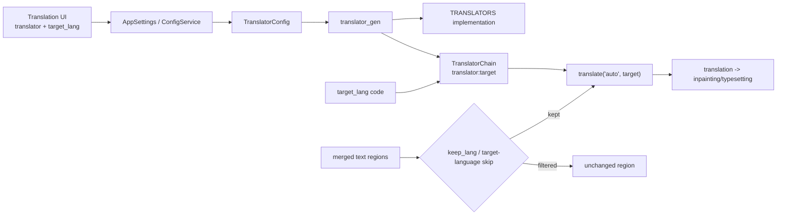
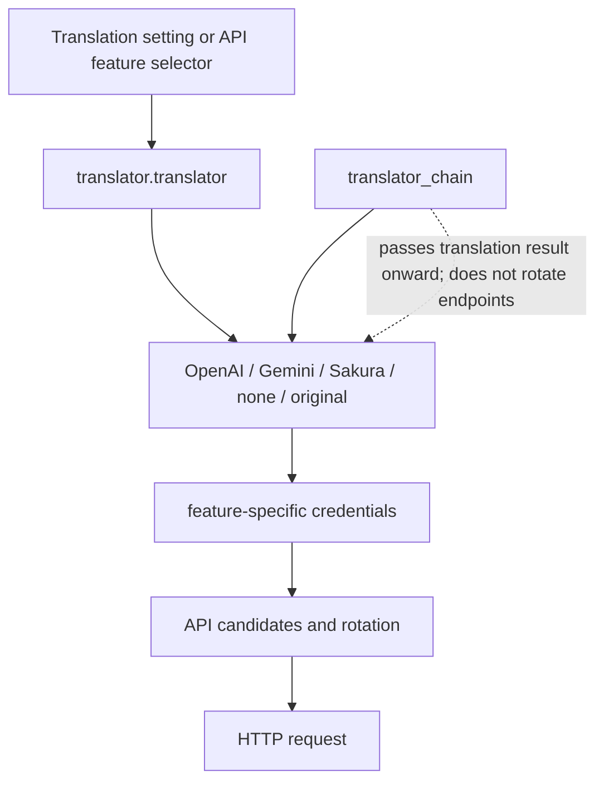

# Translator Selection and Target Languages

This page documents desktop translator selection, target language, and source-language filtering after text-line merging. It does not document API slot rotation, prompt editing, context construction, or detailed translation-chain behavior.

## Feature boundary

- `translator.translator` selects OpenAI, Gemini, Sakura, high-quality variants, no translation, or original text. It changes the translation implementation, not endpoint rotation within one provider.
- `translator.target_lang` stores a three-letter code used as the target of an individual translation request.
- `translator.keep_lang` filters regions after text-line merging by detected source language. Non-matching regions remain unchanged and are not inpainted, translated, or rendered.
- `translator.no_text_lang_skip` controls whether text already detected as the target language may be skipped. Enabling “Don't Skip Target Lang” forces it through translation.
- API Key/Base/Model, `failover`/`round_robin`, prompts, glossary, streaming, RPM, and quality retries belong to API-management or other translator pages.

## UI operations

### Select values in the Translation settings tab

1. Open Settings and select “Translation”. `settings_tab_layout.json` binds this tab to `translator.translator`, `translator.target_lang`, `translator.keep_lang`, and `translator.no_text_lang_skip` in that order.
2. Choose an implementation in “Translator”. Display text comes from the dynamic mapping in `app_logic.py`, not directly from Python enum names.
3. Choose a language in “Target Language”. Display text comes from a `lang_<code>` locale key and is reverse-mapped when saved; for example, “English” is stored as `ENG`.
4. In “Keep Source Language”, choose a source language or “No Filter”. With a language selected, only regions detected as that language continue to translation and later image processing.
5. Enable “Don't Skip Target Lang” to force target-language text through translation. Changes update memory immediately and are persisted by the configuration service.

The translator feature selector in API Management writes the same `translator.translator` key and refreshes the required credential groups; it is not a separate translator setting. API slots only change the request endpoint inside the selected provider.

### UI evidence: call key -> locale value

| UI call key | Actual `en_US.json` value | Actual `zh_CN.json` value |
| --- | --- | --- |
| `label_translator` | Translator | 翻译器 |
| `label_target_lang` | Target Language | 目标语言 |
| `label_keep_lang` | Keep Source Language | 保留源语言 |
| `label_no_text_lang_skip` | Don't Skip Target Lang | 不跳过目标语言文本 |
| `translator_openai_hq` | OpenAI High Quality | OpenAI高质量翻译 |
| `translator_gemini_hq` | Gemini High Quality | Gemini高质量翻译 |
| `translator_none` | None | 无 |
| `translator_original` | Original | 原文 |
| `lang_CHS` | Simplified Chinese | 简体中文 |
| `lang_CHT` | Traditional Chinese | 繁体中文 |
| `lang_ENG` | English | 英语 |
| `lang_JPN` | Japanese | 日语 |
| `lang_KOR` | Korean | 韩语 |
| `lang_FRA` | French | 法语 |
| `lang_DEU` | German | 德语 |
| `lang_ESP` | Spanish | 西班牙语 |
| `lang_RUS` | Russian | 俄语 |
| `lang_ARA` | Arabic | 阿拉伯语 |

`Google Gemini`, `OpenAI`, and `Sakura` are hard-coded display values in `app_logic.py`, not locale keys such as `translator_gemini`; this page preserves those actual values rather than inventing alternate UI labels. The remaining language keys appear in the complete target-language matrix.

## Option matrix

### `translator.translator` — 翻译器 / Translator

| Stored value | English | 简体中文 | Applicable condition |
| --- | --- | --- | --- |
| `openai` | OpenAI | OpenAI | Translation API credentials required |
| `openai_hq` | OpenAI High Quality | OpenAI高质量翻译 | OpenAI credentials and high-quality prompt required; Qt default |
| `gemini` | Google Gemini | Google Gemini | Gemini credentials required |
| `gemini_hq` | Gemini High Quality | Gemini高质量翻译 | Gemini credentials and high-quality prompt required |
| `sakura` | Sakura | Sakura | Sakura address/dictionary configuration |
| `none` | None | 无 | Perform no translation |
| `original` | Original | 原文 | Keep original text as the result |

OpenAI/Gemini, including HQ variants, activate the `translator_openai`/`translator_gemini` API groups; Sakura activates `translator_sakura`. Implementations without APIs do not require a credential card.

### `translator.target_lang` — 目标语言 / Target Language

The target language values are provided by `TranslationService.get_target_languages()`, not arbitrary locale names.

| Stored value | English | 简体中文 |
| --- | --- | --- |
| `CHS` | Simplified Chinese | 简体中文 |
| `CHT` | Traditional Chinese | 繁体中文 |
| `CSY` | Czech | 捷克语 |
| `NLD` | Dutch | 荷兰语 |
| `ENG` | English | 英语 |
| `FRA` | French | 法语 |
| `DEU` | German | 德语 |
| `HUN` | Hungarian | 匈牙利语 |
| `ITA` | Italian | 意大利语 |
| `JPN` | Japanese | 日语 |
| `KOR` | Korean | 韩语 |
| `POL` | Polish | 波兰语 |
| `PTB` | Portuguese (Brazil) | 葡萄牙语（巴西） |
| `ROM` | Romanian | 罗马尼亚语 |
| `RUS` | Russian | 俄语 |
| `ESP` | Spanish | 西班牙语 |
| `TRK` | Turkish | 土耳其语 |
| `UKR` | Ukrainian | 乌克兰语 |
| `VIN` | Vietnamese | 越南语 |
| `ARA` | Arabic | 阿拉伯语 |
| `SRP` | Serbian | 塞尔维亚语 |
| `HRV` | Croatian | 克罗地亚语 |
| `THA` | Thai | 泰语 |
| `IND` | Indonesian | 印度尼西亚语 |
| `FIL` | Filipino (Tagalog) | 菲律宾语（他加禄语） |

These are the 25 values currently displayed by the UI. The backend `VALID_LANGUAGES` set validates chain configuration; do not document a language absent from the service mapping as a UI option.

### `translator.keep_lang` — 保留源语言 / Keep Source Language

| Stored value | English | 简体中文 | Behavior |
| --- | --- | --- | --- |
| `none` | No Filter | 不过滤 | Disable source-language filtering |
| `CHS` | Simplified Chinese | 简体中文 | Keep only regions detected as Simplified Chinese |
| `CHT` | Traditional Chinese | 繁体中文 | Keep only regions detected as Traditional Chinese |
| `ENG` | English | 英语 | Keep only regions detected as English |
| `JPN` | Japanese | 日语 | Keep only regions detected as Japanese |
| `KOR` | Korean | 韩语 | Keep only regions detected as Korean |
| Other `KEEP_LANGUAGES` codes | Corresponding `lang_<code>` English value | Corresponding `lang_<code>` Chinese value | Determined by the backend set |

`none` is the UI disable value; “Keep Source Language” is not the target-language selector.

## Default matrix and parameter boundaries

| Parameter | Core `manga_translator/config.py` | Qt `desktop_qt_ui/core/config_models.py` | Release/startup visible value | Stage and final consumer |
| --- | --- | --- | --- | --- |
| `translator.translator` | `openai_hq` | `openai_hq` | `openai_hq` | Translation; `translator_gen`, `get_translator()` |
| `translator.target_lang` | `ENG` | `CHS` | `CHS` | Translation; `TranslationService`, `TranslatorChain`, region defaults |
| `translator.keep_lang` | `none` | `none` | `none` | Post-merge language filtering; translation pipeline |
| `translator.no_text_lang_skip` | `False` | `False` | `False` | Pre-translation skip decision |

The core and Qt defaults differ: desktop startup uses `CHS`, while the standalone core fallback is `ENG`. Imported configuration, explicit CLI arguments, or an editor region target can override them.

#### `translator.translator` — 翻译器 / Translator

- Control: combo box; the Translation settings tab and API Management translation selector share the key.
- Stage: before translation dispatch; creates the implementation and refreshes API groups.
- Dependencies/conflicts: OpenAI/Gemini/HQ require credentials; Sakura requires address/dictionary settings; `none`/`original` make no remote request. Provider switching is not slot rotation.
- Consumers: `Translator`, `TRANSLATORS`, `get_translator()`, and `TranslationService`.

#### `translator.target_lang` — 目标语言 / Target Language

- Control: combo box; saves a three-letter code and displays it through `lang_<code>`.
- Stage: request construction; a request is represented as `<translator>:<target_lang>`, and missing region values use the current configuration.
- Dependencies/conflicts: must be in the UI list and translator support boundary; `supports_languages(..., fatal=True)` can reject an unsupported chain target.
- Consumers: `TranslationService.set_target_language()`, `TranslatorChain`, `translators.prepare/dispatch()`, and the file service.

#### `translator.keep_lang` — 保留源语言 / Keep Source Language

- Control: combo box; `none` disables filtering.
- Stage: after text-line merging and before translation, erasure, and rendering.
- Dependencies/conflicts: depends on OCR, language detection, and merged regions; a detection error can leave original text. It is not a target-language substitute.
- Consumers: `KEEP_LANGUAGES`, translation-pipeline language filtering, and region state.

#### `translator.no_text_lang_skip` — 不跳过目标语言文本 / Don't Skip Target Lang

- Control: switch; default `False`.
- Stage: pre-translation filtering.
- Dependencies/conflicts: enabling increases requests and API cost; it does not change `keep_lang` or target language.
- Consumers: `TranslatorConfig` and target-language skip logic.

## Runtime behavior

`TranslationService` receives the enum and language code saved by the UI, builds one `TranslatorChain`, and `translators.dispatch()` calls implementations in chain order. `translator_chain` or `selective_translation` is chaining/language-based selection, not API slot rotation. API Management can change the same `translator.translator` key; candidate resolution and cooldown remain API-management concerns.

## Dependencies and conflicts

- Detection/OCR must produce text regions and source-language information before `keep_lang` can operate; it runs after merging.
- `none` performs no translation while `original` explicitly preserves the original result. Neither requires a remote API; later rendering remains workflow-dependent.
- HQ options depend on the corresponding high-quality prompt resource. `extract_glossary` also depends on HQ prompt configuration.
- Changing target language changes the request and typesetting input, not OCR language, render direction, or provider.
- `keep_lang` filters by source language; `no_text_lang_skip` controls target-language skipping. Source filtering still applies first.

## Related files and formats

| File or field | Use | Format and caution |
| --- | --- | --- |
| `config/config.json` | Persist `translator` settings | JSON; import validates and replaces memory settings; do not paste private user configuration |
| `config/config-example.json` | Non-secret field example | Reference only; core and Qt defaults can differ |
| `.env` | API credentials, addresses, and models | Never display real keys, tokens, or user values |
| `dict/prompt_example.yaml` | HQ prompt resource path | YAML; custom prompt details belong elsewhere |
| Translation JSON region `target_lang` | Region-level fallback/serialization | Only present in workflows that write it; distinct from global setting |

## Translator/API selection boundary

Translator selection changes the implementation; the API feature selector is another UI write point; Key/Base/Model slots and `failover`/`round_robin` rotate only within the selected implementation; `translator_chain` passes output to the next translator.

## Source evidence

| Layer | Absolute path | Verified content |
| --- | --- | --- |
| UI layout | `C:/manga-translator-ui-package/desktop_qt_ui/ui/main_page/settings_tab_layout.json` | Translation tab fields and order |
| UI mapping | `C:/manga-translator-ui-package/desktop_qt_ui/app_logic.py` | Translator, language, keep-language, and label mappings |
| UI service | `C:/manga-translator-ui-package/desktop_qt_ui/services/translation_service.py` | Available translators/languages and request-chain construction |
| Qt defaults | `C:/manga-translator-ui-package/desktop_qt_ui/core/config_models.py` | Desktop defaults |
| Core definition | `C:/manga-translator-ui-package/manga_translator/config.py` | Enums, `TranslatorConfig`, chain parsing, and core defaults |
| Dispatch | `C:/manga-translator-ui-package/manga_translator/translators/__init__.py` | `TRANSLATORS`, preparation, dispatch, and chain execution |
| Locale | `C:/manga-translator-ui-package/desktop_qt_ui/locales/en_US.json` | Actual English values |
| Locale | `C:/manga-translator-ui-package/desktop_qt_ui/locales/zh_CN.json` | Actual Simplified Chinese values |

## Verification

| Check | Status | Notes |
| --- | --- | --- |
| BLUEPRINT/PAGE_GUIDELINES/TODO | Complete | Read in full before editing |
| Placeholder inspection | Complete | Continued from existing mirrored placeholders |
| UI layout, call keys, and locales | Complete (static) | Checked layout, mapping, service, and both locale files |
| Core/Qt defaults | Complete (static) | Recorded the `ENG` versus `CHS` difference |
| Runtime UI/network translation | Pending | Requires sanitized configuration and controllable service; no runtime result is claimed |
| Security review | Complete | No secrets, tokens, user images, private prompts, or user configuration values included |
| VitePress build | Pending | Run `npm run docs:build --prefix doc/wiki` |
