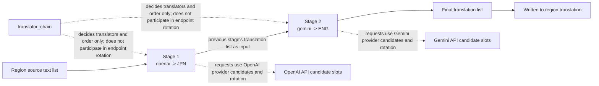
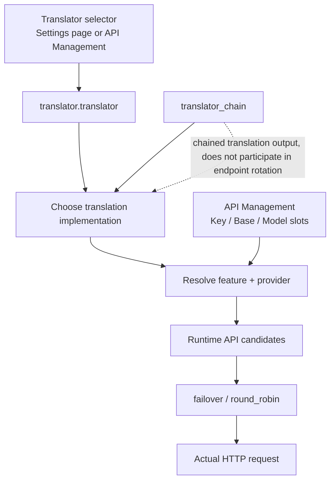

# Translator Chaining

Use `translator_chain` when the same batch of text must first be translated to an intermediate language by one translator and then continued by another translator into the final language. It feeds the output text list of one translator directly into the next one and runs the stages in configuration order. This page covers the chain-string format, the execution order, the difference from API candidate-slot rotation, and the boundary with context and prompts.

## Feature boundary

- `translator.translator_chain` is a string field on the core `TranslatorConfig`, defaulting to `null`; it splits translation into multiple `translator:language` stages executed in sequence.
- Chaining decides only “which translators, in what order, and into which language each stage translates”. It does not pick request endpoints and does not handle retries, cooldown, unavailability, or recovery.
- Chaining does not change context or prompt settings: `cli.context_size` history pages, `translator.high_quality_prompt_path`, and `extract_glossary` still work through their own mechanisms.
- It competes with the single `translator` as a source of the translation generator: `translator_gen` builds `selective_translation` first, then `translator_chain`, then the single `translator`.
- `selective_translation` is a sibling field parsed into the same `TranslatorChain` (language-based translator selection); this page does not expand it. See [Translator engine dispatch](./engine-dispatch.md).
- The Translation group in the desktop Settings page has no `translator_chain` control row; the Web UI hides the field as an advanced key by default.

## Configuration format

### Chain-string format

The value of `translator_chain` is a `;`-separated chain string; each segment is `translator:language-code`, for example `openai:JPN;gemini:ENG`. `TranslatorChain.__init__()` parses it segment by segment:

- The translator name must be a `Translator` enum member (`openai`, `openai_hq`, `gemini`, `gemini_hq`, `sakura`, `none`, `original`) and must exist in the `TRANSLATORS` registry.
- The language code must be a three-letter stored code from `VALID_LANGUAGES` (for example `JPN`, `ENG`, `CHS`, `CHT`, `KOR`) and is case-sensitive.
- The source language of every stage is fixed to `auto`; the target language is that stage's code. `prepare_translation()` validates `supports_languages('auto', target)` for each stage before running.
- An empty string, a missing `:`, an unknown translator name, or an unknown language code raises an error during config parsing; nothing is silently skipped at translation time.

| Stored value | English | Simplified Chinese |
| --- | --- | --- |
| `JPN` | Japanese | 日语 |
| `ENG` | English | 英语 |
| `CHS` | Simplified Chinese | 简体中文 |
| `CHT` | Traditional Chinese | 繁体中文 |
| `KOR` | Korean | 韩语 |

`openai:JPN;gemini:ENG` means: OpenAI first translates the source text into Japanese, then the Japanese output is handed to Gemini, which translates it into English. The full language set lives in `manga_translator/translators/common.py#VALID_LANGUAGES`.

### Configuration entry points and UI text

`translator_chain` is not a row in the desktop Settings page. The places that accept it are:

- Config file: JSON key `translator.translator_chain` (for example `config/config.json`). It is a core `TranslatorConfig` field defaulting to `null`; the Qt model and the release template do not include it.
- CLI: local mode reads the config file via `--config <file>`. Current `args.py` has no standalone `--translator-chain` argument (the `--translator ... -l ...` example in the `config.py` exception message is historical and is not a current CLI argument).
- Web/server: the `/config` configuration API can read and write the field, but `translator.translator_chain` is in the server and web-frontend hidden-key sets, so it is not shown to users by default.

The actual UI text is recorded below. The `translator_chain` and `translator_selective` locale keys exist in both language files but are not referenced by the current desktop settings layout (no bound control), like historical labels such as `translator_google`; their presence does not mean the current Qt UI offers chain-translation options.

| UI call key | English actual value | Simplified Chinese actual value |
| --- | --- | --- |
| `label_translator` | Translator | 翻译器 |
| `translator_chain` | Chain Translator | 链式翻译 |
| `translator_selective` | Selective Translator | 智能选择翻译器 |
| `desc_translator_translator` | Choose the translation engine. The current Qt UI offers OpenAI, Google Gemini, Sakura, High-Quality OpenAI, High-Quality Gemini, plus No Translation and Keep Original. High-Quality OpenAI is recommended. | 选择翻译引擎。当前 Qt UI 可选翻译器包括 OpenAI、Google Gemini、Sakura、高质量翻译 OpenAI、高质量翻译 Gemini，以及“不翻译”“保留原文”。推荐高质量翻译 OpenAI。 |

The hidden-key comment `'translator.translator_chain',  // 链式翻译` in `manga_translator/server/static/script.js` is a code comment, not a user-visible label.

## Execution order and data flow

`Config.translator_gen` parses the `translator_chain` string into a `TranslatorChain`; `dispatch()` runs every stage in `chain.chain` order: it calls `translator.parse_args(config)`, then `translator.translate('auto', stage-language, text-list)`. The translated list returned by one stage becomes the input of the next stage, and the final stage's result is written back to the region field `region.translation`.

Notes: the output of `S1` is not a file or an intermediate render; it is an in-memory list of translated strings, passed verbatim as `S2`'s queries. `A1`/`A2` show that every chain stage still resolves its own provider Key/Base/Model candidates and runs `failover`/`round_robin` on its requests; that rotation happens inside each stage's request, and `translator_chain` itself does not take part.

In a network-free check with fake translators for `openai:JPN;gemini:ENG`, the Gemini stage received exactly the translations returned by the OpenAI stage (see Verification). `dispatch_batch()` is a batch wrapper: it flattens batch queries, calls the same `dispatch()`, and regroups by the original batches; the chain semantics are unchanged.

## Difference from API candidate-slot rotation

- The chain decides “which translators, in what order, and into which language each stage translates”; candidate slots decide “which request endpoint to use inside the chosen provider”.
- Every chain stage is its own translator instance that still resolves its Key/Base/Model candidates through `resolve_runtime_api_config(feature, provider)` (the OpenAI stage resolves `translator`/`openai`, the Gemini stage resolves `translator`/`gemini`) and handles retries, cooldown, and recovery with `run_with_api_candidates` on its requests.
- `translator_chain` has no relationship with numbered slots such as `OPENAI_API_KEY_2`; a failing stage does not switch the chain to another API candidate.
- The Key/Base/Model slots and `failover`/`round_robin` on the API Management page belong to [API slots and rotation](../api-management/slots-and-rotation.md).

## Boundary with context and prompts

- `cli.context_size` (history pages) and the prompt fields are still used by the overall translation stage; the chain itself neither builds history messages nor changes prompt composition.
- The chained `dispatch()` branch passes plain text lists: it does not call `set_prev_context()` and does not pass `ctx` to `translate()`. Multi-page history injection, region-level AI line breaking, and HQ batch data are handled by the single-translator branch and the context mechanism (static finding; requires sanitized runtime validation).
- Every chain stage calls `parse_args(config)` with the same `TranslatorConfig`, so streaming, RPM, and ordinary retry settings apply per translator instance, but they are not part of the chain semantics on this page.
- The configuration boundary of context and prompts is documented in [Context and prompts](./context-and-prompts.md).

## Limits and notes

- Every provider in the chain must satisfy its own credentials and language support; `prepare_translation()` validates the target language of each stage before running.
- Putting `none` in a chain produces empty strings that continue into the next stage, so it is not a meaningful chain stage; `original` passes text through unchanged.
- If a chain contains an HQ stage (`openai_hq`/`gemini_hq`), its region-level batch behavior differs from the single-translator path and needs sanitized runtime validation; this document does not fabricate run results.
- Entry-routing note (static finding): `_batch_translate_texts()` branches on the single `translator` value first; the default AI translators (`openai`/`gemini`/`openai_hq`/`gemini_hq`) take the single-translator branch, and the chain is only reached through the generic `dispatch_translation` branch. Which entry points actually execute the chain must be confirmed by sanitized runtime validation.
- Every stage produces one (or several) translation request; a longer chain multiplies API calls and cost and enlarges the failure surface.

## Related configuration

| Setting | Role | Notes |
| --- | --- | --- |
| `translator.translator_chain` | Defines the chain string and execution order | Core field, default `null`; absent from Qt/release templates |
| `translator.translator` | Single translator when no chain exists | Mutually exclusive with the chain; the desktop selector still writes this key |
| `translator.target_lang` | Single target language when no chain exists | In chain mode each stage uses its own language code |
| `selective_translation` | Language-based translator selection (sibling field) | Parsed into the same `TranslatorChain`; not expanded here |
| `cli.context_size` and prompt fields | History and prompt settings | Orthogonal to the chain; see the context-and-prompts page |
| API Key/Base/Model slots and strategy | Endpoint candidates and rotation per stage provider | Not part of chain semantics; see the API-management pages |

## Source evidence {#source-evidence}

| Layer | File | What was checked |
| --- | --- | --- |
| Core configuration | `manga_translator/config.py` | `TranslatorChain` parsing, `translator_chain`/`selective_translation` fields, `translator_gen` priority |
| Registry and dispatch | `manga_translator/translators/__init__.py` | `TRANSLATORS`, `get_translator()`, `prepare()`, `dispatch()`, `dispatch_batch()` chain order |
| Languages and implementations | `manga_translator/translators/common.py`, `none.py`, `original.py` | `VALID_LANGUAGES` and `translate()` semantics |
| Runtime pipeline | `manga_translator/manga_translator.py` | `prepare_translation`, `_batch_translate_texts` routing, translation written back to regions |
| Endpoint resolution | `manga_translator/runtime_api_resolver.py`, `translators/openai.py`, `gemini.py` | Per-stage `feature/provider` candidates and internal rotation |
| Desktop UI | `desktop_qt_ui/ui/main_page/settings_tab_layout.json`, `app_logic.py` | Translation group has no chain control; `label_translator`/`desc_translator_translator` mapping |
| i18n | `desktop_qt_ui/locales/en_US.json`, `zh_CN.json` | Actual `translator_chain`/`translator_selective` values and unbound status |
| Web server | `manga_translator/server/routes/config.py`, `server/core/config_manager.py`, `server/static/script.js` | Hidden-key sets and default hiding of `translator.translator_chain` |
| Research artifacts | `doc/wiki/research/default-sources.md`, `doc/wiki/data/settings.generated.json`, `doc/wiki/data/i18n.generated.json` | Three-layer default matrix and actual i18n values |

## Verification {#verification}

| Check | Status | Notes |
| --- | --- | --- |
| BLUEPRINT, PAGE_GUIDELINES, TODO | Complete | Read in full and followed the page contract |
| Chain parsing and `translator_gen` | Complete | Verified `openai:JPN;gemini:ENG` parsing and construction priority with `uv run python` |
| Chained data flow | Complete | Fake translators verified that one stage's output is the next stage's input (no network) |
| UI and i18n actual values | Complete (static) | `translator_chain`/`translator_selective` exist but are not bound to desktop controls |
| Real API chained run | Not run | Requires sanitized credentials and a controllable endpoint; documentation checks do not make real requests |
| Entry-routing runtime validation | Deferred | The `_batch_translate_texts` branch behavior needs sanitized runtime confirmation |
| Security review | Complete | No API key/token, username, private absolute path, user image, or private prompt is included |
| VitePress and static checks | Complete | `npm run docs:build --prefix doc/wiki` build passed; `verify-route-mirror.mjs` and `verify-source-evidence.mjs` both PASS |
