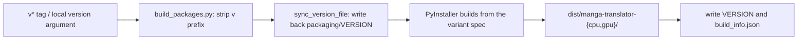
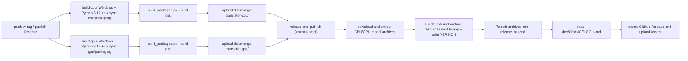

# Packaging and Release

This page is for maintainers. It explains how the project turns source code into distributable desktop and Docker artifacts, how version numbers are determined, how CI publishes to GitHub Releases and container registries, and the boundary of version-check and update-maintenance flows. It does not cover user-facing install and update steps (see [Update and version switching](../install/update-and-version-switching.md)), web-server ports and deployment (see [Web server ports and deployment](./web-server-ports-and-deployment.md)), repository module boundaries (see [Architecture and code boundaries](./architecture-and-code-boundaries.md)), or tests and code quality (see [Tests and code quality](./tests-and-code-quality.md)).

## Feature boundary {#feature-boundary}

- Version: a `v*` Git tag (for example `v2.2.10`) is authoritative for releases. `packaging/VERSION` is the version file shared by the build script and the version-check scripts. The `[project] version` in `pyproject.toml` and the hardcoded `VERSION` in `packaging/launch.py` are development markers only and do not participate in CI releases.
- Desktop artifacts: `packaging/build_packages.py` invokes PyInstaller with `packaging/manga-translator-cpu.spec` and `packaging/manga-translator-gpu.spec` to produce `dist/manga-translator-{cpu,gpu}/`.
- CI release: `.github/workflows/build-and-release.yml` builds both variants, bundles external runtime resources, creates split archives, and creates a GitHub Release on `v*` tag pushes, published releases, or manual dispatch. `.github/workflows/docker-build-push.yml` builds and pushes CPU/GPU Docker images.
- This page covers packaging and release only. Module code boundaries, test flows, and web ports/deployment belong to [Architecture and code boundaries](./architecture-and-code-boundaries.md), [Tests and code quality](./tests-and-code-quality.md), and [Web server ports and deployment](./web-server-ports-and-deployment.md) respectively.

## UI operations {#ui-operations}

Only two kinds of visible copy relate to packaging and release: the desktop window-title/sidebar version display and the source-install maintenance menu's version-check entry. Neither is a settings-page parameter; the full maintenance-menu workflow lives in [Update and version switching](../install/update-and-version-switching.md).

### Window title and version display {#window-title-and-version-display}

On startup the packaged app reads the `VERSION` file from runtime resources through `desktop_qt_ui/utils/app_version.py#get_app_version()` (search order `VERSION` then `packaging/VERSION`, strips the `v` prefix, and falls back to `unknown`), then appends it to the window title and the Qt application version:

| UI call key | English actual value | Simplified Chinese actual value |
| --- | --- | --- |
| `Manga Translator` | Manga Translator | 漫画翻译器 |
| `format_app_title` result | Manga Translator v2.2.10 | 漫画翻译器 v2.2.10 |
| `format_version_label` result | v2.2.10 | v2.2.10 |

### Maintenance menu {#maintenance-menu}

`Win-Install-or-Update.bat` / `Unix-Install-or-Update.sh` ultimately run `packaging/launch.py --maintenance`. The menu copy comes from the hardcoded `L(Simplified Chinese, English)` calls in `launch.py`, not from `en_US.json`/`zh_CN.json`; the table uses the code literal as the key:

| UI call key | English actual value | Simplified Chinese actual value |
| --- | --- | --- |
| `[1] Install (...)` | Install (detect GPU, choose CPU/GPU build, install dependencies) | 安装 (检测显卡, 选择 CPU/GPU 版本并安装依赖) |
| `[2] Update (code + dependencies)` | Update (code + dependencies) | 更新 (代码+依赖) |
| `[3] Switch branch (main/beta)` | Switch branch (main/beta) | 切换分支 (main/beta) |
| `[4] Switch version (by tag)` | Switch version (by tag) | 切换版本 (按 tag) |
| `[5] Switch mirror` | Switch mirror | 切换镜像源 |
| `[6] Re-check version` | Re-check version | 重新检查版本 |
| `[7] Language (中文/English)` | Language (中文/English) | 切换语言 (中文/English) |
| `[8] Exit` | Exit | 退出 |

## Version number {#version-number}

### Version sources {#version-sources}

| File/location | Current value | Role |
| --- | --- | --- |
| `packaging/VERSION` | `v2.2.10` (with `v`) | Authoritative file for builds and version checks; `build_packages.py` writes the tag version back here |
| Git tag `v*` | e.g. `v2.2.10` | CI release version source; `github.ref_name` is passed straight to the build script |
| `pyproject.toml [project] version` | `1.7.6` | Project-metadata marker; out of sync with release versions and unused by CI packaging |
| `packaging/launch.py` constant `VERSION` | `1.7.6` | Hardcoded banner display value; unused by CI packaging |

Version normalization in `build_packages.py`: the version argument has its `v` prefix stripped; `sync_version_file()` writes the effective version back to `packaging/VERSION`; each variant directory gets a `VERSION` file (without `v`) and a `build_info.json` (`{"variant": ..., "version": ...}`). The desktop runtime reads and displays that version.

### Version check {#version-check}

Both `packaging/check_version.py` and `launch.py#check_version_info()` read the local `packaging/VERSION`, fetch from the remote, and compare it with `origin/<branch>:packaging/VERSION`; `launch.py` also counts the commits behind with `HEAD..origin/<branch>`. When the fetch fails or the network is unavailable, they honestly report that the remote version could not be obtained instead of misreporting "up to date" using stale `origin/*` refs.

## Desktop packaging {#desktop-packaging}

### Packaging script {#packaging-script}

`packaging/build_packages.py` is the single PyInstaller entry point:

```powershell
uv run --no-sync python packaging/build_packages.py <version> --build cpu|gpu|both
```

- `<version>` is required; `--build` defaults to `both` and can restrict the build to `cpu` or `gpu`.
- CI prepares the environment with `uv sync --locked --no-default-groups --group cpu|gpu --group packaging`; the `packaging` dependency group contains only `pyinstaller` and `pyinstaller-hooks-contrib`.
- The spec entry is `desktop_qt_ui/main.py`; it collects data and binaries from `onnxruntime`, `py3langid`, `unidic_lite`, `pythainlp`, `nlpo3`, and `opencc`, and carries the runtime hook `pyi_rth_onnxruntime.py`.
- After the build it writes `dist/manga-translator-{variant}/VERSION` and `build_info.json`; failure of any variant aborts the whole script.

### Build steps {#build-steps}



Diagram note: this is the source-confirmed version normalization and PyInstaller artifact flow, not a generic "config → algorithm → output" placeholder. `build_info.json` records `variant` and `version`; the same version argument can build both `cpu` and `gpu` artifacts of the two mutually exclusive dependency groups, but a single environment installs only one group.

## Release artifacts {#release-artifacts}

### Artifact layout {#artifact-layout}

The "Bundle external runtime resources next to app" CI step places replaceable resources next to `app.exe` instead of inside `_internal/`: it first deletes `config`, `examples`, `fonts`, `models`, `dict`, `doc`, `desktop_qt_ui`, `presets`, `logs`, `result`, and `VERSION` from `_internal/`, then copies `config`, `fonts`, `dict`, `doc`, `desktop_qt_ui/locales`, `desktop_qt_ui/ui`, and `manga_translator/server/static` from the repository, and writes the release version into a root-level `VERSION` file. The model directory is extracted from a separate model archive into the artifact root.

| Directory/file | Content | Note |
| --- | --- | --- |
| `app.exe` | PyInstaller one-file entry | Compiled result of `desktop_qt_ui/main.py` |
| `_internal/` | Python runtime and third-party libraries | Does not include replaceable config/fonts/models/dict/doc |
| `config/`, `fonts/`, `dict/`, `doc/` | Repository resources | Copied from the repository next to the executable |
| `desktop_qt_ui/locales/`, `ui/` | Qt interface resources | Read externally by the packaged app, so they can be replaced |
| `manga_translator/server/static/` | Web frontend static assets | Used by the built-in web server |
| `models/` | Model weights | Extracted from a model archive during release |
| `VERSION` | Version number (without `v`) | Read and displayed at desktop startup |

### Split archives {#split-archives}

Release assets are archived per variant as split 7z files: `manga-translator-{cpu,gpu}-<tag>.7z.001`, `.002`…, using `7z a -v1990m -m0=lzma2 -ms=on` (1990 MiB volumes, LZMA2, solid). Extracting them yields the complete distributable directory.

## CI release pipeline {#ci-release-pipeline}

### Release triggers {#release-triggers}

`build-and-release.yml` runs on `v*` tag pushes, GitHub Release publishing (`release: published`), and manual `workflow_dispatch`. `docker-build-push.yml` builds and pushes Docker images on `v*` tag pushes or manual dispatch. GitHub Releases artifacts are also mirrored with branches and tags to the Gitee/GitCode repositories (`sync-to-gitee.yml`).

### Pipeline steps {#pipeline-steps}



Diagram note: this is the real dependency and step order of the workflow file. `release-and-publish` has `needs: [build-cpu, build-gpu]`, so publishing starts only after both variants succeed; when the CHANGELOG file is missing, the release body shows "未找到更新日志文件". The commented-out TUF update-repository and private-key restore steps are not enabled and do not imply a real signed auto-update channel.

## Docker images {#docker-images}

### Image build {#docker-build}

`packaging/Dockerfile` is a multi-stage build: `base-cpu` is based on `python:3.12-slim`, `base-gpu` on `nvidia/cuda:12.1.0-cudnn8-runtime-ubuntu22.04`, selected by the `BUILD_TYPE` argument. Both stages install system dependencies, run `uv sync --locked --no-default-groups --group cpu|gpu`, call `ensure_runtime_files()` to generate runtime config and prompt tables, and back up `config`, `fonts`, `dict`, and `server data` into `default_*` directories so the entrypoint can restore them when volumes are mounted empty. The image runs as a web service (`MANGA_TRANSLATOR_WEB_SERVER=true`, `QT_QPA_PLATFORM=offscreen`, `EXPOSE 8000`), its health check requests `http://localhost:8000/`, and the default command is `python -m manga_translator web --host 0.0.0.0 --port 8000`.

`docker-build-push.yml` uses a `[cpu, gpu]` matrix to build `linux/amd64`, logs in to Docker Hub and ghcr.io, and pushes images with tags that all carry a `-cpu`/`-gpu` suffix: branch/PR refs, semver `<version>` and `<major>.<minor>`, and `latest`.

### Compose deployment {#compose-deployment}

`packaging/docker-compose.yml` defines two services: `manga-translator-cpu` maps host `8000:8000`, and `manga-translator-gpu` maps `8001:8000`. Both mount `./data/{fonts,dict,result,models,logs,server,config}` into the container, use `MT_*` environment variables for the web host, port, GPU, model TTL, retries, and verbose logging, and set the admin password through `MANGA_TRANSLATOR_ADMIN_PASSWORD` (the template ships a default placeholder value that must be replaced on first startup). Uncommenting the `./data/app.env:/app/.env` mount keeps API keys saved in the web admin UI across container rebuilds.

## Dependencies and conflicts {#dependencies-and-conflicts}

- The four hardware backend dependency groups `cpu`, `gpu`, `amd`, and `metal` are mutually exclusive (`[tool.uv] conflicts` in `pyproject.toml`); only one can be installed at a time, and CI desktop packaging builds only `cpu` and `gpu`.
- PyInstaller artifacts do not contain model weights; models are downloaded from a separate release asset during release, so artifact size and model size are managed independently.
- `packaging/VERSION`, the `[project] version` in `pyproject.toml`, and the hardcoded `VERSION` in `launch.py` can be out of sync; releases are based on the tag, so never treat the three as one source.
- The release pipeline depends on pre-seeded model archives in GitHub Releases; missing or failed downloads fail the release.
- Docker builds exclude `doc/`, `*.md`, tests, and build artifacts via `packaging/.dockerignore`, so the image contains only runtime resources.
- This page never writes real API keys, tokens, usernames, or private absolute paths; admin-password and environment-variable values in compose are release-template values and are not copied into the documentation.

## Related files and formats {#related-files-and-formats}

| File/directory | Role on this page | Note |
| --- | --- | --- |
| `packaging/VERSION` | Authoritative version file | Carries the `v` prefix; read by build and check scripts |
| `packaging/build_packages.py` | Desktop packaging entry | Version required; writes back VERSION and `build_info.json` |
| `packaging/manga-translator-{cpu,gpu}.spec` | PyInstaller specs | Entry `desktop_qt_ui/main.py`, collects runtime data |
| `packaging/Dockerfile`, `docker-compose.yml`, `docker-entrypoint.sh` | Docker image and deployment | Multi-stage build, empty-volume restore, health check |
| `packaging/check_version.py` | Version-check script | Compares `origin/main:packaging/VERSION` |
| `packaging/launch.py` | Launcher and maintenance menu | `--maintenance`, `--update`, `--frozen` and more |
| `Win-Start.bat`, `Win-Install-or-Update.bat`, `Unix-*.sh` | Source-install entry points | Invoke `launch.py`; this page does not copy their contents |
| `.github/workflows/build-and-release.yml` | Desktop release CI | Tag/release triggered; bundling, split archives, Release |
| `.github/workflows/docker-build-push.yml` | Docker release CI | Pushes to Docker Hub and ghcr.io |
| `.github/workflows/docs-pages.yml` | Wiki site publishing | Independent of desktop releases; deploys `doc/wiki` only |
| `.github/workflows/sync-to-gitee.yml` | Repository mirror sync | Mirrors branches and tags to Gitee/GitCode on every push |
| `doc/CHANGELOG_v<version>.md` | Release notes body | Release body shows a placeholder when missing |

## Source evidence {#source-evidence}

| Layer | File | What was checked |
| --- | --- | --- |
| Version | `packaging/VERSION`, `packaging/build_packages.py`, `packaging/check_version.py`, `desktop_qt_ui/utils/app_version.py` | Version sources, `v` stripping, write-back, runtime read and display |
| Desktop packaging | `packaging/manga-translator-{cpu,gpu}.spec`, `pyproject.toml` | Entry, data collection, dependency groups and the packaging group |
| CI release | `.github/workflows/build-and-release.yml`, `.github/workflows/docker-build-push.yml` | Triggers, build matrix, resource bundling, split archives, Release/image push |
| Docker | `packaging/Dockerfile`, `packaging/docker-compose.yml`, `packaging/docker-entrypoint.sh`, `packaging/.dockerignore` | Multi-stage build, empty-volume restore, ports, health check |
| Maintenance/update | `packaging/launch.py`, `Win-*.bat`, `Unix-*.sh` | Maintenance menu, version check, update and switch |
| UI/i18n | `desktop_qt_ui/main.py`, `desktop_qt_ui/ui/main_window.py`, `desktop_qt_ui/locales/en_US.json`, `zh_CN.json` | Window-title version composition and visible copy |

## Verification {#verification}

| Check | Status | Notes |
| --- | --- | --- |
| BLUEPRINT, PAGE_GUIDELINES, TODO | Complete | Read in full and followed the page contract (TODO 1.3, 5.14) |
| Packaging scripts and version chain | Complete | Statically checked `build_packages.py`, specs, `app_version.py`, `check_version.py` |
| CI workflows | Complete | Statically checked `build-and-release.yml`, `docker-build-push.yml`, `docs-pages.yml`, `sync-to-gitee.yml` |
| Docker build and deployment | Complete | Statically checked Dockerfile, compose, entrypoint, .dockerignore |
| i18n three-column table | Complete | Verified `en_US.json`/`zh_CN.json` actual values; maintenance menu uses `launch.py` bilingual literals |
| Sanitized runtime verification | Deferred | No real packaging/release run; no real keys, tokens, usernames, or private absolute paths were read |
| Static checks | Complete | `verify-route-mirror.mjs` PASS, `verify-source-evidence.mjs` PASS |
| VitePress | Deferred | Coordinator should run `npm run docs:build --prefix doc/wiki` before merge |