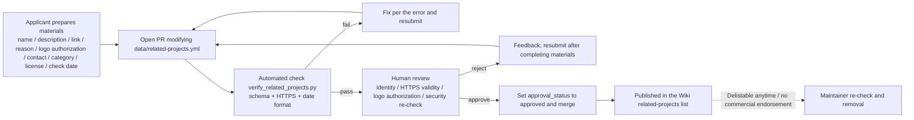

# Related Projects and Links

Use this page when you want to add a translation, OCR, typesetting, image-processing, community, or tooling project to the Manga Translator Wiki "related projects" list, or when you want to understand how an entry is reviewed, published, and delisted. The only reviewed data source for the list is `doc/wiki/data/related-projects.yml`; opening a PR that modifies this file does not publish the entry automatically, and only entries with `approval_status: approved` appear in the public list.

This page covers only the friendly-link submission materials, review flow, security re-check, and no-commercial-endorsement rules. For module boundaries and change steps, see [Architecture and Code Boundaries](./architecture-and-code-boundaries.md) and [Adding or Changing a Feature](./adding-or-changing-a-feature.md); for tests and code-quality conventions, see [Tests and Code Quality](./tests-and-code-quality.md).

## Feature boundary

- The related-projects list is a Wiki site feature, not a runtime feature of the desktop app, CLI, or web server; `desktop_qt_ui/locales/en_US.json` and `zh_CN.json` contain no related-projects keys.
- Bilingual text (name, description, relationship) comes from each entry's `LocalizedText` (`en` and `zh-CN` fields) in `data/related-projects.yml`; the site does not re-translate it.
- Inclusion requires human review and an HTTPS/validity re-check. Impersonation, malicious downloads, privacy tracking, and unauthorized logos are rejected. Entries can be delisted at any time and are marked with external-link risk and no commercial endorsement.
- This page does not cover ordinary code-PR contribution rules, test commands, or packaging/release flows; see the corresponding developer pages.

## Submission materials

One submission must provide all of the following materials; a missing item may bounce the PR back for completion. Field names match `data/related-projects.schema.json`; the English and Simplified Chinese columns below are the conventional meanings of the submission materials, not desktop UI strings (neither locale contains a related key).

| Field | English | Simplified Chinese |
| --- | --- | --- |
| `name` | Project name | 项目名称 |
| `description` | Bilingual description | 双语简介 |
| `url` | Public HTTPS URL | 公开 HTTPS 链接 |
| `relationship` | Relationship to this project | 关联理由 |
| `logo.authorization` | Logo usage authorization | Logo 使用授权 |
| `contact_url` | Official contact channel | 官方联系渠道 |
| `category` | Expected category | 期望分类 |
| `license_status` | License / authorization status | 许可证 / 授权状态 |
| `last_checked` | Last check date | 最后检查日期 |

### Required fields

`verify_related_projects.py` and the JSON Schema together enforce the following fields; validation fails if any field is missing or has an invalid type or format:

| Field | Format requirement | Notes |
| --- | --- | --- |
| `id` | `^[a-z0-9]+(?:-[a-z0-9]+)*$` | Stable lowercase hyphenated ID |
| `name` / `description` / `relationship` | object with non-empty `en` and `zh-CN` | Bilingual text |
| `url` | `^https://…` with a host | Public project link |
| `category` | one of the six enum values | See [Category enum](#category-enum) |
| `logo.url` + `logo.authorization` | HTTPS + non-empty authorization note | Logo URL and usage authorization |
| `contact_url` | `^https://…` with a host | Official contact channel |
| `license_status` | non-empty string | License / authorization status |
| `approval_status` | `pending` or `approved` | Review status |
| `last_checked` | ISO `YYYY-MM-DD` | Last manual check date |

`approval_status` may only be changed to `approved` by a maintainer after review; submissions should keep it `pending`. `contact_url` accepts only official channels already public in the repository; do not hardcode an author email or social account before it is confirmed.

### Self-check before opening a PR

1. Run `uv run python doc/wiki/verify_related_projects.py` from the repository root and confirm the output is `PASS` and the schema is not stale.
2. Confirm every URL is HTTPS with a host; do not include `http://`, personal email addresses, API keys, tracking links, or unauthorized logo assets.
3. Confirm `name`, `description`, and `relationship` are all filled in both languages and are not blank.
4. Confirm `last_checked` uses an ISO date and `approval_status` stays `pending`.
5. Modify only `doc/wiki/data/related-projects.yml`; the schema is regenerated by the validation script with `--write-schema`, so do not edit it by hand.

A minimal placeholder template (structure only, no real project):

```yaml
schema_version: 1
projects:
  - id: example-project
    name:
      en: Example Project
      zh-CN: 示例项目
    description:
      en: One-sentence public description.
      zh-CN: 一句话公开简介。
    url: https://example.com/
    relationship:
      en: Why this project relates to Manga Translator.
      zh-CN: 与本项目的关联理由。
    category: tooling
    logo:
      url: https://example.com/logo.png
      authorization: Maintainer confirmed logo use for the Wiki list.
    contact_url: https://example.com/contact
    license_status: MIT
    approval_status: pending
    last_checked: 2026-08-07
```

## Submission and review flow



Opening a submission does not publish the link automatically: `pending` entries never appear in the public list and are published only after human review sets `approval_status` to `approved`. A rejected submission leaves no permanent negative record and can be resubmitted after completing the materials. Users follow external links at their own risk; the Wiki does not guarantee third-party content or safety.

## Security re-check and no-commercial-endorsement

During human review, maintainers re-check the following; any unmet item is rejected or delisted:

- **Identity verification**: reject impersonation of official projects or third parties; name, logo, and domain must match the real project.
- **Link safety**: HTTPS only; the target page must be reachable, free of malicious downloads, privacy-tracking scripts, and redirect traps.
- **Logo authorization**: `logo.authorization` must state the authorization source; unauthorized logos are always rejected.
- **Contact channel**: only official public channels are accepted; no personal email addresses, social accounts, or private contacts that need extra confirmation.
- **No commercial endorsement**: a link in the list does not endorse any commercial product, service, or project; maintainers may delist any entry at any time and update `approval_status` and `last_checked` accordingly.

## Data file and format

| File | Actual role on this page | Note |
| --- | --- | --- |
| `doc/wiki/data/related-projects.yml` | The only reviewed data source for the related-projects list | Currently `projects: []` (empty); change only through a PR |
| `doc/wiki/data/related-projects.schema.json` | JSON Schema defining all fields and formats | Generated by `verify_related_projects.py --write-schema`; manual edits fail validation |
| `doc/wiki/verify_related_projects.py` | Pydantic-model validation script | Run `uv run python doc/wiki/verify_related_projects.py` from the repository root |
| `doc/wiki/data/README.md` | Data-governance notes | Records "submission is not auto-publish" and human-review rules |
| `desktop_qt_ui/locales/en_US.json` / `zh_CN.json` | Not involved in this page | Confirmed no related keys; bilingual text comes from the data file |

### Category enum {#category-enum}

`category` accepts exactly one of the following six values, matching the "expected category" chosen by the submitter:

| Stored value | English | Simplified Chinese |
| --- | --- | --- |
| `translation` | Translation | 翻译 |
| `ocr` | OCR | OCR / 文字识别 |
| `typesetting` | Typesetting | 排版 |
| `image-processing` | Image processing | 图像处理 |
| `community` | Community | 社区 |
| `tooling` | Tooling | 工具 |

## Related pages

- [Architecture and Code Boundaries](./architecture-and-code-boundaries.md): module boundaries and call relationships.
- [Adding or Changing a Feature](./adding-or-changing-a-feature.md): PR checklist for feature changes.
- [Tests and Code Quality](./tests-and-code-quality.md): test directories, uv commands, and format checks.
- [Packaging and Release](./packaging-and-release.md): release flow (not friendly-link review).

## Source evidence {#source-evidence}

| Layer | File | What was checked |
| --- | --- | --- |
| Data source | `doc/wiki/data/related-projects.yml` | Current empty list, `schema_version`, field structure, and `LocalizedText` bilingual convention |
| Schema | `doc/wiki/data/related-projects.schema.json` | All fields, regexes, enums, required entries, and date format |
| Validation script | `doc/wiki/verify_related_projects.py` | Pydantic models, HTTPS URL validation, `--write-schema`, and PASS output |
| Data governance | `doc/wiki/data/README.md` | Submission is not auto-publish, human review, no commercial endorsement |
| Contract | `doc/wiki/BLUEPRINT.md` section 9.6 | Submission-materials list, official feedback channels, inclusion and delisting rules |
| Coverage matrix | `doc/wiki/research/phase0-page-coverage-matrix.md` | W104 row and S00 evidence family |

## Verification {#verification}

| Check | Status | Notes |
| --- | --- | --- |
| BLUEPRINT, PAGE_GUIDELINES, TODO | Complete | Read in full and followed the page contract |
| `data/related-projects.yml` and schema | Complete | Checked the empty list, schema fields, and required entries; validation script output `PASS: projects=0, approved=0` |
| `en_US` / `zh_CN` | Complete | Confirmed neither locale has related keys; this page's tables come from the data-file convention, not UI strings |
| Review-flow Mermaid | Complete | Statically drawn submission, automated check, human review, publication, and delisting flow |
| Sanitized runtime verification | Deferred | No real `.env`, user config, API key/token, username, or private prompt was read |
| VitePress | Deferred | Coordinator should run `npm run docs:build --prefix doc/wiki` plus mirror/source checks before merge |
