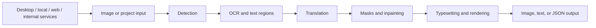

# Manga Translator Wiki

This is the documentation site's home page. Choose a runtime form first, then follow the relevant operation page. The contents are based on the current repository source, desktop i18n, and public server code; capabilities that have not been checked are not presented as product claims.

## Product forms {#product-forms}

The project shares the MangaTranslator processing chain but exposes different interaction boundaries:

| Form | Best for | Entry points |
| --- | --- | --- |
| Qt desktop application | Selecting files locally, adjusting parameters, monitoring progress, and revising regions in the visual editor | [Product Forms](./introduction/product-forms.md) · [First Translation](./introduction/first-translation.md) |
| `local` CLI | Headless, scriptable, and batch processing | [Command Structure](./cli/command-structure.md) · [Local Input and Output](./cli/local-input-output.md) |
| `web` Web UI | Uploading, configuring tasks, and viewing results and history in a browser | [Launch and Access](./web/launch-and-access.md) · [Upload, Configure, and Translate](./web/upload-config-and-translate.md) |
| `ws` / `shared` | Internal service protocols required by an existing local integration | [Web, WS, and Shared Modes](./cli/web-ws-and-shared-modes.md) · [Internal Protocols](./developer/internal-shared-and-websocket.md) |
| Docker | Running the Web form in a container while persisting resources and server data through volumes | [Docker](./install/docker.md) |

`ws` and `shared` are internal integration forms, not unauthenticated public APIs. Web listens on `0.0.0.0:8000` by default, while the internal services use local addresses and different ports by default. See [Deployment, Security, and Troubleshooting](./web/deployment-security-and-troubleshooting.md) and [Web Server Ports and Deployment](./developer/web-server-ports-and-deployment.md) for ports, authentication, and exposure boundaries.

## Where to enter {#entry-navigation}

### Qt desktop entry {#desktop-entry}

The desktop window opens on “Translation Interface”. The sidebar registers these seven regular pages in source order; “Editor View” is a separate bottom item. The labels below are the actual values for the i18n keys called by the code:

| Order | UI call key | English actual value | Simplified Chinese actual value | Used for |
| --- | --- | --- | --- | --- |
| 1 | `Translation Interface` | Translation Interface | 翻译界面 | Adding input, choosing a workflow, and starting a task |
| 2 | `Settings` | Settings | 设置 | Detection, OCR, translation, inpainting, and typesetting parameters |
| 3 | `API Management` | API Management | API 管理 | Selecting feature providers and configuring connections |
| 4 | `Prompt Management` | Prompt Management | 提示词管理 | Managing and applying prompt files |
| 5 | `Replacement Rules` | Replacement Rules | 替换规则 | Managing pre-render text replacement |
| 6 | `Rich Text Rules` | Rich Text Rules | 富文本规则 | Managing rich-text matching and style rules |
| 7 | `Batch Management` | Batch Management | 批量管理 | Applying conditional changes to translation projects |
| Bottom | `Editor View` | Editor View | 编辑器视图 | Opening results and editing regions, text, and styles |

Continue by task:

- [Navigation and Language](./desktop/navigation-and-language.md): page switching, themes, desktop language, and current-page retention.
- [File List and Input](./desktop/translation/file-list-and-input.md): adding images, folders, or drag-and-drop input.
- [Output Directory and Workflow](./desktop/translation/output-directory-and-workflow.md): selecting output locations and one of the nine workflows.
- [Settings Index](./desktop/settings/index.md): configuration lifecycle, import/export, and the nine parameter pages.
- [API Feature Selectors](./desktop/api-management/feature-selectors.md): the boundary between feature selectors, translator selection, and API candidate slots.
- [Editor Layout and File List](./desktop/editor/layout-and-file-list.md): the workspace after entering the editor.

### CLI and Web entries {#cli-web-entry}

The `manga_translator` dispatcher routes formal commands to `local`, `web`, `ws`, or `shared`. Common forms are:

```text
uv run --no-sync python -m manga_translator local -i <image-or-folder> [options]
uv run --no-sync python -m manga_translator web
uv run --no-sync python -m manga_translator ws
uv run --no-sync python -m manga_translator shared
```

See [Configuration Overrides](./cli/configuration-overrides.md) for command-line options and explicit configuration overrides, and [Workflow and File Modes](./cli/workflow-and-file-modes.md) for workflow files and special modes. Web users should start with [Launch and Access](./web/launch-and-access.md). HTTP methods, authentication, and stream framing stay in [Developer HTTP API](./developer/http-api/authentication-and-errors.md), separate from user operations.

## Processing chain and documentation boundary {#processing-boundary}

Different entries eventually use the shared stages. Special workflows skip or override some stages, so this simplified diagram is not a substitute for a workflow page:



This page is only an index. Each feature page owns its UI operations, runtime behavior, dependencies, file formats, and source evidence:

- [Detection](./desktop/settings/detection.md), [OCR, Filter, and Merge](./desktop/settings/ocr-filter-and-merge.md), and [Translation Settings](./desktop/settings/translation.md) explain stage parameters.
- [Masks and Inpainting](./desktop/settings/mask-and-inpainting.md), [Typesetting and Rendering](./desktop/settings/typesetting-and-rendering.md), and [Upscaling and Colorization](./desktop/settings/upscale-and-colorization.md) explain image post-processing.
- [Normal Workflow](./workflows/normal.md) and the other eight workflows specify input, skipped stages, and output.
- [Data and Privacy](./introduction/data-and-privacy.md) describes what may enter local files, server storage, or an external API.

## Bilingual switching boundary {#language-boundary}

The language button in the top-right is a documentation-site feature. The custom `LanguageSwitch.vue` maps the current URL's `/zh/` or `/en/` prefix to the other language while retaining the **same page suffix**. For example, `/zh/desktop/settings/index.html` switches to `/en/desktop/settings/index.html`. It does not translate source code, user configuration, or content without a mirrored page; both language pages must retain matching heading levels, anchors, tables, and link structure.

The desktop application's “Language:” control is a separate boundary. `I18nManager` populates its locale list, writes the selected value to `app.ui_language`, and refreshes Qt control text. It changes the application UI language, not the translation target language; the target remains controlled by settings such as `translator.target_lang`. Web pages have their own static-script i18n and cannot be assumed to be covered by desktop locale files.

| Layer | Control or source | Actual effect | Does not change |
| --- | --- | --- | --- |
| Wiki | `.vitepress/theme/components/LanguageSwitch.vue` | Switches the current documentation route between `zh` and `en` | Application configuration, translation target, source code, or user data |
| Qt desktop | `Language:` / `语言：`, persisted as `app.ui_language` | Display text in the desktop window and created views | `translator.target_lang`, API provider, or processing workflow |
| Web | `server/static/js/i18n.js` and page scripts | Translatable text owned by the Web pages | Desktop locale files or server-side translation configuration |

## Related files and safety boundary {#files-and-safety}

This home page lists public file roles only. It does not read or display values from a user's instance:

| File or directory | Public role | Note |
| --- | --- | --- |
| `config/config-example.json` | Secret-free example of configuration fields | Do not replace it with a user's `config.json` or publish private paths |
| `desktop_qt_ui/locales/en_US.json` / `zh_CN.json` | Actual desktop UI display values | Tables record keys and actual values rather than inventing translations |
| `manga_translator/args.py` | CLI mode and option definitions | Follow the formal entry point and actual help output |
| `manga_translator/server/static/` | Web user interface and its text | Keep user operations separate from developer HTTP contracts |
| `packaging/docker-compose.yml` | Container ports, volumes, and service forms | Example passwords are not production credentials; do not commit `.env` |

## Source evidence {#source-evidence}

| Layer | Files | Checked for this page |
| --- | --- | --- |
| Desktop entry and navigation | `desktop_qt_ui/main.py`, `desktop_qt_ui/ui/main_window.py`, `desktop_qt_ui/ui/main_page/view.py` | Qt startup, seven sidebar pages, editor bottom entry, and page switching |
| Desktop i18n and settings | `desktop_qt_ui/locales/en_US.json`, `desktop_qt_ui/locales/zh_CN.json`, `desktop_qt_ui/services/i18n_service.py` | Actual English/Simplified Chinese values, locale mapping, and `app.ui_language` boundary |
| Wiki route switching | `doc/wiki/.vitepress/config.ts`, `doc/wiki/.vitepress/theme/components/LanguageSwitch.vue` | `/zh/` and `/en/` routes, same-page bilingual switching, and site language labels |
| CLI dispatch | `manga_translator/__main__.py`, `manga_translator/args.py` | Formal `local`, `web`, `ws`, and `shared` entries |
| Web entry | `manga_translator/server/static/index.html`, `script.js`, `js/i18n.js` | Browser workspace, language text, and user entry points |
| Container form | `packaging/Dockerfile`, `packaging/docker-compose.yml` | Web container, port mappings, and resource volumes |

## Verification {#verification}

| Check | Status | Notes |
| --- | --- | --- |
| Page boundary | Complete | Compared with the `BLUEPRINT.md` home-page, navigation, and product-form requirements; this page is an index and boundary guide |
| Desktop entries and i18n matrix | Complete (static) | Checked `main_window.py`, `main_page/view.py`, `en_US.json`, and `zh_CN.json` |
| Wiki bilingual-switch boundary | Complete (static) | Checked `config.ts` and `LanguageSwitch.vue`; no runtime browser result is claimed |
| Sensitive-information review | Complete | No API keys, tokens, usernames, private absolute paths, user images, or private prompts are included |
| Headed UI / browser runtime | Not run | Qt/Web were not started and no screenshots were generated |
| Route, source-evidence, and production build | To verify by command | Run route mirror, source-evidence, and VitePress build after completing the page |

This home page does not replace feature pages; if a feature page is unfinished, its status remains the authority in `TODO.md`.
