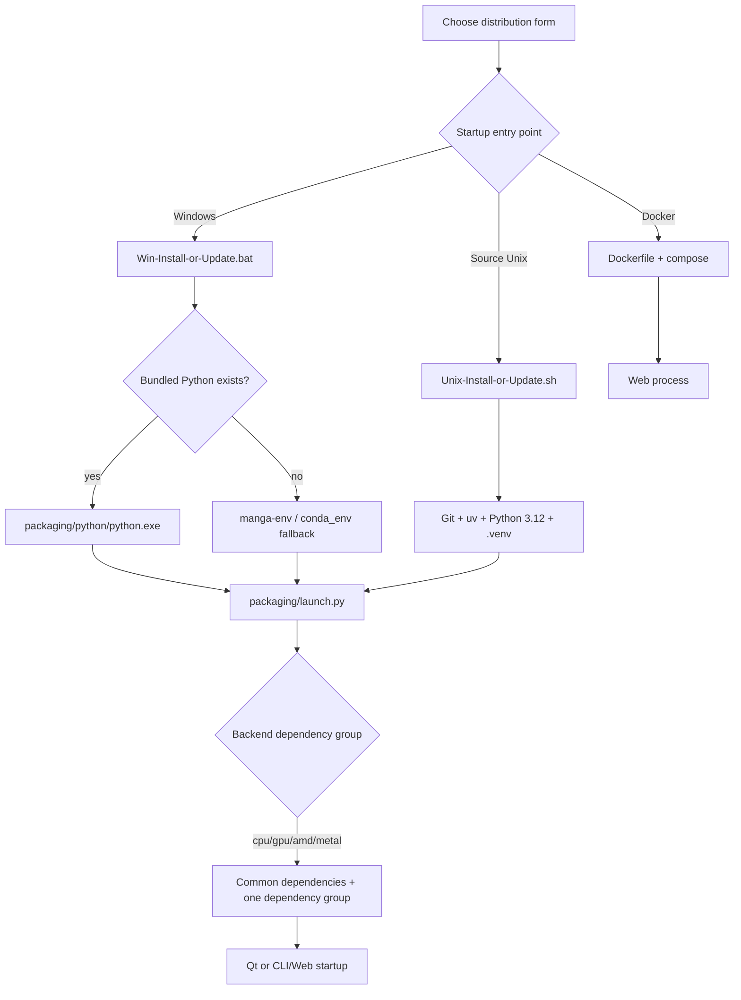

# Choose Edition

Use this page to choose an installation form and compute backend before installing. It answers only which installation entry point to use. See [Requirements](./requirements.md) for Python and uv prerequisites, and [Windows Portable](./windows-portable.md), [Windows from Source](./source-windows.md), and [Docker](./docker.md) for complete procedures.

## Feature boundary {#scope}

| Edition or form | Suitable for | Outside this page |
| --- | --- | --- |
| Windows portable install/update | Windows users who want to extract a package and use its maintenance menu to install dependencies, sync code, and update versions | It does not promise that dependencies require no download; first installation still needs network access and disk space |
| Source environment | Developers, users who need to modify source code, or users running on Linux/macOS | It does not bundle Python; Git, uv, and Python 3.12 are required |
| Docker CPU | Running the Web UI on a server or in a local container with compatibility as the priority | It does not start the Qt desktop UI and does not provide a GPU automatically |
| Docker GPU | Running the Web UI in an NVIDIA container | It covers only the NVIDIA path declared by compose; it is not the AMD/Metal edition |
| Compute backend selection | Selecting CPU, NVIDIA GPU, AMD ROCm, or Apple Metal dependency groups in the installer or `uv sync` | It does not change the translator, OCR, or workflow selection |

Do not treat “portable/source/Docker” and “CPU/GPU/AMD/Metal” as one set of options. The first selects how the project is obtained and started; the second selects runtime dependencies such as PyTorch and ONNX.

## UI operations and selection flow {#ui-operations}

### Windows portable package

1. Extract the release package and run `Win-Install-or-Update.bat` from its root directory. The script changes to its own directory and first looks for `packaging/python/python.exe`.
2. If bundled Python is absent, it searches the legacy `manga-env` Conda environment or `conda_env`. If neither exists, it shows an error and exits; it does not silently use system Python.
3. The maintenance menu shows the current branch and mirror. Choose “Install” to select a download route, sync code, detect the compute device, select a dependency variant, and install dependencies.
4. After installation, run `Win-Start.bat`. It uses the same bundled-Python-first and legacy-Conda fallback order, then starts `desktop_qt_ui\\main.py`.
5. If startup fails, the script displays the exit code and suggests running the install/update script again. Do not upload local paths or environment variables from the error window.

The maintenance menu contains the following options. It is printed in the terminal by `packaging/launch.py --maintenance`, not displayed in the Qt settings page.

| UI call key (source call) | English actual value | Simplified Chinese actual value |
| --- | --- | --- |
| `L("漫画翻译器 - 安装或更新", "Manga Translator UI - Install / Update")` | Manga Translator UI - Install / Update | 漫画翻译器 - 安装或更新 |
| `L("[1] 安装 (检测显卡, 选择 CPU/GPU 版本并安装依赖)", "[1] Install (detect GPU, choose CPU/GPU build, install dependencies)")` | [1] Install (detect GPU, choose CPU/GPU build, install dependencies) | [1] 安装 (检测显卡, 选择 CPU/GPU 版本并安装依赖) |
| `L("[2] 更新 (代码+依赖)", "[2] Update (code + dependencies)")` | [2] Update (code + dependencies) | [2] 更新 (代码+依赖) |
| `L("[3] 切换分支 (main/beta)", "[3] Switch branch (main/beta)")` | [3] Switch branch (main/beta) | [3] 切换分支 (main/beta) |
| `L("[4] 切换版本 (按 tag)", "[4] Switch version (by tag)")` | [4] Switch version (by tag) | [4] 切换版本 (按 tag) |
| `L("[5] 切换镜像源", "[5] Switch mirror")` | [5] Switch mirror | [5] 切换镜像源 |
| `L("[6] 重新检查版本", "[6] Re-check version")` | [6] Re-check version | [6] 重新检查版本 |
| `L("[7] 切换语言 (中文/English)", "[7] Language (中文/English)")` | [7] Language (中文/English) | [7] 切换语言 (中文/English) |
| `L("[8] 退出", "[8] Exit")` | [8] Exit | [8] 退出 |

There are no `en_US.json`/`zh_CN.json` locale keys for this menu. It uses hard-coded bilingual `L(zh, en)` calls and persists the selected language in `packaging/maintenance_config.json`. The table uses each call expression as its key instead of presenting an environment variable or backend field as a UI i18n key.

### Source environment

Use Python 3.12 and uv from the project root. Select exactly one backend group:

```bash
python -m pip install uv
uv sync                                      # default GPU group: NVIDIA CUDA 13.0
uv sync --no-default-groups --group cpu     # CPU
uv sync --no-default-groups --group amd     # Linux AMD ROCm
uv sync --no-default-groups --group metal   # macOS Apple Silicon
```

On Windows, the AMD path is not equivalent to ordinary `uv sync --group amd`; the installer also installs the Radeon SDK and matching PyTorch. Do not sync multiple backend groups.

### Docker

When using `packaging/docker-compose.yml`, choose one service rather than starting CPU and GPU services together:

```bash
docker compose -f packaging/docker-compose.yml up --build manga-translator-cpu
docker compose -f packaging/docker-compose.yml up --build manga-translator-gpu
```

The CPU service maps host `8000` to container `8000`; the GPU service maps host `8001` to container `8000`. Open the host port in the browser, not the container port as if it were a host address. The Docker image's default command is the Web server; it does not open the Qt UI.

## Edition and backend options {#options}

| Stored value | English | Simplified Chinese | Selection condition and effect |
| --- | --- | --- | --- |
| `portable` | Portable Windows package | Windows 便携包 | Windows; the script prefers bundled Python and can fall back to legacy Conda |
| `source` | Source environment | 源码环境 | Source changes, development, or Unix systems |
| `docker-cpu` | Docker CPU | Docker CPU 版 | Web UI in a container using the CPU dependency group |
| `docker-gpu` | Docker GPU | Docker GPU 版 | Web UI in a container with an NVIDIA GPU declared by compose |
| `cpu` | CPU build | CPU 版本 | General compatibility; model stages are usually slower |
| `gpu` | NVIDIA CUDA build | NVIDIA CUDA 版本 | Requires an NVIDIA driver supporting CUDA 13.0; uses `onnxruntime-gpu`, CUDA PyTorch, and `xformers` |
| `amd` | AMD ROCm build | AMD ROCm 版本 | ROCm dependency group on Linux; experimental path with additional driver/SDK requirements on Windows |
| `metal` | Apple Metal build | Apple Metal 版本 | Apple Silicon macOS; uses MPS PyTorch and CPU ONNX Runtime |

`portable`, `source`, and `docker-*` describe distribution forms. The installer's `--requirements` argument accepts only `auto`, `cpu`, `gpu`, `amd`, and `metal`; the two sets are not interchangeable values for one argument.

## Runtime behavior {#runtime}



The Windows maintenance menu installs in this order: choose a Git mirror, force-sync code, call `prepare_environment` to detect the GPU and select a dependency group, then install packages and clean caches. Automatic selection is conditional: NVIDIA checks CUDA/driver support; AMD checks for a recognized gfx and ROCm support; Apple Silicon selects Metal; if detection is inconclusive, manual choices are offered and CPU is generally the default.

The source environment declares common dependencies in `[project].dependencies` and `cpu`, `gpu`, `amd`, and `metal` in mutually exclusive dependency groups in `pyproject.toml`. The uv `conflicts` declaration prevents multiple backend groups from being installed together. During a Docker build, `uv sync --locked --no-default-groups --group "$BUILD_TYPE"` fixes the backend for the CPU or GPU image.

## Dependencies and conflicts {#dependencies}

- **Python**: the project requires `>=3.12,<3.13`. Do not use Python 3.13; the launcher rejects versions outside this range.
- **Mutually exclusive backends**: CPU, NVIDIA GPU, AMD ROCm, and Metal cannot be installed together. When the installed PyTorch type changes, the launcher may first uninstall `torch`, `torchvision`, and `torchaudio`, then purge the pip cache.
- **NVIDIA**: the current uv group uses the CUDA 13.0 PyTorch index; the Docker compose file uses a CUDA 12.1 base image. These are separate container-build and source-install paths and must not be presented as one version promise.
- **AMD**: Linux uses the ROCm index and dependency group; Windows installs the Radeon ROCm SDK before matching wheels and requires the driver version described by the source. Forced installation may be incompatible.
- **macOS**: the Metal group targets Apple Silicon; macOS does not use GPU ONNX Runtime.
- **Network and disk**: installation downloads common dependencies, PyTorch/ONNX packages, and possibly models. If a mirror fails, the menu permits retry and preserves installed packages. Do not switch backends while another Python process holds PyTorch files.
- **Docker resources**: compose sets an 8G memory limit for CPU and 16G for GPU, and declares an NVIDIA device for GPU. These are not minimum requirements for every machine.

## Related files and formats {#files}

| File/directory | Role covered here | Manual-edit, compatibility, and security notes |
| --- | --- | --- |
| `pyproject.toml` | Python version, common dependencies, four backend groups, uv conflicts and indexes | Match the dependency group to the platform; do not enable conflicting groups together |
| `uv.lock` | Resolved lock for source/Docker installation | Re-lock after dependency declarations change; `--locked` rejects an inconsistent lock |
| `packaging/launch.py` | Maintenance menu, GPU detection, backend selection, install/update, and version switching | The menu config stores only language; do not put keys or private addresses in it |
| `Win-Install-or-Update.bat`, `Win-Start.bat` | Windows entry points and Python fallback | The script directory is the working directory; non-ASCII paths change legacy Conda search behavior |
| `Unix-Install-or-Update.sh`, `Unix-Start.sh` | Git, uv, `.venv`, and startup entry points for Linux/macOS | The installer can clone code and create `.venv`; run it only in a trusted directory |
| `packaging/Dockerfile`, `packaging/docker-compose.yml` | CPU/GPU images, ports, volumes, and health checks | The compose admin password is an example; replace it and inject secrets securely in production |
| `packaging/docker-entrypoint.sh` | Restores default config/fonts/dict/server data when an empty volume starts | Restoration occurs only when the target directory is empty; existing volume data is not overwritten automatically |
| `packaging/maintenance_config.json` | Small JSON configuration for maintenance-menu language | Do not disclose user environment information; this is not core `config.json` |

Edition selection does not directly read or write user images, translation JSON, or debug artifacts. Those files are created by the selected runtime form and are documented on workflow, editor, and debugging pages.

## Screenshot and diagram boundary {#visuals}

This page uses Mermaid for the distribution form, entry point, backend-group, and startup chain. The diagrams contain no real host, username, path, or credential. The future screenshot plan may add redacted headed-mode captures of the Windows maintenance menu, `--help`, and Docker Web health state; this task did not start an installer, generate screenshots, or present static terminal output as runtime verification.

Any future screenshot must hide user directories, private addresses beyond public Git remotes, environment values, admin passwords, API keys, tokens, model-cache paths, and user images/prompts.

## Source evidence {#source-evidence}

| Layer | Files | Evidence checked |
| --- | --- | --- |
| Project constraints | `pyproject.toml` | Python 3.12, common dependencies, CPU/GPU/AMD/Metal groups, uv conflicts, and PyTorch indexes |
| Windows entry | `Win-Install-or-Update.bat`, `Win-Start.bat` | Bundled-Python priority, legacy-Conda fallback, maintenance launch, and Qt launch |
| Unix entry | `Unix-Install-or-Update.sh`, `Unix-Start.sh` | Git/uv/Python/.venv setup, project checks, and startup fallback |
| Installation and dispatch | `packaging/launch.py` | `DEP_VARIANTS`, GPU/architecture detection, PyTorch conflict handling, maintenance menu, version/branch/mirror operations |
| Containers | `packaging/Dockerfile`, `packaging/docker-compose.yml`, `packaging/docker-entrypoint.sh` | Build group, 8000/8001 mappings, volumes, resource limits, default restoration, and health check |
| Research evidence | `doc/wiki/research/phase0-related-files-formats-debug-safety.md`, `default-sources.md` | File safety boundaries, configuration layers, and rules against exposing sensitive content |

## Verification {#verification}

| Verification | Status | Notes |
| --- | --- | --- |
| Page contract and bilingual mirror | Complete | Both pages keep matching sections, anchors, tables, and Mermaid structure |
| Source and installation entry points | Complete | Checked `pyproject.toml`, Windows/Unix scripts, `launch.py`, and Docker files |
| UI calls and bilingual values | Complete | Maintenance options are recorded from `L(zh, en)` calls; this menu has no locale JSON keys |
| Sensitive-information review | Complete | No real keys, tokens, usernames, private absolute paths, passwords, images, or prompts were written |
| Headed installation/runtime | Pending runtime verification | No installer, Qt, or Web process was started and no screenshot was generated |
| Static checks and build | Pending execution | Target commands: `node scripts/verify-route-mirror.mjs doc/wiki`, `node scripts/verify-source-evidence.mjs doc/wiki`, and `npm run docs:build --prefix doc/wiki` |
