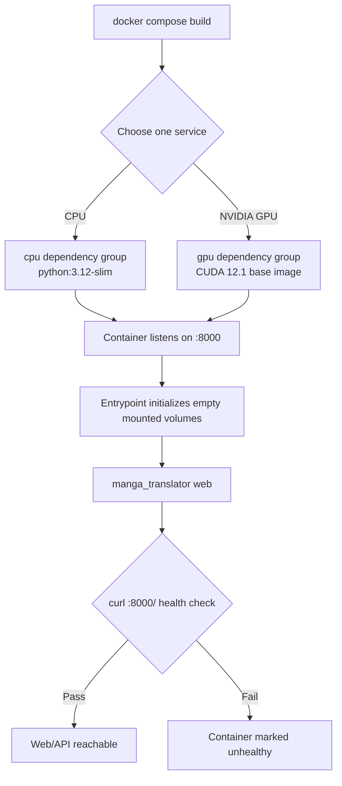

# Docker Deployment

This page explains how to build the current-source CPU or NVIDIA GPU Web service containers, map ports, retain configuration, and inspect service state. The Docker image supplies the Web UI and HTTP API, not the desktop Qt workspace; Web user operations and HTTP contracts belong to their respective pages. This page does not cover publishing image sources, concrete reverse-proxy configuration, or host-level backup policy.

## Start with Compose

`packaging/docker-compose.yml` defines both CPU and GPU services, but normally start only one to avoid consuming two Web ports and two sets of model resources. Run commands from the repository's `packaging/` directory; the Compose build context remains the project root.

### CPU service

```bash
docker compose up --build -d manga-translator-cpu
docker compose logs -f manga-translator-cpu
```

After it becomes healthy, visit `http://127.0.0.1:8000/`. To stop the container while retaining data in bind-mounted directories:

```bash
docker compose stop manga-translator-cpu
docker compose down
```

### NVIDIA GPU service

The host must already have compatible NVIDIA drivers and NVIDIA Container Toolkit:

```bash
docker compose up --build -d manga-translator-gpu
docker compose logs -f manga-translator-gpu
```

After it becomes healthy, visit `http://127.0.0.1:8001/`. The container still listens on `8000`; the GPU Compose service only maps host `8001` to container `8000`.

On the first Web visit, create the first administrator account as prompted by the login page. `MANGA_TRANSLATOR_ADMIN_PASSWORD` in Compose only sets an older service-administration password: it requires at least six characters, does not replace `/auth/setup`, and does not automatically create a login account. Do not use the example password in the repository Compose file. Before a public deployment, set a new random password through an uncommitted environment override or administration configuration.

## Configuration and option matrix

A Docker deployment has no desktop Qt controls, so there is no desktop UI call key to verify. The following table records that boundary instead of presenting environment variables as UI text. Web-page strings belong to the Web pages and are not duplicated here.

| UI call key | English actual value | Simplified Chinese actual value |
| --- | --- | --- |
| None (Docker Compose/CLI operation) | None (Docker Compose/CLI operation) | 无（Docker Compose/CLI 操作） |
| `MT_WEB_HOST` (startup argument/environment variable) | Web host (not a desktop label) | Web 监听地址（不是桌面标签） |
| `MT_WEB_PORT` (startup argument/environment variable) | Web port (not a desktop label) | Web 监听端口（不是桌面标签） |
| `MT_USE_GPU` (startup argument/environment variable) | Use GPU (runtime flag, not a desktop label) | 使用 GPU（运行时标志，不是桌面标签） |
| `MT_MODELS_TTL` (startup argument/environment variable) | Models TTL (runtime flag, not a desktop label) | 模型 TTL（运行时标志，不是桌面标签） |
| `MT_RETRY_ATTEMPTS` (startup argument/environment variable) | Retry attempts (runtime flag, not a desktop label) | 重试次数（运行时标志，不是桌面标签） |
| `MT_VERBOSE` (startup argument/environment variable) | Verbose logging (runtime flag, not a desktop label) | 详细日志（运行时标志，不是桌面标签） |

Compose currently sets `MT_WEB_HOST=0.0.0.0`, container port `8000`, and `MT_USE_GPU=false` for CPU. The GPU service retains container port `8000`, sets `MT_USE_GPU=true`, and maps host port `8001`. These are deployment configuration, not UI keys in `en_US.json` or `zh_CN.json`.

## How the image runs

The Dockerfile uses a multi-stage build: CPU is based on `python:3.12-slim`, GPU on `nvidia/cuda:12.1.0-cudnn8-runtime-ubuntu22.04`; both install system libraries and run the source in `/app`. The build runs `uv sync --locked --no-default-groups --group cpu` or `--group gpu`, so dependencies must match the lock file and chosen build type.

The image exposes and listens on container port `8000`; its default command is `python -m manga_translator web --host 0.0.0.0 --port 8000`. Before startup, the entrypoint checks mounted `config`, `fonts`, `dict`, and server-data directories. When one is empty, it copies initialization data from an image backup and then executes the main command. Both the image and Compose use `curl http://localhost:8000/` as the health check; after a 60-second start period, three consecutive failures mark the container unhealthy.



Host `8000:8000` (CPU) or `8001:8000` (GPU) changes only the external entry point, not the service's internal port. `0.0.0.0` listens on all IPv4 interfaces; it is not a browser address. LAN or Internet access also depends on firewalls, routing, and reverse proxies.

## Dependencies, resources, and conflicts

- CPU and GPU are alternative Compose services. Do not start both unless two isolated services are intentional and the machine can support each service's memory, model cache, and port use.
- The GPU service requires NVIDIA Container Toolkit and requests all available NVIDIA GPUs in Compose. AMD ROCm and macOS Metal have no corresponding Compose service, so neither CPU nor GPU service is their installation method.
- The CPU image uses uv's `cpu` group; the GPU image uses `gpu`. They respectively use `onnxruntime` or `onnxruntime-gpu`; GPU also has CUDA-matched Torch and `xformers`. Do not copy dependencies across groups.
- First model use can download models and consume substantial disk, RAM, or VRAM. Compose memory limits are container limits, not a model-compatibility guarantee. CPU is configured for an 8G limit and 2G reservation; GPU for 16G and 4G, which must be adjusted for the machine.
- The Dockerfile uses a CUDA 12.1 runtime base image, while bare `uv sync` uses the default GPU index specified by the current `pyproject.toml`. Do not derive commands for other platforms from the Dockerfile.

## Persistent volumes, environment variables, and formats

Compose paths are relative to `packaging/`:

| Host directory | Container directory | Contents and notes |
| --- | --- | --- |
| `data/fonts` | `/app/fonts` | Font resources; do not share volumes containing private font files |
| `data/dict` | `/app/dict` | Prompts, dictionaries, and rules; may contain private prompts |
| `data/result` | `/app/result` | Translation results and possible user images/text |
| `data/models` | `/app/models` | Model weights and cache; usually large |
| `data/logs` | `/app/logs` | Log directory; logs can contain paths, errors, and task information |
| `data/server` | `/app/manga_translator/server/data` | Accounts, permissions, sessions, history, and user resources |
| `data/config` | `/app/config` | Configuration and templates; an empty directory is initialized by the entrypoint |

To retain server API configuration saved through the Web administration UI after container recreation, first create an empty `packaging/data/app.env`, then uncomment `./data/app.env:/app/.env` in Compose. Do not commit `.env`, account data, session tokens, API keys, user images, or prompts to Git; manage mounted directories with least privilege and a backup-retention policy.

Runtime environment variables include `MT_WEB_HOST`, `MT_WEB_PORT`, `MT_USE_GPU`, `MT_DISABLE_ONNX_GPU`, `MT_MODELS_TTL`, `MT_RETRY_ATTEMPTS`, and `MT_VERBOSE`. They override Web startup behavior, backend selection, model caching, retry, or logging; their precise defaults come from `manga_translator/args.py` and Compose. This page records only the existence and minimum-length validation of `MANGA_TRANSLATOR_ADMIN_PASSWORD`, never its value.

## Screenshot and Mermaid boundary

This page uses Mermaid only for the informative build, startup, volume-initialization, and health-check flow; it does not fabricate Docker Desktop, terminal, or GPU screenshots. Future screenshots must use a sanitized image, fictional accounts, and minimal public samples, removing usernames, private absolute paths, keys, tokens, server addresses, user images, OCR/translated text, and prompts. Actual container startup, GPU visibility, health checks, and Web login require separate runtime validation; static page completion does not wait for a future unified acceptance pass.

## Source evidence

| Layer | Files | Verified content |
| --- | --- | --- |
| Image build | `packaging/Dockerfile` | CPU/GPU base images, Python, dependency groups, port, entrypoint, health check, and startup command |
| Compose orchestration | `packaging/docker-compose.yml` | 8000/8001 mapping, environment variables, volumes, GPU devices, memory limits, restart policy, and health check |
| Startup initialization | `packaging/docker-entrypoint.sh` | How empty mounted config, font, dictionary, and server-data volumes are restored from defaults |
| Web CLI | `manga_translator/args.py` | `web` host/port/GPU/TTL/retry/verbose arguments and environment overrides |
| Administrator password | `manga_translator/server/core/config_manager.py` | Minimum length and legacy-administration-setting behavior of `MANGA_TRANSLATOR_ADMIN_PASSWORD` |
| Web service | `manga_translator/server/main.py`, `manga_translator/server/routes/` | Service boundary for Web pages, sessions, translation endpoints, and the health-check target |
| Dependency declaration | `pyproject.toml`, `uv.lock` | Python version, CPU/GPU exclusive groups, Torch/ONNX sources, and locked install |

## Verification

| Check | Status | Notes |
| --- | --- | --- |
| Bilingual pages, frontmatter, pageId, headings, and anchors | Complete | Chinese and English mirror section by section; `pageId` is `install.docker` |
| Dockerfile/Compose/entrypoint static review | Complete | Build types, ports, volumes, environment, initialization, and health check reviewed |
| Dependencies, ports, administrator-password, and security boundaries | Complete | Source reviewed; no password values, tokens, usernames, private paths, or user content included |
| Docker Compose build/start, GPU visibility, and Web login | Not run | Requires Docker, NVIDIA Toolkit, and a sanitized runtime environment; static conclusions do not substitute for runtime validation |
| Mermaid/image boundary | Complete | Only an informative Mermaid is included; no screenshots fabricated |
| VitePress static checks and build | Complete | `npm run docs:build --prefix doc/wiki` passed |
