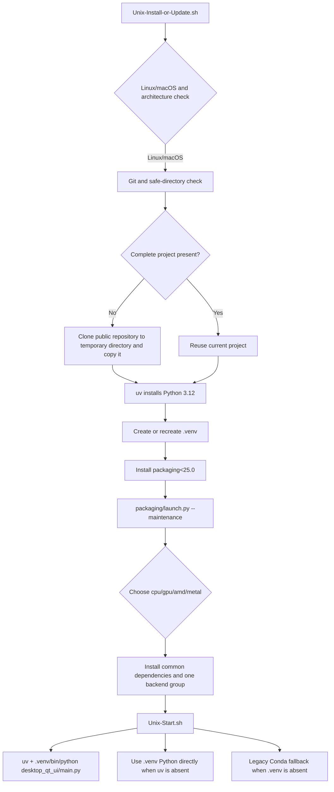

# Linux and macOS Installation

This page covers the Linux/macOS source installation, update, and Qt desktop startup entry points. It is limited to the Unix bootstrap scripts, `.venv`, uv, and platform dependency selection; Windows portable installation, Docker, version switching, and uninstalling belong to their respective installation pages.

The scripts work in the directory containing the scripts. You can download the two scripts into a new, writable, trusted directory, or run the installer from the root of an already-cloned complete repository. Installation does not require entering keys, tokens, or user images on the command line.

## Install and start

### First installation

1. Download `Unix-Install-or-Update.sh` into the target directory. Do not put it in a non-empty directory containing unrelated files; the script refuses to clone there.
2. Make both entry points executable:

   ```bash
   chmod +x Unix-Install-or-Update.sh Unix-Start.sh
   ```

3. Run the install/update entry point:

   ```bash
   ./Unix-Install-or-Update.sh
   ```

4. After the initial confirmation, the script checks the platform and Git. If Git is missing, it tries Homebrew or Xcode Command Line Tools on macOS, and `apt-get`, `dnf`, `pacman`, or `apk` on Linux. It then installs uv, Python 3.12, and creates `.venv` at the project root.
5. The bootstrap script installs only `packaging<25.0`, which the maintenance menu needs, and then opens the bilingual Python maintenance menu. The first full dependency installation is performed by the menu's Install action.

When a complete repository has already been downloaded, run the same entry point from its root. It reuses the existing project instead of cloning again.

### Start the desktop UI

After installation, run this from the project root:

```bash
./Unix-Start.sh
```

`Unix-Start.sh` prefers `.venv/bin/python` and, when available, uses uv to execute `desktop_qt_ui/main.py`; if uv is absent, it directly invokes the `.venv` Python. Only when `.venv` is absent does it try fixed-path or Conda legacy-environment fallbacks. The legacy path is for compatibility with an existing installation, not a new installation method.

You can inspect the start command without launching the UI:

```bash
MANGAT_DRY_RUN=1 ./Unix-Start.sh
```

This mode only prints the command it would run; it still checks the project files and `.venv`. The bootstrap script also accepts `MANGAT_AUTO_CONFIRM=1` to answer its first confirmation automatically. Use that only in controlled automation; do not combine it with an unknown directory or repository URL.

### Maintenance menu

`Unix-Install-or-Update.sh` ultimately executes `packaging/launch.py --maintenance`. The menu shows the current branch and mirror, and persists its language selection in `packaging/maintenance_config.json`. Back up uncommitted source and local configuration before updating or switching branches/tags; update actions can alter the working tree.

| UI call key | Actual English | Actual Simplified Chinese |
| --- | --- | --- |
| `maintenance_menu.title` | Manga Translator UI - Install / Update | 漫画翻译器 - 安装或更新 |
| `maintenance_menu.prompt` | Select an action: | 请选择操作： |
| `maintenance_menu.1` | [1] Install (detect GPU, choose CPU/GPU build, install dependencies) | [1] 安装 (检测显卡, 选择 CPU/GPU 版本并安装依赖) |
| `maintenance_menu.2` | [2] Update (code + dependencies) | [2] 更新 (代码+依赖) |
| `maintenance_menu.3` | [3] Switch branch (main/beta) | [3] 切换分支 (main/beta) |
| `maintenance_menu.4` | [4] Switch version (by tag) | [4] 切换版本 (按 tag) |
| `maintenance_menu.5` | [5] Switch mirror | [5] 切换镜像源 |
| `maintenance_menu.6` | [6] Re-check version | [6] 重新检查版本 |
| `maintenance_menu.7` | [7] Language (中文/English) | [7] 切换语言 (中文/English) |
| `maintenance_menu.8` | [8] Exit | [8] 退出 |
| `maintenance_menu.continue` | Press Enter to continue... | 按回车键继续... |
| `Unix-Start.sh` error literal | Run ./Unix-Install-or-Update.sh first | Run ./Unix-Install-or-Update.sh first |

These are not Qt-widget keys in `desktop_qt_ui/locales/*.json`: the maintenance menu is produced by `L(chinese, english)` calls in `packaging/launch.py`, while Unix-shell errors are hard-coded English source literals. Do not present script messages as desktop UI labels; this page retains the actual displayed values.

## Platform dependency selection

The project requires Python `>=3.12,<3.13`, so the current installer fixes Python to 3.12. `pyproject.toml` separates common dependencies from four mutually exclusive dependency groups. One environment can select only one backend group.

| Stored value | English | Simplified Chinese |
| --- | --- | --- |
| `cpu` | CPU version | CPU 版本 |
| `gpu` | NVIDIA CUDA GPU version | NVIDIA CUDA GPU 版本 |
| `amd` | AMD ROCm version | AMD ROCm 版本 |
| `metal` | Apple Metal version | Apple Metal 版本 |
| `auto` | Automatic selection | 自动选择 |
| `1` (maintenance menu) | Install | 安装 |
| `2` (maintenance menu) | Update | 更新 |
| `3`–`8` (maintenance menu) | Branch / tag / mirror / version / language / exit actions | 分支、版本、镜像、语言和退出操作 |

Automatic selection during installation works broadly as follows:

- Apple Silicon macOS selects `metal`, using PyTorch MPS, CPU ONNX Runtime, and Cocoa-framework support.
- Linux NVIDIA selects `gpu` when a compatible CUDA driver is available; otherwise CPU can be selected.
- Linux AMD recommends `amd` only for a detected supported ROCm architecture. When the hardware cannot be identified or is incompatible, it defaults to recommending `cpu`. The force-AMD choice explicitly warns that compatibility is not guaranteed.
- If hardware detection fails or an Intel GPU is detected, the script offers manual selection; CPU is the compatibility-first fallback.

The project's default `uv sync` groups are `gpu` and `packaging`, but the Unix maintenance path selects the appropriate variant from detection. Do not manually enable `cpu`, `gpu`, `amd`, and `metal` together: `tool.uv.conflicts` declares them mutually exclusive, and mixing them causes PyTorch/ONNX backend conflicts.

## Runtime behavior



The bootstrap script stops at bootstrapping the project, Python, and the maintenance menu. Full dependency installation, code updates, branches/tags, mirrors, and dependency-integrity checks are handled by `packaging/launch.py`. The start script does not automatically synchronize dependencies or silently substitute system Python when `.venv` is missing; it asks you to rerun the install entry point.

For Update, the maintenance menu checks local and remote versions/commits and the dependencies required by the current PyTorch variant. It fetches code and installs missing dependencies only when needed. A network failure can be retried by switching mirrors from the menu, but a mirror does not change the selected software backend.

## Dependencies, conflicts, and platform limits

- **Python:** only 3.12 is supported; 3.13 or another version is not a supported environment.
- **Mutual exclusion:** `cpu`, `gpu`, `amd`, and `metal` cannot coexist. The NVIDIA GPU group includes `onnxruntime-gpu` and `xformers`; CPU uses `onnxruntime`; macOS Metal also uses CPU ONNX Runtime.
- **AMD:** PyTorch and Triton in the ROCm group are conditional on Linux x86_64. Do not choose `amd` on macOS. An unsupported AMD architecture may still fail when force-installed.
- **Architecture:** the installer explicitly supports macOS `arm64`/`x86_64` and Linux `x86_64`/`amd64`; other Linux architectures require confirmation and are not promised to work with bundled wheels.
- **Compilation and wheels:** `pydensecrf` is resolved from platform-specific prebuilt-wheel sources declared by the project. Installation fails if no matching wheel is available; do not expose or commit private wheels.
- **Graphical prerequisites:** the desktop UI depends on PyQt6. Linux Qt/system graphics libraries, macOS graphics permissions, and drivers remain operating-system responsibilities; a headless server is not the desktop-UI environment covered here.
- **Runtime resources:** detection, OCR, inpainting, translation, and rendering can download/read models, fonts, and dictionaries based on enabled features. Put API keys only in your own configuration, never in script arguments, logs, or screenshots.

## Related files and formats

| File or directory | Purpose | Manual-editing / compatibility note |
| --- | --- | --- |
| `Unix-Install-or-Update.sh` | Checks platform, Git, repository directory, uv, Python, and `.venv`, then opens maintenance | Obtain only from a trusted public source; preserve executable permission |
| `Unix-Start.sh` | Checks the project and starts Qt through `.venv`, uv, or legacy Conda in that order | Do not point it at an environment containing unknown code; `MANGAT_DRY_RUN=1` is a no-side-effect check |
| `pyproject.toml` | Python version, common dependencies, four backend groups, PyTorch indexes, and platform wheel sources | Backend groups are exclusive; update `uv.lock` and validate after changes |
| `uv.lock` | Locked resolved dependency versions and sources | Do not hand-copy torch/ONNX entries from another platform |
| `.venv/` | Unix project virtual environment | It may be deleted and recreated by rerunning installation; do not commit it |
| `packaging/launch.py` | Bilingual maintenance menu, GPU detection, dependency installation, updates, and version information | Menu operations may modify the code worktree; do not put sensitive configuration in logs |
| `packaging/maintenance_config.json` | Persists maintenance-menu language and related maintenance preferences | Stores maintenance configuration only; it is not an API-key store |
| `config/`, `fonts/`, `dict/` | Runtime configuration, fonts, and dictionary resources | Use only public/redacted examples; user configuration and private prompts do not belong in documentation |

## Mermaid and screenshot boundary

The diagram above describes static script and environment boundaries, not a claim that every machine follows the same hardware branch. Screenshots of actual GPU detection, mirror fallback, and error paths must be added only after reproduction in a controlled environment.

This page embeds no real user screenshots and records no usernames, private absolute paths, keys, tokens, user images, or prompts. Future screenshots must use public examples and redacted configuration, and include bilingual alt text, captions, and platform/version/theme information. Crop terminal paths and private repository details. A headless environment can perform shell/static validation, but cannot be presented as a headed Qt screenshot.

## Source evidence

| Layer | File | What this page verifies |
| --- | --- | --- |
| Unix bootstrap | `Unix-Install-or-Update.sh` | Platform/architecture, Git setup, safe-directory check, cloning, uv, Python 3.12, `.venv`, and maintenance entry |
| Unix startup | `Unix-Start.sh` | `.venv` preference, uv invocation, direct-Python startup, legacy Conda fallback, and dry run |
| Dependency definition | `pyproject.toml` | Python version, common dependencies, `cpu`/`gpu`/`amd`/`metal` groups, conflicts, and platform sources |
| Maintenance dispatcher | `packaging/launch.py` | Bilingual menu, GPU/architecture recognition, PyTorch sources, missing-dependency checks, updates, and version switching |
| Maintenance preference | `packaging/maintenance_config.json` | Persistence location for maintenance-menu language configuration |

## Security review

- Run scripts only in a trusted directory. The script refuses to clone into a non-empty directory with unrelated files, but it cannot audit the content you downloaded.
- `Unix-Install-or-Update.sh` reaches the network for Git, uv, the public repository, and dependencies. In a managed network, review outbound access, certificates, and mirrors under your organization’s policy.
- `sudo` is used only to install system Git. Never put a sudo password in a command, terminal record, or documentation.
- `MANGAT_REPO_URL`, `MANGAT_UV`, and similar environment variables control execution. Verify custom repository/uv sources before using them; never share an environment variable or `.env` containing credentials.
- Updates, cloning, and extraction write into the current directory. Back up uncommitted work first. Do not run the entire application as root unless you understand the file-ownership consequences.
- Documentation validation uses public paths and redacted placeholders; it never displays real keys, tokens, usernames, private paths, user images, or prompts.

## Verification record

| Validation | Status | Notes |
| --- | --- | --- |
| Source and dependency review | Complete | Statically checked both Unix scripts, `pyproject.toml`, and `packaging/launch.py` behavior |
| UI call and bilingual value review | Complete | Listed maintenance-menu `L(chinese, english)` calls and shell hard-coded messages; no desktop locale key is misrepresented as a script-menu key |
| Shell static check | Complete | `bash -n Unix-Install-or-Update.sh Unix-Start.sh` passes |
| Start dry run | Complete | `MANGAT_DRY_RUN=1 ./Unix-Start.sh` verifies the command path when this repository’s `.venv` is available; it does not start Qt or access user images |
| VitePress build | Complete | `npm run docs:build --prefix doc/wiki` passes |
| Bilingual mirror/source-field checks | Complete | `verify-route-mirror.mjs` and `verify-source-evidence.mjs` pass |
| Headed screenshots | Not run | This scoped task completes static documentation and redaction boundaries only; it does not misrepresent missing screenshots as runtime evidence |
