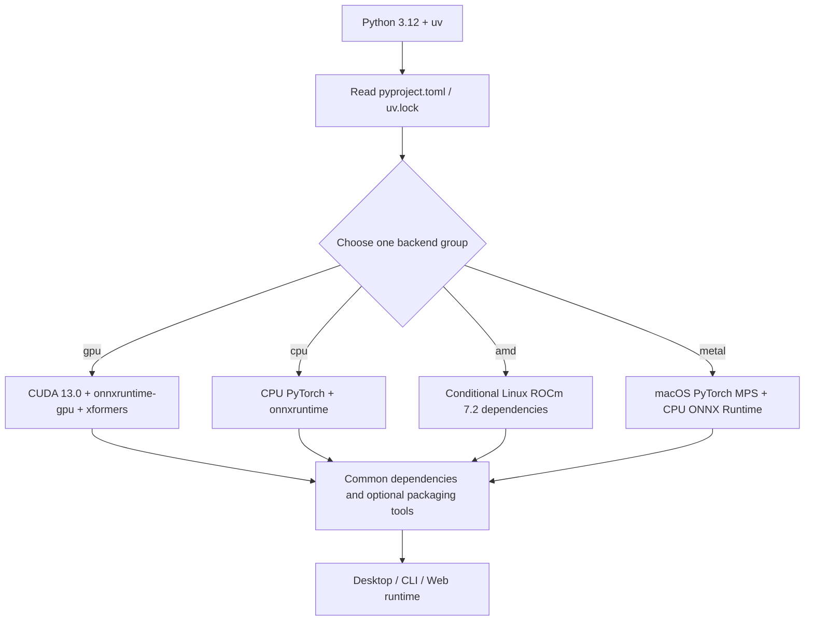

# Runtime Requirements

## Feature boundary

This page covers installation prerequisites: Python and uv versions, CPU/NVIDIA/AMD/Apple Silicon backends, common Python packages, models, fonts, and dictionaries. See [Windows portable](./windows-portable.md) for the Windows package menu and updates, [Linux and macOS](./linux-and-macos.md) for Unix scripts, and [Docker](./docker.md) for volumes. It does not document API keys, user configuration, or translation quality.

The current source of dependency truth is `pyproject.toml` and `uv.lock`. `requirements_cpu.txt`, `requirements_gpu.txt`, `requirements_amd.txt`, and `requirements_metal.txt` are retained legacy/platform notes and must not be mixed into a current uv environment.

## Pre-install checks

1. Use Python **3.12**. The project requires `>=3.12,<3.13`; Python 3.13+ is unsupported.
2. Install `uv`, run the command for the target backend from the repository root, and select exactly one backend group.
3. Provide network access and disk space for PyTorch, models, and (when semantic line breaking is enabled) HanLP models.
4. Online translators still require provider credentials; credentials are outside this page.

| Target | Command | Meaning |
| --- | --- | --- |
| NVIDIA CUDA (default) | `uv sync` | Default `gpu` and `packaging` groups; PyTorch uses the CUDA 13.0 index |
| CPU | `uv sync --no-default-groups --group cpu` | CPU PyTorch and `onnxruntime` |
| Linux AMD ROCm | `uv sync --no-default-groups --group amd` | ROCm 7.2 index; conditional ROCm PyTorch/Triton on Linux x86_64 |
| macOS Apple Silicon | `uv sync --no-default-groups --group metal` | PyPI PyTorch/MPS; CPU ONNX Runtime |

After syncing, launch the desktop UI with `uv run --no-sync python -m desktop_qt_ui.main`; `--no-sync` avoids resolving or installing dependencies at run time.

## UI operations

There is no separate desktop installation page. Source users select a dependency group in the terminal; the Windows installer detects the GPU and selects a variant. Installer text is printed by `packaging/launch.py` and scripts, not by `desktop_qt_ui/locales/*.json`.

After installation, desktop controls change runtime behavior but do not replace the installed backend:

- “Use GPU” (`label_use_gpu`) requests GPU acceleration; it cannot turn a CPU environment into CUDA.
- “Disable ONNX GPU Acceleration” (`label_disable_onnx_gpu`) only disables the ONNX Runtime GPU path.
- “Unload Models After Translation” (`label_unload_models_after_translation`) controls post-task memory/VRAM release.
- “Font” (`label_font_family`) scans system fonts and project `fonts/`; reopen the dropdown after adding a file.

## Option matrix

| UI call key | English actual value | Simplified Chinese actual value |
| --- | --- | --- |
| `label_use_gpu` | Use GPU | 使用 GPU |
| `label_disable_onnx_gpu` | Disable ONNX GPU Acceleration | 禁用 ONNX GPU 加速 |
| `label_unload_models_after_translation` | Unload Models After Translation | 翻译完成后卸载模型 |
| `label_font_family` | Font | 字体 |
| Installer hard-coded `cpu` | CPU | CPU |
| Installer hard-coded `gpu` | NVIDIA GPU / CUDA | NVIDIA GPU / CUDA |
| Installer hard-coded `amd` | AMD GPU / ROCm | AMD GPU / ROCm |
| Installer hard-coded `metal` | Apple Silicon / Metal | Apple Silicon / Metal |

The last four rows are installer values, not claims that corresponding i18n keys exist; `en_US.json` and `zh_CN.json` have no installation-variant keys.

## Runtime behavior

Common dependencies are `[project].dependencies`; hardware backends are `[dependency-groups]`. `default-groups = ["gpu", "packaging"]` makes bare `uv sync` NVIDIA by default, while `conflicts` marks `cpu`, `gpu`, `amd`, and `metal` as mutually exclusive. PyTorch and torchvision bind to explicit indexes per group; `xformers` is GPU-only, and Metal does not use a CUDA index.

Installation and models are separate stages. `manga_translator/utils/inference.py` uses `models/` as the model root; OCR, detection, inpainting, colorization, and upscaling modules generally create subdirectories and download/load models when first enabled. `rendering/chinese_linebreak.py` checks HanLP models and logs a fallback to normal wrapping when they are absent.

## Dependencies and conflicts

- **CPU**: no CUDA/ROCm; broadly compatible, but speed is limited by CPU and memory.
- **NVIDIA GPU**: the current group contains `torch==2.13.0`, `torchvision==0.28.0`, `onnxruntime-gpu==1.28.0`, and `xformers==0.0.35`; the driver must support the CUDA runtime.
- **AMD ROCm**: Linux x86_64 uses `pytorch-rocm72`; Windows AMD uses the installer to install the Radeon ROCm SDK and matching PyTorch wheels in two stages. This path is experimental.
- **Metal**: Apple Silicon uses PyTorch/MPS from PyPI and does not install CUDA, `onnxruntime-gpu`, or `xformers`.

Do not append another backend to the same environment or mix `onnxruntime` with `onnxruntime-gpu` or Torch packages from different CUDA/ROCm indexes. Create a new environment, or cleanly resync one group, when changing backends.

| Component | Conflict/prerequisite | Handling |
| --- | --- | --- |
| `pydensecrf` | Python 3.12 Windows/macOS/Linux x86_64 prefer platform wheels; fallback platforms may require C++ tools | Let uv select the platform source; do not copy wheels across platforms |
| `xformers` | Declared only in the GPU group | Do not copy it from the old GPU file into another group |
| Torch/Triton | Must match one platform index; Windows AMD also requires SDK/driver compatibility | Use the lock file or installer as a set |
| Legacy requirements | Versions may differ from current pyproject/lock | Prefer `uv sync --locked` for current installs |

**Hardware and resource prerequisites**: GPU backends need matching drivers; model downloads need network and storage; `fonts/` accepts `.ttf`, `.otf`, and `.ttc`; `dict/` contains `.txt` dictionaries and `.yaml`/`.json` prompts. Online services also need network access, model names, addresses, and credentials.

## Related files and formats

| File/directory | Format and role | Notes |
| --- | --- | --- |
| `pyproject.toml` | TOML; dependency groups, platform markers, indexes, conflicts | Re-lock and review markers after edits |
| `uv.lock` | Resolved uv versions and sources | `uv sync --locked` rejects an inconsistent lock |
| `requirements_*.txt` | pip requirements text with indexes/markers | Legacy compatibility notes; versions are not the current uv environment |
| `packaging/launch.py` | Installer checks, GPU detection, mirror fallback, AMD special install | Output is not stable i18n text |
| `models/` | Model weights and caches | Created on demand; may contain large files |
| `fonts/` | `.ttf`/`.otf`/`.ttc` files | Affects typesetting and PSD text layers |
| `dict/` | `.txt` dictionaries and `.yaml`/`.json` prompts | Edit according to each consumer schema |
| `config/config-example.json` / `config/config.json` | UTF-8 JSON; release defaults/user runtime config | User config wins; never publish private paths or API settings |

## Screenshot and diagram boundary

This page uses Mermaid only for the dependency-group branch and does not fabricate installer screenshots. Future screenshots must use a sanitized environment, state version/platform/theme, and remove usernames, private absolute paths, tokens, keys, private model names, and download directories. Installer failures and maintenance-menu screenshots belong to the Windows portable page.

## Source evidence

| Layer | Files | Verified content |
| --- | --- | --- |
| Project declaration | `pyproject.toml`, `uv.lock` | Python range, common dependencies, four mutually exclusive groups, PyTorch indexes, and pydensecrf sources |
| Installer | `packaging/launch.py` | Version check, dependency parsing, mirror fallback, GPU detection, and two-stage Windows AMD ROCm install |
| Models | `manga_translator/utils/inference.py` and model modules | `models/` root and lazy load/download behavior |
| Line breaking | `manga_translator/rendering/chinese_linebreak.py` | HanLP download check and normal-wrap fallback |
| Fonts | `desktop_qt_ui/utils/font_list.py`, `desktop_qt_ui/app_logic.py`, `desktop_qt_ui/ui/main_page/dynamic_settings.py` | Font scan, directory action, and dropdown refresh |
| i18n | `desktop_qt_ui/locales/en_US.json`, `zh_CN.json` | Actual values for the four desktop keys |
| Config | `desktop_qt_ui/core/config_models.py`, `desktop_qt_ui/services/config_service.py`, `config/config-example.json` | Default and user-config boundaries |

## Verification

| Check | Status | Notes |
| --- | --- | --- |
| Bilingual structure, frontmatter, pageId | Complete | Mirrored pages with the three-column i18n table |
| Source/config review | Complete | pyproject, installer, platform requirements, model/font/dictionary paths, and locales checked |
| Four environment installs | Not run | Complete environments were not downloaded or rebuilt; verify in sanitized platform environments |
| Screenshots | Not run | No fabricated screenshots; owned by the corresponding install pages |
| Sensitive-information review | Complete | No keys, tokens, usernames, private paths, user images, or private prompts included |
| Wiki static checks/build | Pending in parent worktree | Run route/source-evidence checks and `npm ci` / `npm run docs:build` with the full doc/wiki skeleton |
