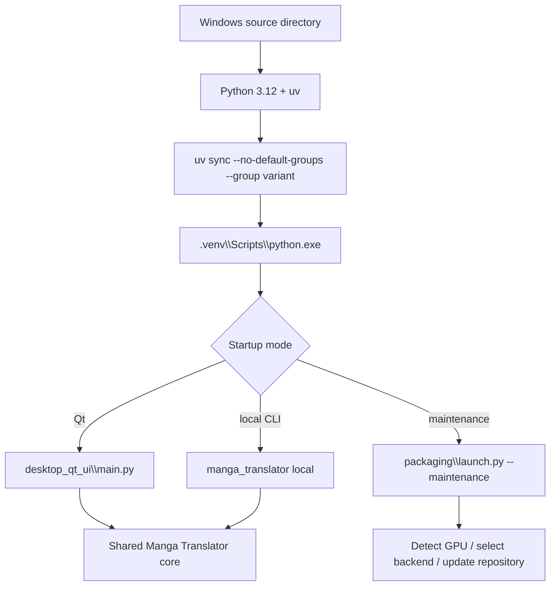

# Windows from Source

This page is for Windows users who need to modify source code, run an unpackaged checkout, or manage the Python environment themselves. It describes the shortest path from repository to Qt startup. It does not replace [Requirements](./requirements.md) for the full hardware/dependency table or [Windows Portable](./windows-portable.md) for packaged execution.

## Feature boundary {#scope}

A source install manages dependencies with Python 3.12 and uv inside the repository, then starts the Qt desktop program or CLI directly. It does not install portable Python, create a Conda environment, or automatically turn the checkout into a Docker image. Windows AMD's special ROCm installation remains the launcher's responsibility.

Choose the portable package if you only want to extract and run it; choose Docker if you only need a browser-based service. A source environment enables branch switching, code changes, tests, and precise dependency selection, but you must maintain Git, uv, Python, models, and drivers yourself.

## UI operations {#ui-operations}

### Prepare the repository and tools

Run these commands in PowerShell. Python must satisfy `>=3.12,<3.13`:

```powershell
git clone https://github.com/hgmzhn/manga-translator-ui.git
Set-Location manga-translator-ui
py -3.12 --version
py -3.12 -m pip install uv
```

If the repository already exists, enter it and check the working-tree status before deciding whether to switch to `main`, `beta`, or a tag. Do not overwrite uncommitted changes with a branch switch or another destructive Git operation.

### Select exactly one backend group

From the project root, run one of these commands:

```powershell
# NVIDIA: the default pyproject.toml group, using the CUDA 13.0 PyTorch index
uv sync

# CPU: disable default groups and enable CPU only
uv sync --no-default-groups --group cpu

# Linux AMD; Windows AMD does not use this ordinary source command
uv sync --no-default-groups --group amd

# macOS Apple Silicon; not for Windows
uv sync --no-default-groups --group metal
```

Windows users generally choose NVIDIA or CPU. If you have Windows AMD, do not copy the Linux `amd` command to Windows; see the “Windows AMD” note below.

### Start the source application

```powershell
# Qt desktop UI
uv run --no-sync --python .venv\Scripts\python.exe desktop_qt_ui\main.py

# Formal CLI entry point
uv run --no-sync python -m manga_translator local -i <image-or-directory>
```

The project also provides `Win-Start.bat`. It changes to the script directory, prefers `packaging\python\python.exe`, then falls back to legacy `manga-env`/`conda_env`; it is therefore not the only source-environment launcher. Prefer the `uv run` commands above for a source checkout, or call `.venv\Scripts\python.exe` directly after confirming the environment layout.

### Maintenance and version switching

When the project launcher must install/update, inspect the GPU, or switch versions, run:

```powershell
uv run --no-sync python packaging\launch.py --maintenance
```

The maintenance menu provides installation, code/dependency updates, `main`/`beta` switching, tag switching, Git mirror switching, version re-check, menu-language switching, and exit. Save your changes before switching branches or tags; the menu changes repository synchronization state and is not read-only.

## Option matrix {#options}

Source installation backends come from `pyproject.toml` dependency groups, not from desktop Qt locale keys. Maintenance-menu text is hard-coded through `L(zh, en)`, so the following tables record the source call and actual display values in three columns.

| Stored value | English | Simplified Chinese | Condition |
| --- | --- | --- | --- |
| `auto` | Auto-select | 自动选择 | Default in `packaging/launch.py`; enters backend selection based on device detection |
| `cpu` | CPU | CPU 版本 | General compatibility; no CUDA/ROCm GPU dependency |
| `gpu` | NVIDIA CUDA | NVIDIA CUDA 版本 | NVIDIA driver supporting CUDA 13.0; uv binds `pytorch-cu130` |
| `amd` | AMD ROCm | AMD ROCm 版本 | Linux x86_64 ROCm; Windows requires a special installer path |
| `metal` | Apple Metal | Apple Metal 版本 | Apple Silicon macOS; not for Windows |
| `--maintenance` | Install / Update maintenance menu | 安装或更新维护菜单 | Starts `packaging/launch.py` maintenance mode; it is not a backend group |

| UI call key (source call) | English actual value | Simplified Chinese actual value |
| --- | --- | --- |
| `L("[1] 安装 (检测显卡, 选择 CPU/GPU 版本并安装依赖)", "[1] Install (detect GPU, choose CPU/GPU build, install dependencies)")` | [1] Install (detect GPU, choose CPU/GPU build, install dependencies) | [1] 安装 (检测显卡, 选择 CPU/GPU 版本并安装依赖) |
| `L("[2] 更新 (代码+依赖)", "[2] Update (code + dependencies)")` | [2] Update (code + dependencies) | [2] 更新 (代码+依赖) |
| `L("[3] 切换分支 (main/beta)", "[3] Switch branch (main/beta)")` | [3] Switch branch (main/beta) | [3] 切换分支 (main/beta) |
| `L("[4] 切换版本 (按 tag)", "[4] Switch version (by tag)")` | [4] Switch version (by tag) | [4] 切换版本 (按 tag) |
| `L("[5] 切换镜像源", "[5] Switch mirror")` | [5] Switch mirror | [5] 切换镜像源 |
| `L("[6] 重新检查版本", "[6] Re-check version")` | [6] Re-check version | [6] 重新检查版本 |
| `L("[7] 切换语言 (中文/English)", "[7] Language (中文/English)")` | [7] Language (中文/English) | [7] 切换语言 (中文/English) |
| `L("[8] 退出", "[8] Exit")` | [8] Exit | [8] 退出 |

The maintenance menu has no `en_US.json`/`zh_CN.json` key; `maintenance_config.json` stores only the menu language. Do not present `--requirements`, `MT_*`, or API environment-variable names as UI labels.

## Runtime behavior {#runtime}



`uv sync` reads common `[project].dependencies` and the selected dependency group, then uses `tool.uv.sources` to select the CPU, CUDA, or ROCm PyTorch index. `uv run --no-sync` uses the existing `.venv` without resolving or upgrading dependencies again. If declarations and `uv.lock` disagree, update and sync the lock instead of ignoring the lock error.

The maintenance mode's `prepare_environment` detects the device and checks the installed PyTorch type. Automatic mode may select NVIDIA, AMD, Apple Silicon, CPU, or Intel GPU paths. Explicit `--requirements cpu|gpu|amd|metal` selects the requested group but still handles the extra Windows AMD path and PyTorch mismatches. After installation, the Qt entry calls `desktop_qt_ui.main` and the CLI entry calls `manga_translator.__main__`; both share the core processing chain.

## Dependencies and conflicts {#dependencies}

- **Python version**: `pyproject.toml` and the launcher both constrain Python to 3.12; Python 3.13 is rejected. Check `uv run --no-sync python --version`, not only the system `python`.
- **Mutually exclusive groups**: `cpu`, `gpu`, `amd`, and `metal` are mutually exclusive under `[tool.uv].conflicts`. Do not run `uv sync --group cpu --group gpu` or retain the default `gpu` group alongside another backend.
- **Default groups**: the project defaults to `gpu` and `packaging`; `uv sync` therefore installs CUDA GPU and packaging tools. CPU/AMD/Metal must use `--no-default-groups`.
- **NVIDIA**: the GPU group uses the `pytorch-cu130` index for `torch`/`torchvision`, `onnxruntime-gpu`, and `xformers`; the driver must support CUDA 13.0. If CUDA is insufficient, maintenance may recommend CPU.
- **AMD**: the Linux AMD group uses the ROCm 7.2 index and platform-marked torch/torchvision/triton. Windows AMD first installs the Radeon ROCm SDK and then fixed AMD PyTorch wheels; driver and gfx architecture determine compatibility.
- **Metal**: the Metal group targets Apple Silicon macOS, using MPS PyTorch, CPU ONNX Runtime, and Cocoa from normal PyPI; do not choose it on Windows.
- **Switching conflicts**: if the installed PyTorch type differs from the target, the launcher may uninstall `torch`, `torchvision`, and `torchaudio` and purge the pip cache. Close other Python processes using PyTorch first.
- **Models and network**: dependency installation does not mean model downloads are complete; detector, OCR, translator, and inpainting models may download on first use or read local model files. Do not place credentials or proxy settings in public scripts.

## Related files and formats {#files}

| File/directory | Role in a source install | Manual-edit, compatibility, and security notes |
| --- | --- | --- |
| `pyproject.toml` | Python version, common dependencies, backend groups, uv conflicts, and platform indexes | Enable only one backend group; update the lock after dependency changes |
| `uv.lock` | Exact resolved versions and sources | `uv sync --locked` rejects an inconsistent lock |
| `.venv/` | Windows virtual environment created by uv | Do not commit it; recreate it with uv if needed |
| `packaging/launch.py` | Maintenance menu, device detection, dependency installation, and version/branch operations | Menu config is not core user config; do not write keys into it |
| `packaging/maintenance_config.json` | JSON configuration for maintenance-menu language | Stores only maintenance state such as `language`; it must not contain API keys |
| `Win-Start.bat`, `Win-Install-or-Update.bat` | Windows entry scripts | They prefer bundled Python; source users should explicitly use `uv run` |
| `config/config.json`, `config/config-example.json` | Runtime application configuration, usually generated/read on first run | User config may contain private paths; do not copy it into docs or commit it |
| `.env` | Dotenv text containing API addresses, models, and secrets | Record only variable names and purpose; never read/display values or commit it |

The source installation does not define translation-result formats. Runtime work directories, project JSON, TXT, images, and debug artifacts are owned by the core workflow consumers and belong on their respective pages; `.venv` and `uv.lock` are not user translation data.

## Screenshot and diagram boundary {#visuals}

The Mermaid diagram covers only the Windows source environment from synchronization and virtual environment to Qt, CLI, and maintenance entries. Future screenshots should use redacted PowerShell, maintenance-menu, and Qt startup states and hide usernames, absolute paths, Git credentials, proxy addresses, API keys, tokens, model paths, and user images. This page did not start Qt, perform a complete dependency install, or generate screenshots; static command examples are not runtime evidence.

## Source evidence {#source-evidence}

| Layer | Files | Evidence checked |
| --- | --- | --- |
| Dependency declaration | `pyproject.toml` | Python 3.12, default groups, CPU/GPU/AMD/Metal groups, conflicts, and PyTorch indexes |
| Launcher | `packaging/launch.py` | Version check, `--requirements`, GPU detection, PyTorch conflict handling, maintenance menu, and Qt/CLI dispatch |
| Windows entry | `Win-Install-or-Update.bat`, `Win-Start.bat` | Working directory, bundled-Python priority, legacy-Conda fallback, and startup behavior |
| Qt/CLI | `desktop_qt_ui/main.py`, `manga_translator/__main__.py`, `manga_translator/args.py` | Desktop and formal CLI entries |
| Configuration/runtime | `desktop_qt_ui/services/config_service.py`, `manga_translator/runtime_paths.py` | Configuration persistence and runtime-directory boundaries |
| Research evidence | `doc/wiki/research/phase0-related-files-formats-debug-safety.md`, `doc/wiki/research/default-sources.md` | File formats, default layers, and sensitive-information boundaries |

## Verification {#verification}

| Verification | Status | Notes |
| --- | --- | --- |
| Page contract and bilingual mirror | Complete | Matching sections, anchors, option tables, diagrams, and evidence scope |
| Source and dependency declarations | Complete | Checked `pyproject.toml`, `launch.py`, Windows scripts, and entry modules |
| UI calls and bilingual values | Complete | Maintenance menu recorded from source `L(zh, en)` calls; absence of locale keys is explicit |
| Sensitive-information review | Complete | No real keys, tokens, usernames, private absolute paths, images, or prompts written |
| Headed runtime and complete install | Pending runtime verification | No Qt startup or complete dependency/GPU/AMD installation was run |
| Static checks and build | Pending execution | Target commands: `node scripts/verify-route-mirror.mjs doc/wiki`, `node scripts/verify-source-evidence.mjs doc/wiki`, and `npm run docs:build --prefix doc/wiki` |
