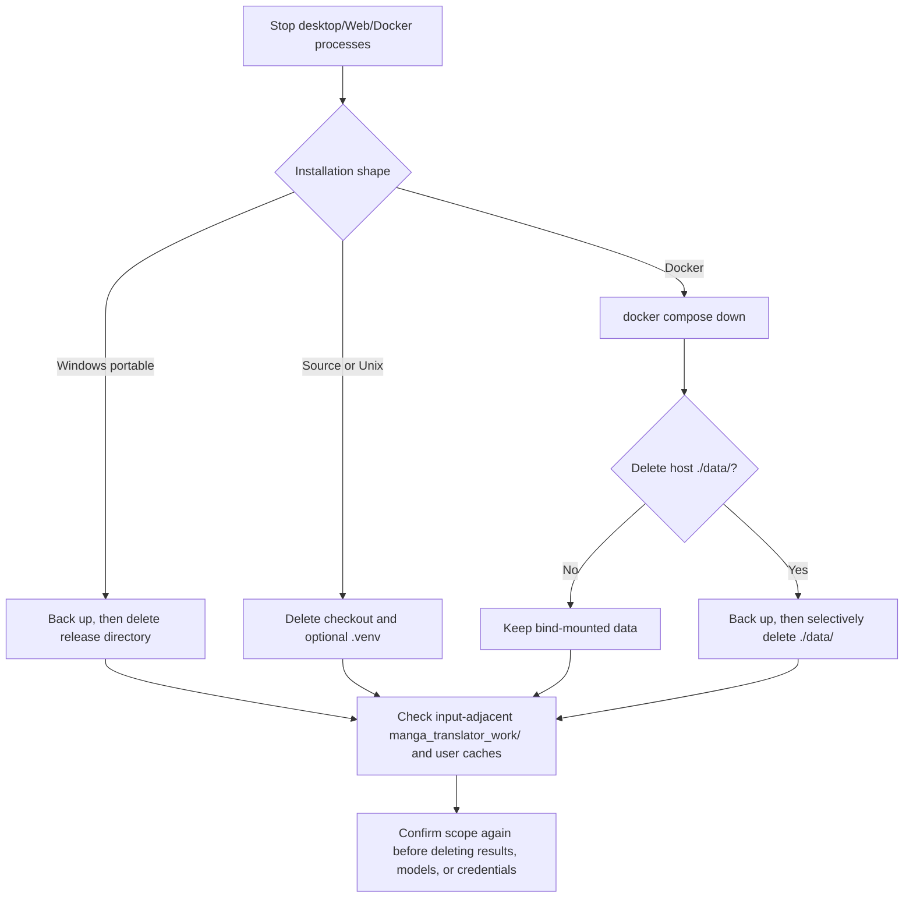

# Uninstall and Data Cleanup

## Feature boundary {#scope}

This page explains how to stop the application and remove a Windows portable package, a source/Unix installation, or a Docker deployment, plus which configuration, model, log, result, and server files require separate handling. The current `Win-*.bat`, `Unix-*.sh`, and Docker Compose files do not provide one universal “uninstall” button or command; uninstalling mainly means deleting the installation directory, virtual environment, or host-mounted data.

This page does not replace the installation steps in [Windows portable](./windows-portable.md), [Linux/macOS installation](./linux-and-macos.md), or [Docker](./docker.md), and it does not treat in-app “Clear translation results” as a complete uninstall.

## UI operations {#operations}

### General sequence

1. Wait for the current task to finish and close the desktop application; Web users should stop the service, and Docker users should first run `docker compose down`. Do not delete a directory while a process is still writing logs, results, or database files.
2. Back up any `config/`, `.env`, `models/`, `result/`, `manga_translator_work/`, or server `data/` that must be kept. Inspect each copy for keys, sessions, prompts, user images, and absolute paths before sharing or migrating it.
3. Delete the installation directory or virtual environment for the selected installation shape in the table below. If the goal is only to free space, clean selected caches/results instead; that is not the same as uninstalling.
4. Before reinstalling, confirm that no old environment path is still selected by the launcher, and check configuration compatibility if you kept settings.

### Installation shapes and deletion actions

| Installation shape | UI/command action | Locations normally worth preserving | Deletion scope |
| --- | --- | --- | --- |
| Windows portable | Close the application, then delete the complete release directory containing `Win-Start.bat` | `config/`, `models/`, `result/`, resources, and `packaging/python/` inside the release directory | The entire release directory; the scripts have no registry or service uninstall step |
| Legacy Windows Conda layout | Remove the environment used only by this project, then delete the program directory; do not remove shared Conda | External Miniconda, `manga-env`, or `conda_env/` inside the program directory | Only the confirmed project environment and program directory |
| Linux/macOS source | Stop processes, then delete the checkout; delete `.venv/` with it if it is not being kept | `.venv/`, `config/`, `models/`, and `result/` inside the checkout | The checkout; an input-adjacent `manga_translator_work/` must be handled separately |
| Docker Compose | Run `docker compose down` from the Compose directory, then delete selected host `data/` only if intended | `./data/config`, `server`, `models`, `result`, `logs`, `fonts`, and `dict` | Containers/images and host bind mounts are separate; `down` does not automatically delete `./data/` |

### In-app cleanup and UI wording

The Web admin cleanup feature only handles the directories defined by the server cleanup service; it is not an installer-directory remover. The results-page “Clear translation results” action clears the browser result list and blob URLs, not necessarily files on the host.

| UI call key | English actual value | Simplified Chinese actual value |
| --- | --- | --- |
| `web_cleanup_management` | Cleanup | 清理管理 |
| `web_cleanup_rules` | Cleanup Rules | 清理规则 |
| `web_auto_cleanup` | Auto Cleanup | 自动清理 |
| `web_manual_cleanup` | Manual Cleanup | 手动清理 |
| `web_cleanup_now` | Cleanup Now | 立即清理 |
| `web_cleanup_report` | Cleanup Report | 清理报告 |
| `web_files_deleted` | Files Deleted | 已删除文件 |
| `web_space_freed` | Space Freed | 释放空间 |
| `web_clear_logs` | Clear Logs | 清空日志 |
| `confirm_clear_results` | Are you sure you want to clear all translation results? | 确定要清空所有翻译结果吗？ |
| `results_cleared` | Translation results cleared | 翻译结果已清空 |

Maintenance-menu wording comes from `L(Chinese, English)` in `packaging/launch.py`, not a Qt locale key. The current menu has install, update, branch/tag, mirror, version check, language, and exit actions, but no uninstall action. The `Win-Start.bat` failure-recovery prompt is hard-coded English, so it must not be described as having a complete bilingual fallback.

## Runtime behavior {#runtime}

Runtime paths are defined by `manga_translator.runtime_paths`: in source runs, the configuration directory is `config/` at the project root; in frozen runs, it is `config/` beside the executable. Models normally live under the application `models/` directory, and desktop logs are written under the application `result/` directory. When `save_to_source_dir` is enabled, output is written to `manga_translator_work/result/` beside the input image, so deleting the installation directory does not remove that input-adjacent work directory.

Docker mounts host `./data/{fonts,dict,result,models,logs,server,config}` into separate container paths. Removing a container therefore does not remove those host files. Server data also includes administrator configuration, user resources, and history-related data under `manga_translator/server/data`; back it up and redact it before deciding whether to delete it.

Server automatic cleanup is disabled by default. Its defaults are to check every 24 hours, delete files older than 7 days, and continue deleting oldest files when the relevant directories exceed 10 GiB. It traverses only server `data/results`, user fonts, and user prompts; it does not clean the application directory, model directory, desktop logs, or input-adjacent work directories.

## Dependencies and conflicts {#dependencies}

- **Open processes**: a running Qt app, Python process, uvicorn service, or Docker container may still write files; Windows may also refuse to remove locked DLLs. Stop processes or containers first.
- **Portable Python versus Conda/venv**: `Win-Start.bat` and `Win-Install-or-Update.bat` prefer `packaging/python/python.exe` and only then search for `manga-env` or `conda_env`. Do not remove Miniconda that another project uses, and do not leave an old PATH pointing at a deleted environment.
- **Hardware dependencies**: removing the application environment does not uninstall system NVIDIA/AMD drivers; drivers are shared dependencies of other software.
- **Docker persistence**: `docker compose down`, removing containers, removing images, and removing bind mounts are different actions. Deleting `./data/server` loses Web accounts, sessions, history, and server resources; deleting `./data/models` forces model downloads again.
- **Caches and credentials**: Hugging Face/Torch and similar user-level caches can live outside the application profile. `.env` and configuration files may contain API credentials. Decide whether to migrate them first, and redact keys, tokens, usernames, absolute paths, and user content before sharing logs.
- **Version switching**: uninstall is not update. The maintenance flow may clean uv/pip download caches and remove platform-inappropriate launcher files during an update, but it does not delete all user data directories.

## Related files and formats {#files}

| File/directory | Actual role | Cleanup, format, and compatibility notes |
| --- | --- | --- |
| `config/config.json`, `config/` | Desktop/CLI configuration and runtime tables | Migratable, but inspect version, absolute paths, and sensitive fields; never upload real contents |
| `.env` | API/server environment variables, when enabled | Treat as credentials; redact before backup or deletion screenshots |
| `packaging/python/`, `.venv/`, `conda_env/`, `Miniconda3/` | Runtime and dependencies | Remove only environments confirmed to belong to this project; do not remove shared Conda/drivers |
| `models/`, user-level model caches | Downloaded models and temporary download-related files | Deleting them causes future downloads; it does not uninstall drivers |
| `result/`, `logs/`, `manga_translator_work/` | Logs, results, and input-adjacent work files | May contain source images, OCR, translations, or diagnostics; sanitize before sharing |
| `manga_translator/server/data/` | Web admin configuration, user resources, and server data | Usually mounted from `./data/server` in Docker; back up and confirm impact before deletion |
| `./data/{fonts,dict,result,models,logs,config}` | Compose host persistence mounts | `down` does not delete them; clean by directory and intent |
| `packaging/uv_cache/`, pip/uv download caches | Installer/update download caches | The maintenance flow can clean download caches, but they are not user result or model data |

## Screenshot and diagram boundary {#visuals}

The Mermaid diagram on this page expresses the stop step, installation-shape branches, container/bind-mount separation, and optional data cleanup boundary. No release package, Docker admin panel, or real uninstall flow was run, so no screenshot is fabricated. Future screenshots must use redacted test directories and fictional user paths; crop usernames, private absolute paths, API keys, tokens, admin passwords, user images, prompts, and history, and provide English and Chinese alt text and captions.

## Source evidence {#source-evidence}

| Layer | File | Verified on this page |
| --- | --- | --- |
| Windows launchers | `Win-Install-or-Update.bat`, `Win-Start.bat` | Script directory, portable-Python priority, Conda fallback, and absence of an uninstall branch |
| Unix launchers | `Unix-Install-or-Update.sh`, `Unix-Start.sh` | Checkout-relative paths, `.venv`, legacy fallback, and temporary clone cleanup |
| Application paths | `manga_translator/runtime_paths.py`, `manga_translator/server_paths.py` | Source/frozen `config/`, server `data/`, and user-resource locations |
| Results and models | `desktop_qt_ui/main.py`, `manga_translator/config.py`, `manga_translator/utils/inference.py` | Logs, `manga_translator_work/`, `models/`, and temporary download paths |
| Web/Docker | `manga_translator/server/core/cleanup_service.py`, `packaging/Dockerfile`, `packaging/docker-compose.yml` | Automatic-cleanup scope, defaults, and host persistence mounts |
| UI/i18n | `manga_translator/server/static/script.js`, `desktop_qt_ui/locales/en_US.json`, `desktop_qt_ui/locales/zh_CN.json` | Clear-results behavior and actual cleanup wording |

## Verification {#verification}

| Verification | Status | Notes |
| --- | --- | --- |
| Page contract | Complete | Bilingual boundary, operations, runtime behavior, conflicts, file formats, Mermaid/screenshot boundary, and security review are covered |
| Current source static review | Complete | Windows/Unix launchers, runtime paths, Docker mounts, server cleanup, and result behavior reviewed |
| UI call key → en_US → zh_CN | Complete | Cleanup/result keys are listed; launcher hard-coded wording is treated as non-Qt text |
| Actual uninstall/data recovery run | Not run | No release package, Docker, or real service was started; static conclusions are not presented as runtime success |
| Static Wiki checks and build | Pending | Run route mirror, source-evidence, coverage checks, and VitePress build after this page is complete |

## Security review {#privacy}

This page contains no real API keys, tokens, admin passwords, usernames, private absolute paths, user images, OCR/translations, model output, or private prompts. Stop services and back up required data before cleanup; deleting `server/data`, `.env`, configuration, results, or model caches is irreversible, and logs or error screenshots must be redacted first.
