# Update and Version Switching

## Feature boundary {#scope}

This page documents the update-maintenance flow delegated to `packaging/launch.py --maintenance` by the install scripts: checking code and dependencies, switching Git branches or tags, changing mirrors, and changing the maintenance-menu language. It does not replace first installation, Windows runtime selection, Linux/macOS bootstrapping, or uninstall/data-cleanup documentation. Here, “version” means the code version and dependency environment, not a desktop translator setting.

The maintenance menu is an interactive command-line UI. Windows uses `Win-Install-or-Update.bat`; Linux/macOS uses `Unix-Install-or-Update.sh` as a bootstrapper. Both ultimately enter the same Python maintenance menu.

## UI operations {#operations}

### Run the maintenance menu

- On Windows, run `Win-Install-or-Update.bat` in the project directory. It changes to its own directory, then prefers `packaging\\python\\python.exe`; legacy Conda layouts are used only when that runtime is absent.
- On Linux/macOS, run `Unix-Install-or-Update.sh`. It checks the platform and Git, bootstraps uv, Python 3.12, and `.venv` when necessary, then starts the maintenance menu. An existing complete project is not cloned again; a non-empty unrelated directory is rejected.
- The menu first displays branch/tag state, mirror, local version, and remote version. When a networked check fails, the remote version is unavailable; that result must not be interpreted as “already up to date.”

### Update code and dependencies

1. Select `[2] Update (code + dependencies)` / `[2] 更新 (代码+依赖)`.
2. The menu fetches the remote, compares `packaging/VERSION` with the target branch version and compares local/remote commits, then checks whether the current environment lacks dependencies declared in `pyproject.toml`.
3. If both code and dependencies are satisfied, it reports that no update is needed. Otherwise it explicitly asks whether to continue. Only `y` or `yes` continues; other input cancels.
4. After code updates successfully, dependencies are checked again and missing packages are installed for the detected CPU/GPU/AMD/Metal variant. If code synchronization fails, dependency updating is skipped, so a partial update is not reported as successful.
5. When dependency installation fails, packages installed successfully are retained. You can retry; retry continues with the remaining packages. uv/pip download caches are automatically cleaned after dependency updating succeeds; completion is reported only after both code and dependencies finish.

Code updates force-sync to `origin/<branch>`, so uncommitted edits can be overwritten. Before proceeding, back up configuration or resources you need outside the application directory and inspect the worktree. The maintenance script is not a version-backup mechanism.

### Switch branches

Select `[3] Switch branch (main/beta)` / `[3] 切换分支 (main/beta)`, then choose `main` (stable) or `beta` (testing). After fetching, the script force-syncs with `git checkout -f -B <target> origin/<target>`; its confirmation explicitly says local changes will be overwritten. After success, run Update once so dependencies are reconciled with the new branch.

When switching from a tag or detached commit, the state is marked `tag/detached`. Update comparisons fall back to `main`, but that does not automatically return the checkout to main.

### Switch versions by tag

Select `[4] Switch version (by tag)` / `[4] 切换版本 (按 tag)`. The menu fetches tags, displays at most 20 in reverse creation-date order, and also accepts a tag name typed directly. After confirmation it performs a forced `git checkout`, which enters detached HEAD; after success it recommends updating dependencies for that version. To return to current branch code, use `[3] Switch branch`; do not treat a detached checkout as a normal development branch.

### Mirror, checking, and language

- `[5] Switch mirror` / `[5] 切换镜像源`: choose the GitHub official remote, the Gitee mirror, or a manually entered repository URL; this changes `origin`. A failed fetch also offers to switch to the other route and retry. PyPI/PyTorch package-mirror fallback is a separate layer from the Git remote.
- `[6] Re-check version` / `[6] 重新检查版本`: fetch and display local/remote version and commit differences only; it does not change code or dependencies.
- `[7] Language (中文/English)` / `[7] 切换语言 (中文/English)`: changes only maintenance-menu `L()` output and writes `packaging/maintenance_config.json`; it does not change desktop Qt `app.ui_language`.
- `[8] Exit` / `[8] 退出`: exits the maintenance menu. After an update or switch, use `Win-Start.bat` on Windows or `Unix-Start.sh` on Linux/macOS to start the application.

## Maintenance-menu wording and options {#options}

The maintenance menu's English is not desktop Qt locale text. The code calls `L(Simplified Chinese, English)`; this table records the call site/code literal as the key and both actual values.

| UI call key | English actual value | Simplified Chinese actual value |
| --- | --- | --- |
| `maintenance_menu.title` | Manga Translator UI - Install / Update | 漫画翻译器 - 安装或更新 |
| `maintenance_menu.action.1` | Install (detect GPU, choose CPU/GPU build, install dependencies) | 安装 (检测显卡, 选择 CPU/GPU 版本并安装依赖) |
| `maintenance_menu.action.2` | Update (code + dependencies) | 更新 (代码+依赖) |
| `maintenance_menu.action.3` | Switch branch (main/beta) | 切换分支 (main/beta) |
| `maintenance_menu.action.4` | Switch version (by tag) | 切换版本 (按 tag) |
| `maintenance_menu.action.5` | Switch mirror | 切换镜像源 |
| `maintenance_menu.action.6` | Re-check version | 重新检查版本 |
| `maintenance_menu.action.7` | Language (中文/English) | 切换语言 (中文/English) |
| `maintenance_menu.action.8` | Exit | 退出 |
| `maintenance.prompt.continue` | Continue update? (y/n): | 是否继续更新? (y/n): |
| `maintenance.prompt.retry` | Retry? (y/n, default y): | 是否重试? (y/n, 默认y): |
| `maintenance.prompt.tag` | Select a number or type a tag name (Enter to cancel): | 请选择序号或直接输入 tag 名 (回车取消): |

The batch-file error text `Please try reinstalling first: run Win-Install-or-Update.bat and choose [1] Install.` is hard-coded English and is not a translated `L()` menu string; changing maintenance language does not translate it. GitHub/Gitee addresses are public defaults in source. Never put a user-entered private remote in documentation or a screenshot.

| Stored value/option | English | Simplified Chinese | Actual effect |
| --- | --- | --- | --- |
| `1` | Install | 安装 | Synchronize code, detect the GPU, and install dependencies |
| `2` | Update | 更新 | Check and update code and dependencies |
| `3` | main / beta | main / beta | Switch stable or testing branch |
| `4` | Switch version by tag | 按 tag 切换版本 | Check out a selected tag and enter detached HEAD |
| `5` | Switch mirror | 切换镜像源 | Change Git `origin` and subsequent Git downloads |
| `6` | Re-check version | 重新检查版本 | Read-only remote-version/commit check |
| `7` | 中文 / English | 中文 / English | Maintenance-menu output language |
| `8` | Exit | 退出 | Leave the maintenance menu |

## Runtime behavior {#runtime}

```mermaid
flowchart TD
    A["Install/update script"] --> B{"Usable Python found?"}
    B -->|Windows preferred| C["packaging/python/python.exe"]
    B -->|Unix| D["uv + .venv Python 3.12"]
    B -->|legacy fallback| E["Conda manga-env / conda_env"]
    C --> F
    D --> F
    E --> F["packaging/launch.py --maintenance"]
    F --> G{"Maintenance action"}
    G -->|check| H["fetch → compare VERSION and commits → check dependency completeness"]
    G -->|update| I["confirm → force-sync target branch → recheck and install missing dependencies"]
    G -->|branch| J["checkout -f -B target origin/target"]
    G -->|tag| K["checkout -f tag → detached HEAD"]
    G -->|mirror| L["remote origin set-url → retry fetch"]
    I --> M["Clean download cache after successful dependency update"]
```

The update decision does not rely on a version string alone. Code needs updating when fetching failed, remote `packaging/VERSION` differs, or commits differ; dependency updating depends on the active PyTorch variant and package-completeness checks. Dependencies are recalculated only after a successful code update, preventing an old-code dependency list from producing the result.

Package installation prefers discoverable uv for bulk installation; when uv is unavailable, it falls back to per-package pip installation. Regular packages use PyPI mirror fallback, while PyTorch packages use the CPU/CUDA/ROCm-specific index or its fallback sources. Cleaning installation caches does not delete project configuration, models, or fonts.

## Dependencies and conflicts {#dependencies}

- `pyproject.toml` requires Python `>=3.12,<3.13`; Python 3.13 is not a replacement runtime.
- `cpu`, `gpu`, `amd`, and `metal` are mutually exclusive uv dependency groups. Do not layer backends in one environment after changing hardware; reinstall the matching variant selected by maintenance.
- Windows AMD is separately handled by `packaging/launch.py` in Radeon SDK → PyTorch order. Do not apply the Linux `amd` group's ROCm conditions to Windows. Detecting the GPU brand does not prove the driver or ROCm works.
- Legacy Conda is a fallback only when portable Python or Unix `.venv` is unavailable. Mixing `packaging/python`, `.venv`, `conda_env`, and external environments can create DLL, Torch, or ONNX Runtime conflicts.
- Code updates can overwrite local source edits, and tags create detached HEAD. Back up and review configuration, prompts, models, fonts, and workspace resources before switching.
- Updates need Git and package-index/mirror access. Translation API networking, credentials, and quota are a separate runtime path. A successful update neither proves the API works nor guarantees models are downloaded or VRAM is sufficient.

## Related files and formats {#files}

| File/directory | Actual role | Format and manual-edit risk |
| --- | --- | --- |
| `Win-Install-or-Update.bat`, `Win-Start.bat` | Windows runtime resolution and maintenance/start entry | CMD batch; do not remove the own-directory change or runtime priority |
| `Unix-Install-or-Update.sh`, `Unix-Start.sh` | Unix Git/uv/Python 3.12/`.venv` bootstrap and maintenance/start entry | Bash; rejects overwriting unrelated non-empty directories and recreates `.venv` for a mismatched version |
| `packaging/launch.py` | Menu, Git operations, version checks, dependency checks/install, and cache cleanup | Python; do not edit the worktree or change remotes while it runs |
| `packaging/maintenance_config.json` | Persists maintenance-menu language | JSON; stores menu preference only, not desktop settings |
| `packaging/VERSION` | Local release-version text | Plain text; must be assessed with remote branch version and commit |
| `pyproject.toml`, `uv.lock` | Dependency groups, indexes, and locked resolution | TOML/lock file; do not combine mutually exclusive groups; update versions through project maintenance |
| `.env`, `config/config.json` | API credentials and application configuration | Never copy, upload, or screenshot real values, tokens, or private paths |
| `config/`, `dict/`, `models/`, `fonts/`, `manga_translator_work/` | User resources, prompts, models, fonts, and work products | An update/switch is not a resource backup; review, redact, and back up each item before moving it |

## Screenshot and diagram boundary {#visuals}

This page's Mermaid diagram documents only static invocation, checking branches, and Git/dependency-update boundaries. This task did not run a real release-package maintenance menu and did not create update logs, GPU-selection, or version-switching screenshots; static source conclusions are not presented as runtime success. Future screenshots must use sanitized test configuration and fictitious paths, crop usernames, private absolute paths, keys, tokens, model-download logs, user images, and prompts, and provide English and Chinese alt text/captions.

## Source evidence {#source-evidence}

| Layer | File | Checked for this page |
| --- | --- | --- |
| Windows entry points | `Win-Install-or-Update.bat`, `Win-Start.bat` | Working directory, portable-Python priority, Conda fallback, PATH, and exit codes |
| Unix entry points | `Unix-Install-or-Update.sh`, `Unix-Start.sh` | Git/uv/Python 3.12/.venv bootstrap, project-directory protection, and maintenance launch |
| Maintenance menu | `packaging/launch.py` | `--maintenance`, menu options, language persistence, and branch/tag/mirror operations |
| Update decisions | `packaging/launch.py` | `check_all_updates`, version/commit comparison, dependency completeness, and update order |
| Dependency definitions | `pyproject.toml`, `uv.lock` | Python constraint, conflicting groups, PyTorch indexes, and pinned versions |
| Release version and paths | `packaging/VERSION`, `manga_translator/runtime_paths.py` | Version file and checkout/release resource boundary |

## Verification {#verification}

| Check | Status | Notes |
| --- | --- | --- |
| Page boundary and body | Complete | Covers update, branches, tags, mirrors, dependencies, files, security, and static behavior |
| UI call key → en_US → zh_CN | Complete | Maintenance menu uses actual `L()` literals in `packaging/launch.py`, not Qt locale |
| Windows/Unix scripts and launcher static review | Complete | Interpreter fallback, maintenance entry, updating, and version-switching paths checked |
| Maintenance menu/real release package | Not run | The environment did not execute headed or interactive installation; it is not presented as runtime success |
| Route, source, and redaction static checks | Pending | Run repository Wiki validation scripts after this page task is complete |
| VitePress build | Pending | Run `npm run docs:build --prefix doc/wiki` after this page task is complete |

## Sensitive-information review {#privacy}

This page contains no API keys, tokens, administrator passwords, usernames, private absolute paths, user images, OCR/translation text, or private prompts. `.env`, user `config.json`, caches, and workspaces are described only as boundaries; any shared update log or screenshot still needs item-by-item redaction.
