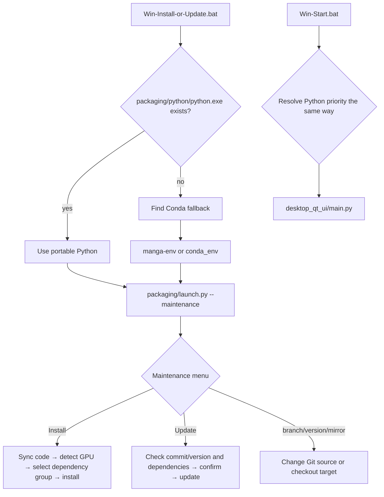

# Windows Portable

## Feature boundary {#scope}

This page documents the Windows startup chain, runtime selection, and maintenance menu provided by `Win-Install-or-Update.bat` and `Win-Start.bat` in the repository root. It is for Windows users whose source or release directory contains these scripts; it does not replace source installation, Docker, Linux/macOS, or version-uninstall pages, and it does not document desktop translation parameters.

“Portable” means that the scripts prefer `packaging/python/python.exe` inside the application directory instead of requiring the user to activate a system environment first. If that interpreter is absent, the current scripts still support the legacy Conda layouts; these are not two dependency schemes to mix in one environment.

## UI operations {#operations}

### First installation or maintenance

1. Extract the release package to a writable directory. Double-click `Win-Install-or-Update.bat`; the script changes to its own directory first, so launching it from Explorer, an elevated Command Prompt, or another working directory still uses the correct project root.
2. The maintenance menu shows the current branch/tag state, mirror, and version-check results. Enter the number requested on screen; this is a command-prompt menu, not a Qt window, and requires an interactive console.
3. Choose “Install”. The script synchronizes code, detects the GPU, then lets the launcher select the CPU, NVIDIA GPU, or Windows AMD path and install dependencies. If dependency installation fails, successful packages are kept and you can retry or cancel.
4. After installation, press Enter to return to the maintenance menu, choose “Exit”, and then double-click `Win-Start.bat` to start the desktop application.

### Actual maintenance-menu wording

The `L(Chinese, English)` calls in `packaging/launch.py` are the launcher's own bilingual strings, not desktop Qt locale keys. The table keeps the call-site/code literal as the key so launcher prompts are not mistaken for Qt i18n.

| UI call key | English actual value | Simplified Chinese actual value |
| --- | --- | --- |
| `maintenance_menu.title` | Manga Translator UI - Install / Update | 漫画翻译器 - 安装或更新 |
| `maintenance_menu.action.1` | Install (detect GPU, choose CPU/GPU build, install dependencies) | 安装 (检测显卡, 选择 CPU/GPU 版本并安装依赖) |
| `maintenance_menu.action.2` | Update (code + dependencies) | 更新 (代码+依赖) |
| `maintenance_menu.action.3` | Switch branch (main/beta) | 切换分支 (main/beta) |
| `maintenance_menu.action.4` | Switch version (by tag) | 切换版本 (按 tag) |
| `maintenance_menu.action.5` | Switch mirror | 切换镜像源 |
| `maintenance_menu.action.6` | Re-check version | 重新检查版本 |
| `maintenance_menu.action.7` | Language (中文/English) | 切换语言 (中文/English) |
| `maintenance_menu.action.8` | Exit | 退出 |
| `Win-Start.bat.error.reinstall` | Please try reinstalling first: run Win-Install-or-Update.bat and choose [1] Install. | 请先尝试重新安装：运行 Win-Install-or-Update.bat 并选择 [1] Install。 |
| `Win-Start.bat.prompt.open-maintenance` | Open Win-Install-or-Update.bat now? (y/n): | Open Win-Install-or-Update.bat now? (y/n): |

The last line is hard-coded English in the batch file and has no Chinese fallback; do not claim that it participates in complete bilingual switching. The maintenance language switch changes only `L()` output from `packaging/launch.py`; it does not change the desktop Qt `app.ui_language`.

### Updates, branches, and versions

- “Update” checks remote code version/commit and the current PyTorch dependencies first. If nothing is newer it reports that no update is needed; otherwise it asks for `y/yes` confirmation.
- “Switch branch” switches between `main` and `beta`; “Switch version” checks out a tag. Do not treat uncommitted local changes as a recoverable backup after switching; back them up and inspect the worktree first.
- “Switch mirror” changes the source used for subsequent Git/package downloads; a network failure is not reported as installation success.
- “Re-check version” is read-only; “Language” changes maintenance-menu output; “Exit” leaves the menu.

### Startup and error feedback

`Win-Start.bat` first prints `Starting...` and runs `desktop_qt_ui\\main.py`. A normal close prints `Application closed.`; a non-zero exit prints the exit code, recommends reinstalling, shows the public Issue URL, and asks whether to open the maintenance script. If neither portable Python nor a valid Conda environment is found, the script reports the missing environment and exits instead of silently using another Python.

## Option matrix {#options}

| Stored value/option | English | Simplified Chinese | Applies when |
| --- | --- | --- | --- |
| `1` | Install | 安装 | Maintenance menu; detect GPU and install code dependencies |
| `2` | Update | 更新 | Maintenance menu; check and update code and dependencies |
| `3` | main / beta | main / beta | Maintenance menu; branch switching |
| `4` | Switch version by tag | 按 tag 切换版本 | Maintenance menu; version switching |
| `5` | Switch mirror | 切换镜像源 | Maintenance menu; download-source switching |
| `6` | Re-check version | 重新检查版本 | Maintenance menu; read-only check |
| `7` | 中文 / English | 中文 / English | Maintenance-menu output language |
| `8` | Exit | 退出 | Maintenance menu |
| `auto` | Automatic selection | 自动选择 | Launcher dependency-scheme default; select by platform/GPU |
| `cpu` | CPU | CPU | No usable GPU or explicit CPU selection |
| `gpu` | NVIDIA CUDA GPU | NVIDIA CUDA GPU | NVIDIA/CUDA dependency group |
| `amd` | AMD ROCm | AMD ROCm | Experimental Windows AMD path; requires detected driver/GPU conditions |
| `metal` | Apple Metal | Apple Metal | Non-Windows; defined in the shared `pyproject.toml` dependency configuration, with no installation steps on this page |

## Runtime behavior {#runtime}

The batch files only locate the runtime, set `PYTHONUTF8=1`, prepend runtime directories to PATH, and call Python. Portable Python has priority over Conda: the script looks for `packaging\\python\\python.exe`; only if it is absent does it search the adjacent or drive-root `Miniconda3`, a Conda root found through `CONDA_EXE`, the named `manga-env` environment, and finally the legacy `conda_env` directory beside the application. The Conda fallback simulates activation by prepending PATH entries but does not modify the system environment.

The install flow in `launch.py` reads dependencies and PyTorch sources from `pyproject.toml`; updates compare `packaging/VERSION`, the remote commit, and dependency completeness. It prefers a discoverable uv for bulk installation, falls back to per-package pip when uv is unavailable, and tries configured alternate mirrors when a source fails. The Windows AMD path checks GPU/driver compatibility before installing the Radeon SDK and PyTorch in the script's required order; an unsupported device may fall back to CPU or require cancellation. Detecting an AMD device alone does not prove that ROCm was enabled.

## Dependencies and conflicts {#dependencies}

- **Python version**: The current launcher accepts Python 3.12 only; `pyproject.toml` requires `>=3.12,<3.13`. System Python 3.13 or another version cannot substitute for the portable runtime.
- **Mutually exclusive groups**: `cpu`, `gpu`, `amd`, and `metal` are mutually exclusive in the uv configuration. Do not layer CPU, NVIDIA CUDA, and AMD ROCm groups into one environment; after a hardware change, use the maintenance menu to check and reinstall the matching dependencies.
- **Windows AMD**: Windows AMD is not a simple copy of the Linux `amd` group. The script handles ROCm/PyTorch ordering separately and reports driver/support-list limits. Compatibility cannot be inferred from the GPU brand alone.
- **Legacy Conda**: It is used only when the portable interpreter is absent. Do not combine packages from `packaging\\python`, `conda_env`, and an external environment; an incorrect PATH can cause DLL, Torch, or ONNX Runtime conflicts.
- **GPU/CPU resources**: GPU dependencies do not mean models are downloaded or that available VRAM is sufficient; the first start may still download or initialize models. CPU can run the application but is usually slower. If installation fails, do not delete successful packages and repeatedly switch schemes without checking the cause.
- **Paths**: The script has a special drive-root Miniconda lookup when the installation path contains non-ASCII characters. To reduce DLL, Git, and model-path problems, prefer a short, writable path without special characters.
- **Network**: Installation/update needs Git and package-index or mirror access. API networking is a separate runtime path; successful installation does not prove a translation API is usable.

## Related files and formats {#files}

| File/directory | Actual role | Manual-edit, format, and compatibility risks |
| --- | --- | --- |
| `Win-Install-or-Update.bat` | Enter maintenance mode | Windows CMD batch; do not remove the `%~dp0` working-directory change or Python priority |
| `Win-Start.bat` | Start the Qt desktop app | Windows CMD batch; non-zero exit codes drive error feedback |
| `packaging/launch.py` | Maintenance menu, version checks, GPU detection, dependency installation, and Qt startup dispatch | Python source; menu operations read/write Git state/remotes and environment packages, so do not edit files during execution |
| `packaging/python/` | Preferred portable Python directory in a release package | Must contain `python.exe`; the repository does not commit the interpreter, so a source checkout cannot assume it exists |
| `Miniconda3/`, `conda_env/` | Legacy Conda fallback layouts | `manga-env` has priority over the legacy path; used only when portable Python is absent |
| `pyproject.toml` / `uv.lock` | Dependency versions, mutually exclusive groups, indexes, and locked resolution | Do not mix lock results from different groups; update versions through project maintenance workflow |
| `packaging/VERSION` | Local release-version comparison | Plain-text version; the maintenance script also compares Git commits, so this line alone is not the full update decision |
| `config/config.json`, `.env` | Application settings/API credentials | Do not ship real user values; secrets and absolute paths must not enter documentation or screenshots |
| `config/`, `dict/`, `models/`, `fonts/` | Runtime resources and user data | May contain prompts, models, fonts, and personal paths; audit each item when backing up or moving a portable directory |

The installer does not wrap every resource download in one standalone file format; code, dependencies, and resources are separate. Do not treat `uv.lock` as user configuration, or upload `.env` or `config/config.json` when requesting help.

## Screenshot and diagram boundary {#visuals}

The Mermaid diagram on this page expresses only the static script branches and maintenance/startup call chain. This task did not start a Windows release package and produced no maintenance-menu, GPU-selection, or installation-log screenshot; static conclusions are not presented as runtime success. Future screenshots may use only a sanitized release package and fictitious paths; crop usernames, private absolute paths, tokens, keys, model-download logs, and user images, and provide both English and Chinese alt text/captions.

## Source evidence {#source-evidence}

| Layer | File | Checked for this page |
| --- | --- | --- |
| Batch entry points | `Win-Install-or-Update.bat`, `Win-Start.bat` | Working directory, portable-Python priority, Conda fallback, PATH, exit codes, and targets |
| Maintenance/launcher | `packaging/launch.py` | `--maintenance` menu, install/update, branch/tag/mirror, version, GPU, and dependency flow |
| Dependency definition | `pyproject.toml`, `uv.lock` | Python version, mutually exclusive CPU/GPU/AMD/Metal groups, PyTorch indexes, and pinned versions |
| Release version | `packaging/VERSION` | Local version file used in update checks |
| Runtime paths | `manga_translator/runtime_paths.py` | Resource-configuration boundary for a development checkout versus a frozen/release directory |
| Research evidence | `doc/wiki/research/default-sources.md`, `phase0-related-files-formats-debug-safety.md` | Default sources, file formats, sensitive-information rules, and pending runtime-validation boundaries |

## Verification {#verification}

| Check | Status | Notes |
| --- | --- | --- |
| Three page contracts | Complete | Boundary, operations, three-column wording, mechanism, dependency conflicts, files, source evidence, and visual boundary covered |
| Batch files and launcher static review | Complete | Root batch files and the `packaging/launch.py` menu/entry points checked |
| `pyproject.toml` and lock file | Complete | Python 3.12 constraint, mutually exclusive groups, and Windows AMD note checked |
| Headed Windows install/start | Not run | The release-package maintenance menu was not executed in the current environment; static conclusions are not called runtime success |
| Route/source static checks | Pending | Run by the repository wiki validation scripts |
| VitePress build | Pending | Run `npm run docs:build --prefix doc/wiki` |

## Sensitive-information review {#privacy}

This page contains no API keys, tokens, administrator passwords, usernames, private absolute paths, user images, OCR/translation text, or private prompts. `.env`, user `config.json`, model caches, and `manga_translator_work/` are described only as file boundaries; shared logs, installation screenshots, and error windows still require item-by-item redaction.
