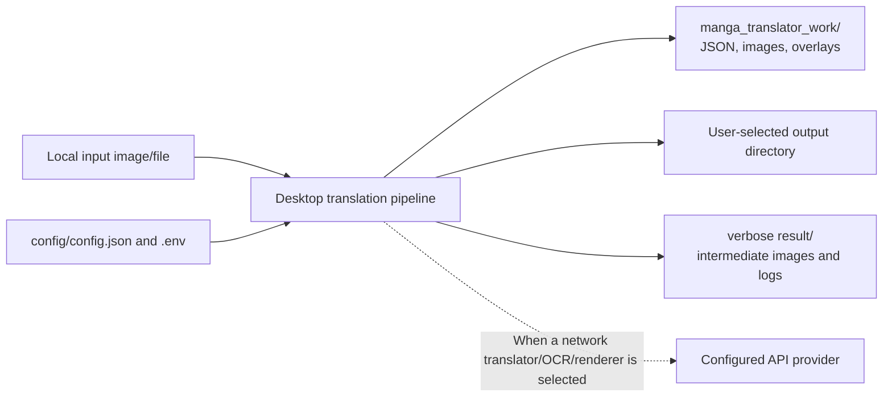
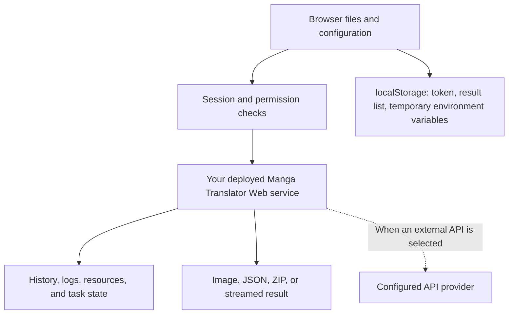

# Data and Privacy

This page helps you determine where manga images, recognized text, translations, configuration, and logs go. It describes storage and transfer boundaries confirmed by the current source; it is not a legal privacy notice and does not replace the API management, Web user, or debugging-artifact pages.

## Feature boundary

- **Local desktop processing**: the desktop application reads input images and intermediate data on the local machine; configuration, work, and `result/` diagnostic directories are local as well.
- **External translation or AI services**: when you choose a network-backed translator, OCR, colorizer, or renderer, request data is sent to that provider or to the compatible endpoint you configure. Provider retention, training, and cross-border policies are outside this project's source code.
- **Web mode**: the browser submits files and configuration to the server you start; that server also maintains accounts, sessions, history, resources, and logs. The deployer controls the server address, reverse proxy, Docker volumes, and backups.
- **Out of scope here**: see [Credentials, addresses, and models](../desktop/api-management/credentials-addresses-models.md) for API slots, [Upload, configuration, and translation](../web/upload-config-and-translate.md) for Web operations, and [Debug artifact index](../reference/debug-artifact-index.md) for individual diagnostic files.

## UI operations

### Desktop

1. On the translation page, choose input files or a directory and set an output directory you control. The program creates `manga_translator_work/` near the input directory; the exact output still depends on the workflow and output settings.
2. When using configuration import/export in “Settings”, choose only a sanitized JSON file. Do not upload an `.env` containing secrets or a work directory containing original images or translations to a public location.
3. In “API Management”, API-key fields use password mode by default. The value appears in the window only after you explicitly click the visibility icon; this does not protect the value from clipboard access, screen recording, or external services.
4. “API Keys (.env)” and “Log output...” refer to credential editing and the log area. API tests, model discovery, and translation can make network requests or receive server responses; error messages may still contain an address, model name, or processing stage.

### Web

- After login, the browser stores the session token in `localStorage.session_token` and sends it on subsequent business requests as `X-Session-Token`; logout clears the local token.
- Configuration import/export reads and writes JSON files locally in the browser. The current user environment variables may be temporarily stored in `localStorage.user_env_vars`; do not leave them on a shared browser or in developer tools.
- The result list is stored in browser `localStorage`, which is separate from server history. Server history, logs, fonts, and prompts remain subject to account permissions and deployment retention policies.
- The API Key tab is hidden by default; the server's `/env` and `/env/effective` endpoints should not return server key values in clear text. Server-side authorization is the final boundary; hiding a frontend control is not a substitute for it.

## Option matrix

This page has no independent privacy switch. The table lists the actual UI strings referenced above. English and Chinese values come from the current desktop locales; the Web main page also contains hard-coded HTML/script text, so its English wording cannot be inferred from desktop locales alone.

| UI call key | English actual value | Simplified Chinese actual value |
| --- | --- | --- |
| `API Management` | API Management | API 管理 |
| `Manage API keys and environment variables for each translator` | Manage API keys and environment variables for each translator | 管理每个翻译器的 API 密钥和环境变量 |
| `API Keys (.env)` | API Keys (.env) | API密钥 (.env) |
| `Log output...` | Log output... | 日志输出... |
| `Export Config` | Export Config | 导出配置 |
| `Import Config` | Import Config | 导入配置 |
| `Show Secret` | Show Secret | 显示密钥 |
| `Hide Secret` | Hide Secret | 隐藏密钥 |
| `Clear List` | Clear List | 清空列表 |
| `Start Translation` | Start Translation | 开始翻译 |
| `Normal Translation` | Normal Translation | 正常翻译流程 |
| `Export Translation` | Export Translation | 导出翻译 |
| `Export Original Text` | Export Original Text | 导出原文 |

These keys document UI wording only. `.env`, `X-Session-Token`, and `localStorage.session_token` are code identifiers, not labels to copy into the interface or secret values to disclose.

## Runtime behavior

### Desktop data flow

The desktop configuration service updates memory and `os.environ` immediately, then coalesces the disk write with a 250 ms debounce. Both configuration and `.env` use an atomic replacement after writing a temporary file. In development, the runtime directory is `config/` under the repository root; in a frozen package it is `config/` beside the executable.

Per-image JSON is stored at `<image-dir>/manga_translator_work/json/<stem>_translations.json`. It may contain an absolute image path, original and translated text, region geometry, styles, `mask_raw` (a base64 PNG), `mask_is_refined`, overlays, and the last export directory. It is therefore not a suitable public minimal example. PNG, JSON, log, PSD, or JSX files under `result/` produced by `verbose` may likewise contain original images, text, coordinates, translations, and local paths.

### Web data flow

The server authentication dependency validates `X-Session-Token`, refreshes activity, and rejects invalid or expired sessions. Translation requests also check feature permissions, concurrency, and daily quotas. The server configuration output recursively replaces values whose key names contain `api_key`, `api_secret`, `password`, `token`, or `key` with `***`. This constrains only that output path; it does not make raw configuration, logs, browser storage, or provider logs automatically sanitized.

## Dependencies and conflicts

- Using only local models does not mean that no sensitive data is written: the work directory, JSON, diagnostic images, and logs can still contain original images and text.
- Cloud or compatible APIs introduce networking, authentication, rate limits, and third-party retention policies. A self-hosted compatible endpoint should still be reviewed for its access control and logging policy.
- `verbose` is useful for diagnosis but increases diagnostic output containing images, text, coordinates, and paths. Disable it or inspect and clean every file before sharing.
- `mask_raw` is a base64-encoded PNG, not anonymization; `mask_is_refined` only says whether the mask has been refined and provides no privacy protection.
- Web `0.0.0.0:8000` means listening on all IPv4 interfaces, not a secure browser address. Firewall rules, reverse proxies, Docker port mappings, and backup retention require separate configuration and verification.
- Browser history and server history are different stores; deleting one does not prove that the other was deleted. A download ticket may also permit retrieval for a limited time.

## Related files and formats

| File or data | Stored/transmitted content | Sanitization and cleanup notes |
| --- | --- | --- |
| `config/config.json` | Desktop/Web configuration and user options; user configuration takes priority over the example | Do not commit personal paths, private options, or secrets referenced indirectly by configuration |
| `.env` | API, authentication, and model environment variables in `KEY=VALUE` text form | Never display or copy real values; use clearly fictional placeholders for keys and tokens |
| `config/custom_api_params.json` | Additional request parameters for each provider | Treat custom headers, Bearer values, and private endpoints as secrets |
| `manga_translator_work/json/<stem>_translations.json` | Regions, original/translated text, dimensions, masks, styles, overlays, and path metadata | Do not publish directly; `mask_raw` and absolute paths are user content |
| Images, TXT, PSD, JSX, and `result/` under `manga_translator_work/` | Intermediate images, exported text, editable projects, scripts, and diagnostic logs | Inspect each file for originals, text, translations, reference images, tokens, and local paths |
| Web browser `localStorage` | `session_token`, result list, locale, and possibly `user_env_vars` | Log out and clear site data on shared devices; do not copy developer-tools contents |
| Web server data directory | Accounts, sessions, history, logs, fonts, prompts, tasks, and download tickets | The deployer defines permissions, backups, retention, and cleanup; do not use hashes or tokens as examples |

Although `config/translation_template.json` has a `.json` extension, the template parser reads an optional `output_format` line as text. It affects the export extensions under `originals/` and `translations/`; it is not per-image translation JSON. System prompts and user prompts must also be reviewed separately; never paste a private prompt into documentation.

## Source evidence

| Layer | File | Verified for this page |
| --- | --- | --- |
| Runtime paths | `manga_translator/runtime_paths.py:11-30` | Application and configuration directories in development and frozen builds |
| Environment variables | `manga_translator/utils/dotenv_utils.py:17-80` | `MANGA_TRANSLATOR_ENV_PATH`, dotenv parsing/loading, and UTF-8 writes |
| Desktop persistence | `desktop_qt_ui/services/config_service.py:144, 477-559, 752-821` | 250 ms debounce, memory updates, and atomic `.env`/JSON writes |
| Secret UI | `desktop_qt_ui/ui/main_page/env_management.py:190-223` | Secret-key detection, password mode, and show/hide tooltips |
| Per-image data | `manga_translator/manga_translator.py:713-872` | Region JSON, styles, skip flags, upscale/colorization metadata, and base64 masks |
| Diagnostic paths | `manga_translator/manga_translator.py:3315-3347` | verbose, Web, and result-directory branches |
| Web frontend | `manga_translator/server/static/script.js`, `static/js/history-gallery.js` | localStorage, upload, result list, history, and download interactions |
| Web authentication | `manga_translator/server/core/middleware.py:94-164` | `X-Session-Token` validation, activity refresh, and 401 boundary |
| Configuration sanitization | `manga_translator/server/core/translation_integration.py:323-352` | Recursive replacement of sensitive keys in server configuration output |
| Phase 0 research | `doc/wiki/research/phase0-related-files-formats-debug-safety.md`, `phase0-web-user-http.md` | File formats, diagnostic artifacts, Web storage, and sensitive-data categories |

## Verification

| Check | Status | Notes |
| --- | --- | --- |
| Page contract and frontmatter | Complete | `BLUEPRINT.md`, `PAGE_GUIDELINES.md`, and `TODO.md` were read; the page includes boundary, operations, three-column i18n evidence, behavior, limits, files, source evidence, and verification sections |
| UI/i18n three-column evidence | Complete (static) | Desktop call keys and actual `en_US.json`/`zh_CN.json` values were checked; Web hard-coded/fallback limits are recorded from research |
| Source evidence | Complete (static) | Configuration, paths, per-image JSON, diagnostics, Web localStorage, sessions, and server sanitization have file and line references |
| Sensitive-data review | Complete | No real keys, tokens, accounts, private absolute paths, user images, or private prompts are included |
| Sanitized runtime verification | Pending | Web was not started and no real translation was run; actual retention, provider logs, and conditional artifacts require separate sanitized-sample checks |
| Route mirror and source checks | Complete (target pages, static) | Target-page heading hierarchy, frontmatter, source-evidence sections, and bilingual paths were checked; the full-site scripts are not present in this worktree because their untracked directory is absent, so an equivalent target-page check passed |
| VitePress build | Failed (blocked elsewhere) | The build is blocked by the existing placeholder YAML error in `en/introduction/product-forms.md`; the error does not point to this page |
