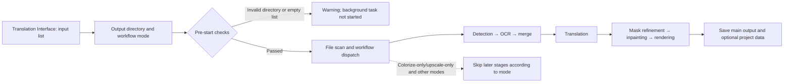

# First Translation

Start here when the application is installed and you want to process one or more manga images. This page covers the shortest usable path in the desktop “Translation Interface”: add inputs, confirm the output directory, choose a workflow mode, and start the task. Detailed detector, OCR, translator, typesetting, and API credential settings belong to [Settings](/en/desktop/settings/index.md), [Translator](/en/desktop/translator/selection-and-languages.md), and [API Management](/en/desktop/api-management/feature-selectors.md).

## Feature boundary {#feature-boundary}

This page covers the desktop actions needed for a first run, the differences among the nine workflow modes, input/output discovery rules, task states, and the safety boundary. It does not expand every detector, OCR model, translation provider, prompt field, or editor property; those are maintained in their respective module pages.

For a first run, use a public, non-sensitive sample image and start with “Normal Translation”. “Normal Translation” is not a configuration-free demo mode: it still checks the API requirements of the current configuration and uses the installed or otherwise available models.

## UI operations {#ui-operations}

### From input to start

1. Open “Translation Interface” in the sidebar. This is the initially selected page, and its title defaults to “Normal Translation”.
2. Click “Add Files” above the input list to choose images, or click “Add Folder” to recursively add supported images from a folder. You can also drop files or folders onto the list. The list displays a thumbnail tree; each file can be removed with its inline remove action.
3. Make sure the list is not empty. “Clear List” removes the current input list but does not delete source images or results already written to disk.
4. In “Translation Task”, check “Output Directory:”. You can type or drop a directory into the field, use “Browse...” to select one, or use “Open” to open the current directory.
5. For the first run, leave “Translation Workflow Mode:” at “Normal Translation” and click “Start Translation”. Choosing another workflow changes the title, description, and start-button label.

Before starting, the application checks that the output directory exists, that the input list is not empty, and that the current configuration's API requirements are met. A failed check does not start the background translation. If the file scan finds no valid images, it shows the “File List Empty” warning and aborts startup.

### During and after a task

- After launch, the start button first shows `Starting...` (this call key is missing from both locale files, so the current code falls back to displaying the key itself). The input buttons, clear button, file list, and API page are disabled while translating; the button then becomes “Stop Translation”.
- Progress is reported with the current count, total count, and a message. Clicking “Stop Translation” changes the button to “Stopping...”. After the stop request finishes, the task returns to a stopped state and progress resets. Stopping does not delete files already saved.
- Success, partial failure, and files skipped because an output already exists are recorded in task state and logs. With overwrite disabled, an existing same-name output may be skipped; delete the old output or enable overwrite in Settings before retrying.
- “Open” opens the output directory; it does not open the editor. Continuing to edit a result depends on the Editor page and any generated project JSON; see [Editor import, export, and writeback](../desktop/editor/import-export-and-writeback.md).

## Option matrix {#option-matrix}

The table records the workflow dropdown's configuration field and actual UI text. When a workflow is selected, the desktop runtime clears the other workflow fields and writes only the selected one. “Normal Translation” means these special fields are all `false`; it does not restore other settings to defaults.

| Stored value | English | Simplified Chinese | Behavior after selection |
| --- | --- | --- | --- |
| `normal` (all special fields `false`) | Normal Translation | 正常翻译流程 | Follows the normal path: colorization (if enabled), upscaling (if enabled), detection, OCR, text-line merging, translation, mask refinement, inpainting, and rendering |
| `cli.generate_and_export=true` | Export Translation | 导出翻译 | Produces project JSON and translated text without saving the main result image |
| `cli.template=true` | Export Original Text | 导出原文 | Produces project JSON and an original-text template for manual translation and later import; the actual branch also requires `cli.save_text=true` |
| `cli.translate_json_only=true` | Translate JSON Only | 仅翻译（JSON） | Reads an existing project JSON, translates its regions, and writes JSON back without detection, OCR, inpainting, or rendering |
| `cli.load_text=true` | Import Translation and Render | 导入翻译并渲染 | Reads existing JSON and text files, imports the translation, inpaints, and renders an output image |
| `cli.colorize_only=true` | Colorize Only | 仅上色 | Runs only colorization; a `none` colorizer does not force a color change |
| `cli.upscale_only=true` | Upscale Only | 仅超分 | Runs colorization (if configured) and upscaling; with no ratio, the result may remain the source or the pre-upscaled colorized image |
| `cli.inpaint_only=true` | Inpaint Only | 仅修复 | Detects text regions and inpaints the source without OCR, translation, or translated-text rendering |
| `cli.replace_translation=true` | Replace Translation | 替换翻译 | Extracts/matches text from a paired translated image in `translated_images/`, then inpaints and renders the raw image, or uses template alignment for direct pasting |

“Export Translation”, “Export Original Text”, “Translate JSON Only”, and “Import Translation and Render” require understanding project sidecar files. If the first goal is simply a translated image, do not choose an export workflow. The complete phase matrix is in the [workflow matrix](/en/reference/workflow-matrix.md).

### UI-call and i18n evidence

The following evidence table records the UI text used in this page. The first column is the call key passed to `_t()`; the other columns are the actual values in `en_US.json` and `zh_CN.json`. Configuration keys, environment variables, and backend fields are not presented as UI labels.

| UI call key | `en_US` actual value | `zh_CN` actual value |
| --- | --- | --- |
| `Translation Interface` | Translation Interface | 翻译界面 |
| `Translation Task` | Translation Task | 翻译任务 |
| `Add Files` | Add Files | 添加文件 |
| `Add Folder` | Add Folder | 添加文件夹 |
| `Clear List` | Clear List | 清空列表 |
| `Output Directory:` | Output Directory: | 输出目录: |
| `Select or drag output folder...` | Select or drag output folder... | 选择或拖入输出文件夹... |
| `Browse...` | Browse... | 浏览... |
| `Open` | Open | 打开 |
| `Choose translation workflow mode before starting the task.` | Choose translation workflow mode before starting the task. | 开始任务前请选择翻译流程模式。 |
| `Translation Workflow Mode:` | Translation Workflow Mode: | 翻译流程模式： |
| `Start Translation` | Start Translation | 开始翻译 |
| `Starting...` | Missing (runtime falls back to `Starting...`) | Missing (runtime falls back to `Starting...`) |
| `Stop Translation` | Stop Translation | 停止翻译 |
| `Stopping...` | Stopping... | 停止中... |
| `File List Empty` | File List Empty | 文件列表为空 |
| `Normal Translation` | Normal Translation | 正常翻译流程 |
| `Export Translation` | Export Translation | 导出翻译 |
| `Export Original Text` | Export Original Text | 导出原文 |
| `Translate JSON Only` | Translate JSON Only | 仅翻译（JSON） |
| `Import Translation and Render` | Import Translation and Render | 导入翻译并渲染 |
| `Colorize Only` | Colorize Only | 仅上色 |
| `Upscale Only` | Upscale Only | 仅超分 |
| `Inpaint Only` | Inpaint Only | 仅修复 |
| `Replace Translation` | Replace Translation | 替换翻译 |

The workflow descriptions also come from the same locale pair, including the tips for the standard, export, JSON-only, import-and-render, colorize-only, upscale-only, inpaint-only, and replace-translation modes. They contain code-defined paths such as `manga_translator_work/`, `_original.txt`, and `_translated.txt`; these paths are not private user information.

## Runtime behavior {#runtime-behavior}

### The normal translation pipeline

The desktop controller gives a background worker the file list and a copy of the current configuration. For each input image, the core path is generally: colorization (when enabled) → upscaling (when enabled) → detection → OCR → text-line merging/filtering → translation → mask refinement → inpainting → typesetting and rendering. If there are no detection boxes or no translatable text, processing may return the input or a preprocessed image early; this does not guarantee that every intermediate artifact is produced for every image.

“Translator selection” chooses a translation implementation. The feature selector in API Management writes the corresponding feature configuration, while Key/Base/Model candidates and rotation select an endpoint inside the chosen implementation. They are not synonyms for the workflow dropdown. `translator_chain` is also translator chaining; see [Translator selection and languages](../desktop/translator/selection-and-languages.md).

### Task state, cancellation, and concurrency

Before starting, the controller flushes pending API environment-variable writes, checks the output directory and input list, and then scans files. Background state moves through starting, processing, completed/failed, or stopped. Stopping calls cooperative cancellation on the worker and invalidates late scan/translation callbacks. Files already written to disk are not automatically rolled back.

`batch_concurrent` is effective only for the normal translation path. Import translation, JSON-only, both export modes, colorize-only, upscale-only, inpaint-only, and replace-translation workflows are treated as incompatible by the desktop controller and core path and fall back to non-concurrent processing. Concurrency also does not mean one API request contains multiple images; batch, queue, and translator limits still come from core configuration.

## Dependencies and conflicts {#dependencies-and-conflicts}

- A readable input image and an existing writable output directory are required. An empty list, invalid directory, or scan with no valid images prevents startup.
- Image extensions come from `SUPPORTED_IMAGE_EXTENSIONS`; the file service separately recognizes `.pdf`, `.epub`, `.cbz`, `.cbr`, and `.zip`. Archive extraction paths and sidecar pairing require runtime verification; this page does not promise unverified archive behavior.
- The detector, OCR, translator, inpainting, and renderer required by normal translation depend on current configuration. Network-backed translators require valid credentials/address/model in API Management; this page never displays real secrets.
- `save_text` controls project JSON and original/translated text writes. The original-export branch also requires `template=true` and `save_text=true`. With `overwrite=false`, existing results or sidecar files may be skipped.
- Colorization and upscaling are not forced by every special mode. For example, “Upscale Only” does not automatically set an upscale ratio, and some paths colorize first when a colorizer is enabled. Do not infer the actual phases from the button label alone.
- Runtime differences that still need a sanitized small-image run—files retained after cancellation, no-text pages, archive mapping, TXT precedence, and reuse of an existing inpainted image—are explicitly separated from the statically proven boundaries above.

## Related files and formats {#related-files-and-formats}

The most common result of a normal first translation is a main image in the output directory and optional project data under `manga_translator_work/` beside the input image, depending on `save_text`. The core path uses these supported locations:

| File or directory | Purpose and format | First-run note |
| --- | --- | --- |
| `<output-dir>/<stem>.<format>` | Main result image; normally preserves the input extension when no format is specified | Do not treat this as a fixed absolute path; actual nesting depends on the input source and save configuration |
| `manga_translator_work/json/<stem>_translations.json` | UTF-8 project JSON containing regions, original/translated text, dimensions, and optional masks/overlays | May contain user text, translations, box coordinates, and absolute paths; do not share it directly |
| `manga_translator_work/originals/<stem>_original.<format>` | Original-text export; format comes from `translation_template.json` `output_format`, defaulting to `json` | Mainly used by original export and import workflows |
| `manga_translator_work/translations/<stem>_translated.<format>` | Translated-text export; same format rule | Produced by Export Translation; do not confuse it with project JSON |
| `manga_translator_work/inpainted/<stem>_inpainted.<original extension>` | Inpainting-stage image that an import-and-render path may reuse | Generated only when the workflow and stage succeed |
| `manga_translator_work/editor_base/<original filename>` | Post-colorization/upscaling base image for the editor | Not produced on every run |

Verbose mode may also place input, detection-box, mask, inpainting, and final diagnostic artifacts under `result/`. These files may contain complete user images, OCR text, or translations and must not be uploaded without review. Do not read or display `.env`, user `config.json`, private prompts, user images, or task artifacts; remove paths, credentials, and source text before sharing logs.

## Source evidence {#source-evidence}

| Layer | File | Checked for this page |
| --- | --- | --- |
| UI structure | `desktop_qt_ui/ui/main_page/pages/translation_page.py` | Input buttons, file list, output-directory controls, nine workflow options, and start-button bindings |
| UI workflow state | `desktop_qt_ui/ui/main_page/runtime.py` | Workflow indexes, mutually exclusive fields, title/tip/start-button labels, starting/stopping state, and progress updates |
| Controller | `desktop_qt_ui/app_logic.py` | Output-directory and empty-list checks, API checks, file scanning, background worker, progress, completion, failure, and stopping callbacks |
| File input | `desktop_qt_ui/services/file_service.py`, `desktop_qt_ui/ui/widgets/file_list_view.py` | Image/archive extensions, recursive scanning, natural sorting, work-directory exclusion, drag-and-drop, and empty/loading/error states |
| Workflow dispatch | `manga_translator/manga_translator.py`, `manga_translator/utils/concurrent_pipeline.py` | Nine mode branches, output writes, and special-mode concurrency boundary |
| Paths and template | `manga_translator/utils/path_manager.py`, `manga_translator/utils/translation_template.py` | Project JSON, TXT, inpainted image, editor base, and template extension rules |
| Configuration and i18n | `desktop_qt_ui/core/config_models.py`, `desktop_qt_ui/locales/en_US.json`, `desktop_qt_ui/locales/zh_CN.json` | `save_text`/workflow fields and the three-column UI-text evidence in this page |

## Verification {#verification}

| Check | Status | Notes |
| --- | --- | --- |
| Page contract and bilingual structure | Complete | Both pages use the same `pageId`, heading hierarchy, and explicit anchors; no generic entry/overview section was added |
| Source and research cross-check | Complete | Related research and the source files listed above were checked |
| Three-column i18n evidence | Complete | The UI call keys used by the operations were checked against both locales; no keys, tokens, user content, or private paths were written |
| Route mirror / source evidence | Pending run | Run the corresponding scripts before commit |
| VitePress build | Pending run | Build after page checks pass |
| Headed runtime verification | Not complete | Requires a sanitized small image and usable model/configuration; static conclusions and runtime questions are separated |
