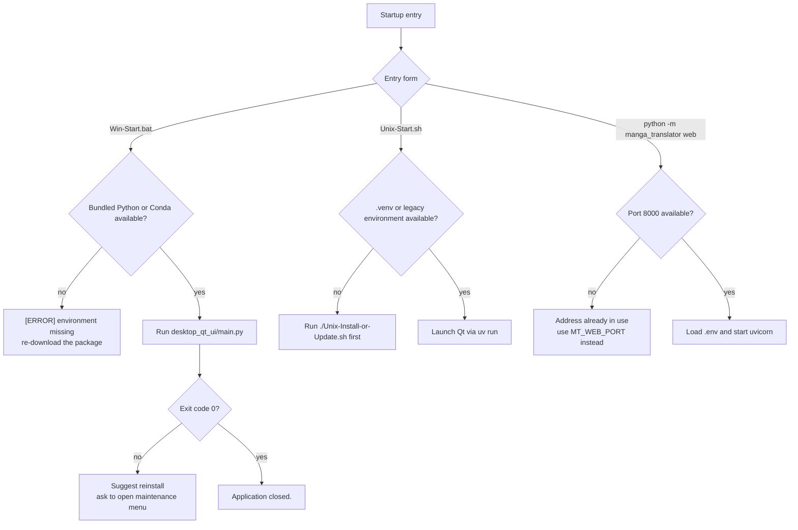

# Installation and Startup Troubleshooting

When the program cannot be installed, will not open, or exits immediately after launch, locate the symptom on this page first, then return to the matching installation page to apply the fix. This page covers installation and startup problems only and does not repeat the full steps of each installation page; see [Choose Edition](../install/choose-edition.md), [Runtime Requirements](../install/requirements.md), [Windows Portable](../install/windows-portable.md), [Windows from Source](../install/source-windows.md), [Linux and macOS Installation](../install/linux-and-macos.md), [Docker Deployment](../install/docker.md), [Update and Version Switching](../install/update-and-version-switching.md), and [Uninstall and Data Cleanup](../install/uninstall-and-data-cleanup.md) for the installation flows.

Model loading, GPU VRAM, and memory issues are covered by [Model, GPU, and Memory](./model-gpu-and-memory.md); API authentication, rate limiting, and timeouts by [API Auth, Rate Limit, and Timeout](./api-auth-rate-limit-and-timeout.md); output JSON and rendering problems by [Output JSON and Rendering](./output-json-and-rendering.md); and pre-sharing log cleanup by [Privacy, Cleanup, and Log Sharing](./privacy-cleanup-and-log-sharing.md).

## Feature boundary {#scope}

- This page covers installation failures for the Windows portable, source/Unix, and Docker forms, plus startup failures for the Qt desktop, CLI, and Web server entry points.
- "Installation failure" means environment creation, dependency download, or backend selection failed; "startup failure" means the entry point exists but cannot reach a usable state, such as an error exit, port conflict, or initialization failure.
- A successful installation does not mean models are downloaded, an API is reachable, or the GPU is usable; those are runtime problems handled by their own troubleshooting pages.

## Quick diagnosis {#quick-diagnosis}

| Symptom | Most likely cause | First check |
| --- | --- | --- |
| `Win-Start.bat` prints `[ERROR] Application exited with code ...` | Broken runtime environment or dependencies | Read `result/log_*.txt`, then run `Win-Install-or-Update.bat` and choose `[1] Install`; see [Windows Portable](../install/windows-portable.md) |
| `Win-Start.bat` cannot find bundled Python or Conda | Incomplete distribution directory | Re-extract the package and confirm `packaging/python/python.exe` or a Conda environment exists |
| `Unix-Start.sh` prints `Run ./Unix-Install-or-Update.sh first` | Missing project files or `.venv` | Run `Unix-Install-or-Update.sh` first; see [Linux and macOS Installation](../install/linux-and-macos.md) |
| `uv sync` fails due to network | Package source unreachable | Retry or switch mirrors and use `uv sync --locked`; see [Runtime Requirements](../install/requirements.md) |
| Launcher reports a Python version error | Current Python is not 3.12 | Install Python 3.12 (`>=3.12,<3.13`); do not use 3.13+ |
| Web server exits with a port conflict | Port `8000` is already in use | Change `MT_WEB_PORT` or stop the conflicting process; Docker see [Docker Deployment](../install/docker.md) |
| Desktop window opens and disappears immediately | Service initialization failure or Qt/Torch DLL conflict | Run from a terminal to see stderr and check `result/log_*.txt` for unhandled exceptions |

## Installation failures {#installation-failures}

### Python version mismatch {#python-version}

`packaging/launch.py` accepts only Python 3.12: below 3.12 it prints `错误: 需要 Python 3.12+` (hard-coded Chinese, "error: Python 3.12+ required"), above 3.12 it prints `错误: 仅支持 Python 3.12,不支持更高版本` and suggests using Python 3.12. `pyproject.toml` constrains the interpreter to `>=3.12,<3.13`.

Fix: install Python 3.12 and run `uv sync` again; do not reuse an old `.venv` with a Python 3.13+ interpreter.

### Dependency installation failures and mirror fallback {#dependency-install}

The installer first uses the declared dependency sources and, on failure, falls back through the mirror list in `packaging/launch.py`: ordinary packages try the Tsinghua, Aliyun, Douban, and official PyPI mirrors in order, while PyTorch packages try mirrors or the official source per `PYTORCH_INDEX_FALLBACKS`/`PYTORCH_INDEX_PRIORITY`. When every source fails, the installer reports that all mirrors failed and stops; already installed packages are kept and the retry resumes from the failing package.

- A proxy, firewall, or certificate problem can fail every source; first confirm that PyPI and the PyTorch download host are reachable.
- Source environments should use `uv sync --locked`; uv refuses to install when the lock file is inconsistent with `pyproject.toml`, and wheels from other platforms must not be mixed in by hand.
- The launcher depends on `packaging<25.0` to parse dependency declarations; when the installed version is too new, the launcher downgrades it automatically before continuing.

### Dependency group conflicts {#dependency-groups}

`pyproject.toml` declares four mutually exclusive dependency groups — `cpu`, `gpu`, `amd`, and `metal` — and bare `uv sync` installs `gpu` plus `packaging`. Adding another backend to the same environment, or mixing `onnxruntime` with `onnxruntime-gpu` or Torch from different CUDA/ROCm indexes, causes DLL, Torch, or ONNX Runtime conflicts. When the launcher detects that the installed PyTorch type does not match the target, it warns that the PyTorch version is mismatched, uninstalls `torch`/`torchvision`/`torchaudio`, and reinstalls; close other Python processes using PyTorch before the uninstall. When changing backends, create a fresh environment or cleanly resync one group; see the conflict table in [Runtime Requirements](../install/requirements.md).

### Runtime environment not found {#missing-environment}

- Windows portable: `Win-Start.bat` prefers `packaging/python/python.exe` and falls back to the legacy Conda layout (`manga-env` or `conda_env`). If neither exists it prints `[ERROR] Neither bundled Python nor Conda environment was found.` and tells the user to re-download the package; it never silently uses the system Python.
- Unix: `Unix-Start.sh` prefers `.venv/bin/python`, then legacy Conda environments; if none exists it prints `Run ./Unix-Install-or-Update.sh first`.
- Source: run `uv sync` in the repository root to create `.venv`, then launch with `uv run --no-sync python -m desktop_qt_ui.main`; see [Windows from Source](../install/source-windows.md).

## Startup failures {#startup-failures}

### Qt desktop startup failure {#qt-startup}

`desktop_qt_ui/main.py` starts in this order: create the log file, ensure runtime files exist, enable faulthandler, create the `QApplication`, initialize services, and create the main window. Logs go to `result/log_<timestamp>.txt` (`result/` next to `app.exe` in frozen builds, project-root `result/` in source runs). Key failure points:

- Service initialization failure logs `Fatal: Service initialization failed.` and exits with code 1; the concrete exception is in the log.
- Unhandled exceptions are written to the log and stderr by the global exception handler; Qt-internal errors are recorded by the Qt message handler.
- PyTorch is imported before PyQt6 to avoid Qt and `c10.dll` loading conflicts; the portable build also registers PyInstaller directories for DLL search. Mixed environments or a wrong PATH often surface as an immediate crash at startup.
- For non-zero exit codes, `Win-Start.bat` prints `[ERROR] Application exited with code ...`, suggests reinstalling, and asks whether to open `Win-Install-or-Update.bat`. Do not upload the local paths or logs shown in the error window.

Advice: run the startup command directly in a terminal to see stderr; inspect `result/log_*.txt`; confirm only one environment is used; reinstall with `[1] Install` in the maintenance menu when needed.

### Web server startup failure {#web-startup}

`python -m manga_translator web` listens on `0.0.0.0:8000` by default and can be overridden with `--host`/`--port` or `MT_WEB_HOST`/`MT_WEB_PORT`. At startup it reads `.env` from the application directory: when present it prints `[INFO] Loaded environment variables from: ...` and lists only the API-related variable names; when absent it prints `[WARNING] .env file not found at: ...`, which is a warning, not a fatal error.

- If the port is occupied, uvicorn raises a binding error; change the port or stop the conflicting process and retry.
- Docker health-checks with `curl http://localhost:8000/`; after three consecutive failures and a 60-second grace period the container is marked unhealthy; see [Docker Deployment](../install/docker.md).
- On first visit the Web login page asks you to create an administrator account; `MANGA_TRANSLATOR_ADMIN_PASSWORD` is a legacy admin-password setting and does not create a login account automatically.

### CLI exits immediately {#cli-startup}

`manga_translator/__main__.py` parses arguments and dispatches to `local`, `web`, `ws`, or `shared`. Without a mode it prints help and exits; `local` without `-i` input fails argument validation; an unknown mode prints `Unknown mode` and exits; exception paths print the exception class and traceback and exit with code 1.

Note: `__main__.py` imports `torch` before parsing arguments. When PyTorch is missing or its DLLs are incompatible, even `--help` can fail before parsing. First confirm the entry point works with `uv run --no-sync python -m manga_translator --help` and `uv run --no-sync python -m manga_translator local --help`, then handle the concrete input. The full command inventory is in the formal subcommand section of `doc/wiki/research/cli-command-inventory.md`.

### First-run initialization {#first-run}

Every entry point calls `ensure_runtime_files()` from `manga_translator/runtime_files.py` at startup, creating user-editable runtime tables under `config/` (custom API params, AI OCR/renderer/colorizer prompts, text filter, text replacements, rich-text rules, translation template); failures only log warnings and never overwrite existing user files. The Web server also creates account, session, audit, and permission data files under `manga_translator/server/data/`.

Model download is a separate stage: detector, OCR, and inpainting models are usually downloaded or loaded on first enable; with semantic line breaking enabled, `rendering/chinese_linebreak.py` checks the HanLP model and falls back to normal wrapping when it is absent. A successful install does not mean models are downloaded or an online API is usable.

## Logs and evidence collection {#logs-evidence}

| Entry point | Log location | Contents |
| --- | --- | --- |
| Qt desktop | `result/log_<timestamp>.txt` and `logs/` | Startup info, warnings, unhandled exceptions, faulthandler crash traces |
| CLI | stdout/stderr; `-v` enables verbose logging | Mode dispatch, error tracebacks, exit codes |
| Web server | stdout/stderr and server records | `.env` loading, `[SERVER CONFIG]`, task logs |
| Docker | `docker compose logs <service>`; `./data/logs` | Container stdout and health-check results |

Before sharing logs, remove API keys, tokens, usernames, private absolute paths, image paths, OCR/translations, and prompt text; error-window screenshots need the same redaction. See [Privacy, Cleanup, and Log Sharing](./privacy-cleanup-and-log-sharing.md).

## UI text matrix {#ui-text}

Installation and startup messages come from the launcher, batch/shell scripts, and the server's prints — they are not Qt control texts from `desktop_qt_ui/locales/*.json`, and `en_US.json`/`zh_CN.json` have no installation/startup keys. The table below uses "call site / code literal" as the key and keeps the actual displayed values; missing languages are marked honestly and never invented.

| UI call key (source call/literal) | English actual value | Simplified Chinese actual value |
| --- | --- | --- |
| `launch.py#is_python_version_valid` | No English output (hard-coded Chinese in launch.py) | 错误: 需要 Python 3.12+ |
| `launch.py#is_python_version_valid` | No English output (same) | 错误: 仅支持 Python 3.12,不支持更高版本 |
| `launch.py L("漫画翻译器 - 安装或更新", "Manga Translator UI - Install / Update")` | Manga Translator UI - Install / Update | 漫画翻译器 - 安装或更新 |
| `Win-Start.bat` `echo Starting...` | Starting... | Missing (hard-coded English in the batch file; no Chinese fallback) |
| `Win-Start.bat` `echo Application closed.` | Application closed. | Missing (same) |
| `Win-Start.bat` `echo [ERROR] Application exited with code %EXITCODE%` | [ERROR] Application exited with code ... | Missing (same) |
| `Win-Start.bat` `echo Please try reinstalling first...` | Please try reinstalling first: run Win-Install-or-Update.bat and choose [1] Install. | Missing (same) |
| `Win-Start.bat` `echo [ERROR] Neither bundled Python nor Conda environment was found.` | [ERROR] Neither bundled Python nor Conda environment was found. | Missing (same) |
| `Win-Start.bat` `set /p OPEN_MAINT="Open Win-Install-or-Update.bat now? (y/n): "` | Open Win-Install-or-Update.bat now? (y/n): | Missing (same) |
| `Unix-Start.sh` `fail "No .venv or compatible legacy environment was found"` | No .venv or compatible legacy environment was found | Missing (hard-coded English in the script; no Chinese fallback) |
| `Unix-Start.sh` `echo "Run ./Unix-Install-or-Update.sh first"` | Run ./Unix-Install-or-Update.sh first | Missing (same) |
| `server/main.py` `print("[INFO] Loaded environment variables from: " + env_path)` | [INFO] Loaded environment variables from: {path} | Missing (hard-coded English in the server; no Chinese fallback) |
| `server/main.py` `print("[WARNING] .env file not found at: " + env_path)` | [WARNING] .env file not found at: {path} | Missing (same) |

## Related files and formats {#files}

| File/directory | Actual role | Manual-edit and compatibility note |
| --- | --- | --- |
| `packaging/launch.py` | Python-version gate, dependency check, GPU detection, mirror fallback, PyTorch conflict handling, entry dispatch | Never write keys into it; menu output is not stable i18n |
| `Win-Start.bat`, `Unix-Start.sh` | Runtime-environment lookup and startup error feedback | Prefer bundled Python/`.venv`; most error messages are hard-coded English |
| `desktop_qt_ui/main.py` | Desktop startup order, logging, faulthandler, global exception handling, service init | PyTorch must be imported before PyQt6; do not reorder imports casually |
| `manga_translator/__main__.py`, `manga_translator/args.py` | CLI mode dispatch and defaults | Imports torch before parsing; default port `0.0.0.0:8000` |
| `manga_translator/runtime_files.py` | Creates runtime tables on first startup | Failures warn only; never overwrites user files |
| `result/log_*.txt`, `logs/` | Desktop and service logs | Redact keys, paths, and user content before sharing |
| `packaging/python/`, `.venv/`, `conda_env/` | Portable/source/legacy Conda runtimes | Keep one environment; do not mix dependency groups |
| `config/config.json`, `.env` | User configuration and API credentials | Never read, display, or commit real values |
| `packaging/Dockerfile`, `docker-compose.yml`, `docker-entrypoint.sh` | Image build, ports/volumes/health-check, initialization | Keep port mapping consistent with Compose |

## Troubleshooting flow {#troubleshooting-flow}

The diagram shows the common startup paths and error-feedback branches only; real exit codes, mirror fallback, and GPU branches still require source review and controlled runtime verification.

## Source evidence {#source-evidence}

| Layer | Files | What was checked |
| --- | --- | --- |
| Launcher | `packaging/launch.py` | Python 3.12 gate, mirror fallback, PyTorch conflict handling, entry dispatch |
| Windows entry | `Win-Start.bat` | Bundled-Python priority, Conda fallback, exit codes, reinstall hint |
| Unix entry | `Unix-Start.sh` | `.venv`/uv/legacy Conda order, dry-run, error messages |
| Desktop startup | `desktop_qt_ui/main.py` | Log file, faulthandler, global exception handler, service init, Qt launch |
| Service init | `desktop_qt_ui/services/__init__.py` | Essential/heavy service initialization and failure logging |
| CLI dispatch | `manga_translator/__main__.py`, `manga_translator/args.py` | Mode dispatch, default ports, implicit `local`, exit behavior |
| Web startup | `manga_translator/server/main.py` | `.env` loading, uvicorn binding, startup event, health check |
| Runtime tables | `manga_translator/runtime_files.py` | `ensure_runtime_files` factories and warn-only failure handling |
| Docker | `packaging/Dockerfile`, `packaging/docker-compose.yml`, `packaging/docker-entrypoint.sh` | Port mapping, volume init, health check |
| Research | `doc/wiki/research/cli-command-inventory.md`, `doc/wiki/research/default-sources.md`, `doc/wiki/research/phase0-page-coverage-matrix.md` | Command contract, default sources, page coverage |

## Verification {#verification}

| Check | Status | Notes |
| --- | --- | --- |
| Page contract (PAGE_GUIDELINES, BLUEPRINT, TODO 1.3/5.17) | Complete | Boundary, cross-links, three-column text matrix, flow table/diagram, and footer evidence covered |
| Launcher and scripts static review | Complete | Checked error branches of `launch.py`, `Win-Start.bat`, and `Unix-Start.sh` |
| Desktop/CLI/Web startup chain | Complete | Checked `main.py`, `__main__.py`, `args.py`, `server/main.py`, and `runtime_files.py` |
| Three-column UI text review | Complete | Install/startup messages are launcher/script hard-coded texts; `en_US.json`/`zh_CN.json` have no dedicated keys and missing values are marked honestly |
| Actual install/startup runtime verification | Not run | No release-package install, Qt launch, or Web binding in a controlled environment; static conclusions are not runtime proof |
| Route mirror and source-evidence checks | Pending | This task runs `verify-route-mirror.mjs` and `verify-source-evidence.mjs` in `doc/wiki` |
| VitePress build | Pending | Coordinator should run `npm run docs:build --prefix doc/wiki` |

## Sensitive-information review {#privacy}

This page records no API keys, tokens, admin passwords, usernames, private absolute paths, user images, OCR/translations, or private prompts. `.env`, user `config.json`, logs, and error windows are described only as file boundaries; redact them item by item before sharing logs or screenshots.
