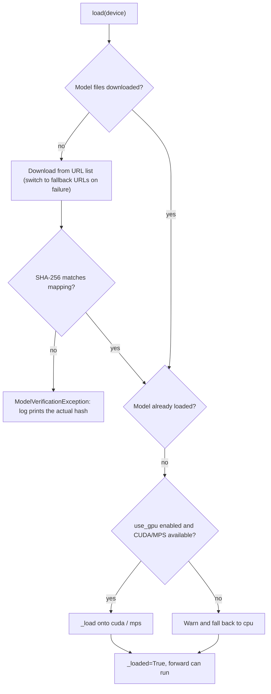
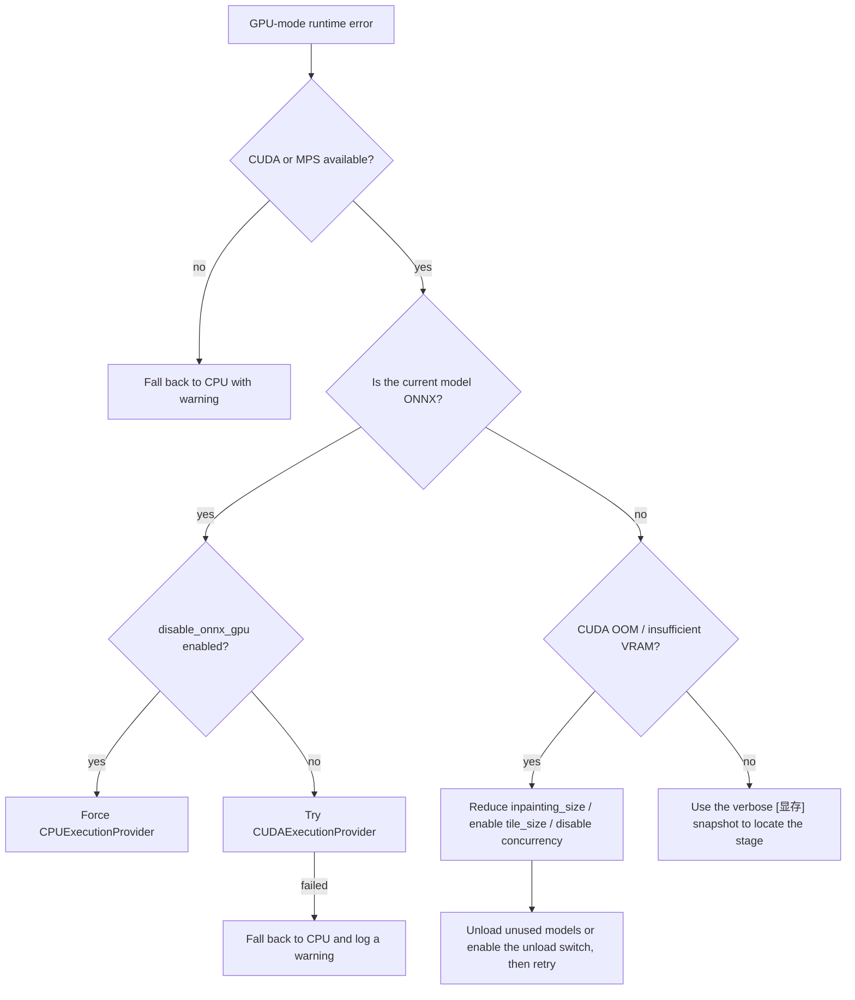
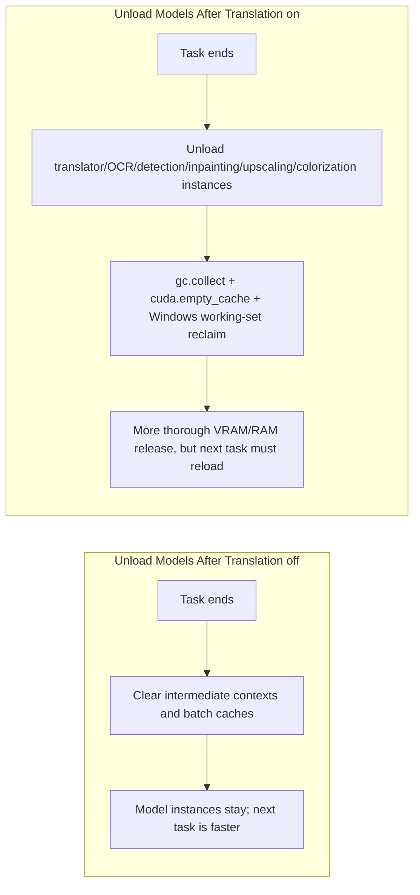

# Model, GPU, and Memory Troubleshooting

Use this page when a task stalls on model download, reports “CUDA out of memory”, GPU mode will not start, or memory/VRAM does not drop after translation. It covers model loading, GPU devices, VRAM, and RAM. Hardware backend groups are installed separately; see [Runtime Requirements](../install/requirements.md). The switches such as `app.unload_models_after_translation` are documented in [General and App Settings](../desktop/settings/general-and-app.md). This page does not repeat the full parameter pages for translation, OCR, detection, inpainting, or upscaling, nor API auth and rate limiting (see [API Auth, Rate Limit, and Timeout](./api-auth-rate-limit-and-timeout.md)) or CLI subprocess whole-machine memory limits (see [Subprocess, Memory, and Recovery](../cli/subprocess-memory-and-recovery.md)).

## Feature boundary {#feature-boundary}

- This page covers: model download/verification failures, device selection for `cli.use_gpu`, the ONNX path for `cli.disable_onnx_gpu`, post-task unload via `app.unload_models_after_translation`, and VRAM-related remedies such as `inpainting_size` and `tile_size`.
- This page does not cover: how to choose installation dependency groups (see `install/requirements.md`), the full options of the inpainting/upscaling pages (see their settings pages), or how to share logs and debug artifacts (see [How to Read and Share a Debug Run](../debugging/how-to-read-and-share-a-debug-run.md)).
- The settings pages record where each switch lives in the UI; this page explains their role in model, GPU, and memory troubleshooting and the underlying behavior.

## Common symptoms and quick diagnosis {#symptoms}

| Symptom | Common cause | Where to start |
| --- | --- | --- |
| First use of a model stalls on download or reports hash verification failure | Network unreachable, fallback URLs also fail, corrupted file or content differs from the actual weights | Check the `models/` subdirectory and the actual hash printed in logs; see [Model loading and download](#model-loading) |
| CUDA/Metal device not found and automatic fallback to CPU | CPU dependency group installed, driver mismatch, or `cli.use_gpu` enabled while the device is unavailable | [Runtime Requirements](../install/requirements.md); `label_use_gpu` |
| ONNX model fails to load or has GPU compatibility issues | ONNX Runtime CUDA provider unavailable or DLL conflict | Enable `label_disable_onnx_gpu` to force CPU and check whether it recovers |
| CUDA out of memory / insufficient VRAM | Per-inference input too large, `inpainting_size` too large, or high peak usage from concurrency and caches | Reduce `inpainting_size`, enable `tile_size`, disable concurrency, enable the unload switch |
| Memory/VRAM does not drop after a task | Model instances stay cached, Python and CUDA caches are not reclaimed | Enable `app.unload_models_after_translation`; inspect the `[显存]` snapshot in verbose logs |

## Relevant switches in the UI {#ui-controls}

### Settings → General {#general-group}

Open “Settings” (`Settings`) and select the “General” (`General`) group. The three switches all live in this group:

1. “Use GPU” (`Use GPU`) requests GPU acceleration. It only changes the runtime device; it cannot turn a CPU dependency environment into CUDA.
2. “Disable ONNX GPU Acceleration” (`Disable ONNX GPU Acceleration`) disables only the ONNX Runtime GPU path and forces CPU.
3. “Unload Models After Translation” (`Unload Models After Translation`) controls model unloading and memory reclamation after each task; when enabled, the next task reloads the models.

| UI call key | English actual value | Simplified Chinese actual value |
| --- | --- | --- |
| `label_use_gpu` | Use GPU | 使用 GPU |
| `desc_cli_use_gpu` | Enable GPU acceleration. Requires CUDA support, significantly speeds up processing. | 启用 GPU 加速。需要 CUDA 支持，可大幅提升处理速度。 |
| `label_disable_onnx_gpu` | Disable ONNX GPU Acceleration | 禁用 ONNX GPU 加速 |
| `desc_cli_disable_onnx_gpu` | Disable ONNX Runtime GPU acceleration. Try enabling this if GPU mode has compatibility issues. | 禁用 ONNX Runtime GPU 加速。如果 GPU 模式出现兼容问题，可尝试启用此选项。 |
| `label_unload_models_after_translation` | Unload Models After Translation | 翻译完成后卸载模型 |
| `desc_app_unload_models_after_translation` | Unload all models after translation to free VRAM and memory. Good for low VRAM, but requires reloading for next translation. | 翻译完成后卸载所有模型以释放显存和内存。适合显存不足的场景，但下次翻译需要重新加载。 |
| `desc_upscale_tile_size` | Tile processing size (0=no tiling). Splits large images into tiles to reduce VRAM usage. Recommended 200-800. | 分块处理大小 (0=不分割)。将大图分割成小块处理以降低显存占用。建议 200-800。 |

The last row is the description-panel text of the upscaling parameter `upscale.tile_size`, not a General-group switch.

### Other relevant settings {#other-settings}

- Inpainting size `inpainter.inpainting_size`: Settings → Mask and Inpainting. The default is `2048`; a value that is too large directly causes insufficient VRAM.
- Upscaling tiles `upscale.tile_size`: Settings → Upscale / Colorization. `0` processes the full image without tiling; tiling significantly lowers peak VRAM.
- Concurrent batches `cli.batch_concurrent`: Settings → General. Concurrency loads intermediate results of multiple images at once and raises peak VRAM/RAM; disable it when VRAM is limited.

## Key settings {#key-settings}

#### `cli.use_gpu` — 使用 GPU / Use GPU {#cli-use-gpu}

- Control: switch (Settings → General; UI call key `label_use_gpu`).
- Stored value: boolean.
- Options: `true | Use GPU | 使用 GPU`; when off there is no separate UI label, it simply means GPU is not requested.
- Defaults: core `manga_translator/config.py#CliConfig.use_gpu` is `True`; Qt model `desktop_qt_ui/core/config_models.py#CliSettings.use_gpu` is `True`; release `config/config-example.json` is `true`.
- Effective stage: device selection during `MangaTranslator` initialization, affecting the device of every subsequently loaded model.
- Mechanism: when enabled and available, `cuda` is selected (or `mps` on Apple Silicon); when enabled but neither CUDA nor MPS is available, a warning is printed and `cpu` is used. It does not change the installed dependency group.
- Dependencies/conflicts: depends on the backend group and drivers chosen at install time; the ONNX part is also affected by `cli.disable_onnx_gpu`.
- Diagram: not needed on its own; see the branches in [GPU and VRAM](#gpu-and-vram).

#### `cli.disable_onnx_gpu` — 禁用 ONNX GPU 加速 / Disable ONNX GPU Acceleration {#cli-disable-onnx-gpu}

- Control: switch (Settings → General; UI call key `label_disable_onnx_gpu`).
- Stored value: boolean; on the CLI it maps to `--disable-onnx-gpu` and exports the environment variable `MT_DISABLE_ONNX_GPU=1` at startup.
- Options: `true | Disable ONNX GPU Acceleration | 禁用 ONNX GPU 加速`; off means ONNX may use the CUDA provider.
- Defaults: core `CliConfig.disable_onnx_gpu` is `False`; Qt `CliSettings.disable_onnx_gpu` is `False`; release config is `false`.
- Effective stage: ONNX Runtime session creation (ONNX models such as detection, OCR, and inpainting).
- Mechanism: `set_onnx_gpu_disabled()` sets a process-wide switch; when enabled, `build_execution_providers` uses `CPUExecutionProvider` directly. Even when disabled, a failed CUDA provider creation falls back to CPU with a warning.
- Dependencies/conflicts: affects only the ONNX path, not PyTorch/MPS models; it is not mutually exclusive with `cli.use_gpu`.
- Diagram: see [GPU and VRAM](#gpu-and-vram).

#### `app.unload_models_after_translation` — 翻译完成后卸载模型 / Unload Models After Translation {#app-unload-models-after-translation}

- Control: switch (Settings → General; UI call key `label_unload_models_after_translation`, a custom checkbox in the dynamic settings).
- Stored value: boolean.
- Options: `true | Unload Models After Translation | 翻译完成后卸载模型`; off keeps model instances after the task.
- Defaults: Qt model `desktop_qt_ui/core/config_models.py#AppSettings.unload_models_after_translation` is `False`; release config is `false`; the core `Config` has no such field (desktop app state).
- Effective stage: the `finally` cleanup after each translation task.
- Mechanism: when enabled, `full_memory_cleanup(unload_models=True)` unloads the model instances cached by the translator, OCR, detection, inpainting, upscaling, and colorization modules, then runs garbage collection, CUDA `empty_cache`/peak-stat reset, and on Windows calls `EmptyWorkingSet` or `SetProcessWorkingSetSize` to reclaim physical memory; when disabled, only the cache dictionaries are cleared and model instances are kept for a faster next run.
- Dependencies/conflicts: the next task must reload models, so the first response is slower; it does not guarantee that VRAM used by third-party processes is returned immediately.
- Diagram: see [Unloading and memory reclamation](#memory-cleanup).

## Runtime behavior {#runtime-behavior}

### Model loading and download {#model-loading}

The model root is `BASE_PATH/models` (`BASE_PATH` is the repository root in development and the executable directory in frozen builds). Detection, OCR, inpainting, upscaling, colorization, and translation use separate subdirectories. `ModelWrapper.load()` first checks whether the files are downloaded: if missing, it downloads from the URL list in the module’s `_MODEL_MAPPING`, computes SHA-256, and compares it with the `hash` entry; a mismatch raises `ModelVerificationException` and prints the actual hash in logs. Only after the files are ready does `_load(device)` move the weights onto the target device.

On download failure or hash mismatch, first check the network and permissions of the `models/` directory, then compare the actual hash printed in logs against the mapping or delete corrupted files and retry. Do not copy local paths from download directories or logs into public reports.

### GPU and VRAM {#gpu-and-vram}

Device selection happens during `MangaTranslator` initialization: with `use_gpu=True` and an available device it selects `cuda`/`mps`, otherwise it falls back to `cpu` with a warning. ONNX sessions are created by `onnx_runtime.py`: unless disabled it prefers `CUDAExecutionProvider`, and a missing provider or failed session creation automatically falls back to `CPUExecutionProvider`. Both the desktop app and the CLI set `PYTORCH_ALLOC_CONF=expandable_segments:True` before importing PyTorch to reduce fragmentation and lower the chance of OOM. In verbose mode, VRAM snapshots are written to logs with the `[显存]` prefix (allocated/reserved/peak/free) to locate stage-by-stage growth.

The diagram reflects real branches in the source. Whether OOM occurs also depends on image size, `batch_concurrent`, and other processes on the same machine; enabling tiling or the unload switch does not guarantee that no model ever reports OOM.

### Unloading and memory reclamation {#memory-cleanup}

`app.unload_models_after_translation` is read by `app_logic.py` after a desktop task finishes and triggers `full_memory_cleanup()`. The core `MangaTranslator` also runs `_cleanup_gpu_memory()` per batch: normal cleanup does throttled garbage collection and CUDA synchronization, while `aggressive=True` also runs `empty_cache` and `ipc_collect`; MPS has no equivalent cache-clearing API.

Enabling unload does not mean VRAM used by third-party processes (browsers, other PyTorch programs) is returned immediately, nor that system RAM usage drops to zero at once; it mainly releases the models and caches held by this process.

### Idle unloading in server modes {#idle-unload}

The `web`, `ws`, and `shared` modes support `--models-ttl` (seconds, default `0`). When greater than `0`, `MangaTranslator` starts a background cleanup task that unloads models idle longer than the TTL; `0` keeps models resident. The desktop app does not use this CLI parameter; its behavior is controlled by `app.unload_models_after_translation`.

## Dependencies and conflicts {#dependencies}

- GPU acceleration depends on the backend group and drivers selected at install time; with the wrong group or drivers, `cli.use_gpu` only triggers a fallback instead of fixing the environment; see [Runtime Requirements](../install/requirements.md).
- An oversized `inpainting_size` directly causes OOM; `upscale.tile_size` tiling lowers upscaling peak VRAM; `cli.batch_concurrent` raises concurrent peaks, so disable it when VRAM is limited.
- `cli.disable_onnx_gpu` affects only the ONNX path; PyTorch/MPS models still select their device through `cli.use_gpu`.
- Enabling `app.unload_models_after_translation` costs reload time on the next task; it and `models_ttl` are different entry points (desktop switch vs server-mode CLI parameter).
- RAM limits (subprocess RSS / whole-machine memory) are a different class from VRAM; see [Subprocess, Memory, and Recovery](../cli/subprocess-memory-and-recovery.md).
- `cli.ignore_errors` decides whether a per-image failure is skipped or aborts the task; CUDA OOM has no dedicated friendly Chinese message, and task logs keep the original traceback. Clean logs before sharing per [Privacy, Cleanup, and Log Sharing](./privacy-cleanup-and-log-sharing.md).

## Related files and formats {#related-files-and-formats}

| File/directory | Actual role on this page | Manual-edit and sharing note |
| --- | --- | --- |
| `models/` (under `BASE_PATH`) | Model weight root with per-module subdirectories | Downloaded on first use; logs print the actual hash on verification failure; do not commit large files or private model names |
| `config/config-example.json` / `config/config.json` | Persists `cli.use_gpu`, `cli.disable_onnx_gpu`, `app.unload_models_after_translation` | Only check the sanitized template; never read or display a real user config |
| `MT_DISABLE_ONNX_GPU` / `.env` | ONNX switch env var exported at CLI startup; desktop `.env` stores API credentials | Never show real credential values |
| `result/` | Verbose logs (including `[显存]` snapshots) and debug intermediates | Clean paths, usernames, tokens, and user images before sharing |
| `pyproject.toml` / `uv.lock` | Decide whether CPU or GPU dependency groups are installed | Resync with `uv sync` when switching backends; see `install/requirements.md` |

## Source evidence {#source-evidence}

| Layer | File | What was checked |
| --- | --- | --- |
| Settings UI | `desktop_qt_ui/ui/main_page/settings_tab_layout.json`, `desktop_qt_ui/ui/main_page/dynamic_settings.py`, `desktop_qt_ui/ui/main_page/view.py` | The three General-group switches, the custom checkbox, and label mapping |
| UI/i18n | `desktop_qt_ui/locales/en_US.json`, `zh_CN.json` | Keys and actual bilingual display values |
| Config models | `desktop_qt_ui/core/config_models.py`, `manga_translator/config.py`, `config/config-example.json` | Core/Qt/release default values |
| Model loading | `manga_translator/utils/inference.py`, `manga_translator/utils/generic.py` | `models/` root, download and fallback URLs, SHA-256 verification, `load`/`unload`, and VRAM cleanup |
| Device and ONNX | `manga_translator/manga_translator.py`, `manga_translator/utils/onnx_runtime.py`, `manga_translator/__main__.py` | Device fallback, `set_onnx_gpu_disabled`, `MT_DISABLE_ONNX_GPU`, `PYTORCH_ALLOC_CONF`, and VRAM snapshots |
| Memory cleanup | `desktop_qt_ui/utils/memory_cleanup.py`, `desktop_qt_ui/app_logic.py` | `full_memory_cleanup`, unload-switch read, and post-task call timing |
| Server modes | `manga_translator/args.py`, `manga_translator/manga_translator.py` | `--models-ttl` and the idle-unload task |
| OCR switching | `desktop_qt_ui/services/ocr_service.py` | Automatic unload of the previous OCR model when the editor model changes |

## Verification {#verification}

| Check | Status | Notes |
| --- | --- | --- |
| Bilingual structure, frontmatter, pageId | Complete | Both pages are isomorphic with identical heading hierarchy and explicit anchors; the placeholder pageId is kept |
| UI layout and i18n three-column table | Complete | Statically checked the General layout, `app_logic.py` mapping, and actual `en_US.json`/`zh_CN.json` values |
| Model loading/device/ONNX/cleanup source chain | Complete | Statically checked `inference.py`, `onnx_runtime.py`, `manga_translator.py`, `memory_cleanup.py`, and `app_logic.py` |
| Real GPU/OOM reproduction | Not run | Requires matching hardware, a sanitized environment, and public samples |
| Actual model download and verification | Not run | This page triggered no real downloads and fabricated no runtime results |
| Sensitive-information review | Complete | No key, token, username, private path, user image, or private prompt was written |
| VitePress and static checks | Pending | The coordinator should run the mirror/source checks and the docs build |
