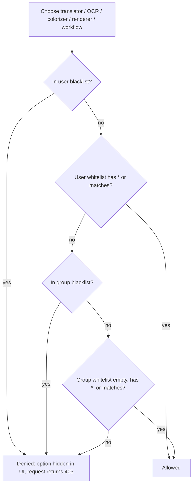
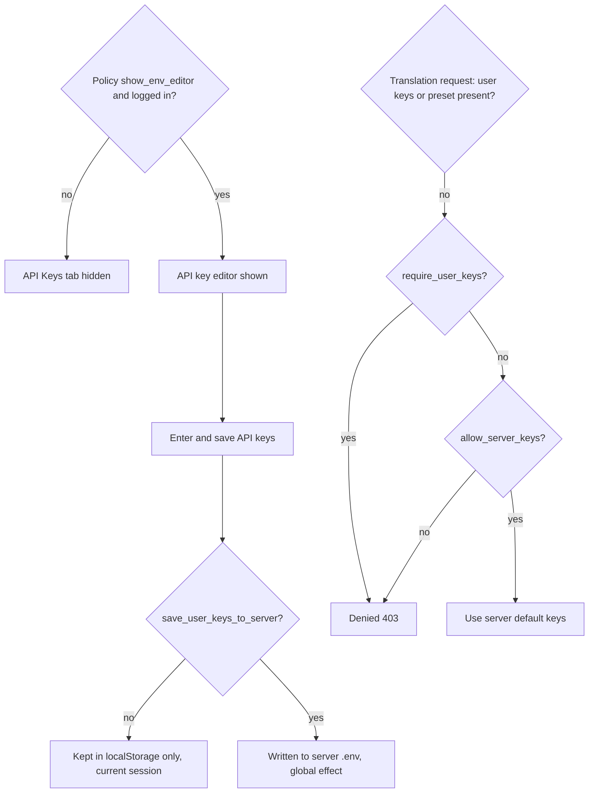
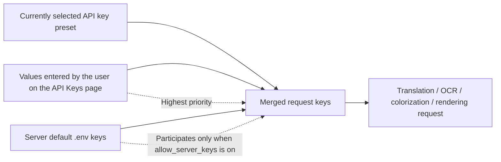

# Accounts, Permissions, and API Keys

When several people share one translation server, this page explains how to create and manage user accounts, control which translators/OCR/colorizers/renderers/workflows and parameters each user may use, and how users fill in API keys on their own page. On first startup, when no account exists, the login page guides you through creating the first administrator; afterwards an administrator assigns permissions in “用户管理” (User Management), “用户组管理” (Group Management), “配额管理” (Quota Management), and related screens. Session login and expiry details are in [Login, language, and session](./login-language-and-session.md), the overall admin console structure is in [Administrator interface](./administrator-interface.md), and font/prompt resource upload permissions are in [Resources, fonts, and prompts](./resources-fonts-and-prompts.md). The authentication contract for direct HTTP API callers is covered by [Developer HTTP API: Authentication and errors](../developer/http-api/authentication-and-errors.md) and [Admin: Users, groups, quota, and audit](../developer/http-api/admin-users-groups-quota-audit.md); this page only describes operations a user performs in the browser.

## Feature boundary {#feature-boundary}

- This page covers the browser-side account lifecycle (initial setup, login, registration, password change, logout), roles/groups/feature permissions and quota, plus the user-side API key editor and policy.
- A “user account” is not an “HTTP API client”: the `X-Session-Token` request/response format, status codes, and route inventory belong to the developer HTTP API pages.
- This page does not cover server startup, ports, CORS, or firewalls (see [Deployment, security, and troubleshooting](./deployment-security-and-troubleshooting.md)), nor translation tasks themselves (see [Upload, configure, and translate](./upload-config-and-translate.md)).
- API keys are described only through management and effective-order rules; no real keys, usernames, private paths, or user-entered values are shown.

## User accounts {#user-accounts}

### Set up the first admin account {#initial-admin-setup}

When the server has no accounts yet, `/auth/status` returns `need_setup` and the login page shows only the “首次使用，请创建管理员账户” (first use, create an admin account) and “创建管理员账户” (create admin account) form. Fill in “管理员用户名” (admin username, at least 2 characters), “管理员密码” (admin password, at least 6 characters), and “确认密码” (confirm password); submitting creates the first `admin`-role account and logs it in. The login page only honors the single controlled redirect `redirect=/admin`; any other value returns to the main page.

### Login, registration, and forced password change {#login-register-and-forced-password-change}

- The “登录” (Login) tab uses “用户名” (Username) and “密码” (Password); failures show “用户名或密码错误” (wrong username or password), “用户不存在” (user does not exist), or “账号已被禁用” (account disabled). When login succeeds but the account carries the `must_change_password` flag (forced for the default admin), the “需要修改密码” (password change required) dialog appears first; you may choose “稍后修改” (later) or “确认修改” (confirm).
- The “注册” (Register) tab appears only when an administrator enables “允许用户注册” (allow user registration) in “服务器配置” (Server Configuration). A successful registration creates a `user`-role account in the “注册用户默认分组” (default group for registered users, default `default`; the `admin` group is not selectable). When registration is disabled, direct registration calls return “注册功能未开启，请联系管理员” (registration is disabled, contact the administrator).
- Login is rate-limited by IP (15 per 10 minutes) and by username (8 per 10 minutes); registration is limited by IP (5 per 10 minutes). When exceeded, the page asks you to retry later (`Retry-After`).

### Change password, logout, and session state {#change-password-logout-and-session}

The “修改密码” (Change password) dialog on the login page calls the change-password endpoint and verifies the old password; success clears the forced-password-change flag. Logging out terminates the current session, and the front end clears the local token and returns to the login page regardless of the result. The token is stored in the browser as `localStorage.session_token` and sent on later requests as the `X-Session-Token` header; invalid, expired, or disabled accounts are rejected and sent back to the login page.

| UI call key | English actual value | Simplified Chinese actual value |
| --- | --- | --- |
| `setup` form (hardcoded in login.html) | No locale key; hardcoded Chinese | 首次使用，请创建管理员账户 / 管理员用户名 / 管理员密码 / 确认密码 / 创建管理员账户 |
| `login` form (hardcoded in login.html) | No locale key; hardcoded Chinese | 请登录以继续使用 / 用户名 / 密码 / 登录 |
| `register` form (hardcoded in login.html) | No locale key; hardcoded Chinese | 请登录或注册以继续使用 / 注册 |
| `change-password` modal (hardcoded in login.html) | No locale key; hardcoded Chinese | 需要修改密码 / 新密码 / 确认新密码 / 稍后修改 / 确认修改 |

## Permissions and roles {#permissions-and-roles}

### Roles, groups, and inheritance {#roles-groups-and-inheritance}

Accounts have exactly two roles: `admin` and `user`. Administrators can enter the admin console; regular users can only use the capabilities granted to them. Every user belongs to a group (default `default`; administrators usually belong to the `admin` group). Group permissions and quota act as “inherited configuration” that user-level settings can override: a whitelist can unlock items disabled by the group, and a blacklist can additionally deny items.

Feature-permission resolution follows this priority, from highest to lowest: user blacklist → user whitelist → group blacklist → group whitelist. `*` means allow all; an empty user whitelist means inherit from the group.

### Feature, resource, and quota permissions {#feature-resource-and-quota-permissions}

- Feature permissions: translators, OCR, colorizers, renderers, workflows, and parameters each have `allowed_*` / `denied_*` lists. Parameter permissions filter by configuration key (for example `translator.target_lang`).
- Resource permissions: `can_upload_files` / `can_delete_files` decide whether private fonts and prompts can be uploaded/deleted. When a group configures the finer-grained `can_upload_fonts`, `can_delete_fonts`, `can_upload_prompts`, or `can_delete_prompts`, the group value wins.
- Quota: `max_concurrent_tasks` (default 2 for regular users, 10 for administrators) limits simultaneously running tasks; `daily_quota` (default 100 for regular users, `-1` means unlimited) limits the daily task count. Group quota takes precedence over user-level quota. Exceeding a limit returns `429`.
- Upload limits are also affected by server configuration: `max_image_size_mb` and `max_images_per_batch`.

### How permissions affect the UI {#how-permissions-affect-the-ui}

The front end loads `/user/settings`, `/translators?mode=authenticated`, `/languages?mode=authenticated`, `/workflows?mode=authenticated`, `/config?mode=authenticated`, and similar data, then hides controls the user may not use: the API Keys tab, font/prompt upload sections, parameter groups (matched by `data-key` against `allowed_parameters`), workflow dropdown options, and more. Hiding controls is only a UX-level filter; the final translation request is re-checked server-side, and missing permission returns `403`.

In the diagram, denial appears both as filtered dropdown options and as the final server-side check; a regular user cannot bypass it by hand-crafting a request. The `admin` link is shown only when the current session role is `admin`.

| UI call key | English actual value | Simplified Chinese actual value |
| --- | --- | --- |
| `admin` (hardcoded fallback in script.js) | Missing; uses call-site fallback | 管理 |
| `web_resource_management` | Resource Management | 资源管理 |
| `web_can_upload_font` | Can Upload Font | 可上传字体 |
| `web_can_upload_prompt` | Can Upload Prompt | 可上传提示词 |
| `web_group_permissions` | Group Permissions | 用户组权限 |
| `web_can_view_history` | Can View History | 可查看历史 |
| `web_can_view_logs` | Can View Logs | 可查看日志 |
| `label_translator` | Translator | 翻译器 |
| `label_ocr` | OCR Model | OCR模型 |
| `label_colorizer` | Colorization Model | 上色模型 |
| `label_renderer` | Renderer | 渲染器 |
| User-management screen (hardcoded in admin) | No locale key; hardcoded Chinese | 用户管理 / 用户组管理 / 配额管理 / 会话管理 / 添加用户 / 创建用户 / 编辑用户 / 普通用户 / 管理员 / 账户启用 / 活跃 / 禁用 / 编辑权限配置 |

## API key management {#api-key-management}

### User-side API key editor {#user-side-api-key-editor}

The settings area on the main page has four tabs: “Basic Settings / Advanced Settings / Options / API Keys (.env)”. The `API Keys (.env)` tab starts hidden and is shown only when the user is logged in and the server policy `show_env_editor` is enabled. The editor groups API fields into four categories — “Translator / OCR Model / Colorization Model / Renderer”. The translation category contains OpenAI, Gemini, and Sakura groups; the OCR/colorization/renderer categories each contain OpenAI and Gemini groups. Field labels come from i18n (for example `label_OPENAI_API_KEY`); secret fields use `password`-type inputs, and placeholders such as `sk-...` and `AIza...` are sanitized examples, not real keys. Sakura and the OCR/colorization/renderer groups carry hardcoded Chinese notes, for example “Sakura 使用固定兼容密钥，只需要配置 API 地址和词典路径” (Sakura uses a fixed compatible key; only the API address and dictionary path need configuring) and “需单独配置，不会回落到翻译分组” (configure separately; it does not fall back to the translation group).

The save button writes the entered fields into `localStorage.user_env_vars` (kept after a page refresh) and posts them to `/env`. Whether the values are truly saved to the server depends on the policy `save_user_keys_to_server`: when disabled, the page notes “API 密钥仅在本次会话中使用，不会保存到服务器” (keys are only used in this session and are not saved to the server); when enabled, they are written into the server `.env` and take effect immediately. `/env` and `/env/effective` never return server key plaintext — they only return source metadata (user-entered / preset / server default) and sanitized state.

### API key policy {#api-key-policy}

The policy each user sees is the merge of “global policy + group policy”, with the group policy winning. The four policy fields mean:

| Policy field | Off (default) | On |
| --- | --- | --- |
| `show_env_editor` | The `API Keys (.env)` tab is not shown on the user page | Logged-in users can view and edit keys |
| `allow_server_keys` | Falling back to server default keys is forbidden; users must rely on presets or their own values | Server default `.env` keys may be used |
| `require_user_keys` | Falling back to server defaults is allowed when the user has no keys | Translation requests are rejected (`403`) when the user has no keys and no preset |
| `save_user_keys_to_server` | User keys stay in the browser/current session only | User-entered keys are written into the server `.env`; not recommended in multi-user environments |

The policy controls “who can edit, whether fallback is allowed, and whether persistence happens”. It never returns key plaintext to the page and never exposes real values in docs or logs.

### Effective order and merging {#effective-order-and-merging}

The environment variables for each translation request merge in the order “user-entered > currently selected preset > server default”, with higher priority overriding lower. Presets come from the “API 密钥预设” (API key presets) created by an administrator or from the group default preset; `/env/effective` returns the active preset source and the source of each field so the page can display “inherited from preset/server default, values are not shown in plaintext”.

Merging happens only during server-side request construction; the page never receives the fully merged plaintext keys.

### Server default keys and presets {#server-default-keys-and-presets}

Administrators maintain “服务器默认API密钥” (server default API keys, `.env`) and “API密钥预设” (API key presets) in the “API密钥管理” (API key management) module. Server default keys are the fallback when no user or preset overrides anything; presets can be restricted to visible groups and assigned to users or groups as their default. In “用户管理” (User Management), an administrator can also assign each user an “API密钥预设” (API key preset; default is “继承用户组设置”, inherit group settings).

| UI call key | English actual value | Simplified Chinese actual value |
| --- | --- | --- |
| `Manga Translator` | Manga Translator | 漫画翻译器 |
| `Basic Settings` | Basic Settings | 基础设置 |
| `Advanced Settings` | Advanced Settings | 高级设置 |
| `Options` | Options | 选项 |
| `API Keys (.env)` | API Keys (.env) | API密钥 (.env) |
| `Log output...` | Log output... | 日志输出... |
| `label_OPENAI_API_KEY` | OpenAI API Key | OpenAI API 密钥 |
| `label_OPENAI_API_BASE` | OpenAI API Base | OpenAI API 地址 |
| `label_OPENAI_MODEL` | OpenAI Model | OpenAI 模型 |
| `label_GEMINI_API_KEY` | Gemini API Key | Gemini API 密钥 |
| `label_GEMINI_API_BASE` | Gemini API Base | Gemini API 地址 |
| `label_GEMINI_MODEL` | Gemini Model | Gemini 模型 |
| `label_SAKURA_API_BASE` | SAKURA API Base | SAKURA API 地址 |
| `label_SAKURA_DICT_PATH` | SAKURA Dictionary Path | SAKURA 词典路径 |
| `label_OCR_OPENAI_API_KEY` | OCR OpenAI API Key | 文字识别 OpenAI API 密钥 |
| `label_COLOR_OPENAI_API_KEY` | Colorization OpenAI API Key | 上色 OpenAI API 密钥 |
| `label_RENDER_OPENAI_API_KEY` | Rendering OpenAI API Key | 渲染 OpenAI API 密钥 |
| `translator_openai` | OpenAI Translate | OpenAI翻译 |
| `translator_gemini` | Gemini Translate | Gemini翻译 |
| `translator_sakura` | Sakura Translate | Sakura翻译 |
| `save_api_keys` | Missing; call-site fallback is Chinese | 保存 API 密钥 |
| `api_keys_will_be_saved` | Missing; call-site fallback is Chinese | API 密钥将保存到服务器 |
| `api_keys_session_only` | Missing; call-site fallback is Chinese | API 密钥仅在本次会话中使用，不会保存到服务器 |
| `login_required_for_api_keys` | Missing; call-site fallback is Chinese | 登录后可查看和保存 API 密钥 |
| `api_keys_saved_to_server` | Missing; call-site fallback is Chinese | API 密钥已保存到服务器 |
| `api_keys_saved_session` | Missing; call-site fallback is Chinese | API 密钥已保存（仅本次会话） |
| `api_keys_save_failed` | Missing; call-site fallback is Chinese | API 密钥保存失败 |
| Env-var management (hardcoded in admin) | No locale key; hardcoded Chinese | API密钥管理 / API密钥预设 / 服务器默认API密钥 / 保存API密钥 / 创建预设 / 保存修改 / 删除 |

## Dependencies and conflicts {#dependencies-and-conflicts}

- Registration availability depends on the administrator’s “允许用户注册” (allow user registration) switch; when off, the login page hides the Register tab and the endpoint refuses too.
- Enabling `save_user_keys_to_server` writes user keys into the server `.env`; any user save affects the whole deployment, so plan it together with group policy in multi-user environments.
- Feature permissions filter options and requests; they do not change the capabilities of the translators/OCR themselves. When `*` and a blacklist both exist, the blacklist wins.
- Group quota takes precedence over user-level quota, but user-level `denied_*` always wins over the group whitelist; configure the group first, then the user.
- Hiding the API Keys tab is not the same as disabling it server-side: `show_env_editor` only controls the page editing entry, while whether a request may use server keys is decided by `allow_server_keys` / `require_user_keys`.

## Related files and formats {#related-files-and-formats}

| File/location | Actual role on this page | Manual-edit and compatibility note |
| --- | --- | --- |
| `manga_translator/server/data/accounts.json` | Account persistence: username, bcrypt hash, role, group, permissions, status | Never read or display real accounts; written atomically with backups by `AccountService` |
| App-directory `.env` | Server default API keys (within the `WEB_API_ENV_KEYS` whitelist) | Never commit real keys; can be overwritten by user saves when `save_user_keys_to_server` is on |
| Admin server configuration | `registration.enabled`, `api_key_policy`, `show_env_to_users`, upload limits | Registration is off by default; `show_env_to_users` defaults to `false` |
| `localStorage.session_token` / `user_info` | Session token and user-info cache | Browser-local; the `/auth/check` result wins once a server-side session is invalidated |
| `localStorage.user_env_vars` | Browser staging of user-entered API keys | Stores only valid keys from `api-key-schema.js`; whether it reaches the server depends on policy |
| `static/js/shared/api-key-schema.js` | API key editor field schema (categories, groups, keys, i18n, placeholders) | The backend `WEB_API_ENV_KEYS` stays in sync with it |

## Source evidence {#source-evidence}

| Layer | File | What was checked |
| --- | --- | --- |
| Account service | `manga_translator/server/core/account_service.py` | Create/update/delete, bcrypt password hashing and strength, default admin |
| Permission service | `manga_translator/server/core/permission_service.py` | Feature-permission priority, concurrency/daily quota, file permissions, parameter filtering |
| Key policy | `manga_translator/server/core/api_key_policy.py` | Defaults of the four policy fields and group override |
| Auth middleware | `manga_translator/server/core/middleware.py` | `require_auth` / `require_admin`, `401`/`403` |
| Auth routes | `manga_translator/server/routes/auth.py` | setup/login/register/change-password/check/status and rate limits |
| Env/settings routes | `manga_translator/server/routes/config.py` | `/api-key-policy`, `/env`, `/env/effective`, `/user/settings` |
| User-management routes | `manga_translator/server/routes/users.py` | Admin user CRUD and permission updates |
| Request merging | `manga_translator/server/core/response_utils.py` | `apply_user_env_vars` preset merge and policy denial |
| Front-end main script | `manga_translator/server/static/script.js` | Tab visibility, key editor, upload/parameter filtering, admin link |
| Login page | `manga_translator/server/static/login.html` | Initial setup/login/register/forced-password-change flow |
| Admin UI | `manga_translator/server/static/admin-new.html`, `static/js/admin/modules/users.js`, `permissions.js`, `envvars.js`, `static/js/admin/components/permission-editor.js` | User/group/permission/key management screens and permission editor |
| i18n | `desktop_qt_ui/locales/en_US.json`, `zh_CN.json`, `static/js/i18n.js` | Key mapping, actual display values, missing fallbacks |

## Verification {#verification}

| Check | Status | Notes |
| --- | --- | --- |
| BLUEPRINT, PAGE_GUIDELINES, TODO | Complete | Read in full and followed the page contract |
| Account and auth flow | Complete | Statically checked `auth.py`, `login.html`, `middleware.py` |
| Permission model and UI filtering | Complete | Statically checked `permission_service.py`, `users.py`, `script.js`, `permission-editor.js` |
| API key policy and editor | Complete | Statically checked `api_key_policy.py`, `api-key-schema.js`, `config.py`, `response_utils.py` |
| i18n three columns | Complete | The tables record key, actual English, and actual Simplified Chinese values; missing entries are marked |
| Sanitized runtime verification | Deferred | No Web server/browser was started; no real `.env`, `accounts.json`, key, or user data was read |
| VitePress | Deferred | Coordinator should run `npm run docs:build --prefix doc/wiki` plus mirror/source checks before merge |