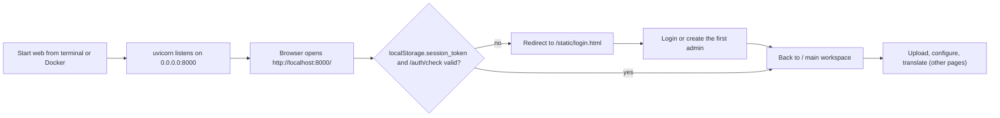

# Web Launch and Access

Use this page when you run Manga Translator as a web service and want to upload images, configure parameters, and view results in a browser. The official `web` subcommand serves both the user interface (`GET /` main workspace, `GET /admin` admin UI, and `/static/*` assets) and the developer HTTP API in one process; this page covers only the user path of “start the server + access it in a browser”. Login, session, registration, and language switching are covered in [Login, language, and session](./login-language-and-session.md), uploading and translation in [Upload, config, and translate](./upload-config-and-translate.md), and the HTTP API contract and internal `ws`/`shared` protocols in the developer pages and [CLI web, ws, and shared modes](../cli/web-ws-and-shared-modes.md).

## Feature boundary {#feature-boundary}

- The official entry is `python -m manga_translator web`; it listens on `0.0.0.0` port `8000` by default and can be overridden with the `MT_WEB_HOST`/`MT_WEB_PORT` environment variables or the `--host`/`--port` arguments. A separate `127.0.0.1:8000` parser in `manga_translator/server/args.py` is not wired into the official top-level parser, so it must not be used to rewrite the official defaults.
- `web`, `local`, `ws`, and `shared` are sibling subcommands: `local` is command-line batch translation and does not listen on any port; `ws` (listens locally on `127.0.0.1:5003`, upstream `ws://localhost:5000`) and `shared` (`127.0.0.1:5003`) are internal executor protocols that browsers do not access directly.
- This page belongs to the web user side: the regular UI at `GET /`, the admin UI at `GET /admin`, and the session entry at `static/login.html`. All JSON, form, and streaming endpoints belong to the developer HTTP API pages even when the static frontend calls some of them.
- The default `0.0.0.0` means the server binds every network interface: localhost, LAN, and port-mapped access all work, and the service is exposed to the network by default.

## Start the web server {#start-web-server}

### Start from the command line {#start-via-cli}

Run from the repository root with the project-managed runtime:

```powershell
uv run --no-sync python -m manga_translator web
```

This is equivalent to the defaults `--host 0.0.0.0 --port 8000`. During startup:

1. `__main__.py` tries to import `torch` before parsing arguments; if PyTorch is missing or its DLLs are incompatible, even `--help` can fail.
2. It loads `.env` from the application directory when present (only the names of loaded keys are printed, never their values); a warning is printed when the file is missing.
3. It initializes the server configuration and data directories (admin config and user-resource directories under `manga_translator/server/data`), then Uvicorn listens on `host:port` with `timeout_keep_alive=1800` (30-minute keep-alive) and a 30-second graceful shutdown timeout.
4. It prints a `[SERVER CONFIG]` summary and an internal nonce (used for shared-executor registration; do not copy this value into public reports).

Options of the `web` subcommand (environment variables are evaluated at process startup and take precedence over the baseline values in the help text):

| Option | Environment variable | Default | Effect |
| --- | --- | --- | --- |
| `--host` | `MT_WEB_HOST` | `0.0.0.0` | Listen address |
| `--port` | `MT_WEB_PORT` | `8000` | Listen port |
| `--use-gpu` | `MT_USE_GPU` | `false` | Enable GPU (true for `true`/`1`/`yes`/`on`) |
| `--disable-onnx-gpu` | `MT_DISABLE_ONNX_GPU` | `false` | Disable ONNX Runtime GPU (same truthy rule) |
| `--models-ttl` | `MT_MODELS_TTL` | `0` | Seconds to keep models in memory; `0` means forever |
| `--retry-attempts` | `MT_RETRY_ATTEMPTS` | `None` | Retry attempts on failure; `-1` means infinite |
| `-v`, `--verbose` | `MT_VERBOSE` | `false` | Verbose logging (true for `true`/`1`/`yes`) |

For example, to listen on localhost only and use port `8080`:

```powershell
uv run --no-sync python -m manga_translator web --host 127.0.0.1 --port 8080
```

Note: running `python manga_translator/server/main.py` directly imports the nonexistent `manga_translator.args.parse_arguments`, so that direct module guard is not an official entry; always use `python -m manga_translator web`.

### Start with Docker {#start-via-docker}

`packaging/docker-compose.yml` provides CPU and GPU services; both listen on `8000` inside the container, with different host mappings:

| Service | Image | Host mapping | Host access URL |
| --- | --- | --- | --- |
| `manga-translator-cpu` | `manga-translator:cpu` | `8000:8000` | `http://localhost:8000` |
| `manga-translator-gpu` | `manga-translator:gpu` | `8001:8000` | `http://localhost:8001` |

The Dockerfile declares `EXPOSE 8000` and runs `python -m manga_translator web --host 0.0.0.0 --port 8000`. The compose file sets an admin-password environment variable for first startup (a sample value that must be changed before any exposed deployment; this page does not show real values) and mounts `fonts`, `dict`, `result`, `models`, `logs`, `manga_translator/server/data`, and `config` as data volumes; persisting `.env` requires an explicit `data/app.env` mount. Image build, upgrade, and removal are covered in [Install: Docker](../install/docker.md).

## Access in the browser {#browser-access}

After startup succeeds, enter one of these addresses in the browser:

| Scenario | Address |
| --- | --- |
| Local CLI | `http://localhost:8000/` or `http://127.0.0.1:8000/` |
| LAN | `http://<server-ip>:8000/` (`0.0.0.0` binds all interfaces) |
| Docker CPU | `http://localhost:8000/` |
| Docker GPU | `http://localhost:8001/` |

`GET /` is served by `routes/web.py` from `static/index.html`; when the file is missing, a placeholder HTML “Web UI not installed” is returned. `/static/*` is mounted with StaticFiles, `/locales/*` is also mounted when the `desktop_qt_ui/locales` directory exists, and `GET /admin` returns `admin-new.html` (the entry link is shown to admin accounts only).

### First access and login entry {#first-access-and-login}

On page load, the main script `script.js` reads `localStorage.session_token` and calls `GET /auth/check`:

- No token, a failed request, or `valid=false`: the local token is removed and the page redirects to `/static/login.html`.
- `login.html` first calls `GET /auth/status`: with no users it returns `need_setup=true` and shows “首次使用，请创建管理员账户” (create the first admin); with existing accounts and registration enabled by the admin it shows login/registration tabs, otherwise login only.
- After a successful login the token is written to `localStorage.session_token` and the browser returns to `/` to enter the main workspace.



This diagram describes only the source-confirmed session-check branch; `need_setup`, the registration switch, forced password change, and the legacy password gate belong to [Login, language, and session](./login-language-and-session.md) and are not expanded here.

### Language and UI entry {#language-and-ui-entry}

The header of the main UI provides a language selector. The chosen value is stored in `localStorage.locale`, the page fetches the desktop locale JSON from `/i18n/{locale}` and applies translations, falling back to `/i18n/en_US` on load failure. The default locale is decided in this order: `localStorage.locale` → browser language (en/zh/ja/ko/es prefix) → `zh_CN`. The page title and header H1 use the locale key `Manga Translator` and fall back to the HTML title “Manga Translator Web UI” before i18n loads.

## Ports and exposure {#ports-and-exposure}

| Scenario | Port | Documentation convention |
| --- | --- | --- |
| Web (official `web` subcommand) | `0.0.0.0:8000` (overridable via `MT_WEB_HOST`/`MT_WEB_PORT`) | Shared by the user UI and the HTTP API; browser access entry |
| Docker CPU | Container listens on `8000`, mapped `8000:8000` | Host entry `8000` |
| Docker GPU | Container listens on `8000`, mapped `8001:8000` | Host entry `8001`, not the container default `8000` |
| `ws` internal | Listens locally on `127.0.0.1:5003`; upstream `ws://localhost:5000` | Internal protocol, not accessed by browsers; see CLI and developer pages |
| `shared` internal | `127.0.0.1:5003` | Internal protocol; see developer pages |

The source configures CORS with `allow_origins=["*"]`, `allow_credentials=True`, and all methods/headers; this is a server-side setting and does not mean every origin/credential combination passes in a real browser. The actual preflight behavior requires runtime verification.

## UI copy reference {#ui-copy}

The UI copy on this page falls into two groups: keys that exist in the desktop locales, and HTML-hardcoded strings. The locale values below are recorded as “call key → `en_US` → `zh_CN`”:

| UI call key | English actual value | Simplified Chinese actual value |
| --- | --- | --- |
| `Manga Translator` | Manga Translator | 漫画翻译器 |

The six options of the header language selector are hardcoded in `index.html` as each language’s native name and have no desktop locale key; the selected value is stored in `localStorage.locale` and sent to `/i18n/{locale}`:

| Stored value (`localStorage.locale`) | Actual HTML text (hardcoded) |
| --- | --- |
| `zh_CN` | 简体中文 |
| `zh_TW` | 繁體中文 |
| `en_US` | English |
| `ja_JP` | 日本語 |
| `ko_KR` | 한국어 |
| `es_ES` | Español |

Hardcoded login-page and admin-link strings (when a locale key is missing, `t()` uses the caller-side fallback):

| Location | Actual displayed text |
| --- | --- |
| `script.js` page-title fallback | `Manga Translator Web UI` (after i18n loads, the Chinese UI shows 漫画翻译器) |
| `login.html` page title | `用户登录 - Manga Translator` |
| `login.html` first-setup subtitle | `首次使用，请创建管理员账户` |
| `login.html` login subtitle | `请登录以继续使用` |
| Admin-link key `admin` | Not a locale key; `t('admin', '管理')` falls back to 管理 |
| `routes/web.py` placeholder response | `Web UI not installed` |

## Dependencies and security notes {#dependencies-and-security}

- The default `0.0.0.0` makes the service reachable on the LAN; use `--host 127.0.0.1` for localhost-only access. Windows Firewall may block inbound LAN connections, so the port must be allowed.
- The admin password in the Docker compose file is a sample value and must be changed before any network-exposed deployment; this page never shows real keys, tokens, or usernames.
- Startup reads `.env` from the application directory and the admin config under `manga_translator/server/data`; this documentation does not read or display those real files and does not copy the nonce printed in logs.
- The browser stores `session_token`, `locale`, `user_env_vars`, and similar values in `localStorage`; they are not server history, and clearing browser data loses that local state (see the progress, results, and history page).
- `python -m manga_translator` imports PyTorch before parsing arguments; a missing or DLL-incompatible PyTorch can prevent startup. That is an environment issue, not an argument error.
- Do not open the `ws`/`shared` ports in a browser; they require a nonce/secret and an internal protocol.

## Related files {#related-files}

| File | Role on this page | Note |
| --- | --- | --- |
| `manga_translator/args.py` | Official `web` subcommand and `MT_WEB_HOST`/`MT_WEB_PORT` defaults | The standalone parser in `server/args.py` is not part of the official entry |
| `manga_translator/__main__.py` | Mode dispatch, `web` → `run_server` | Imports torch before parsing |
| `manga_translator/server/main.py` | Uvicorn startup, static mounts, CORS, nonce | The direct module guard is unusable |
| `manga_translator/server/routes/web.py` | `GET /`, `GET /admin`, `GET /api` | Returns HTML or placeholder text |
| `manga_translator/server/static/index.html`, `login.html`, `admin-new.html`, `script.js` | Main workspace, login entry, admin UI | Some copy is hardcoded in HTML |
| `packaging/Dockerfile`, `docker-compose.yml`, `docker-entrypoint.sh` | Container build and port mapping | Host entry `8000` for CPU, `8001` for GPU |
| `.env` (application directory) | Loads API keys and other environment variables at startup | Real values are never read or displayed here |

## Source evidence {#source-evidence}

| Layer | File | What was checked |
| --- | --- | --- |
| Entry and arguments | `manga_translator/args.py:23`–`:50`, `manga_translator/__main__.py` | `web` subcommand, host/port defaults, and `MT_*` environment variables |
| Server startup | `manga_translator/server/main.py:245`–`:251`, `:276`–`:294`, `:384`–`:419` | CORS, static mounts, `uvicorn.run` host/port, and 30-minute keep-alive |
| Page routes | `manga_translator/server/routes/web.py:30`–`:66` | `GET /`, `GET /admin`, `GET /api`, and placeholder HTML |
| Frontend session | `manga_translator/server/static/script.js:88`–`:130`, `:444`–`:518`, `:531`–`:540` | `/auth/check`, locale loading, and title/admin-link fallbacks |
| Login and first setup | `manga_translator/server/static/login.html:496`–`:542`, `routes/auth.py:289`–`:440` | `need_setup`, login, and first-admin creation |
| i18n | `desktop_qt_ui/locales/en_US.json`, `zh_CN.json`, `data/i18n.generated.json` | Actual English/Chinese values for keys such as `Manga Translator` |
| Docker | `packaging/Dockerfile:112`, `:123`, `packaging/docker-compose.yml:13`–`:17`, `:64`–`:68` | Container listens on `8000`, host mappings `8000`/`8001` |

## Verification {#verification}

| Check | Status | Notes |
| --- | --- | --- |
| BLUEPRINT, PAGE_GUIDELINES, TODO | Complete | Read in full and followed the page contract |
| Ports and defaults | Complete | Statically checked `args.py`, `server/main.py`, and Docker |
| Startup and access path | Complete | Statically checked `__main__.py`, `routes/web.py`, `script.js`, and `login.html` |
| `en_US` / `zh_CN` actual locales | Complete | The tables record keys and actual values; HTML-hardcoded items are marked honestly |
| Sanitized runtime verification | Deferred | No real `.env`, admin config, API key/token, username, or user image was read; no server run or screenshots |
| VitePress | Deferred | Coordinator should run `npm run docs:build --prefix doc/wiki` plus mirror/source checks before merge |