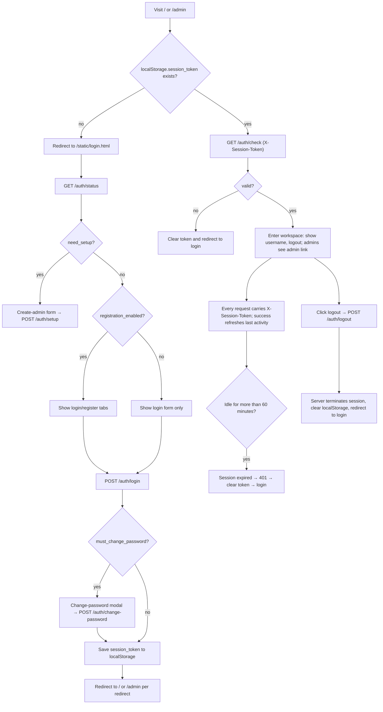

# Web Login, Language Switching, and Sessions

When a browser opens the Web workspace (`/`) or the admin interface (`/admin`), the frontend first checks the session token saved in the browser: if the token is missing or invalid it redirects to the login page, otherwise it enters the requested interface directly. This page covers the login page's first-run setup, username/password login, registration and forced password change, how to choose the interface language, and how the session token is stored, refreshed, and invalidated.

Full account and permission management is covered in [Accounts, permissions, and API keys](./accounts-permissions-and-api-keys.md), and how to start the Web service and reach it is covered in [Launch and access](./launch-and-access.md). This page describes user-interface operations and session behavior only; it does not expand HTTP contract details, which belong to [Authentication and errors](../developer/http-api/authentication-and-errors.md) in the developer HTTP API pages.

## Feature boundary

- The login page has four entry points: creating the first admin, username/password login, registration (when enabled by an admin), and forced password change on first login.
- Language switching covers the workspace and the admin interface; the login page itself has no language selector and is hardcoded to Simplified Chinese.
- Session retention is based on account sessions: the token is stored in browser `localStorage`, sent on every request through the `X-Session-Token` header, and expires after 60 minutes of inactivity.
- A legacy password-only gate (`/user/login`) that is unrelated to accounts still exists in the UI; it is a separate mechanism from the `/auth/*` account sessions, and this page keeps the two distinct.
- User operations and developer HTTP routes are separated: this page only describes behavior visible in the UI and does not present endpoint paths as tutorial steps.

## Login page {#login-page}

The login page is the static file `static/login.html`, served at `/static/login.html`. On load it does two things in parallel: it calls `GET /auth/status` to decide which form to show, and it calls `GET /auth/check` (with any existing token) to decide whether it can skip login entirely.

### First visit: create the admin account {#first-run-setup}

`GET /auth/status` returns `need_setup: true` when the system has no users yet. The login page hides the login/register tabs and shows the "First use, please create an admin account" notice and creation form:

| UI call key | English actual value | Simplified Chinese actual value |
| --- | --- | --- |
| Hardcoded (no key) | — (login page has no English copy) | 首次使用，请创建管理员账户 |
| Hardcoded (no key) | — | 管理员用户名 |
| Hardcoded (no key) | — | 管理员密码 |
| Hardcoded (no key) | — | 确认密码 |
| Hardcoded (no key) | — | 创建管理员账户 |

1. Enter an admin username (at least 2 characters) and a password (at least 6 characters), then repeat the password to confirm.
2. Click "创建管理员账户" (Create admin account). The frontend submits `{username, password}` to `POST /auth/setup`.
3. On success the server creates an account with `role=admin` and `group=admin` and immediately creates a session; the returned token is written to `localStorage.session_token`, user info to `localStorage.user_info`, and the page redirects according to the safe-redirect rule.

The source also keeps a "create default admin" method and log hints (`admin`/`admin123`), but the current initialization flow does not call it; instead it tells users to visit the login page to create the first admin. Whether this path is enabled in some release is a runtime verification item.

### Username and password login {#username-password-login}

The login form submits to `POST /auth/login` with the body `{username, password}`.

1. If both fields are empty, the frontend shows "请输入用户名和密码" (please enter username and password).
2. Wrong credentials, a missing user, or a disabled account return `success: false`, and the page shows the matching error.
3. On success the server returns a session token and user info. If `must_change_password` is true, the "change password required" modal appears first; otherwise the token is written to `localStorage.session_token` and the page redirects.
4. The redirect target is decided by `getSafeRedirectUrl()`: it returns `/admin` only when the URL carries `?redirect=/admin`, and `/` in every other case, preventing open redirects.

Failed logins are rate-limited per IP and per username: at most 15 attempts per IP and 8 per username within 10 minutes, after which the server returns `429` with a `Retry-After` header.

### User registration {#user-registration}

Whether the registration tab appears depends on the `registration_enabled` field of `GET /auth/status`, which comes from the admin setting `registration.enabled` (disabled by default).

- When disabled, the login page shows only the login form, and calling `POST /auth/register` directly returns `403` ("注册功能未开启，请联系管理员" / registration is not enabled).
- When enabled, two tabs, "登录" (login) and "注册" (register), are shown. Registration requires a username of at least 2 characters and a password of at least 6 characters; the confirmation password must match.
- On success a regular user (`role=user`) is created in the admin-configured `default_group`, and a session is created and written to `localStorage` immediately.
- Registration is rate-limited per IP: at most 5 attempts within 10 minutes, after which the server returns `429`.

### Forced password change {#force-change-password}

When login returns `must_change_password: true`, the page opens the "⚠️ 需要修改密码" (password change required) modal explaining "为了账号安全，首次登录需要修改默认密码" (for account security, first login requires changing the default password). The token is kept in a memory variable at this point and is not written to `localStorage`.

- Enter the new password and confirmation (at least 6 characters), then click "确认修改" (confirm change). This calls `POST /auth/change-password` with the `X-Session-Token` header and the body `{old_password, new_password}`.
- After a successful change the server clears the `must_change_password` flag, and only then does the frontend write the token to `localStorage` and redirect.
- Clicking "稍后修改" (change later) skips the change and saves the token to enter the system; whether the server forces the change again on a later request is a runtime verification item.

### Safe return and the legacy password gate {#safe-return-and-legacy-gate}

Redirects after login, registration, and setup accept only `?redirect=/admin` and never follow arbitrary URLs. When the admin interface detects an invalid session it returns to `/static/login.html?redirect=/admin`, so a successful login goes straight back to the admin panel.

The workspace also keeps a legacy "access password" flow: the frontend first requests `/user/access`; when the admin setting `user_access.require_password` is true and `sessionStorage` has no `user_logged_in` flag, it shows an "请输入访问密码" (enter access password) overlay. Submitting the password calls `POST /user/login` (form field `password`), and on success only a `sessionStorage` flag is set. This is a single-password gate unrelated to accounts, roles, or session tokens; the same IP may try at most 10 times within 10 minutes, after which the server returns `429`. Whether this flow is still enabled by a deployment configuration requires runtime verification.

## Language switching {#language-switching}

### Workspace language selector {#workspace-language-selector}

The workspace `index.html` has a language dropdown in the header (`id="language-select"`) with six hardcoded options:

| Stored value | English | Simplified Chinese |
| --- | --- | --- |
| `zh_CN` | Simplified Chinese | 简体中文 |
| `zh_TW` | Traditional Chinese | 繁體中文 |
| `en_US` | English | English |
| `ja_JP` | Japanese | 日本語 |
| `ko_KR` | Korean | 한국어 |
| `es_ES` | Spanish | Español |

The actual switch flow (`loadI18n` / `changeLanguage`):

1. It first reads `localStorage.locale`; when no value is saved it infers the language from `navigator.language` (`en`→`en_US`, `zh-CN`→`zh_CN`, `zh-TW`→`zh_TW`, `ja`→`ja_JP`, `ko`→`ko_KR`, `es`→`es_ES`, otherwise keeping the default `zh_CN`).
2. The frontend requests `GET /i18n/{locale}`; the server reads the desktop translation file `desktop_qt_ui/locales/{locale}.json` (with path-traversal protection).
3. If loading fails it falls back to `GET /i18n/en_US`; `t(key, default)` returns the default text or the key itself when the key is missing.
4. After switching, `applyTranslations()` updates the title, buttons, and tabs, and regenerates the configuration form to apply the new language.

The language choice is stored only in the current browser's `localStorage.locale` and is not written to server account settings; switching browsers or clearing site data reverts to the browser-inferred value.

### Admin interface language {#admin-interface-language}

The admin interface (`admin-new.html` + `js/admin/i18n.js`) uses its own `admin_locale` key, defaults to a browser-language inference, supports five locales (`zh_CN`, `zh_TW`, `en_US`, `ja_JP`, `ko_KR`, without `es_ES`), and falls back to `zh_CN` for missing keys. Its language is independent of the workspace.

### Login page language {#login-page-language}

The login page does not load i18n and has no language selector; all copy is hardcoded Simplified Chinese. Its language is therefore unrelated to the workspace selection.

### UI copy matrix {#ui-copy-matrix}

The following keys are actually called by the Web frontend through `t(key, default)`, with values from the desktop `en_US.json` / `zh_CN.json`:

| UI call key | English actual value | Simplified Chinese actual value |
| --- | --- | --- |
| `Manga Translator` | Manga Translator | 漫画翻译器 |
| `admin` | Missing (absent in both locales) | Missing, always falls back to 管理 |
| `Add Files` | Add Files | 添加文件 |
| `Clear List` | Clear List | 清空列表 |
| `Translation Workflow Mode:` | Translation Workflow Mode: | 翻译流程模式： |
| `Start Translation` | Start Translation | 开始翻译 |
| `Export Config` | Export Config | 导出配置 |
| `Import Config` | Import Config | 导入配置 |
| `Basic Settings` | Basic Settings | 基础设置 |
| `Advanced Settings` | Advanced Settings | 高级设置 |
| `Options` | Options | 选项 |
| `API Keys (.env)` | API Keys (.env) | API密钥 (.env) |
| `env_hint` | API key input fields will appear below based on the selected translator | 根据选择的翻译器，下方会显示所需的 API 密钥输入框 |
| `Log output...` | Log output... | 日志输出... |
| `Normal Translation` | Normal Translation | 正常翻译流程 |
| `Export Translation` | Export Translation | 导出翻译 |
| `Export Original Text` | Export Original Text | 导出原文 |
| `Import Translation and Render` | Import Translation and Render | 导入翻译并渲染 |
| `Colorize Only` | Colorize Only | 仅上色 |
| `Upscale Only` | Upscale Only | 仅超分 |
| `Inpaint Only` | Inpaint Only | 仅修复 |

The following UI copy has no i18n key and is hardcoded in HTML (all login-page text, the workspace "注销" logout button, the "管理" admin link, and the six language names in the dropdown). The desktop locales also keep a set of Web-related keys such as `web_language_selector`, `web_switch_language`, `web_current_language`, `web_confirm_language_switch`, `web_admin_panel`, and `web_admin_only`, but the current Web static code does not reference them; they are "present in the catalog but not yet referenced" items to verify.

## Session retention {#session-retention}

### Token generation and browser storage {#token-generation-and-storage}

`SessionService.create_session` generates a session token with `secrets.token_urlsafe(32)` and keeps the session ID, username, role, IP, User-Agent, creation time, and last-activity time in memory; with `enable_persistence` enabled it also writes them to `manga_translator/server/data/sessions.json` (only active, non-expired sessions are saved).

On the browser side the token is stored in `localStorage.session_token` and user info in `localStorage.user_info`. The token is not placed in a cookie, so it is not sent automatically; the frontend attaches the `X-Session-Token` header manually on every request.

### Validation and activity refresh {#validation-and-activity-refresh}

- On page load: `checkAuthentication()` first reads `localStorage.session_token`; without it, it redirects to the login page immediately. With it, it requests `GET /auth/check`; a `valid: false` response or a failed request clears the token and redirects to login.
- On every protected request: the `require_auth` dependency reads `X-Session-Token`; a missing, invalid, or expired token returns `401`, and a deactivated account also returns `401`. On success it calls `update_activity` to refresh the last-activity time.
- Idle timeout: `session_timeout_minutes` is fixed to `60` in `main.py`, so a session whose last activity is older than 60 minutes is considered expired; a background task cleans up expired sessions every 5 minutes.
- Persistence across restarts: once sessions are written to `sessions.json`, the service reloads active, non-expired sessions on startup, so a browser token may still work after a service restart (runtime verification item).

### Logout and invalidation {#logout-and-invalidation}

- Clicking "注销" (logout) first calls `POST /auth/logout` (with `X-Session-Token`) so the server terminates that session, then removes `localStorage.session_token` and redirects to the login page.
- Once a session is terminated or expired on the server, the next request returns `401`; the frontend clears the token and returns to the login page.
- When an admin deactivates an account, the user's existing session is judged invalid on the next request (`401`, `USER_INACTIVE`).

## Login and session flow {#login-session-flow}

The diagram shows the account-session main flow in the current source: first-run setup, login, forced password change, entering the workspace, activity refresh, expiry, and logout. Bypasses such as the legacy `/user/login` password gate, disabled registration, and persisted sessions after a restart are covered in the sections above instead of being expanded here. The diagram does not fabricate runtime screenshots, real tokens, or private task artifacts; display details that need an actually running service are listed as pending in the verification record.

## Errors and rate limits in user terms {#errors-and-rate-limits}

| Status | What it means in the UI | Trigger (static source) | What the user can do |
| --- | --- | --- | --- |
| `401` | Not logged in or session invalid | Missing token, invalid/expired token, deactivated account | Log in again from the login page; contact the admin if the account is deactivated |
| `403` | No permission | Non-admin accessing admin features; registration disabled by an admin | Ask the admin for permission, or wait until registration opens |
| `429` | Too many attempts | Login: 15 per IP or 8 per username per 10 minutes; registration: 5 per IP per 10 minutes; legacy gate: 10 per IP per 10 minutes | Wait for the time indicated by the `Retry-After` response header |

## Dependencies and conflicts

- The Web interface language reuses the desktop `desktop_qt_ui/locales/*.json` files directly, so adding or renaming a desktop key affects the Web UI; missing keys such as `admin` always show the hardcoded fallback text.
- The session token lives in `localStorage` and is shared across tabs of the same browser; the legacy gate uses `sessionStorage.user_logged_in`, which is per-tab and disappears when the tab closes.
- The 60-minute session idle timeout and the browser's 30-minute batch-request timeout are two independent parameters: the former is a server session, the latter is a frontend request timeout, and they must not be conflated.
- The `/auth/*` account sessions and the `/sessions` session-management API (`session_security_service`) are two implementations: user login uses the former, while admin session lists and access logs use the latter.
- Clearing browser site data removes `session_token`, `locale`, and `admin_locale` at the same time, which is equivalent to logging out and restoring the default language.
- This page stores and shows no real tokens, usernames, passwords, or session content; it only documents field names and flows.

## Related files and formats

| File/format | Actual role on this page | Manual-edit and compatibility note |
| --- | --- | --- |
| `manga_translator/server/static/login.html` | Login page (setup/login/register/change password) | Entirely hardcoded Simplified Chinese, no i18n keys |
| `manga_translator/server/static/index.html` | Workspace (language dropdown, logout, username, admin link) | Language options hardcoded; the rest is translated with `t()` |
| `manga_translator/server/static/script.js` | Session check, i18n loading, language switching, logout | Token stored only in `localStorage`; do not switch to plaintext cookies |
| `manga_translator/server/static/js/i18n.js` | Shared I18n class for the workspace | Loads desktop translations from `/locales/{locale}.json` |
| `manga_translator/server/static/js/admin/i18n.js` | Admin I18n (`admin_locale`) | Falls back to `zh_CN` for missing keys |
| `manga_translator/server/core/session_service.py` | Session creation, token, expiry, persistence | `session_timeout_minutes=60` passed by `main.py` |
| `manga_translator/server/core/account_service.py` | Accounts, bcrypt passwords, `must_change_password` | Passwords at least 6 characters; never read real account files |
| `manga_translator/server/core/middleware.py` | `require_auth` validates `X-Session-Token` | Invalid/expired/deactivated all return `401` |
| `manga_translator/server/routes/auth.py` | `/auth/status`, `/setup`, `/login`, `/register`, `/change-password`, `/check`, `/logout` | Login/registration rate limits |
| `manga_translator/server/routes/web.py` | `/`, `/admin` static pages and legacy `/user/login` | Legacy gate independent of account sessions |
| `manga_translator/server/data/accounts.json`, `sessions.json` | Account and session persistence | Never display real contents |
| `desktop_qt_ui/locales/*.json` | Web translation source (`/i18n/{locale}`) | Six locales; missing keys fall back |

## Mermaid data-flow limits

The diagram depicts the account-session main flow: first-run setup, login, forced password change, entering the workspace, activity refresh, expiry, and logout. It does not claim that every visit requests `/auth/status` or that every session is written to disk; `need_setup`, the registration switch, the legacy password gate, and persisted sessions after a restart take their documented bypasses. No runtime screenshot, real token, or private task artifact has been fabricated; display details that need an actually running service are listed as pending in the verification record.

## Source evidence {#source-evidence}

| Layer | File | What was checked |
| --- | --- | --- |
| Login-page UI | `manga_translator/server/static/login.html` | Setup/login/register/change-password forms, `/auth/status` branches, `getSafeRedirectUrl` |
| Workspace UI | `manga_translator/server/static/index.html`, `script.js` | Session check, `X-Session-Token`, logout, `locale` read/write, language fallback |
| Admin UI | `manga_translator/server/static/admin-new.html`, `js/admin/app.js`, `js/admin/i18n.js` | `admin_locale`, `?redirect=/admin` return, session check |
| Session service | `manga_translator/server/core/session_service.py`, `system_init.py` | Token generation, 60-minute timeout, 5-minute cleanup, persistence |
| Account service | `manga_translator/server/core/account_service.py` | Password strength, bcrypt, `must_change_password`, default-admin path |
| Auth middleware | `manga_translator/server/core/middleware.py` | `require_auth`, 401 semantics, activity refresh |
| Routes | `manga_translator/server/routes/auth.py`, `web.py`, `config.py` | `/auth/*`, legacy `/user/login`, `/user/access`, `/i18n/{locale}` |
| i18n | `desktop_qt_ui/locales/en_US.json`, `zh_CN.json`, `doc/wiki/data/i18n.generated.json` | Keys actually called by the Web UI and their three-column actual values |

## Verification {#verification}

| Check | Status | Notes |
| --- | --- | --- |
| BLUEPRINT, PAGE_GUIDELINES, TODO | Complete | Read section 1.3, item 5.12, and section 9.3 in full and followed the contract |
| Login/language/session UI and calls | Complete | Statically checked `login.html`, `index.html`, `script.js`, and admin JS |
| `en_US` / `zh_CN` actual locales | Complete | Checked each Web-called key; missing keys are marked as fallbacks |
| Session runtime chain | Complete | Statically checked token generation, validation, activity refresh, expiry cleanup, and persistence |
| Sanitized runtime verification | Deferred | No real accounts, tokens, `accounts.json`, `sessions.json`, or private content were read; first-run setup, registration switch, legacy gate, forced password change, and sessions after restart need a running Web service |
| VitePress | Deferred | Coordinator should run `npm run docs:build --prefix doc/wiki` plus mirror/source checks before merge |