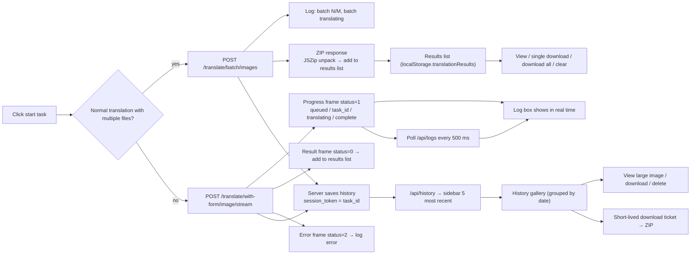

# Web Progress, Results, and History

After a translation starts, this page explains how to watch task progress, preview and download results in the browser, and manage the history records stored on the server. Progress is shown in real time through the log box rather than a percentage bar; the results list exists only in the current browser; history is stored on the server, so the same account can see it from any browser. Uploading, configuration, and starting a translation are covered in [Upload, config, and translate](./upload-config-and-translate.md), sessions and language switching in [Login, language, and session](./login-language-and-session.md), and administrator management of all history and tasks in [Administrator interface](./administrator-interface.md).

## Feature boundary {#feature-boundary}

- The “results list” is a temporary view inside the current browser; entries are saved in `localStorage.translationResults` (as blob URLs). It is not server history and cannot be recovered after clearing browser data or switching browsers.
- “History records” are written automatically by the server after a successful translation and are isolated per user; a regular user sees only their own history, and whether it can be viewed, downloaded, or deleted depends on permissions. The corresponding endpoints return 403 without permission.
- Progress is presented through streaming progress frames, task-log polling every 500 ms, and the log box; there is no percentage progress bar.
- This page covers web user operations only. The frame format and the history/download-ticket HTTP contracts live in [Streaming protocol](../developer/http-api/streaming-protocol.md) and [History, files, and download tickets](../developer/http-api/history-files-and-download-tickets.md).

## UI operations {#ui-operations}

### View translation progress {#view-progress}

1. After clicking the “开始任务” (start task) button, the “日志输出” (log output) area on the right streams progress messages in real time.
2. Single-file normal translation uses the streaming endpoint; progress messages come from two sources:
   - progress frames in the stream response (`status=1`), for example “加载图片中...”, “初始化翻译器...”, “翻译中...”, and “Done!”;
   - after the task starts, the browser polls `/api/logs?limit=200&task_id=...` every 500 ms to fetch fuller task logs (detection, OCR, translator calls, and so on) filtered by timestamp.
3. Multi-file normal translation is chunked by `cli.batch_size`; the log shows “批次 N/M: X 个文件”, “批量翻译中...”, and finally “所有任务完成！”.
4. Queuing and concurrency: when the concurrency limit is reached, a progress frame sends “排队中... (前面还有 N 个任务)”, and after acquiring a slot it sends “获得翻译槽位，开始处理...”.
5. Failure and cancellation: a progress frame with `status=2` carries the error into the log; an administrator-cancelled task ends with 499.
6. Expired session: when log polling receives 401, polling stops and the UI shows “登录状态已过期，已停止实时日志轮询。当前任务可能仍在继续，请重新登录后再查看日志。”.

### Preview and manage results {#preview-and-manage-results}

1. Each finished image is added to the “results list” automatically, newest first; ZIP entries show 📦 and images show 🖼️.
2. Each entry has “查看” (view), “下载” (download), and “×” (delete) actions: view opens the image in a new tab, download saves it under its original filename, and delete releases the corresponding blob URL.
3. When image results exist, “🔍 展开图片查看器” appears; the toolbar also has “打包下载” (download all) and “清空” (clear). “打包下载” packs all results into `translation_results_<timestamp>.zip` with JSZip.
4. The image-viewer modal shows thumbnails on the left and the large image on the right, with a “下载” (download) action; the mobile layout supports pinch-to-zoom.
5. Clearing asks for confirmation (“确定要清空所有翻译结果吗？”), then releases all blob URLs and empties the list.

### Open the history gallery {#open-history-gallery}

1. On page load, `/api/history` is called for the current user’s history; the “history” area shows only the 5 most recent entries (timestamp + “N 个文件”).
2. Clicking “📷 打开相册” or “📷 查看全部 (N)” opens the “翻译历史相册” modal, where history is grouped by date into cards.
3. Each card shows a thumbnail, time, and file count and can be checked; both thumbnail and large-image requests carry `X-Session-Token` to reach the protected image endpoints.
4. Clicking “查看” on a card opens a fullscreen image viewer with left/right arrow navigation and Esc to close.

### Download history {#download-history}

1. Single record: fetch the session detail first; with only 1 file, request a single-file download ticket; with multiple files, request a ticket for the whole session’s ZIP.
2. After checking several records, “下载选中” (download selected) requests a batch ticket; without a selection, “下载全部” (download all) packs the entire history into one ZIP (filename prefixes `history_selected` / `history_all`).
3. Tickets are short-lived URLs (5 minutes by default), and the server cleans up the temporary ZIP after the download.

### Delete history {#delete-history}

1. Click 🗑 on a gallery card, confirm with “确定要删除这条翻译历史吗？”, and `DELETE /api/history/{token}` is called.
2. Deletion removes both the server session directory and the index record; the local gallery list refreshes.
3. Without delete permission the endpoint returns 403 and the UI shows “删除失败”.

## UI copy reference {#ui-copy}

The main workspace reads the desktop locale files (`desktop_qt_ui/locales/*.json`) served by `/i18n/{locale}` through `t()`. The results list uses these keys:

| UI call key | English actual value | Simplified Chinese actual value |
| --- | --- | --- |
| `view` | View | 查看 |
| `download` | Download | 下载 |
| `delete` | Delete | 删除 |
| `just_now` | Just now | 刚刚 |
| `packing_results` | Packing all results... | 正在打包所有结果... |
| `download_complete` | Download complete | 下载完成 |
| `download_failed` | Download failed | 下载失败 |
| `confirm_clear_results` | Are you sure you want to clear all translation results? | 确定要清空所有翻译结果吗？ |
| `results_cleared` | Translation results cleared | 翻译结果已清空 |

The remaining copy in the results/history area has no i18n key and comes from hardcoded HTML or JS; the history gallery, log box, and some progress messages stay in Chinese even on non-Chinese locales:

| Location/element | English | Simplified Chinese actual value |
| --- | --- | --- |
| `#results-empty` | None (hardcoded Chinese) | 暂无翻译结果 |
| `#download-all-btn` | None (hardcoded Chinese) | 打包下载 |
| `#clear-results-btn` | None (hardcoded Chinese) | 清空 |
| `#history-empty` | None (hardcoded Chinese) | 暂无翻译历史 |
| `#open-gallery-btn` / `#refresh-history-btn` title | None (hardcoded Chinese) | 打开相册 / 刷新 |
| Gallery modal title | None (hardcoded Chinese) | 📷 翻译历史相册 |
| `#gallery-download-selected` / `#gallery-download-all` | None (hardcoded Chinese) | 下载选中 / 下载全部 |
| Gallery card buttons | None (hardcoded Chinese) | 查看 / 下载 / 🗑 |
| Gallery selection info | None (hardcoded Chinese) | 已选择 {n} 项 |
| Sidebar “view all” | None (hardcoded Chinese) | 📷 查看全部 ({n}) / 📷 打开相册 |
| Image viewer | None (hardcoded Chinese) | 图片查看器 / 点击左侧缩略图查看大图 / 下载 |
| Start-task button | None (hardcoded Chinese) | 开始任务 |
| Progress log (`script.js` ternary) | Task started | 开始任务 |
| Progress log (`script.js` ternary) | Processing | 正在处理 |
| Progress log (`script.js` ternary) | Batch translating | 批量翻译中 |
| Progress log (`script.js` ternary) | All tasks completed! | 所有任务完成！ |
| Progress log (`script.js` ternary) | Task error | 任务出错 |
| Relative time (`formatTime`) | Nm ago / Nh ago | N分钟前 / N小时前 |

## Runtime behavior {#runtime-behavior}

### Stream progress frames and log polling {#stream-progress-and-log-polling}

Single-file normal translation calls `POST /translate/with-form/image/stream`; the response is a custom stream of “1-byte status + 4-byte length + data” frames: `status=1` is a progress JSON (stages include `task_id`, `start`, `image_loading`, `translator_init`, `translating`, `transforming`, `sending`, `complete`, plus `queued` and `slot_acquired` while waiting), `status=0` is the result image data, and `status=2` is an error. The frontend parses the frames, writes each `message` into the log box, and uses the value of the `task_id` stage as the current task ID. While a task exists, the browser polls `/api/logs?limit=200&task_id=<task_id>` every 500 ms and filters new logs by timestamp.

Multi-file normal translation uses `POST /translate/batch/images`: the body carries base64 images, config, `batch_size`, and filenames, and the response is a ZIP with the custom `X-Content-Type: application/zip` header; the frontend unpacks it with JSZip and adds each image to the results list. The batch request sets a 30-minute timeout in the frontend with `AbortController`.

### Results list and browser storage {#results-list-and-local-storage}

Every completion (single-file stream, batch unpack, or other paths that return a blob) calls `addResult()`, which appends `{id, filename, imageData, type, timestamp}` to `resultsList` and writes it to `localStorage.translationResults`. `imageData` is a blob URL created with `URL.createObjectURL()`. Deleting or clearing releases those blob URLs.

Blob URLs are valid only within the page session that created them: after a refresh or in another browser, preview/download of old entries usually no longer works. History is the durable, cross-browser, cross-session storage.

### Server history and download tickets {#server-history-and-download-tickets}

Only requests that go through the `while_streaming` pipeline write server history automatically: in the web UI, single-file “normal translation” (`/translate/with-form/image/stream`) and batch translation (one record per image, token `{task_id}_{i}`) are saved; export original/translated, import-and-render, colorize-only, upscale-only, and inpaint-only use non-streaming endpoints in the web UI and do not write history (the `/stream` variants of those workflows do). Saving uses `task_id` as `session_token`, copies the result image into a session folder under the result directory, and writes `metadata.json` plus an index record; a failed save only logs a warning and does not interrupt the main flow.

History listing, thumbnails, large images, downloads, and deletion all require login (requests carry `X-Session-Token`). Downloads never expose file paths directly: first a short-lived ticket is requested — one ticket for a single file or a whole session, and `batch-download-ticket` for multiple records — then `GET /api/history/downloads/t/{ticket}` serves the file within 5 minutes by default, and the server cleans up the temporary ZIP afterward.

The diagram describes the source-confirmed data flow and does not claim that every run has history: saving is best-effort and only warns on failure; export/import/colorize/upscale/inpaint go through non-streaming endpoints in the web UI and produce no history entry, and the results list always exists only in the current browser. No runtime screenshot or private task artifact has been fabricated.

## Dependencies and conflicts {#dependencies-and-conflicts}

- The results list and server history are two independent mechanisms: the former lives in `localStorage.translationResults` (blob URLs), the latter in the server result directory and `translation_history.json`. Do not mix them up.
- Progress visibility depends on the session: once `session_token` expires, streaming requests, history endpoints, and log polling all return 401; polling stops automatically and prompts a re-login.
- History is isolated per user: a regular user can only view, download, and delete their own history; view/delete permissions come from the account permissions. For the administrator view, see [Administrator interface](./administrator-interface.md).
- Download tickets have a TTL (5 minutes by default) and their temporary ZIPs are cleaned up; request a new ticket after long idle time.
- The 30-minute frontend timeout for batch requests matches the server’s `timeout_keep_alive=1800`, but it does not mean every image in the batch succeeded; cancellation and failures are handled by the server task machinery, see [Translation endpoints](../developer/http-api/translation-endpoints.md).
- Log content may contain business text and paths; remove request bodies, log messages, paths, and credentials before sharing, see [Privacy, cleanup, and log sharing](../troubleshooting/privacy-cleanup-and-log-sharing.md).

## Related files {#related-files}

| File/interface | Actual role on this page | Note |
| --- | --- | --- |
| `manga_translator/server/static/index.html` | DOM for the results area, history area, image viewer, and log area | Most copy is hardcoded Chinese in HTML |
| `manga_translator/server/static/script.js` | Frame parsing, log polling, results list, and batch download | `t()` reads `/i18n/{locale}`; local storage keys `translationResults`, `session_token`, `locale` |
| `manga_translator/server/static/js/history-gallery.js` | History loading, gallery, large-image view, download tickets, and deletion | Copy is hardcoded Chinese; `historyData` lives in memory only |
| `manga_translator/server/request_extraction.py` | `while_streaming` progress frames and `save_translation_to_history` | `session_token = task_id`; a failed save only warns |
| `manga_translator/server/core/history_service.py` | History CRUD and ZIP packing | Session directory + `metadata.json` + index record |
| `manga_translator/server/core/download_ticket_service.py` | Short-lived download tickets | Default TTL 5 minutes |
| `manga_translator/server/routes/history.py`, `routes/logs.py` | History and log HTTP endpoints | 403 without permission; see developer HTTP API pages |
| `desktop_qt_ui/locales/en_US.json`, `zh_CN.json` | Data source for `/i18n/{locale}` | Keys and actual values are in the tables above |
| `manga_translator/server/data/translation_history.json` | History index records | Real user data is never shown |

## Source evidence {#source-evidence}

| Layer | File | What was checked |
| --- | --- | --- |
| Frontend progress/results | `manga_translator/server/static/script.js` | Frame parsing (`processStream`), batch loop, `addResult`/`renderResults`/`downloadAllResults`/`clearResults`, log polling |
| Frontend history | `manga_translator/server/static/js/history-gallery.js` | History loading, gallery, image view, download tickets, and deletion |
| Static structure | `manga_translator/server/static/index.html` | Results, history, image-viewer, and log elements |
| Streaming backend | `manga_translator/server/request_extraction.py` | Frame format, stages, and `save_translation_to_history` |
| History service | `manga_translator/server/core/history_service.py` | Session directory, `metadata.json`, ZIP packing, deletion |
| Download tickets | `manga_translator/server/core/download_ticket_service.py` | TTL and temporary-file cleanup |
| HTTP endpoints | `manga_translator/server/routes/history.py`, `routes/logs.py`, `routes/translation.py` | History/log/translation endpoints and permissions |
| i18n | `desktop_qt_ui/locales/en_US.json`, `zh_CN.json`, `doc/wiki/data/i18n.generated.json` | Keys and actual English/Chinese values |

## Verification {#verification}

| Check | Status | Notes |
| --- | --- | --- |
| BLUEPRINT, PAGE_GUIDELINES, TODO | Complete | Read in full and followed the page contract; web user operations are separated from the HTTP API |
| Progress stream and log polling | Complete | Statically checked frame parsing and `/api/logs` polling in `script.js` |
| Results list and local storage | Complete | Statically checked `addResult`/`localStorage.translationResults`; cross-session blob-URL invalidity is a browser-behavior inference |
| History and download tickets | Complete | Statically checked `history-gallery.js`, `history_service.py`, `download_ticket_service.py` |
| `en_US` / `zh_CN` actual locales | Complete | Tables record key, actual English, and actual Simplified Chinese values; hardcoded items are marked honestly |
| Sanitized runtime verification | Deferred | No real user history, image, session token, `.env`, or API key was read; no server run or screenshots |
| VitePress | Deferred | Coordinator should run `npm run docs:build --prefix doc/wiki` plus mirror/source checks before merge |