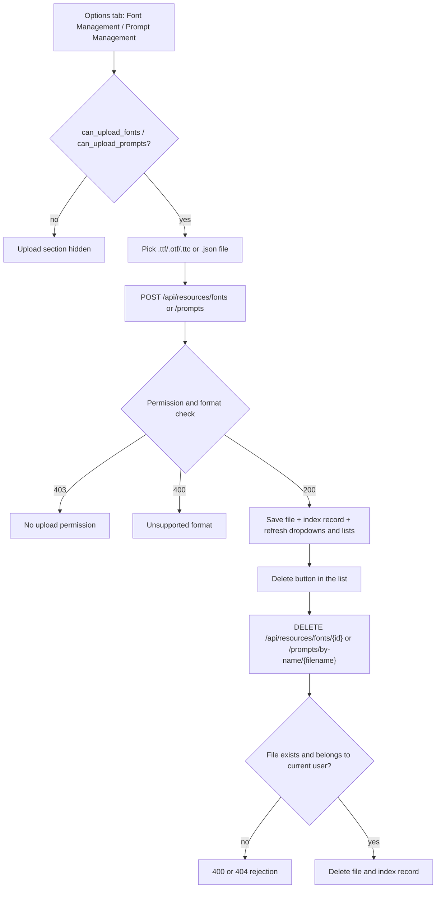
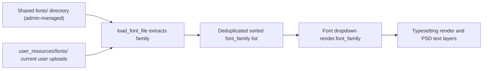
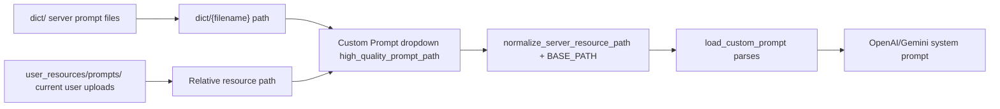

# Resources, Fonts, and Prompts

When the server lacks the font you need, or the translator needs a custom prompt, upload your own font and prompt files in the “Options” tab of the web workspace and select them from the configuration dropdowns. This page covers only ordinary-user resource upload, listing, deletion, and configuration use; admin-managed shared fonts and prompts are described in [Administrator interface](./administrator-interface.md), and HTTP endpoint contracts live in [Config, environment, and resources API](../developer/http-api/config-env-and-resources.md).

## Feature boundary {#feature-boundary}

- This page covers web user resources: upload, list, and delete fonts (TTF/OTF/TTC) and prompts (JSON), plus the `render.font_family` and `translator.high_quality_prompt_path` configuration fields.
- Upload-section visibility is decided by `can_upload_fonts` and `can_upload_prompts` returned from `/user/settings`; whether deletion is allowed is decided by the server-side permission check.
- It does not cover admin-managed shared fonts and prompts (`/upload/font`, `/upload/prompt`, `/fonts`, `/prompts` management endpoints), nor the desktop prompt-list CRUD (see [Prompt list, apply, and preview](../desktop/prompts/list-apply-and-preview.md)).
- This page never shows real API keys, private prompt bodies, or user file contents.

## UI operations {#ui-operations}

### Find the resource and configuration entries {#find-resource-entry}

After signing in, the right settings panel of the main workspace has four tabs: “Basic Settings”, “Advanced Settings”, “Options”, and “API Keys (.env)”.

- “Font Management” and “Prompt Management” are located in the right column of the “Options” tab.
- The corresponding upload section is shown only when `can_upload_fonts` / `can_upload_prompts` is true; hiding the section does not mean the server forbids it, and the permission is ultimately enforced by the server.
- The `render.font_family` dropdown is on the “Advanced Settings” tab (render group), and the `translator.high_quality_prompt_path` dropdown is on the “Basic Settings” tab (translator group). Both render as dropdowns even when the option list is empty, with a “-- 不使用 --” empty option.

### Upload fonts {#upload-fonts}

1. On the “Options” tab, click “上传字体文件” (Upload font file) in the “Font Management” area.
2. The file picker only accepts `.ttf`, `.otf`, and `.ttc`; the backend accepts exactly the same three formats.
3. After a successful upload the frontend re-requests `/config/options`, refreshes the Font dropdown and the uploaded-font list, and logs “字体上传成功” (Font uploaded successfully).

### Upload prompts {#upload-prompts}

1. On the “Options” tab, click “上传提示词文件” (Upload prompt file) in the “Prompt Management” area.
2. The file picker only accepts `.json`; the server-side `resource_service` `PROMPT_FORMATS` is `.txt`/`.json`, but the prompt loader (`load_prompt_file`) parses only `.json`/`.yaml`/`.yml`, so use JSON.
3. After a successful upload the Custom Prompt dropdown and the uploaded-prompt list are refreshed.

### Delete resources {#delete-resources}

- Font rows always show a “删除” (Delete) button; prompt rows show “删除” only for user resources whose path contains `user_resources`, while server-provided prompts show a “服务器提示词” (Server prompt) label.
- Clicking “删除” opens a confirmation dialog; after confirmation the delete endpoint is called and the frontend refreshes dropdowns and lists.
- The frontend does not hide delete buttons according to `can_delete_fonts` / `can_delete_prompts`; the server rejects requests without permission with `403`.

### UI string matrix {#i18n-strings}

| UI call key | English actual value | Simplified Chinese actual value |
| --- | --- | --- |
| `label_font_family` | Font | 字体 |
| `label_high_quality_prompt_path` | Custom Prompt | 自定义提示词 |
| `font_uploaded` | Font uploaded successfully | 字体上传成功 |
| `font_upload_failed` | Font upload failed | 字体上传失败 |
| `font_upload_error` | Font upload error | 字体上传错误 |
| `prompt_uploaded` | Prompt uploaded successfully | 提示词上传成功 |
| `prompt_upload_failed` | Prompt upload failed | 提示词上传失败 |
| `prompt_upload_error` | Prompt upload error | 提示词上传错误 |
| `web_upload_font` | Upload Font | 上传字体 |
| `web_upload_prompt` | Upload Prompt | 上传提示词 |
| `web_my_fonts` | My Fonts | 我的字体 |
| `web_my_prompts` | My Prompts | 我的提示词 |
| `web_resource_management` | Resource Management | 资源管理 |
| `web_can_upload_font` | Can Upload Font | 可上传字体 |
| `web_can_upload_prompt` | Can Upload Prompt | 可上传提示词 |

Some message keys are missing in both locales, so `t()` falls back to the hardcoded Chinese default text and the English UI also displays Chinese:

| UI call key | Both-locale status | Fallback display |
| --- | --- | --- |
| `font_deleted` / `prompt_deleted` | Missing | 字体删除成功 / 提示词删除成功 |
| `font_delete_failed` / `prompt_delete_failed` | Missing | 字体删除失败 / 提示词删除失败 |
| `font_delete_error` / `prompt_delete_error` | Missing | 字体删除错误 / 提示词删除错误 |

Strings such as “字体管理”, “上传字体文件”, “支持 TTF, OTF, TTC 格式”, “已上传的字体”, “加载中...”, “暂无已上传的字体”, “提示词管理”, “上传提示词文件”, “支持 JSON 格式”, “已上传的提示词”, “暂无已上传的提示词”, “服务器提示词”, “-- 不使用 --”, and “删除” are hardcoded Chinese text in `index.html` or `script.js`; they do not pass through `t()` and switching languages does not translate them.

## Parameters and options {#parameters-and-options}

#### `render.font_family` — 字体 / Font {#font-family}

- Control: dropdown (always shown, with a “-- 不使用 --” empty option).
- Location: settings panel → “Advanced Settings” (render group); UI call key `label_font_family`.
- Stored value: a font-family name string; empty means the renderer default font is used.
- Options: the `font_family` list from `/config/options`, a deduplicated union of shared `fonts/` directory families and the current user's uploaded-font families.
- Defaults: core `manga_translator/config.py#RenderSettings.font_family` is `None`; web release config `server_config.json` is `Microsoft YaHei UI`.
- Effective stages: typesetting/render and editable PSD text layers.
- Mechanism: focusing the dropdown re-requests `/config/options` to pick up newly uploaded fonts; options display a short file name (last path segment when a path exists). The selected value is submitted with the translation request as `render.font_family`, and the renderer matches the family in the Qt font database.
- Dependencies/conflicts: the font file must yield a valid family via `load_font_file`; a `.ttc` collection may return several families. When the requested family is not found, the renderer falls back to the default family and logs a warning.
- Related files and debug artifacts: `fonts/` (shared), `manga_translator/server/data/user_resources/fonts/{username}/` (user).
- Diagram: required, the font-family merge and consumer data flow, see [How the font dropdown merges](#font-merge).
- Source evidence: definition/defaults `manga_translator/config.py`, `server/server_config.json`; option building `routes/config.py#get_config_options`; UI `static/script.js#generateConfigUI`, `updateFontSelects`; consumers `request_extraction.py`, `rendering/text_render/_fonts.py`.
- Verification status: source/i18n static check complete; sanitized runtime verification deferred to web acceptance.

#### `translator.high_quality_prompt_path` — 自定义提示词 / Custom Prompt {#high-quality-prompt-path}

- Control: dropdown (always shown, with a “-- 不使用 --” empty option).
- Location: settings panel → “Basic Settings” (translator group); UI call key `label_high_quality_prompt_path`.
- Stored value: a relative path string; empty means no custom prompt is loaded.
- Options: the `high_quality_prompt_path` list from `/config/options` = prompts under `dict/` excluding system stems (`dict/{filename}`) plus the relative resource paths of user-uploaded prompts (`manga_translator/server/data/user_resources/prompts/{username}/{filename}`).
- Defaults: core `manga_translator/config.py#TranslatorSettings.high_quality_prompt_path` is `None`; web release config `server_config.json` is `dict/prompt_example.yaml`.
- Effective stages: system-prompt construction for translation requests (OpenAI/Gemini HQ translators).
- Mechanism: the selected path is normalized by `normalize_server_resource_path`, joined with `BASE_PATH`, parsed into a dict by `load_custom_prompt`, and stored in `Context.custom_prompt_json`; the OpenAI/Gemini system-prompt builder then flattens it. Parse failures only log a warning and invalid content is never sent to the model.
- Dependencies/conflicts: only translators that support custom prompts consume it; `.txt` passes upload validation but cannot be parsed by the loader. Prompt content is private text and must not be exposed in logs, exports, or shared debug artifacts.
- Related files and debug artifacts: `dict/`, `user_resources/prompts/`; request bodies are not persisted.
- Diagram: required, the prompt merge and consumer data flow, see [How the prompt dropdown merges](#prompt-merge).
- Source evidence: definition/defaults `manga_translator/config.py`, `server/server_config.json`; option building `routes/config.py#get_config_options`; loading `manga_translator.py#_load_and_prepare_prompts`, `translators/prompt_loader.py`; consumers `translators/openai.py`, `gemini.py`.
- Verification status: source/i18n static check complete; sanitized runtime verification deferred to web acceptance.

## Runtime behavior {#runtime-behavior}

### Resource storage and index {#resource-storage}

User resources are stored per user:

| Resource | Directory | Index |
| --- | --- | --- |
| Fonts | `manga_translator/server/data/user_resources/fonts/{username}/` | `user_resources/fonts/index.json` |
| Prompts | `manga_translator/server/data/user_resources/prompts/{username}/` | `user_resources/prompts/index.json` |

On upload the filename is sanitized first (path segments plus `..`, `/`, `\`, and NUL are removed), and duplicate names get a numeric suffix; the index records `id`, `user_id`, `filename`, `file_path`, `file_size`, and `file_format` (fonts also record `font_family`). Deletion removes both the file and the index record.

### Resource lifecycle {#resource-lifecycle}

Limitation: both upload and delete require a session and each checks resource permissions; even when the UI shows a button, a request without permission is rejected by the server with `403`.

### How the font dropdown merges {#font-merge}

Note: `/config/options` returns family names only, not file paths; `load_font_file` registers the font into the Qt font library and returns the family, so newly uploaded fonts appear in the dropdown only after options are re-requested.

### How the prompt dropdown merges {#prompt-merge}

Note: the `dict/` scan excludes the four system stems `system_prompt_hq`, `system_prompt_hq_format`, `system_prompt_line_break`, and `glossary_extraction_prompt`; user prompt paths come from `get_user_prompts` and are appended after server prompts, so server prompts appear first and user prompts follow.

## Dependencies and conflicts {#dependencies-and-conflicts}

- After uploading a font, reload the configuration options first (focus the dropdown or sign in again) before it appears in the selector; if the font is not registered, the renderer falls back to the default family.
- Prompts must be parseable JSON; `.txt` can be uploaded but cannot be loaded and is treated as missing during translation.
- Admin-managed shared fonts/prompts and user private resources are two separate storages and permission sets: shared resources are covered in [Administrator interface](./administrator-interface.md), and the HTTP contracts for both are in [Config, environment, and resources API](../developer/http-api/config-env-and-resources.md).
- Resource permissions come from the user-group configuration (`can_upload_fonts`, `can_upload_prompts`, `can_delete_fonts`, `can_delete_prompts`); hiding UI elements only affects display and cannot bypass server checks.
- Uploaded filenames are sanitized and duplicates get numeric suffixes; do not rely on the original uploaded filename.

## Related files and formats {#related-files-and-formats}

| File/format | Actual role on this page | Manual-edit and compatibility note |
| --- | --- | --- |
| `.ttf` / `.otf` / `.ttc` | User font upload formats | Only these three extensions; the family is extracted by `load_font_file` |
| `.json` | User prompt upload format (UI restriction) | The root must be an object; `load_prompt_file` parses JSON/YAML only |
| `.txt` | In the server prompt format whitelist but not consumable | Do not upload; treated as missing during translation |
| `manga_translator/server/data/user_resources/fonts/` | User font storage | One subdirectory per username; never show real user files |
| `manga_translator/server/data/user_resources/prompts/` | User prompt storage | Paths appear in the dropdown; sanitize before sharing reports |
| `fonts/` | Shared font directory (admin-managed) | Only admins can write; visible to ordinary users in the dropdown |
| `dict/` | Server prompt directory (admin-managed) | System stems are excluded; visible to ordinary users in the dropdown |
| `server_config.json` | Web release defaults for `font_family` and `high_quality_prompt_path` | Reference sanitized defaults only |

## Source evidence {#source-evidence}

| Layer | File | What was checked |
| --- | --- | --- |
| UI | `manga_translator/server/static/index.html`, `static/script.js` | Resource sections, upload/delete handlers, dropdown refresh |
| i18n | `manga_translator/server/static/js/i18n.js`, `desktop_qt_ui/locales/en_US.json`, `zh_CN.json` | Key mapping, actual bilingual values, and missing fallbacks |
| Service | `manga_translator/server/core/resource_service.py` | Format whitelist, filename sanitization, duplicate suffix, index records |
| Routes | `manga_translator/server/routes/resources.py` | `/api/resources/*` upload/list/delete/stats and permissions |
| Option building | `manga_translator/server/routes/config.py` | `font_family`, `high_quality_prompt_path` merge logic |
| Config models | `manga_translator/config.py`, `server/server_config.json` | Core and web release defaults |
| Consumers | `manga_translator/manga_translator.py`, `translators/prompt_loader.py`, `rendering/text_render/_fonts.py` | Path normalization, prompt parsing, font-family registration |

## Verification {#verification}

| Check | Status | Notes |
| --- | --- | --- |
| BLUEPRINT, PAGE_GUIDELINES, TODO | Complete | Read in full and followed the page contract |
| UI layout and calls | Complete | Statically checked `index.html`, `script.js` resource sections and dropdowns |
| i18n actual locales | Complete | Records keys, en/zh actual values, and missing fallbacks |
| Resource storage and merge flow | Complete | Statically checked `resource_service.py`, `routes/config.py`, and consumers |
| Sanitized runtime verification | Deferred | Web server not started; no real `.env`, user files, or private prompts read |
| VitePress | Deferred | Coordinator should run mirror/source checks and `docs:build` before merge |
