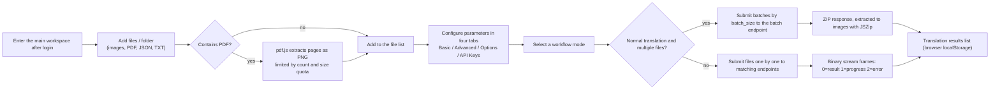

# Web Upload, Configuration, and Translation

After logging into the web interface (`/`), the main workspace covers the full "upload images → configure parameters → start translation" flow: the left panel adds files, selects a workflow mode, and starts the task, while the four tabs on the right configure parameters and API keys. This page describes user-interface operations only. The request, response, authentication, and status-code contracts of the HTTP endpoints the browser calls are documented in the developer pages `../developer/http-api/translation-endpoints.md` and `../developer/http-api/streaming-protocol.md`.

## Feature boundary

- This page covers upload, configuration, and starting a translation in the web user interface. Login and sessions are covered in [Login, language, and session](./login-language-and-session.md), progress, results, and history in [Progress, results, and history](./progress-results-and-history.md), accounts, permissions, and API keys in [Accounts, permissions, and API keys](./accounts-permissions-and-api-keys.md), font and prompt uploads in [Resources, fonts, and prompts](./resources-fonts-and-prompts.md), and access URLs in [Launch and access](./launch-and-access.md).
- The web frontend is not a direct reuse of the desktop Qt UI: `index.html` ships with initial Chinese text, and `script.js` overrides part of the static text through i18n keys. Strings such as "添加文件夹" (Add Folder), "文件列表" (File List), "翻译结果" (Translation Results), "翻译历史" (Translation History), and "N 个文件" (N files) remain hardcoded in HTML/script and have no i18n key.
- Uploading, PDF extraction, config import/export, and the results list all happen in the browser. The results list in `localStorage` and the server-side translation history are two separate stores.
- Keys controlled by the workflow-mode dropdown — `cli.load_text`, `cli.translate_json_only`, `cli.template`, `cli.generate_and_export`, `cli.colorize_only`, `cli.upscale_only`, `cli.inpaint_only` — and also `cli.batch_size`, `cli.batch_concurrent`, and `cli.use_gpu` are hidden by the server-side `SERVER_HIDDEN_CONFIG_KEYS` set and never appear in the web config form; do not edit them by hand.
- Upload count/size limits, the API-key editor switch, and font/prompt upload permissions come from `/user/settings`; `0` means unlimited.

## UI operations

### Add files and folders

1. The left "File List" panel provides three buttons: "Add Files" (`Add Files`), "Add Folder" (hardcoded Chinese in HTML, not i18n), and "Clear List" (`Clear List`).
2. Click "Add Files" to open the system multi-select dialog, or "Add Folder" to choose an entire directory. The file input `accept` is `image/*,.pdf,.json,.txt`.
3. When a PDF is selected, the browser renders every page at 2x with pdf.js and extracts PNG pages (file names like `{base}_page_{pageNumber}.png`). Extraction is limited by `max_pdf_size_mb` (frontend fallback 50 MB) and `max_images_per_batch`; when the quota is exceeded, only the remaining pages are extracted and a warning is logged. PDF-related log messages are hardcoded Chinese fallbacks in the script (neither `en_US` nor `zh_CN` has these keys).
4. `.json`, `_original.txt`, and `_translated.txt` files selected at the same time are matched to images by base file name for the "Import Translation and Render" mode; match success or failure is written to the log.
5. The `✖` button on a list item removes that item; "Clear List" clears everything; the counter shows `N 个文件` (hardcoded Chinese).
6. When the count or size limit is exceeded, the frontend shows an `alert` and rejects the addition.

### Configure parameters

1. The right settings area has four tabs: "Basic Settings" (`Basic Settings`), "Advanced Settings" (`Advanced Settings`), "Options" (`Options`), and "API Keys" (`API Keys (.env)`). Switching tabs only changes local display; it does not trigger a request.
2. The config form is generated from `GET /config?mode=authenticated`; dropdown options come from `/config/options`, `/translators`, `/languages`, and `/workflows`. Labels prefer the `label_<key>` translation key, then `t(key)`, then a formatted key name.
3. The server filters by user permissions: parameters the user cannot use are hidden as a group (`allowed_parameters`); the workflow dropdown keeps only `allowed_workflows`; the "API Keys" tab is shown only when `show_env_editor` is true and the user is logged in; font/prompt upload sections are controlled by `can_upload_fonts`/`can_upload_prompts`.
4. Boolean parameters render as "True"/"False" dropdowns (`True`/`False`), numbers as number inputs, and strings/enums as text inputs or dropdowns.
5. "Export Config" (`Export Config`) serializes the current form values into a `config.json` download; "Import Config" (`Import Config`) reads a local JSON file and regenerates the form. Both happen entirely in the browser and never touch the server.
6. When API keys are required, switch to the "API Keys" tab: the editor renders key inputs in four groups (translation, OCR, colorizer, renderer) with password or text fields. The "Save API Keys" button POSTs the filled keys to `/env` and also stores them in `localStorage.user_env_vars`. `/env` and `/env/effective` never return server key plaintext, and this document does not record any real key.

### Select a workflow mode

The "Translation Workflow Mode:" (`Translation Workflow Mode:`) dropdown lists seven modes, restricted by `/workflows` permissions. The table also shows the endpoint each mode submits to in the frontend script (mechanism notes; the full request/response contracts live in the developer HTTP API pages):

| Dropdown value | Mode (i18n) | Frontend submit endpoint (mechanism) |
| --- | --- | --- |
| `normal` | Normal Translation / 正常翻译流程 | Multi-file: `/translate/batch/images`; single file: `/translate/with-form/image/stream` |
| `export_trans` | Export Translation / 导出翻译 | `/translate/export/translated` |
| `export_raw` | Export Original Text / 导出原文 | `/translate/export/original` |
| `import_trans` | Import Translation and Render / 导入译文并渲染 | `/translate/import/json` (requires the image and a matching JSON file) |
| `colorize` | Colorize Only / 仅上色 | `/translate/colorize` |
| `upscale` | Upscale Only / 仅超分 | `/translate/upscale` |
| `inpaint` | Inpaint Only / 仅修复 | `/translate/inpaint` |

### Start a translation

1. After confirming the file list and parameters, click "Start Translation" (`Start Translation`). If the file list is empty, the log asks you to add image files first.
2. Normal translation with more than one file: files are split into batches of `cli.batch_size` (frontend fallback `5` when missing). Each batch converts images to data URIs and posts to the batch endpoint with a 30-minute browser timeout (`AbortController`); the response is a ZIP, which the browser extracts with JSZip and adds each image to the "Translation Results" list. If JSZip is unavailable or extraction fails, the ZIP is downloaded directly.
3. Normal translation of a single file, or any non-normal mode: files are submitted one by one. The normal mode uses the binary stream endpoint; the browser parses the custom frames (1 status byte + 4 length bytes + data; `0`=result data, `1`=progress JSON, `2`=error). Progress messages are written to the "Log output" panel and an error aborts the current file.
4. API keys: single-file requests submit the currently entered keys as the `user_env_vars` form field; batch requests use the keys saved for that user on the server. `runtime_api.py` maps these values to per-feature/provider runtime overrides.
5. Task logs: during translation the frontend polls for new logs every 500 ms (`/api/logs?limit=200&task_id=...`) and after the task finishes fetches the full log by `task_id`; a `401` response stops polling and prompts you to log in again.
6. Finished images appear in the "Translation Results" list, where you can view, download individually, download all as a ZIP, or clear them. This list lives in browser `localStorage` and is unrelated to server history.

### UI copy reference

Translatable web copy is resolved by locating the call key in `script.js` and then checking `desktop_qt_ui/locales/en_US.json` and `zh_CN.json`. The table below lists the keys most relevant to upload, configuration, and translation; missing entries are marked as-is rather than invented.

| UI call key | English actual value | Simplified Chinese actual value |
| --- | --- | --- |
| `Manga Translator` | Manga Translator | 漫画翻译器 |
| `Add Files` | Add Files | 添加文件 |
| `Clear List` | Clear List | 清空列表 |
| `Translation Workflow Mode:` | Translation Workflow Mode: | 翻译流程模式： |
| `Start Translation` | Start Translation | 开始翻译 |
| `Export Config` | Export Config | 导出配置 |
| `Import Config` | Import Config | 导入配置 |
| `Basic Settings` | Basic Settings | 基础设置 |
| `Advanced Settings` | Advanced Settings | 高级设置 |
| `Options` | Options | 选项 |
| `API Keys (.env)` | API Keys (.env) | API密钥 (.env) |
| `Log output...` | Log output... | 日志输出... |
| `Normal Translation` | Normal Translation | 正常翻译流程 |
| `Export Translation` | Export Translation | 导出翻译 |
| `Export Original Text` | Export Original Text | 导出原文 |
| `Import Translation and Render` | Import Translation and Render | 导入译文并渲染 |
| `Colorize Only` | Colorize Only | 仅上色 |
| `Upscale Only` | Upscale Only | 仅超分 |
| `Inpaint Only` | Inpaint Only | 仅修复 |
| `admin` | Missing (absent from both locales) | Missing; call-site fallback is 管理 |
| `env_hint` | API key input fields will appear below based on the selected translator | 根据选择的翻译器，下方会显示所需的 API 密钥输入框 |
| `view` | View | 查看 |
| `download` | Download | 下载 |
| `delete` | Delete | 删除 |
| `import_mode_no_json` | Import mode: JSON file not found | 导入翻译模式：未找到JSON文件 |
| `import_mode_json_only` | Import mode: Only JSON files are supported, TXT files are not supported | 导入翻译模式：只支持JSON文件，不支持TXT文件 |
| `using_translation_file` | Using translation file | 使用翻译文件 |
| `extracting_pdf` | Missing (absent from both locales) | Missing; call-site fallback is 正在提取PDF页面 |
| `folder_scan_result` | Found in folder | 从文件夹中找到 |
| `translation_file_matched` | Translation file matched | 翻译文件已匹配 |
| `translation_file_no_match` | No matching image found | 未找到匹配的图片 |
| `packing_results` | Packing all results... | 正在打包所有结果... |
| `download_complete` | Download complete | 下载完成 |
| `confirm_clear_results` | Are you sure you want to clear all translation results? | 确定要清空所有翻译结果吗？ |
| `results_cleared` | Translation results cleared | 翻译结果已清空 |

Strings such as "Add Folder", "File List", "Translation Results", "Translation History", and "N files" are hardcoded with no i18n key (the "Log output" panel header is covered by the `Log output...` key).

## Parameters and options

#### `cli.batch_size` — 批量大小 / Batch Size {#cli-batch-size}

- Control: none. The web config form does not render this parameter because the server-side `SERVER_HIDDEN_CONFIG_KEYS` set hides it; the frontend script reads `config.cli.batch_size` to decide batching.
- Location: not displayed; read only by `startTask`/`processBatch`.
- Stored value: non-negative integer; the web frontend falls back to `5` when it is missing.
- Options: integer; there is no enum dropdown.
- Defaults: core `manga_translator/config.py#CliConfig.batch_size = 1`; release `config/config-example.json = 3`; web frontend `script.js` fallback `5`; backend batch request model `BatchTranslateRequest.batch_size = 4` (the frontend always sends an explicit value, so the frontend value takes effect). Do not collapse these into one default.
- Effective stages: batch scheduling for normal translation with more than one file; each batch size is `min(batch_size, remaining files)`.
- Mechanism: `startTask` splits the file list into batches by this value and posts each batch to the batch endpoint with `batch_size` in the request body.
- Dependencies/conflicts: affects only the multi-file path of normal translation; export, import, colorize, upscale, and inpaint modes process files one by one and ignore it.
- Related files/debug artifacts: produces no standalone file; it only affects request batching and `get_batch_ctx` on the backend.
- Diagram: not needed: it only determines the number of batches and does not change processing-stage order or algorithm branches.
- Source evidence: `static/script.js` (`startTask`, `processBatch`); `server/routes/config.py` (hidden keys); `server/request_extraction.py#BatchTranslateRequest`.
- Verification: in progress (static check complete; sanitized batch run not yet performed).

#### `translator.translator` — 翻译器 / Translator {#translator}

- Control: dropdown; options come from `/translators`, are filtered by permissions, and display names are translated with the `translator_<value>` key.
- Location: Settings → Basic Settings.
- Stored value: translator identifier such as `openai`, `gemini`, `sakura`, `none`, or `original`.
- Options: determined by the server `/translators`; no fixed frontend enum.
- Defaults: core `manga_translator/config.py#TranslatorConfig.translator = Translator.openai_hq`; release `config/config-example.json = "openai"`.
- Effective stages: translation-request construction (`translator_gen` builds the translator as `translator:target_lang`).
- Mechanism: the dropdown writes `translator.translator`; `RUNTIME_API_ENV_PRIORITY` in `runtime_api.py` determines where each provider's API base/model overrides come from.
- Dependencies/conflicts: selects the translation implementation only; OCR, colorizer, and renderer models and key groups are independent.
- Related files/debug artifacts: produces no standalone file; it affects the translation request and the translator name in logs.
- Diagram: not needed: the option only changes the final consumer implementation, and the mode endpoints are already listed in a table on this page.
- Source evidence: `static/script.js` (`loadTranslators`, `replaceWithSelectTranslated`); `server/routes/config.py#get_translators`; `manga_translator/config.py#TranslatorConfig`.
- Verification: in progress (static check complete).

#### `translator.target_lang` — 目标语言 / Target Language {#target-lang}

- Control: dropdown; options come from `/languages` and display names are translated with the `lang_<code>` key.
- Location: Settings → Basic Settings.
- Stored value: target-language code such as `CHS` or `ENG`.
- Options: determined by the server `/languages`.
- Defaults: core `manga_translator/config.py#TranslatorConfig.target_lang = "ENG"`; release `config/config-example.json = "CHS"`.
- Effective stages: translation-request construction (`translator_gen` passes `target_lang` to the translator).
- Mechanism: the dropdown writes `translator.target_lang`; it is independent from the keep-source-language option (`keep_lang`).
- Dependencies/conflicts: the translator must support the selected target language; `translator_chain` can override the target language per segment.
- Related files/debug artifacts: produces no standalone file.
- Diagram: not needed: a single enum selection with no branch diagram.
- Source evidence: `static/script.js` (`loadLanguages`); `server/routes/config.py#get_languages`; `manga_translator/config.py#TranslatorConfig`.
- Verification: in progress (static check complete).

#### `translator.keep_lang` — 保留源语言 / Keep Source Language {#keep-lang}

- Control: dropdown; options come from the `keep_lang` entry of `/config/options`, and `none` is displayed as "不过滤" (No Filter) via the `lang_filter_disabled` key.
- Location: Settings → Basic Settings.
- Stored value: a keep-source-language code or `none`; `none` disables source-language filtering.
- Options: `none` plus the language list returned by the server.
- Defaults: core `manga_translator/config.py#TranslatorConfig.keep_lang = "none"`; release `config/config-example.json = "none"`.
- Effective stages: the merge/filter stage before translation.
- Mechanism: when enabled, `manga_translator.py` filters regions by detected language: regions whose detected language does not match `keep_lang` are removed (not translated) and reported in the "merged keep-language filter" log; `CHS`/`CHT` and shared-CJK matching have dedicated handling.
- Dependencies/conflicts: depends on the language output of the detection stage; unrelated to the target language.
- Related files/debug artifacts: produces no standalone file; the filtered count appears in the task log.
- Diagram: not needed: a single enum selection.
- Source evidence: `static/script.js` (`populateDropdowns`); `server/routes/config.py#_get_server_keep_lang_options`; `manga_translator/manga_translator.py` (`_keep_language_matches`, merge filtering).
- Verification: in progress (static check complete).

## Upload and translation data flow

"Normal translation with multiple files" uses the batch endpoint (ZIP response); every other mode submits files one by one. Progress frames appear only in the binary stream of single-file normal translation; the batch endpoint returns its result after the request finishes or is cancelled.

## Dependencies and conflicts

- Upload limits (count, per-image size, PDF size) come from `/user/settings` and are decided by admin/group quotas; `0` means unlimited, and the frontend rejects additions that exceed the limit.
- The config form content is permission-filtered: a user group can hide parameters and set default values; a user whitelist can unlock parameters disabled by the group. Filtered parameters are not shown and should not be injected by hand.
- `cli.batch_size` only controls batching of multi-file normal translation. It is a different layer from `context_size` and `batch_concurrent`; they cannot replace each other.
- "Import Translation and Render" requires an image and a same-name JSON file to be selected together. Selecting only the image logs a missing-JSON hint and skips that file.
- The API-key source differs between the batch and single-file endpoints: single-file requests send the currently entered keys with the request, while batch requests use the keys saved on the server. Switching language or refreshing the page does not lose keys saved to `/env`, but it does clear unsaved temporary input.
- The browser results list (`localStorage`) and the server translation history are two separate stores; clearing the results list does not affect server history.
- Uploads and translations can contain business content. Before sharing logs, exported files, or debug directories, remove request bodies, historical page text, paths, and credentials.

## Related files and formats

| File/format | Actual role on this page | Manual-edit and compatibility note |
| --- | --- | --- |
| `image/*` (PNG, JPG, WebP, ...) | Main input for normal translation, export, import-and-render, colorize, upscale, and inpaint | Decided by the backend image-format support list; no user images are recorded in this document |
| `.pdf` | Browser-side pdf.js extraction to PNG pages | Limited by `max_pdf_size_mb`/`max_images_per_batch`; extraction logs are hardcoded fallbacks |
| `.json` | Translation file required by "Import Translation and Render"; also the config import/export format | JSON must parse; matched to images by base file name |
| `_original.txt` / `_translated.txt` | Matched to images by name for the import-translation mode | Matched only in the browser; the backend import endpoint accepts JSON |
| `config.json` | Format downloaded by "Export Config" and read by "Import Config" | Import regenerates the form locally; hidden keys are not shown after import |
| `localStorage` (`session_token`, `locale`, `translationResults`, `user_env_vars`) | Session token, language, results list, and temporary keys | Browser-local storage; the results list is not server history |
| `manga_translator/server/static/` | Web frontend static assets (`index.html`, `script.js`, `js/i18n.js`, `js/shared/api-key-schema.js`) | Hardcoded Chinese coexists with i18n overrides |

## Mermaid data-flow limits

The diagram describes source-confirmed data transformations and final consumers: the batch path extracts a ZIP in the browser and the single-file path parses custom binary stream frames. It does not claim that every run has a network request or streamed progress: empty file lists, no PDFs, single-file normal translation, and export/import/colorize/upscale/inpaint modes all take their documented bypasses. No runtime screenshot or private task artifact has been fabricated, and no real key, user image, or private prompt is shown.

## Source evidence {#source-evidence}

| Layer | File | What was checked |
| --- | --- | --- |
| UI page | `manga_translator/server/static/index.html` | File input `accept`, workflow dropdown, four tabs, config import/export buttons, results/history panels |
| Frontend logic | `manga_translator/server/static/script.js` | `init` load order, upload limits and PDF extraction, `startTask`/`processBatch`/`processFile`, stream-frame parsing, config import/export, permission filtering, log polling |
| UI/i18n | `manga_translator/server/static/js/i18n.js`, `desktop_qt_ui/locales/en_US.json`, `zh_CN.json` | Key mapping and actual bilingual values, missing keys/fallbacks |
| API-key editor | `manga_translator/server/static/js/shared/api-key-schema.js` | Four groups, env keys, save button and `/env` submission |
| Config endpoints | `manga_translator/server/routes/config.py` | Filtering, hidden keys, and defaults in `/config`, `/config/options`, `/user/settings`, `/env` |
| Translation endpoints | `manga_translator/server/routes/translation.py`, `request_extraction.py`, `streaming.py` | Batch ZIP, single-file stream, auth, cancellation `499`, stream-frame format |
| Runtime API overrides | `manga_translator/server/runtime_api.py` | `user_env_vars` mapped to per-feature/provider runtime overrides |
| Static serving | `manga_translator/server/main.py`, `routes/web.py` | Mounting of `/`, `/static`, `/locales` and page responses |

## Verification {#verification}

| Check | Status | Notes |
| --- | --- | --- |
| BLUEPRINT, PAGE_GUIDELINES, TODO | Complete | Section 1.3 and subsection 5.12 read in full and followed the page contract |
| Frontend upload/config/translate chain | Complete | Statically checked `index.html`, `script.js`, `i18n.js`, `api-key-schema.js` |
| `en_US` / `zh_CN` actual locales | Complete | The table records key, actual English, and actual Simplified Chinese values; missing entries marked as missing/fallback |
| Server-side filtering and batch/stream behavior | Complete | Statically checked `config.py`, `translation.py`, `request_extraction.py`, `streaming.py`, `runtime_api.py` |
| Route mirror and source-evidence checks | Complete | Ran `node scripts/verify-route-mirror.mjs .` and `node scripts/verify-source-evidence.mjs .` |
| Sanitized runtime verification | Deferred | No real `.env`, user `config.json`, API key/token, username, user image, or private prompt was read |
| VitePress production build | Deferred | Coordinator should run `npm run docs:build --prefix doc/wiki` before merge |