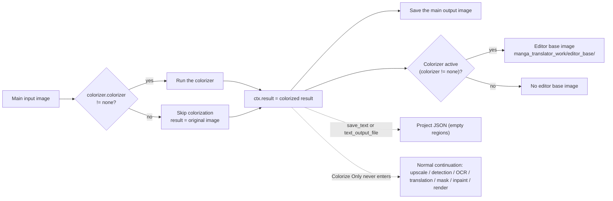

# Colorize Only

Use the Colorize Only workflow when you want to colorize a batch of images without detection, OCR, translation, inpainting, or rendering. In the "Translation Workflow Mode:" combo box on the translation page it sits after "Import Translation and Render", and its start button reads "Start Colorizing". The mode only runs the colorization stage and then returns immediately to save the main output image; selecting the mode does not force a colorizer, and when `colorizer.colorizer` is `none` the result is the original image.

Colorize Only, [Upscale Only](./upscale-only.md), and [Inpaint Only](./inpaint-only.md) are the single-stage workflows; the overall boundaries of the nine workflows are in [Output Directory and Workflow](../desktop/translation/output-directory-and-workflow.md), with a summary table in [Workflow Matrix](../reference/workflow-matrix.md). The colorizer type, colorization size, and denoise strength parameters are covered by [Upscale and Colorization](../desktop/settings/upscale-and-colorization.md), and the forced parameter overrides of the nine modes by [Mode-Specific Workflows and Template Alignment](../desktop/settings/mode-specific.md).

## Feature boundary

- Inputs: the main input images (the same file-discovery rules as normal translation: supported extensions are found recursively, collected in natural sort order, and directories named `manga_translator_work` are skipped).
- Stages executed: colorization (conditional). Whether colorization actually runs is decided by `colorizer.colorizer`; when it is `none`, the result is the original image.
- Stages skipped: upscaling, detection, OCR, textline merge, translation, mask refinement, inpainting, and rendering. The Colorize Only branch sits right after colorization and before upscaling in the source, so upscaling never runs even when `upscale_ratio` is set.
- Output files: the main output image; the editor base image `manga_translator_work/editor_base/<original-filename>` when the colorizer is active (`colorizer != none`); and, when `cli.save_text` is enabled, the batch path also writes a project JSON with empty `regions` (static source conclusion, pending runtime verification).
- Workflow field: combo index 5 writes `cli.colorize_only=true`; GUI switching keeps the eight workflow booleans mutually exclusive.

## UI operations

### Select the Colorize Only workflow

1. Open the translation page and choose "Colorize Only" (`Colorize Only`) in the "Translation Workflow Mode:" (`Translation Workflow Mode:`) combo box.
2. The page title becomes "Colorize Only" and the subtitle shows the hint: only colorize images, no detection, OCR, translation or rendering.
3. The start button becomes "Start Colorizing" (`Start Colorizing`); clicking it starts the backend task in this mode.

Selecting a mode only writes configuration and updates the UI texts; it does not start a task. Before starting, add the main input images ("Add Files...", "Add Folder...", or drag-and-drop) and enter or drop an output folder into "Output Directory:". When the colorizer is `openai_colorizer` / `gemini_colorizer`, the matching API key must be configured in API Management first; the i18n description says the UI will not start translation without the key, and whether the same blocking check applies when starting this workflow still needs runtime verification.

### UI text matrix

| UI call key | English actual value | Simplified Chinese actual value |
| --- | --- | --- |
| `Translation Workflow Mode:` | Translation Workflow Mode: | 翻译流程模式： |
| `Colorize Only` | Colorize Only | 仅上色 |
| `Start Colorizing` | Start Colorizing | 开始上色 |
| `Tip: Only colorize images, no detection, OCR, translation or rendering` | Tip: Only colorize images, no detection, OCR, translation or rendering | 提示：仅对图片进行上色处理，不进行检测、OCR、翻译和渲染 |
| `label_colorizer` | Colorization Model | 上色模型 |
| `label_colorization_size` | Colorization Size | 上色大小 |
| `label_denoise_sigma` | Denoise Strength | 降噪强度 |
| `label_ai_colorizer_history_pages` | AI Colorizer History Pages | AI 上色历史页数 |
| `label_overwrite` | Overwrite Existing Files | 覆盖已存在文件 |
| `label_save_text` | Editable Image | 图片可编辑 |
| `label_batch_concurrent` | Concurrent Batch Processing | 并发批量处理 |

## Option matrix

The combo box has no separate `userData`; the index is the mode value. Runtime code maps index 5 to `cli.colorize_only=true`. The stored values of the related settings are listed below, with the three UI evidence columns and their actual effect on this workflow.

| Stored value | English | Simplified Chinese | Effect in this workflow |
| --- | --- | --- | --- |
| `colorize_only=true` | Colorize Only | 仅上色 | Enters the Colorize Only branch; skips upscaling, detection, OCR, translation, mask refinement, inpainting, and rendering |
| `colorizer.colorizer=none` | None | 不使用 | No colorization; the result is the original image and no editor base is written |
| `colorizer.colorizer=mc2` | Manga Colorization v2 | Manga Colorization v2 | Local colorization model |
| `colorizer.colorizer=openai_colorizer` | OpenAI Colorizer | OpenAI Colorizer | OpenAI AI colorization; requires the matching API key |
| `colorizer.colorizer=gemini_colorizer` | Gemini Colorizer | Gemini Colorizer | Gemini AI colorization; requires the matching API key |
| `cli.overwrite=false` | Overwrite Existing Files | 覆盖已存在文件 | Skips images whose main output image already exists before starting |
| `cli.save_text=true` | Editable Image | 图片可编辑 | Qt/release default `true`; the batch path writes a project JSON with empty `regions` (static conclusion) |
| `cli.batch_concurrent=true` | Concurrent Batch Processing | 并发批量处理 | This mode is forced to run non-concurrently |

## Runtime behavior

### Stages and outputs

Colorize Only reuses the colorization step of `_translate_until_translation()` and returns early after the colorizer runs and before upscaling starts. The Mermaid diagram below shows the source-confirmed stage order, result assignment, and output branches; the dashed edges are the normal-flow continuation that Colorize Only never enters.

The diagram expresses the source-confirmed branches: with `colorize_only=true`, `_translate_until_translation()` sets `ctx.result` to the colorized image after colorization, sets `ctx.text_regions` to an empty list, reports the progress state `colorize-only-complete` (a core-internal finished state with no dedicated desktop locale text), writes the editor base when needed, and returns; the batch path never calls `_complete_translation_pipeline()` and never runs upscaling, detection, OCR, translation, mask refinement, inpainting, or rendering. When `colorizer.colorizer=none`, the colorization step is skipped, `ctx.img_colorized = ctx.input`, and the result is the original image.

### Concurrency and mutual exclusion

- `batch_concurrent` is incompatible: both the desktop controller and the core `translate_batch()` list Colorize Only among the incompatible modes and force non-concurrent processing; keeping the concurrent setting in the UI does not turn this into a concurrent pipeline.
- Manually stacking multiple workflow fields is not a supported combination. GUI switching keeps the eight fields mutually exclusive; in the core dispatch, the Colorize Only branch returns before the Upscale Only and Inpaint Only branches, so combining it with `upscale_only` or `inpaint_only` results in Colorize Only behavior only. This page does not describe such stacking as supported.
- As with normal translation, whether colorization runs is decided by `colorizer.colorizer`; Colorize Only does not force a colorizer. Normal, Upscale Only, Inpaint Only, and Replace Translation also colorize first when `colorizer.colorizer != none`; that is the colorization stage itself, not unique to this workflow.

## Dependencies and conflicts

- `colorizer.colorizer=none`: no colorization runs, the output is the original image, and no editor base is written; this is the direct consequence of Colorize Only not forcing a colorizer.
- AI colorizers: `openai_colorizer` / `gemini_colorizer` need the matching API key (`.env`) and a reachable network; the i18n description says the UI will not start translation without the key, and the actual blocking prompt when starting this workflow needs runtime verification.
- `upscale_ratio`: the Colorize Only branch returns before upscaling, so upscaling settings are ignored in this mode.
- `cli.overwrite=false`: the GUI filters images whose main output image (from `_calculate_output_path`) already exists before starting; if every image is skipped, the task ends before translation begins.
- `cli.save_text`: Qt/release default is `true`; the batch save path writes a project JSON with empty `regions` (static source conclusion; the actual content of an empty-regions JSON and editor behavior need runtime verification).
- No text regions means none of the detection, OCR, translation, mask, inpainting, or rendering intermediate files are produced: no inpainted image, no original/translated TXT, and no template-export files.
- PSD export (`export_editable_psd`) belongs to the shared save logic `_save_and_cleanup_context()`; the actual PSD content for this mode with no text regions has not been runtime-verified.
- Colorization model, VRAM, network, and API costs follow `colorizer.colorizer` and the colorization parameters; this page does not repeat those parameter descriptions.

## Related files and formats

| File/format | Actual role on this page | Notes |
| --- | --- | --- |
| Main output image | The colorized result (or the original image) | Path decided by the output directory, `save_to_source_dir`, and `cli.format` |
| `manga_translator_work/editor_base/<original-filename>` | Base image for the editor after colorization | Written only when `colorizer.colorizer != none`; keeps the original extension |
| `manga_translator_work/json/<stem>_translations.json` | Project JSON (empty regions) | Written only when `save_text` or `text_output_file` is enabled (static conclusion) |
| Inpainted image / original and translated TXT / template export | Not produced | This mode does not run detection, OCR, translation, inpainting, or rendering |

No real user configuration, keys, tokens, usernames, private absolute paths, user images, or task artifacts are shown on this page.

## Source evidence {#source-evidence}

| Layer | File | What was checked |
| --- | --- | --- |
| Workflow selection and writes | `desktop_qt_ui/ui/main_page/runtime.py:21-47,151-238` | Index 5 → `colorize_only=true`, eight-field mutual exclusion, title/hint/start-button texts |
| Translation page layout | `desktop_qt_ui/ui/main_page/pages/translation_page.py:27-113` | Header title/hint, workflow combo box, output-directory controls, and start button |
| i18n | `desktop_qt_ui/locales/en_US.json:488-501,686`; `desktop_qt_ui/locales/zh_CN.json:486-499,684` | Actual bilingual values of the workflow, hint, start button, and related settings |
| Controller | `desktop_qt_ui/app_logic.py:3094-3288` | `save_info`, main-output overwrite filtering, mode/tip, and concurrency disabling |
| Qt config | `desktop_qt_ui/core/config_models.py:123-147` | Defaults of `colorize_only`, `overwrite`, `save_text`, and `batch_concurrent` |
| Core config | `manga_translator/config.py:106-113,378-387,388-425` | `Colorizer` enum, `ColorizerConfig`, and `CliConfig` |
| Core branch | `manga_translator/manga_translator.py:4236-4332` | Colorization and the Colorize Only early return in `_translate_until_translation()` |
| Batch saving | `manga_translator/manga_translator.py:4195-4220` | Rendering pipeline skipped, main output saved, JSON written when `save_text` |
| Batch dispatch | `manga_translator/manga_translator.py:3399-3520` | Special-mode priority and concurrency incompatibility |
| Output path | `manga_translator/manga_translator.py:540-599` | `_calculate_output_path()` output directory and format |
| Editor base | `manga_translator/manga_translator.py:1074-1096` | `_save_work_image()` and `_save_editor_base_if_needed()` |
| Paths | `manga_translator/utils/path_manager.py:95-127` | Work directory, `editor_base` path, and legacy lookup fallback |

## Verification {#verification}

| Check | Status | Notes |
| --- | --- | --- |
| BLUEPRINT, PAGE_GUIDELINES, TODO | Complete | Read in full and followed the page contract; the three contract files were not modified |
| Source and research material | Complete | Cross-checked `workflow-matrix-source-evidence.md`, `phase0-related-files-formats-debug-safety.md`, and the UI, i18n, controller, and core sources |
| Three-column i18n evidence | Complete | The workflow option, hint, start button, and related settings record the call key, English, and Simplified Chinese actual values |
| Route/page mirror | Pending | Run route mirror and source-evidence checks after completing the pages |
| Sanitized runtime verification | Pending | Actual colorized output, overwrite/error prompts, empty-`regions` JSON, and AI-colorizer key blocking need sanitized runtime verification |
| Production build | Pending | Run `npm run docs:build --prefix doc/wiki` if needed |

- [ ] [In progress] Runtime confirmation remains: output and prompts when the colorizer is `none`, the actual content of an empty-`regions` JSON, overwrite/error dialogs, and the blocking behavior when the AI-colorizer key is missing.