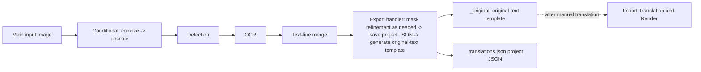

# Export Original Text

Use this mode when you want to export the text on the original images as text, translate it manually outside the app, and render it back later. This is the export-original workflow among the nine workflows; its UI name is “Export Original Text” (`导出原文`). It runs only conditional colorization/upscaling, detection, OCR, and text-line merging on each main input image, then skips translation, inpainting, and rendering and writes the per-image project JSON and `<stem>_original.<template-format>` original-text template. After translating those templates manually, [Import Translation and Render](./import-translation-and-render.md) reads them back and renders.

See [Output Directory and Workflow](../desktop/translation/output-directory-and-workflow.md) for the nine-mode overview and output-directory settings, and [Mode-Specific Workflows and Template Alignment](../desktop/settings/mode-specific.md#cli-template) and [CLI Batch and Output](../desktop/settings/cli-batch-and-output.md#cli-save-text) for the `cli.template` and `cli.save_text` parameters.

## Feature boundary {#feature-boundary}

- This page covers only the “Export Original Text” workflow (combo index `2`) among the nine workflows. Selecting it clears all eight mutually exclusive workflow fields and sets only `cli.template=true`; at runtime the export branch is entered only when `cli.save_text=true` as well.
- Inputs are the main input images and a readable translation template; outputs are the project JSON and the original-text sidecar, with no main output image. Each image's work directory is keyed by its `<stem>` without the extension.
- This page does not repeat the parameter algorithms of detection, OCR, colorization, upscaling, masking, inpainting, or rendering; selecting a workflow is not translator selection or API-candidate rotation (see [Translator selection](../desktop/translator/selection-and-languages.md)).

## UI operations {#ui-operations}

### Select the Export Original Text workflow {#select-export-original}

1. Open the “Translation” page (`Translation`) and click the “Translation Workflow Mode:” (`Translation Workflow Mode:`) combo box in the “Translation Task” (`Translation Task`) card.
2. Select “Export Original Text” (`Export Original Text`). The UI sets only `cli.template=true`, clears the other seven workflow fields, and saves the configuration; the title changes to “Export Original Text” and the subtitle shows the matching tip.
3. Click “Generate Original Text Template” (`Generate Original Text Template`) to start the task. Switching modes does not start a task automatically; while a task is running, the button shows states such as “Stop Translation” (`Stop Translation`); see [Progress, Stop, and Task State](../desktop/translation/progress-stop-and-task-state.md).

| UI call key | English actual value | Simplified Chinese actual value |
| --- | --- | --- |
| `Translation Workflow Mode:` | Translation Workflow Mode: | 翻译流程模式： |
| `Export Original Text` | Export Original Text | 导出原文 |
| `Generate Original Text Template` | Generate Original Text Template | 仅生成原文模板 |
| `Tip: After exporting, manually translate imagename_original.txt in manga_translator_work/originals/, then use 'Import Translation and Render' mode` | Tip: After exporting, manually translate imagename_original.txt in manga_translator_work/originals/, then use 'Import Translation and Render' mode | 提示：导出原文后，可在 manga_translator_work/originals/ 目录手动翻译 图片名_original.txt 文件，然后使用「导入翻译并渲染」模式 |

`imagename` in the tip is the program's example name for the input `<stem>`, not a private user file name; `manga_translator_work/originals/` is a fixed subdirectory under each image's work directory.

## Option matrix {#option-matrix}

The workflow combo has no separate `userData`; the index is the mode value. The stored value and the written workflow field for this mode are:

| Stored value | English | Simplified Chinese | Workflow field written | Start button (English / Simplified Chinese) |
| --- | --- | --- | --- | --- |
| `2` | Export Original Text | 导出原文 | `template=true` (also requires `save_text=true`) | Generate Original Text Template / 仅生成原文模板 |

Related settings (Settings → Mode Specific or CLI group):

| UI call key | English actual value | Simplified Chinese actual value |
| --- | --- | --- |
| `label_template` | Export Original Text | 导出原文 |
| `label_save_text` | Editable Image | 图片可编辑 |
| `desc_cli_save_text` | Save translation results to JSON file for later editing in the editor. | 保存翻译结果到 JSON 文件，用于后续在编辑器中修改。 |
| `label_overwrite` | Overwrite Existing Files | 覆盖已存在文件 |

## Runtime behavior {#runtime-behavior}

The “Export Original Text” mode enters the export branch only when `template=true` **and** `save_text=true` (`is_template_save_mode` in source). Core `translate_batch()` forces `batch_size=1` for per-image write-out and lists this mode as incompatible with `batch_concurrent`; the desktop controller also sets the concurrency local variable to `false` for this run. The high-quality translator flow is skipped for import/export modes as well.

The diagram expresses only the source-confirmed stage order: `_translate_until_translation()` runs conditional colorization/upscaling, detection, OCR, and text-line merging; `_handle_template_and_save_text()` then refines the mask as needed, saves the JSON, and generates the original-text template. When there are no text regions, an empty JSON and an empty template file are still written.

### Input and discovery rules {#input-and-discovery}

- Main inputs must be images supported by the file service. Adding a folder searches recursively in natural order and skips directories named `manga_translator_work`. Archive and document extensions are recognized by the same service, but archive-sidecar pairing for this workflow has not been runtime-verified.
- Each image's work directory is keyed by the input's original path and its `<stem>` without the extension: the original-text sidecar is written to `manga_translator_work/originals/<stem>_original.<template-format>`.
- A readable template is required; when `config/translation_template.json` is missing or unreadable, `output_format` falls back to `json`.
- With `detector.import_yolo_labels=true` and imported labels present, detection uses the imported boxes directly and marks the run as “template mode”.

### Skipped and kept stages {#skipped-and-kept-stages}

- Skipped: translation, inpainting, rendering, and main-output-image saving; no translation service is called, so no API translation requests are produced.
- Kept: conditional colorization → conditional upscaling → detection → OCR → text-line merging; mask refinement runs when non-empty regions and an original mask exist.
- Exception: imported-YOLO-label export modes skip mask refinement and do not save a mask in the JSON.
- Boundary: the GUI sets only `template`; Qt/release defaults set `save_text=true`. If an external configuration sets `save_text=false`, the export branch is not entered and the actual fallback path requires runtime verification.

### Mask and JSON details {#mask-and-json-details}

- The project JSON is written by `_save_text_to_file()` to `manga_translator_work/json/<stem>_translations.json` (the new location is preferred; the legacy image-directory location is the fallback).
- Export Original Text writes `skip_font_scaling=false` into the JSON so a later import-and-render run re-runs smart typesetting instead of inheriting old font sizes; because translation did not run, region `translation` values are still the originals.
- The refined `ctx.mask` is saved with `mask_is_refined=true`; without a refinement result, `mask_raw` is saved with `mask_is_refined=false`. Imported-YOLO-label export modes do not save a mask.
- `generate_original_text()` renders each region as an `<original>` line per the template, using the original text as a placeholder when `translation` is empty; with no text regions it logs and creates an empty file.

### Output files {#output-files}

| Output | Path | Notes |
| --- | --- | --- |
| Project JSON | `manga_translator_work/json/<stem>_translations.json` | Regions, dimensions, mask, and export markers; read by import-and-render |
| Original-text template | `manga_translator_work/originals/<stem>_original.<template-format>` | Extension comes from the template `output_format`; defaults to `json`; an empty file is created when there are no text regions |
| Main output image | not written | Rendering is skipped, so no main image is produced |
| Editor base image | `manga_translator_work/editor_base/<original-filename>` | Written conditionally only when colorization or upscaling is enabled |

## Dependencies and conflicts {#dependencies-and-conflicts}

- Requires `cli.save_text=true` and a readable template; incompatible with `batch_concurrent` (both the frontend and core process it non-concurrently), and Export Original Text additionally forces `batch_size=1`.
- With `cli.overwrite=false`, the existing `<stem>_original.<template-format>` is checked before starting; existing files are skipped and recorded as skipped.
- Shares the template and JSON write path with Export Translation, and pairs with Import Translation and Render as “export original → manual translation → import and render”; see [Import Translation and Render](./import-translation-and-render.md).
- The display name describes the goal and does not automatically enable or disable colorization/upscaling models; the colorizer and ratio are still governed by `colorizer.colorizer` and `upscale.upscale_ratio`.

## Related files and formats {#related-files-and-formats}

| File/format | Actual role on this page | Manual-edit and compatibility note |
| --- | --- | --- |
| `config/translation_template.json` | Determines `output_format` and the `<original>`/`<translated>` placeholders | The first `output_format:` line must be a safe extension; missing/invalid values fall back to `json`; do not embed private paths |
| `manga_translator_work/originals/<stem>_original.<format>` | Original-text template output for manual translation | The file name must match the input `<stem>`; Import Translation and Render reads it first |
| `manga_translator_work/json/<stem>_translations.json` | Project JSON output | New location preferred; legacy image-directory location compatible |
| `manga_translator_work/editor_base/` | Conditionally written editor base images | Produced only when colorization/upscaling is enabled |
| `manga_translator_work/yolo_labels/<stem>.txt` | Imported-YOLO-label input | Participates in detection only with `import_yolo_labels=true` |

No real user configuration, keys, tokens, usernames, private absolute paths, user images, or task artifacts are shown here; no real runtime screenshot is available for this page, so a diagram must not be presented as a runtime screenshot.

## Source evidence {#source-evidence}

| Layer | File | What was checked |
| --- | --- | --- |
| UI layout | `desktop_qt_ui/ui/main_page/pages/translation_page.py:64-110` | Translation Task card, workflow combo, and start button |
| Workflow state/writes | `desktop_qt_ui/ui/main_page/runtime.py:21-47,151-215` | Index `2` maps to `template=true`; tip and button copy |
| i18n | `desktop_qt_ui/locales/en_US.json`, `zh_CN.json` | Actual bilingual values for combo, tip, button, and settings |
| Controller | `desktop_qt_ui/app_logic.py:3149,3244-3270` | Pre-start existence check, `is_template_save_mode`, and concurrency disabling |
| Qt config | `desktop_qt_ui/core/config_models.py:123` | `template`, `save_text`, and `overwrite` defaults |
| Core dispatch | `manga_translator/manga_translator.py:799,3448-3510,4090-4130` | Export-branch condition, `batch_size=1`, skipped translation/rendering, and export handler |
| Template export | `desktop_qt_ui/services/workflow_service.py:305-398` | `generate_original_text()`, placeholders, and empty-file behavior |
| Paths | `manga_translator/utils/path_manager.py:178-201` | `get_original_txt_path()`, work directory, and `originals` subdirectory |
| Template format | `manga_translator/utils/translation_template.py:10-65` | `output_format` parsing and fallback |

## Verification {#verification}

| Check | Status | Notes |
| --- | --- | --- |
| BLUEPRINT, PAGE_GUIDELINES, TODO | Complete | Read in full and followed the page contract |
| UI and three-column i18n | Complete | Statically cross-checked `translation_page.py`, `runtime.py`, and both locales |
| Runtime chain (static) | Complete | Cross-checked `translate_batch()` branches, `_handle_template_and_save_text()`, and template generation |
| Sanitized runtime verification | Deferred | No GUI launched; no real `.env`, user `config.json`, keys, or user images read; GUI tips, overwrite dialogs, and the `save_text=false` fallback path remain runtime items |
| Route/source checks | Deferred | Run route-mirror and source-evidence checks after completing the pages |
| VitePress build | Deferred | Coordinator should run `npm run docs:build --prefix doc/wiki` before merge |

- [ ] [In progress] Runtime confirmation remains: GUI tips and overwrite dialogs, the `save_text=false` fallback path, and sidecar pairing under archive inputs.