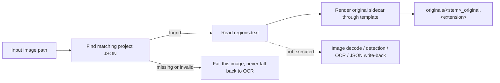

# Export Original Text

Export Original Text now reads `regions[].text` from the existing local project JSON by default and writes only `<stem>_original.<template-format>`. It does not open the image, run detection/OCR, or write the project JSON back. Settings → Mode Specific → Text Export → “Export Text from Local JSON Only” controls this behavior; disable it to restore the legacy image detection/OCR and JSON-write flow.

See [Output Directory and Workflow](../desktop/translation/output-directory-and-workflow.md) for the nine-mode overview and [Mode-Specific Workflows and Template Alignment](../desktop/settings/mode-specific.md#cli-export-from-local-json) for this toggle and `cli.template`.

## When to use it {#feature-boundary}

- Selecting Export Original Text (combo index `2`) sets `cli.template=true`; by default it also reads the existing project JSON and writes only the original-text sidecar.
- Default inputs are the matching project JSON and a readable template. The image path only locates JSON and is not decoded. No main image is written and JSON is not modified.
- Disable `cli.export_from_local_json` to enter the legacy flow, which requires `cli.save_text=true` and runs detection, OCR, mask processing, and JSON write-back.

## Run this workflow {#ui-operations}

### Select the Export Original Text workflow {#select-export-original}

1. Open the “Translation” page and click the “Translation Workflow Mode:” combo box in the “Translation Task” card.
2. Select “Export Original Text”. The UI sets only `cli.template=true`, clears the other seven workflow fields, and saves the configuration; the title changes to “Export Original Text” and the subtitle shows the matching tip.
3. Click “Generate Original Text Template” to start the task. Switching modes does not start a task automatically; while a task is running, the button shows states such as “Stop Translation”; see [Progress, Stop, and Task State](../desktop/translation/progress-stop-and-task-state.md).

`imagename` in the tip is the program's example name for the input `<stem>`, not a private user file name; `manga_translator_work/originals/` is a fixed subdirectory under each image's work directory.

## Processing order {#runtime-behavior}

With `cli.export_from_local_json` enabled by default, `translate_batch()` reads local JSON before image materialization. A missing JSON fails that image and never falls back to OCR. Disable the toggle to enter the legacy `template + save_text` branch.

### Input and discovery rules {#input-and-discovery}

- The translation-page file list still supplies image paths; each path determines the work directory and matching project JSON, but the export branch does not open image content.
- Project JSON must exist at the new `manga_translator_work/json/<stem>_translations.json` location or the compatible legacy sibling path.
- The original sidecar is written to `manga_translator_work/originals/<stem>_original.<template-format>`; a readable template is required, with invalid/missing formats falling back to `json`.
- `detector.import_yolo_labels` applies only to the legacy detection flow after local JSON export is disabled.

### Skipped and kept stages {#skipped-and-kept-stages}

- Default skips: image loading, colorization, upscaling, detection, OCR, translation, mask processing, inpainting, rendering, main-image saving, and JSON write-back.
- Default kept work: read `regions[].text` from existing JSON and render the original sidecar through the template. `<translated>` may still use the JSON's existing `translation` value.
- Disabling the local-JSON toggle restores conditional colorization/upscaling, detection, OCR, mask refinement, and JSON writing; it still does not call a translation service.

### Project JSON details {#mask-and-json-details}

- Default local export opens the project JSON read-only. Its bytes remain unchanged, including mask, font size, translations, and editor fields.
- `generate_original_text()` exports non-empty source text through the template and removes `[BR]`; no regions produce the template's empty output.

### Output files {#output-files}

| Output | Path | Notes |
| --- | --- | --- |
| Project JSON | `manga_translator_work/json/<stem>_translations.json` | Must already exist; read-only and unchanged by default |
| Original-text template | `manga_translator_work/originals/<stem>_original.<template-format>` | The only file written by default; extension comes from template `output_format` |
| Main output image | not written | The image is not opened or rendered |
| Editor base image | not written | Default local JSON export does not colorize or upscale |

## Inputs, outputs, and limitations {#dependencies-and-conflicts}

- Defaults require an existing project JSON and readable template. Missing JSON fails explicitly without OCR fallback; `batch_concurrent` remains incompatible.
- With `cli.overwrite=false`, an existing original sidecar is skipped before processing.
- `cli.save_text` remains part of the Export Original Text workflow flag combination; default local export never saves or overwrites JSON.
- Disable `cli.export_from_local_json` to restore the legacy flow and its detection, OCR, colorization/upscaling, and `save_text` write behavior.

## Read next {#related-pages}

- Other workflows: [Normal Translation](./normal.md) · [Export Translation](./export-translation.md) · [Translate JSON Only](./translate-json-only.md) · [Import Translation and Render](./import-translation-and-render.md) · [Colorize Only](./colorize-only.md) · [Upscale Only](./upscale-only.md) · [Inpaint Only](./inpaint-only.md) · [Replace Translation](./replace-translation.md)
- Selecting a workflow, output directory, and mutually exclusive writes: [Output Directory and Workflow](../desktop/translation/output-directory-and-workflow.md)
- Inputs, skipped stages, and outputs of all nine workflows: [Workflow Matrix](../reference/workflow-matrix.md)
- Mutually exclusive workflow fields, parameter overrides, and template alignment: [Mode-Specific Workflows and Template Alignment](../desktop/settings/mode-specific.md)

> See the reference index: [Workflow Matrix](../reference/workflow-matrix.md).
