# Export Translation

Use the Export Translation workflow when you only need the translated text of the image in bulk and do not yet need inpainting, layout, and rendered images. It still runs conditional colorization, conditional upscaling, detection, OCR, and translation, but skips inpainting, rendering, and main-image saving. The translated text of each image is written through the template into a `translations/` sidecar in the work directory, and the project JSON is saved as well.

Export Translation forms the template/JSON family together with [Export Original Text](./export-original.md), [Translate JSON Only](./translate-json-only.md), and [Import Translation and Render](./import-translation-and-render.md). The overall boundaries of the nine workflows are in [Output Directory and Workflow](../desktop/translation/output-directory-and-workflow.md), with a summary table in [Workflow Matrix](../reference/workflow-matrix.md).

## Feature boundary

- Inputs: the main input images (the same file-discovery rules as normal translation) plus a readable export template `config/translation_template.json`.
- Stages executed: conditional colorize → conditional upscale → detection → OCR → text-line merge → translation; the mask is refined when text regions exist but only a raw mask is available.
- Stages skipped: inpainting, rendering, and main-output-image saving. Translation results land only in the project JSON and the translated sidecar; no final image is produced.
- Output files: `manga_translator_work/json/<stem>_translations.json` and `manga_translator_work/translations/<stem>_translated.<template-extension>`.
- Workflow field: combo index 1 writes `cli.generate_and_export=true` at runtime; GUI switching keeps the eight workflow booleans mutually exclusive.

## UI operations

### Select the Export Translation workflow

1. Open the translation page and choose “Export Translation” (`Export Translation`) in the “Translation Workflow Mode:” (`Translation Workflow Mode:`) combo box.
2. The page title becomes “Export Translation” and the subtitle shows the hint: after exporting, check the translated sidecars in `manga_translator_work/translations/`.
3. The start button becomes “Export Translation” (`Export Translation`); clicking it starts the backend task in this mode.

Selecting a mode only writes configuration and updates the UI texts; it does not start a task. Before starting, add the main input images (“Add Files...”, “Add Folder...”, or drag-and-drop) and make sure the export template exists and parses. The UI hint always reads `imagename_translated.txt`, but the actual extension comes from the template's `output_format` (default `json`); the hint text does not change with the template extension.

“Output Directory:” only determines where the main output image goes. Export Translation writes no main image, so in this mode it does not affect the JSON or translated-sidecar locations; both always follow the per-image work-directory rules.

| UI call key | English actual value | Simplified Chinese actual value |
| --- | --- | --- |
| `Translation Workflow Mode:` | Translation Workflow Mode: | 翻译流程模式： |
| `Export Translation` | Export Translation | 导出翻译 |
| `Tip: After exporting, check manga_translator_work/translations/ for imagename_translated.txt files` | Tip: After exporting, check manga_translator_work/translations/ for imagename_translated.txt files | 提示：导出翻译后，可在 manga_translator_work/translations/ 目录查看 图片名_translated.txt 文件 |
| `label_generate_and_export` | Export Translation | 导出翻译 |
| `label_overwrite` | Overwrite Existing Files | 覆盖已存在文件 |
| `label_import_yolo_labels` | Import Fixed YOLO Boxes | 导入固定YOLO框 |
| `label_batch_concurrent` | Concurrent Batch Processing | 并发批量处理 |

## Option matrix

The combo box has no separate `userData`; the index is the mode value. Runtime code maps index 1 to `cli.generate_and_export=true`. The stored values of the related settings are listed below, with the three UI evidence columns and their actual effect on this workflow.

| Stored value | English | Simplified Chinese | Effect in this workflow |
| --- | --- | --- | --- |
| `generate_and_export=true` | Export Translation | 导出翻译 | Enters the export branch; skips inpainting, rendering, and main-image saving |
| `overwrite=false` | Overwrite Existing Files | 覆盖已存在文件 | Skips images whose translated sidecar already exists before starting |
| `import_yolo_labels=true` | Import Fixed YOLO Boxes | 导入固定YOLO框 | Skips mask refinement and does not save the mask in JSON |
| `batch_concurrent=true` | Concurrent Batch Processing | 并发批量处理 | This mode is forced to run non-concurrently |

## Runtime behavior

### Stages and outputs

Export Translation reuses the first half of the normal-translation pipeline and finishes in the shared template-export handler. The Mermaid diagram below shows the source-confirmed stage order, mask branches, and output files. It shares `_handle_template_export` with Export Original Text but is called with `ensure_json_with_empty_regions=false`, so images without text regions produce no files (Export Original Text writes an empty template instead).

```mermaid
flowchart LR
    Input["Main input images"] --> Pre["Conditional: colorize -> upscale"]
    Pre --> Detect["Detection"] --> OCR["OCR"] --> Merge["Text-line merge"] --> Translate["Translation"]
    Translate --> Handler["Template-export handler"]
    Handler --> Yolo{"Import YOLO labels?"}
    Yolo -->|yes| YoloMask["Skip mask refinement; JSON saves no mask"]
    Yolo -->|no| RefineCheck{"Regions exist with only a raw mask?"}
    RefineCheck -->|yes| Refine["Refine mask (refine only, no inpainting)"]
    RefineCheck -->|no| NoRefine["Skip mask refinement"]
    YoloMask --> HasText{"Any non-empty text regions?"}
    Refine --> HasText
    NoRefine --> HasText
    HasText -->|yes| SaveJson["Save project JSON"]
    HasText -->|no| NoOut["Produce no files"]
    SaveJson --> JsonFile["manga_translator_work/json/&lt;stem&gt;_translations.json"]
    SaveJson --> Gen["generate_translated_text writes translations via template"]
    Gen --> TxtFile["manga_translator_work/translations/&lt;stem&gt;_translated.&lt;template-extension&gt;"]
    Translate -. "not executed" .-> Skip["Inpainting / rendering / main-image saving"]
```

### Template-export details

- Template path resolution order: a user-specified path > the `MANGA_TEMPLATE_PATH` environment variable > the default `config/translation_template.json`.
- The first `output_format:` line in the template determines the sidecar extension; valid values are safe 1–32-character extensions, falling back to `json` when missing or invalid.
- `generate_translated_text()` collects items from the `regions` list of the project JSON: only non-empty original-text regions are included, `[BR]` markers are removed from both original and translated text, `<original>` is filled with the original and `<translated>` with the translation. An empty translation is exported as an empty string (it does not fall back to the original text, unlike Export Original Text).
- The template must contain at least one line with the `<original>` placeholder; otherwise parsing raises an error and the export log records “Failed to export clean text”.
- The built-in default template uses `output_format` `json` and an `<original>` / `<translated>` line structure.

### JSON fields written by Export Translation

- `skip_font_scaling=true`: Export Translation preserves the fixed font size for later replay; Export Original Text and Translate JSON Only write `false` instead.
- Mask: when `save_mask` is enabled, a base64 mask and `mask_is_refined` are saved; export modes with imported YOLO labels skip mask saving.
- When colorization or upscaling is active, the JSON records `colorizer`, `upscale_ratio`, and `upscaler`.
- This mode does not render, so `skip_text_replacements` is not written; existing paint/stamp overlay layers in the old JSON are preserved.

### Concurrency and mutual exclusion

- `batch_concurrent` is incompatible: both the desktop controller and `translate_batch()` treat it as an incompatible mode and force non-concurrent handling. Keeping the concurrent configuration in the UI does not turn this mode into a concurrent pipeline.
- Manually stacking multiple workflow fields is not a supported combination. In the runtime `translate_batch()` dispatch order, the Export Original Text branch runs before the Export Translation branch; GUI switching keeps the eight fields mutually exclusive.
- As with normal translation, conditional colorization and upscaling still run in preprocessing based on `colorizer.colorizer` and `upscale.upscale_ratio`; those values are not forced by this workflow.

## Dependencies and conflicts

- Template dependency: a missing template logs a warning and the project JSON is still saved; an unparsable template means no translated sidecar is produced.
- No text regions: this mode calls the shared export flow with `ensure_json_with_empty_regions=false`, so images without text regions produce neither JSON nor a translated sidecar. This differs from Export Original Text, which writes an empty template (static source conclusion; the runtime prompt for the empty-region case still needs verification).
- `cli.overwrite=false`: the GUI skips images whose translated sidecar already exists before starting (it checks `get_translated_txt_path`, i.e., the target file generated with the template extension).
- `cli.save_text`: entering the export branch does not depend on `save_text`; JSON and the translated sidecar are written unconditionally inside the branch. This differs from Export Original Text, which requires `template=true` and `save_text=true`.
- Colorization, upscaling, detection, OCR, and translation still consume model, VRAM, network, and API costs according to their parameters; this page does not repeat those parameter descriptions.
- The main output directory, `save_to_source_dir`, and `cli.format` affect only the main output image; this mode writes no main image, so those settings have no direct effect on this workflow's outputs.

## Related files and formats

| File/format | Actual role on this page | Notes |
| --- | --- | --- |
| `config/translation_template.json` | Determines the translated-sidecar extension and placeholder structure | The first `output_format:` line is the extension; missing/invalid falls back to `json` |
| `manga_translator_work/json/<stem>_translations.json` | Project JSON with `regions`, mask, and `skip_font_scaling` | New location takes priority; falls back to the legacy image-side location |
| `manga_translator_work/translations/<stem>_translated.<template-extension>` | Translated sidecar | Extension comes from the template; the `.txt` in the UI hint is fixed text |
| Main output image | Not produced | This mode skips main-image saving |

No real user configuration, keys, tokens, usernames, private absolute paths, user images, or task artifacts are shown on this page.

## Source evidence

| Layer | File | What was checked |
| --- | --- | --- |
| Workflow selection and writes | `desktop_qt_ui/ui/main_page/runtime.py:183-215` | Index 1 → `generate_and_export=true`, eight-field mutual exclusion, and config saving |
| Title, hint, and start button | `desktop_qt_ui/ui/main_page/runtime.py:22-47,219-238` | “Export Translation” title, hint call keys, and button text |
| i18n | `desktop_qt_ui/locales/en_US.json`, `zh_CN.json` | Actual bilingual values for `Export Translation`, `Tip: After exporting...`, and `label_*` |
| Controller | `desktop_qt_ui/app_logic.py:3157-3162,3222,3245-3272` | Pre-start translated-sidecar check, workflow hint, and special-mode concurrency disabling |
| Core dispatch | `manga_translator/manga_translator.py:4151,5770` | Export branches in the standard and HQ paths; rendering skipped |
| Template export | `manga_translator/manga_translator.py:960,1021` | Shared `_handle_generate_and_export` → `_handle_template_export` flow |
| JSON writes | `manga_translator/manga_translator.py:713,803,829` | `_save_text_to_file`, `skip_font_scaling=true`, and the YOLO mask exception |
| Paths | `manga_translator/utils/path_manager.py` | JSON/translated-sidecar paths and new/legacy lookup fallback |
| Template parsing/generation | `manga_translator/utils/translation_template.py`, `desktop_qt_ui/services/workflow_service.py` | `output_format` parsing, `<original>/<translated>` placeholders, and `generate_translated_text` |

## Verification

| Check | Status | Notes |
| --- | --- | --- |
| BLUEPRINT, PAGE_GUIDELINES, TODO | Complete | Read in full and followed the page contract; the three contract files were not modified |
| Source and research material | Complete | Cross-checked `workflow-matrix-source-evidence.md` and the UI, i18n, controller, and core sources |
| Three-column i18n evidence | Complete | The workflow option, hint, button, and related settings record the call key, English, and Simplified Chinese actual values |
| Route/page mirror | Pending | Run route mirror and source-evidence checks after completing the pages |
| Empty-region and overwrite/error prompts | Pending | `ensure_json_with_empty_regions` empty-region behavior, overwrite prompts, and error dialogs need sanitized runtime verification |
| Production build | Pending | Run `npm run docs:build --prefix doc/wiki` if needed |

- [ ] [In progress] Runtime confirmation remains: actual prompts and file retention for empty text regions, overwrite prompt dialogs, and user-visible feedback when the template is missing.