# Inpaint Only

Use the Inpaint Only workflow when you only need to erase the text areas from the artwork and keep a clean background image, without recognizing text content, translating, or typesetting and rendering. It still runs conditional colorization, conditional upscaling, detection, text-line merge, mask refinement, and inpainting, but skips OCR, translation, and rendering. The branch clears the text regions before finishing, so the main output is a clean image without translated text.

Inpaint Only, [Colorize Only](./colorize-only.md), and [Upscale Only](./upscale-only.md) are image-only bypass modes; the difference from the full pipeline is covered in [Normal Translation](./normal.md). The overall boundaries of the nine workflows are in [Output Directory and Workflow](../desktop/translation/output-directory-and-workflow.md), with a summary table in [Workflow Matrix](../reference/workflow-matrix.md). The mask and inpainting parameters themselves are documented in [Mask and Inpainting](../desktop/settings/mask-and-inpainting.md).

## Feature boundary

- Inputs: the main input images (the same file-discovery rules as normal translation). No workflow sidecar such as a project JSON, TXT, or paired image is required.
- Stages executed: conditional colorize (when `colorizer.colorizer != none`) → conditional upscale (when `upscale.upscale_ratio` is set) → detection → skip OCR and fill detected lines with the literal `TEXT` → text-line merge → mask refinement → inpainting.
- Stages skipped: OCR, translation, rendering, and text typesetting. `text_regions` is cleared before the branch ends, so the result is never rendered with translated text.
- Output files: the main output image (the inpainted clean image; the un-inpainted work image when there are no text lines, no merged regions, or an AI renderer is selected); an editor base image when conditional colorization or upscaling is active; and a project JSON with empty `regions` when `save_text` is enabled (static source conclusion; runtime pending).
- Workflow field: combo index 7 writes `cli.inpaint_only=true` at runtime; GUI switching keeps the eight workflow booleans mutually exclusive.

## UI operations

### Select the Inpaint Only workflow

1. Open the translation page and choose “Inpaint Only” (`Inpaint Only`) in the “Translation Workflow Mode:” (`Translation Workflow Mode:`) combo box.
2. The page title becomes “Inpaint Only” and the subtitle shows the hint “Tip: Detect text regions and inpaint to output clean images, no translation or rendering”.
3. The start button becomes “Start Inpainting” (`Start Inpainting`); clicking it starts the backend task in this mode.

Selecting a mode only writes configuration and updates the UI texts; it does not start a task. Before starting, add the main input images (“Add Files”, “Add Folder”, or drag-and-drop). No sidecar file is required in this mode.

“Output Directory:” determines where the main output image goes, with the same naming rules as normal translation: the input folder name and relative hierarchy are preserved under the normal output directory, `save_to_source_dir=true` switches to `manga_translator_work/result/` next to the source image, and an empty or `none` `cli.format` keeps the original extension.

| UI call key | English actual value | Simplified Chinese actual value |
| --- | --- | --- |
| `Translation Workflow Mode:` | Translation Workflow Mode: | 翻译流程模式： |
| `Choose translation workflow mode before starting the task.` | Choose translation workflow mode before starting the task. | 开始任务前请选择翻译流程模式。 |
| `Inpaint Only` | Inpaint Only | 仅修复 |
| `Tip: Detect text regions and inpaint to output clean images, no translation or rendering` | Tip: Detect text regions and inpaint to output clean images, no translation or rendering | 提示：仅检测文字并执行图像修复，输出无字干净图，不进行翻译和渲染 |
| `Start Inpainting` | Start Inpainting | 开始修复 |
| `Add Files` | Add Files | 添加文件 |
| `Add Folder` | Add Folder | 添加文件夹 |
| `Clear List` | Clear List | 清空列表 |
| `Output Directory:` | Output Directory: | 输出目录: |
| `Select or drag output folder...` | Select or drag output folder... | 选择或拖入输出文件夹... |
| `Browse...` | Browse... | 浏览... |
| `Open` | Open | 打开 |
| `label_overwrite` | Overwrite Existing Files | 覆盖已存在文件 |
| `label_batch_concurrent` | Concurrent Batch Processing | 并发批量处理 |
| `label_save_text` | Editable Image | 图片可编辑 |
| `label_inpainter` | Inpainting Model | 修复模型 |

## Option matrix

The combo box has no separate `userData`; the index is the mode value. Runtime code maps index 7 to `cli.inpaint_only=true`. The stored values of the related settings are listed below, with the three UI evidence columns and their actual effect on this workflow.

| Stored value | English | Simplified Chinese | Effect in this workflow |
| --- | --- | --- | --- |
| `inpaint_only=true` | Inpaint Only | 仅修复 | Enters the inpaint-only branch; skips OCR, translation, and rendering |
| `overwrite=false` | Overwrite Existing Files | 覆盖已存在文件 | Skips images whose main output image already exists before starting |
| `batch_concurrent=true` | Concurrent Batch Processing | 并发批量处理 | This mode is forced to run non-concurrently |
| `save_text=true` | Editable Image | 图片可编辑 | Qt/release default on; the save stage still writes a project JSON with empty `regions` (static source conclusion) |
| `render.renderer` as an AI renderer | Renderer | 渲染器 | With the OpenAI/Gemini renderer selected, real inpainting is skipped and the work image is used as the inpaint base |

## Runtime behavior

### Stages and outputs

Inpaint Only reuses the first half of the normal-translation preprocessing and finishes inside the “Inpaint Only” branch of `_translate_until_translation`. The Mermaid diagram below shows the source-confirmed stage order, skip branches, and outputs. It shares conditional colorization, conditional upscaling, and detection with normal translation, but OCR and translation are skipped.

```mermaid
flowchart LR
    Input["Main input images"] --> Pre["Conditional: colorize -> upscale"]
    Pre --> Detect["Detection"]
    Detect --> HasLine{"Text lines and a valid raw mask?"}
    HasLine -->|no| Pass["Use the un-inpainted work image as the result"]
    HasLine -->|yes| Fill["Skip OCR: fill detected lines with literal TEXT"]
    Fill --> Merge["Text-line merge"]
    Merge --> HasRegion{"Merged text regions exist?"}
    HasRegion -->|no| Pass
    HasRegion -->|yes| Refine["Mask refinement"]
    Refine --> AiRenderer{"AI renderer selected?"}
    AiRenderer -->|yes| WorkBase["Skip inpainting; use the work image as the inpaint base"]
    AiRenderer -->|no| HasMask{"Mask empty?"}
    HasMask -->|yes| WorkBase
    HasMask -->|no| Inpaint["Inpainting"]
    WorkBase --> Result["Result image"]
    Inpaint --> Result
    Result --> Clear["Clear text_regions; never render translated text"]
    Result --> Save["Save the main output image"]
    Save -. "skipped" .-> SkipStages["OCR / translation / rendering"]
    Clear -. "skipped" .-> SkipStages
```

- Each detected line is filled with the literal `TEXT` placeholder while OCR is skipped; text-line merge combines the detected lines into `text_regions`.
- When there are no text lines, no raw mask, or no merged regions, the un-inpainted work image is returned directly as the result without mask refinement or inpainting.
- When mask refinement fails, it degrades to a simple dilation driven by `kernel_size` and `mask_dilation_offset`.
- Real inpainting is skipped when an AI renderer (OpenAI/Gemini) is selected or the mask is empty; the work image passes through as the “inpaint base”.
- Before the branch ends, `text_regions` is cleared and the `inpaint_only_complete` flag is set; the save stage skips `_complete_translation_pipeline`, so the regular post-mask rendering does not run.

### Mask and inpainting details

- Mask refinement and inpainting parameters come from the “Inpainting” tab in Settings (inpainting model, inpainting size, precision, per-block inpainting, solid-fill pure bubbles, mask dilation offset, and so on); see [Mask and Inpainting](../desktop/settings/mask-and-inpainting.md).
- The inpainting input is the work image after conditional colorization/upscaling (`load_image(ctx.upscaled)`), not the raw input image.
- The inpainting result is stored in `ctx.img_inpainted`, converted to a PIL image, and saved as `ctx.result` as the main output. This mode does not write an extra `inpainted/` sidecar.

### Concurrency and mutual exclusion

- `batch_concurrent` is incompatible: both the desktop controller and `translate_batch()` treat it as an incompatible mode and force non-concurrent handling. Keeping the concurrent configuration in the UI does not turn this mode into a concurrent pipeline.
- Manually stacking multiple workflow fields is not a supported combination; GUI switching keeps the eight fields mutually exclusive, and the backend `translate_batch()` only builds the concurrent pipeline when no incompatible mode is present.
- As with normal translation, preprocessing still runs conditional colorization and upscaling according to `colorizer.colorizer` and `upscale.upscale_ratio`; those values are not forced by this workflow.

## Dependencies and conflicts

- Input dependency: the main inputs must be images supported by the file service; no project JSON, TXT, or paired image is required.
- `cli.overwrite=false`: the GUI checks whether the main output image already exists before starting (it shares the normal-translation check branch with other main-image-only modes).
- `cli.save_text`: the Qt/release default is `true`. When enabled, the save stage still writes a project JSON with empty `regions` (including the mask and colorize/upscale info). This is a static source conclusion; the actual GUI file behavior still needs runtime verification.
- AI renderer: with the OpenAI/Gemini renderer selected, this mode does not perform real inpainting and outputs the un-inpainted work image. The name “Inpaint Only” therefore differs from the actual behavior in that case; this is source-confirmed.
- Detection, mask refinement, and inpainting consume model and VRAM costs according to their parameters; OCR and translation are skipped, so they incur no such costs.
- The main output directory, `save_to_source_dir`, and `cli.format` affect only the main output image. This mode writes no original/translated TXT, so the export template file has no effect here.

## Related files and formats

| File/format | Actual role on this page | Notes |
| --- | --- | --- |
| Main output image | The inpainted clean image | Path is decided by the output-path calculator; it is the un-inpainted work image when there are no text lines, no merged regions, or an AI renderer is selected |
| `manga_translator_work/json/<stem>_translations.json` | Project JSON with empty `regions` | Written when `save_text` is enabled; new location takes priority, with fallback to the legacy image-side location |
| `manga_translator_work/editor_base/<original-filename>` | Colorize/upscale editor base | Written when conditional colorization or upscaling is active, sharing the preprocessing logic with Colorize Only/Upscale Only |
| `manga_translator_work/inpainted/` | Inpainted sidecar | Not written in this mode (normal translation writes it when inpainting completes) |
| Original/translated TXT | Not produced | This mode does not run template export |

No real user configuration, keys, tokens, usernames, private absolute paths, user images, or task artifacts are shown on this page.

## Source evidence

| Layer | File | What was checked |
| --- | --- | --- |
| Workflow selection and writes | `desktop_qt_ui/ui/main_page/runtime.py` | Index 7 → `inpaint_only=true`, eight-field mutual exclusion, and title/hint/start-button texts |
| Translation-page UI | `desktop_qt_ui/ui/main_page/pages/translation_page.py` | Workflow combo, title/subtitle, input buttons, and start button |
| i18n | `desktop_qt_ui/locales/en_US.json`, `zh_CN.json` | Actual bilingual values for `Inpaint Only`, `Start Inpainting`, the hint, and `label_*` |
| Controller | `desktop_qt_ui/app_logic.py` | Pre-start main-output check and special-mode concurrency disabling |
| Qt config | `desktop_qt_ui/core/config_models.py` | `inpaint_only` and `save_text` defaults |
| Core dispatch | `manga_translator/manga_translator.py:3399,3476,3505,4104,4195,5811` | Special-mode priority, concurrency limits, translation/rendering skip, and HQ path |
| Inpaint-only branch | `manga_translator/manga_translator.py:4367-4520` | Detection → fill `TEXT` → merge → mask refinement → inpainting, AI-renderer and empty-mask branches |
| Regular post-processing | `manga_translator/manga_translator.py:5213` | `_complete_translation_pipeline` skipped when `inpaint_only_complete` is set |
| Paths | `manga_translator/utils/path_manager.py` | Main-output and project-JSON paths, `manga_translator_work` work directory |
| Release config | `config/config-example.json` | `inpaint_only: false`, `save_text: true`, and inpainter defaults |

## Verification

| Check | Status | Notes |
| --- | --- | --- |
| BLUEPRINT, PAGE_GUIDELINES, TODO | Complete | Read in full and followed the page contract; the three contract files were not modified |
| Source and research material | Complete | Cross-checked `workflow-matrix-source-evidence.md` and the UI, i18n, controller, and core sources |
| Three-column i18n evidence | Complete | The workflow option, hint, button, and related settings record the call key, English, and Simplified Chinese actual values |
| Route/page mirror | Pending | Run route mirror and source-evidence checks after completing the pages |
| Empty-text/empty-mask and AI-renderer branches | Pending | The actual outputs and prompts for no text lines, no merged regions, and AI-renderer skipping need sanitized runtime verification |
| Production build | Pending | Run `npm run docs:build --prefix doc/wiki` if needed |

- [ ] [In progress] Runtime confirmation remains: prompts and outputs for no text lines/no merged regions, the actual result when an AI renderer skips inpainting, the real `save_text` empty-`regions` JSON write, and the overwrite prompt dialog.