# Normal Translation

"Normal Translation" is the default choice of the "Translation Workflow Mode:" combo box on the translation page and the only one of the nine workflows that runs the full translation chain. Use this mode when you want to detect text on images, recognize and translate it, inpaint the original text areas, and render the translation; the other eight modes skip most of these stages, see [Output Directory and Workflow](../desktop/translation/output-directory-and-workflow.md) for the overview.

This page covers only the inputs, full processing stages, skip conditions, and output files of the normal mode. Adding files, list states, and drag-and-drop are covered by [File List and Input](../desktop/translation/file-list-and-input.md); start, stop, cancel, and progress states by [Progress, Stop, and Task State](../desktop/translation/progress-stop-and-task-state.md); and the parameter algorithms of each stage by the corresponding settings pages (Detection, OCR Filter and Merge, Translation, Mask and Inpainting, Typesetting and Rendering, Upscale and Colorization, CLI Batch and Output).

## Feature boundary

- Input: main input images added with "Add Files", "Add Folder", or drag-and-drop. When a folder is added, the supported image extensions are discovered recursively, collected in natural sort order, and directories named `manga_translator_work` are skipped.
- Processing stages: conditional colorization → conditional upscaling → detection → OCR → textline merge → translation → mask refinement → inpainting → rendering → saving the main output image.
- Skip conditions: no textlines after detection, no text after OCR, empty regions after translation, cancellation, and AI-renderer inpainting skip, as listed under "Skip conditions" below.
- Outputs: the main output image; the project JSON and inpainted image when `cli.save_text` (the "Editable Image" UI setting) is enabled; and an editor base image when colorization or upscaling is enabled.
- Normal mode is the only one of the nine workflows allowed to enter the `batch_concurrent` concurrent pipeline; the other eight are treated as incompatible in both the desktop controller and the core `translate_batch()` and run non-concurrently.
- This page does not explain the parameter algorithms of individual detectors, OCR engines, translators, inpainting models, or renderers; those belong to the settings pages. The workflow combo box, output-directory controls, and the mutually exclusive writes of the nine modes are covered by [Output Directory and Workflow](../desktop/translation/output-directory-and-workflow.md).

## UI operations

### Add inputs and select the workflow

1. Open the "Translation" tab. The header title defaults to "Normal Translation", with the subtitle "Tip: Standard translation pipeline with detection, OCR, translation and rendering".
2. Click "Add Files" or "Add Folder" to add images, or drop files/folders onto the page; click "Clear List" to clear the current list.
3. In the "Translation Workflow Mode:" combo box, confirm that "Normal Translation" is selected. Changing the combo box first clears all eight mutually exclusive workflow fields, then sets and saves only the field for the selected mode; normal mode leaves all eight fields `false`.
4. Enter a path in the "Output Directory:" field or drag an output folder into it; the placeholder is "Select or drag output folder...". Click "Browse..." to choose a directory, or "Open" to open the selected directory with the operating system.
5. Click "Start Translation" to start the task. While running, the button text changes to "Stop Translation"; clicking it again requests a stop, and the button then enters the "Stopping..." state.

### UI text matrix

| UI call key | English actual value | Simplified Chinese actual value |
| --- | --- | --- |
| `Translation Task` | Translation Task | 翻译任务 |
| `Normal Translation` | Normal Translation | 正常翻译流程 |
| `Translation Workflow Mode:` | Translation Workflow Mode: | 翻译流程模式： |
| `Add Files` | Add Files | 添加文件 |
| `Add Folder` | Add Folder | 添加文件夹 |
| `Clear List` | Clear List | 清空列表 |
| `Output Directory:` | Output Directory: | 输出目录: |
| `Select or drag output folder...` | Select or drag output folder... | 选择或拖入输出文件夹... |
| `Browse...` | Browse... | 浏览... |
| `Open` | Open | 打开 |
| `Start Translation` | Start Translation | 开始翻译 |
| `Stop Translation` | Stop Translation | 停止翻译 |
| `Stopping...` | Stopping... | 停止中... |
| `Tip: Standard translation pipeline with detection, OCR, translation and rendering` | Tip: Standard translation pipeline with detection, OCR, translation and rendering | 提示：标准翻译流程，会进行检测、OCR、翻译和渲染 |
| `🔧 Translation workflow: {mode}` | 🔧 Translation workflow: {mode} | 🔧 翻译流程：{mode} |
| `📁 Output directory: {dir}` | 📁 Output directory: {dir} | 📁 输出目录：{dir} |
| `label_batch_size` | Batch Size | 批量大小 |
| `label_batch_concurrent` | Concurrent Batch Processing | 并发批量处理 |
| `label_save_text` | Editable Image | 图片可编辑 |
| `label_overwrite` | Overwrite Existing Files | 覆盖已存在文件 |
| `label_save_to_source_dir` | Save to Source Directory | 输出到原图目录 |
| `label_format` | Output Format | 输出格式 |
| `label_skip_no_text` | Skip Images Without Text | 跳过无文本图像 |

"🔧 Translation workflow: {mode}" and "📁 Output directory: {dir}" are fixed prefixes in run logs and progress messages, not ordinary control labels; the controller emits them around task start.

## Runtime behavior

### Main pipeline

Normal mode processes each image in the order below; whether colorization, upscaling, or inpainting actually happens is decided by the corresponding parameters, not forced by the mode. When detection finds no textlines or OCR recognizes no text, the image returns early and the remaining stages are skipped.

```mermaid
flowchart LR
    Input["Main input image"] --> Colorize{"colorizer.colorizer\n!= none?"}
    Colorize -- "no" --> UpscaleQ{"upscale.upscale_ratio\nset?"}
    Colorize -- "yes" --> Colorized["Colorize"]
    Colorized --> UpscaleQ
    UpscaleQ -- "no" --> Detect["Detection"]
    UpscaleQ -- "yes" --> Upscaled["Upscale"]
    Upscaled --> Detect
    Detect --> HasLines{"Textlines found?"}
    HasLines -- "no" --> SkipRegion["Skip: output input/upscaled image\n(skip-no-regions)"]
    HasLines -- "yes" --> OCR["OCR"]
    OCR --> HasText{"Text recognized?"}
    HasText -- "no" --> SkipText["Skip: output input/upscaled image\n(skip-no-text)"]
    HasText -- "yes" --> Merge["Textline merge"]
    Merge --> Translate["Translate"]
    Translate --> Mask["Mask refinement"]
    Mask --> AIQ{"Renderer is\nAI renderer?"}
    AIQ -- "yes" --> RenderBase["Skip inpainting: work image as render base"]
    AIQ -- "no" --> Inpaint["Inpaint"]
    RenderBase --> Render["Render"]
    Inpaint --> Render
    Render --> Output["Main output image"]
    Render -. "save_text or text_output_file" .-> Json["Project JSON"]
    Inpaint -. "save_text" .-> Inpainted["Inpainted image"]
    Colorized -. "colorize or upscale enabled" .-> EditorBase["Editor base image"]
    Upscaled -. "colorize or upscale enabled" .-> EditorBase
```

The diagram expresses the source-confirmed stage order, skip branches, and output branches; it does not claim every run passes every stage. `colorizer.colorizer=none`, an empty `upscale_ratio`, no text, an AI renderer, and cancellation each take their documented bypass. The inpainted and editor base images are written only under the listed conditions; no runtime screenshot or private task artifact has been fabricated.

### Skip conditions

| Condition | Trigger point | Result |
| --- | --- | --- |
| No textlines after detection (`textlines` empty) | After detection in `_translate_until_translation()` | Progress status `skip-no-regions`; result set to the input or upscaled image; OCR, translation, mask refinement, inpainting, and rendering are skipped |
| No text after OCR (`textlines` empty) | After OCR in the same function | Progress status `skip-no-text`; result set to the input or upscaled image; translation and rendering are skipped |
| `text_regions` empty after translation | `_complete_translation_pipeline()` | Progress status `error-translating`; result set to the input or upscaled image |
| Translation returns `cancel` | Same function | Progress status `cancelled`; result set to the input or upscaled image |
| `renderer` is an AI renderer (`openai_renderer` / `gemini_renderer`) | Inpainting step | Inpainting is skipped; the work image is used as the render base |
| Mask empty or all zero | Inpainting step | Inpainting is skipped; `img_inpainted = img_rgb` |
| `revert_upscaling=true` | Before saving | Progress status `downscaling`; the result is resized back to the input size |

"Input or upscaled image" means that on an early no-text return `ctx.result = ctx.upscaled`, and with `revert_upscaling` enabled it is then resized back to the original size. `cli.skip_no_text` (the "Skip Images Without Text" / 跳过无文本图像 UI setting) is a stored CLI field; the static source review found no consumer of it on the main translation path. The built-in early exit for textless images is triggered by the `skip-no-regions` / `skip-no-text` states; whether the two interact remains a runtime item.

### Outputs and file writes

- Main output image: determined by `_calculate_output_path()`, which preserves the input folder name and relative hierarchy under the output directory; with `save_to_source_dir=true` (the "Save to Source Directory" / 输出到原图目录 UI setting) the output moves to `manga_translator_work/result/` next to the source image; an empty or `none` `cli.format` keeps the original extension, otherwise the configured extension is used. Saving goes through `_save_and_cleanup_context()`.
- Project JSON: when `save_text` (the "Editable Image" / 图片可编辑 UI setting) or `text_output_file` is enabled, `manga_translator_work/json/<stem>_translations.json` is written with `regions`, `original_width`, `original_height`, the `mask_raw` mask (when `save_mask` is enabled), upscale/colorization information, and rendered-state flags; this is the basis for later "Import Translation and Render" and editor write-back.
- Inpainted image: when `save_text` is enabled and the image has an `img_inpainted`, `manga_translator_work/inpainted/<stem>_inpainted.<original-extension>` is written; when an AI renderer skips inpainting, the saved file is the work image.
- Editor base image: when colorization or upscaling is enabled, `manga_translator_work/editor_base/<original-filename>` is written as the editable base for the editor.
- `cli.overwrite` (the "Overwrite Existing Files" / 覆盖已存在文件 UI setting): when `false`, the GUI filters files before starting by checking whether the main output image already exists; if all files are skipped, the task ends before translation and asks the user to delete same-named files or enable overwrite.

## Dependencies and conflicts

- `batch_size` and `batch_concurrent`: normal mode is the only workflow allowed to use the concurrent pipeline; the other eight modes are treated as incompatible in both the desktop controller and the core `translate_batch()` and are forced to run non-concurrently. Concurrency does not mean all images request the API at once; stage-level parallelism, backpressure, and failure isolation are covered by [CLI Batch and Output](../desktop/settings/cli-batch-and-output.md).
- `cli.save_text`: controls project JSON and inpainted-image writes in normal mode as well; the Qt/release default is `true`.
- Whether colorization, upscaling, detection, OCR, inpainting, and rendering actually run is decided by their parameters (for example `colorizer.colorizer`, `upscale.upscale_ratio`, `render.renderer`); see the settings pages.
- Context pages, glossary, replacement rules, API-candidate rotation, and retries affect translation and rendering quality but do not change the stage order of normal mode.
- The exact dialog text for a missing, unwritable, or unopenable output directory has not been runtime-checked; static conclusions are not presented as runtime results.

## Related files and formats

| File/directory | Role on this page | Notes |
| --- | --- | --- |
| Main output image | Final translation result | Path decided by the output directory, `save_to_source_dir`, and `cli.format`; no real user image is shown |
| `manga_translator_work/json/<stem>_translations.json` | Project JSON (regions, source text, translation, mask, dimensions) | New location takes priority; the old image-side JSON is the fallback; contents are user data |
| `manga_translator_work/inpainted/<stem>_inpainted.<original-extension>` | Inpainted image | Written only when `save_text` is enabled and an `img_inpainted` exists |
| `manga_translator_work/editor_base/<original-filename>` | Colorize/upscale editor base | Written only when colorization or upscaling is enabled |
| `manga_translator_work/yolo_labels/` | Optional YOLO-label import | Imported boxes change mask behavior in export modes; see the Detection settings page |

No real `.env`, user `config.json`, key, token, username, private absolute path, user image, or private prompt is read or displayed here.

## Source evidence {#source-evidence}

| Layer | File | What was checked |
| --- | --- | --- |
| UI layout | `desktop_qt_ui/ui/main_page/pages/translation_page.py:27-113` | Header title/hint, add buttons, workflow combo, output-directory controls, and start button |
| Workflow state and writes | `desktop_qt_ui/ui/main_page/runtime.py:21-47,151-238` | Call keys for the nine mode titles/hints, clearing eight fields, index mapping, and button text |
| i18n | `desktop_qt_ui/locales/en_US.json:481-505`; `desktop_qt_ui/locales/zh_CN.json:479-503` | Actual bilingual values for controls, modes, buttons, and hints |
| Input/discovery | `desktop_qt_ui/services/file_service.py:31-47` | Supported extensions, recursion, natural sort, and work-directory exclusion |
| Controller | `desktop_qt_ui/app_logic.py:3094-3270` | Output path, overwrite filtering, mode detection, and concurrency disabling |
| Qt config | `desktop_qt_ui/core/config_models.py:123-147` | Workflow fields and defaults for `save_text`, `batch_size`, `batch_concurrent` |
| Core config | `manga_translator/config.py:388-425` | `CliConfig` field defaults and docstrings |
| Core preprocessing | `manga_translator/manga_translator.py:4236-4616` | Colorize/upscale/detection/OCR/merge order and skip branches |
| Core postprocessing | `manga_translator/manga_translator.py:5206-5318` | Mask refinement, inpainting, rendering, output, and upscale revert |
| Batch dispatch | `manga_translator/manga_translator.py:3399-3520` | Special-mode priority and concurrency-incompatibility checks |
| Output path | `manga_translator/manga_translator.py:540-599` | Output directory, relative hierarchy, `save_to_source_dir`, and format |
| Paths/work directory | `manga_translator/utils/path_manager.py:135-169,288-300` | JSON, inpainted image, work directory, and lookup rules |

## Verification {#verification}

| Check | Status | Notes |
| --- | --- | --- |
| BLUEPRINT, PAGE_GUIDELINES, TODO | Complete | Read in full and followed the page contract |
| Source and research material | Complete | Cross-checked `workflow-matrix-source-evidence.md`, `phase0-related-files-formats-debug-safety.md`, and the listed UI, i18n, controller, and core sources |
| Three-column i18n evidence | Complete | Controls and related settings fields record the call key, actual English, and actual Simplified Chinese values |
| Route/page mirror | Pending | Run route mirror and source-evidence checks after completing the pages |
| Sanitized runtime verification | Deferred | No GUI/model was launched; runtime conclusions such as no-text early returns, overwrite prompts, cancellation file retention, and the `skip_no_text` consumer need sanitized validation |
| VitePress build | Pending | Coordinator should run `npm run docs:build --prefix doc/wiki` before merge |

- [ ] [In progress] Runtime confirmation remains: actual output of no-text early returns, overwrite/error dialogs, files retained after cancellation, and whether `skip_no_text` affects result saving.