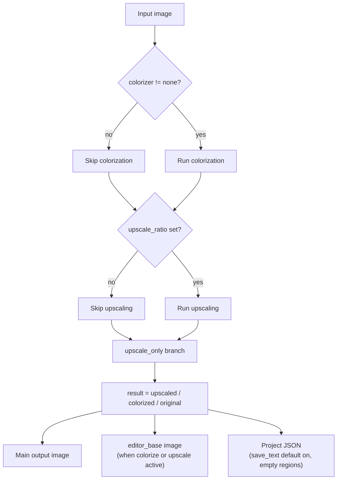

# Upscale Only

Use the Upscale Only workflow when you only need to enlarge images in bulk (for example, before manual cleanup, printing, or archiving) and do not need detection, OCR, translation, inpainting, or layout rendering. It sends each input image through the upscaler and writes the main output image directly, without producing translated text or entering the mask, inpainting, and rendering stages.

Upscale Only belongs to the same bypass family as Colorize Only and Inpaint Only: all of them skip the second half of the translation pipeline and differ only in which pre-stage they keep. The overall boundaries of the nine workflows are in [Output Directory and Workflow](../desktop/translation/output-directory-and-workflow.md), with a summary table in [Workflow Matrix](../reference/workflow-matrix.md); the upscaling model, ratio, and tiling parameters are described in [Upscaling and Colorization](../desktop/settings/upscale-and-colorization.md).

## Feature boundary

- Inputs: the main input images (the same file-discovery rules as normal translation: Add Files, Add Folder, or drag-and-drop; folders are searched recursively in natural sort order and directories named `manga_translator_work` are skipped).
- Stages executed: colorize (conditional) → upscale (conditional). Colorization runs first when `colorizer.colorizer` is not `none`; upscaling runs when `upscale.upscale_ratio` has a value.
- Stages skipped: detection, OCR, text-line merge, translation, mask refinement, inpainting, and layout rendering. The `upscale_only` branch clears `text_regions` so the translation and rendering branches are never entered.
- Output files: the main output image (its path is computed by the output-path rules, see Related Files and Formats); when either colorization or upscaling is active, the editor base image `manga_translator_work/editor_base/<original-filename>` is written as well.
- Workflow field: combo index 6 writes `cli.upscale_only=true` at runtime; GUI switching keeps the eight workflow booleans mutually exclusive.

Upscale Only does not force a ratio: `upscale_only=true` only decides which stages are skipped, while whether the image is actually enlarged is decided by `upscale_ratio`. When the ratio is empty, the output is the colorized result (if the colorizer is on) or the original image. The source code also does not turn colorization off in this mode, so the UI hint "only upscale images" is not fully consistent with the actual pre-colorization when a colorizer is enabled.

## UI operations

### Select the Upscale Only workflow

1. Open the translation page and choose “Upscale Only” (`Upscale Only`) in the “Translation Workflow Mode:” (`Translation Workflow Mode:`) combo box.
2. The page title becomes “Upscale Only” and the subtitle shows the hint: only upscale images, no detection, OCR, translation or rendering.
3. The start button becomes “Start Upscaling” (`Start Upscaling`); clicking it starts the backend task in this mode.

Selecting a mode only writes configuration and updates the UI texts; it does not start a task. Before starting, add the main input images (“Add Files...”, “Add Folder...”, or drag-and-drop) and, if needed, choose the upscaling model and ratio under “Settings → Mode Specific → Upscaling”; when the ratio stays at “Not Use”, this mode does not change the image.

| UI call key | English actual value | Simplified Chinese actual value |
| --- | --- | --- |
| `Translation Workflow Mode:` | Translation Workflow Mode: | 翻译流程模式： |
| `Upscale Only` | Upscale Only | 仅超分 |
| `Tip: Only upscale images, no detection, OCR, translation or rendering` | Tip: Only upscale images, no detection, OCR, translation or rendering | 提示：仅对图片进行超分处理，不进行检测、OCR、翻译和渲染 |
| `Start Upscaling` | Start Upscaling | 开始超分 |
| `label_upscaler` | Upscaling Model | 超分模型 |
| `label_upscale_ratio` | Upscale Ratio | 超分倍数 |
| `upscale_ratio_not_use` | Not Use | 不使用 |
| `label_tile_size` | Tile Size (0=No Split) | 分块大小(0=不分割) |
| `label_revert_upscaling` | Revert Upscaling | 还原超分 |
| `label_colorizer` | Colorization Model | 上色模型 |
| `label_overwrite` | Overwrite Existing Files | 覆盖已存在文件 |
| `label_save_text` | Editable Image | 图片可编辑 |
| `label_batch_concurrent` | Concurrent Batch Processing | 并发批量处理 |

## Option matrix

The combo box has no separate `userData`; the index is the mode value. Runtime code maps index 6 to `cli.upscale_only=true`. The stored values of the related settings are listed below, with the three UI evidence columns and their actual effect on this workflow.

| Stored value | English | Simplified Chinese | Effect in this workflow |
| --- | --- | --- | --- |
| `upscale_only=true` | Upscale Only | 仅超分 | Enters the upscale-only branch; skips detection, OCR, translation, inpainting, and rendering |
| `upscale_ratio=null` (“Not Use”) | Not Use | 不使用 | Does not upscale; the output is the original image or the pre-colorized result |
| `upscale_ratio=2/3/4` | 2 / 3 / 4 | 2 / 3 / 4 | Scales by the corresponding integer factor |
| `upscale_ratio=x2/x4/DAT2 x4` | x2 / x4 / DAT2 x4 | x2 / x4 / DAT2 x4 | MangaJaNai string tiers; also select the model name |
| `upscaler` | Upscaling Model | 超分模型 | Chooses waifu2x, ESRGAN, 4x UltraSharp, Real-CUGAN, or MangaJaNai |
| `tile_size=0` | Tile Size (0=No Split) | 分块大小(0=不分割) | 0 disables tiling; an empty value uses the runtime default 400; positive values process by tiles |
| `revert_upscaling=true` | Revert Upscaling | 还原超分 | Restores the input dimensions after upscaling (upscaling still runs) |
| `colorizer` (not `none`) | Colorization Model | 上色模型 | This mode does not turn colorization off; when enabled, colorization runs before upscaling |
| `overwrite=false` | Overwrite Existing Files | 覆盖已存在文件 | Skips images whose main output image already exists before starting |
| `save_text=true` | Editable Image | 图片可编辑 | GUI/release default on; the batch loop writes the project JSON back after upscaling |
| `batch_concurrent=true` | Concurrent Batch Processing | 并发批量处理 | This mode forces non-concurrent processing |

## Runtime behavior

### Processing branches and outputs

The desktop task enters the standard or high-quality batch loop through `translate_batch()`, and each image goes through `_translate_until_translation()` for conditional colorization and conditional upscaling. The `upscale_only` branch returns directly with `ctx.result = ctx.upscaled` after upscaling, so the subsequent detection, OCR, translation, and rendering stages are skipped as a whole.

The diagram shows the source-confirmed branches of Upscale Only, not a generic “config → algorithm → output” box: an empty ratio still outputs the colorized image or the original; the editor base image is written only when `colorizer != none` or `upscale_ratio` is set; and the project-JSON write depends on `cli.save_text`/`text_output_file` (see Dependencies and Conflicts) and is subject to sanitized runtime verification. This mode does not become a concurrent pipeline just because the UI still stores the concurrent setting.

## Dependencies and conflicts

- `upscale_only=true` does not force a ratio: when `upscale_ratio` is “Not Use” (`null`), the output is the colorized result or the original image; the UI hint and the actual code behavior are not fully consistent (the code does not turn colorization off).
- Pre-colorization: when `colorizer.colorizer` is not `none`, Upscale Only still runs colorization first, incurring model, VRAM, and API costs; with an empty ratio the output keeps that colorized result.
- `revert_upscaling` only restores the output size; it does not cancel upscaling. The image is enlarged and then downscaled, so upscaling computation still happens.
- `tile_size=0` only disables tiling; it does not disable upscaling. An empty value uses the runtime default 400.
- `cli.overwrite=false`: the GUI skips images whose main output image already exists before starting (the “normal mode” branch checks the output image).
- `cli.save_text`: the GUI/release default is `true`. The batch loop calls `_save_text_to_file` even when `text_regions` is empty, as long as `save_text` or `text_output_file` is enabled, so with default settings Upscale Only also writes a project JSON with empty `regions` (recording `upscale_ratio`, `upscaler`, and `last_export_dir`). The research matrix lists only the main image and the editor base image as outputs; actual file retention needs sanitized runtime verification.
- `batch_concurrent` is incompatible: both the desktop controller and `translate_batch()` treat Upscale Only as an incompatible mode and force non-concurrent processing.
- Manually combining multiple workflow fields is not a supported combination; GUI switching keeps the eight fields mutually exclusive, and core dispatch does not rely on stacked fields.
- The main output directory, `save_to_source_dir`, and `cli.format` determine the main output image location and extension; the JSON and editor base image always follow the per-image work-directory rules and are not affected by the output directory.
- This mode does not render, so it does not write `skip_text_replacements`; paint/stamp overlay layers in an existing JSON are preserved.

## Related files and formats

| File/format | Actual role on this page | Notes |
| --- | --- | --- |
| Main output image | Final image after upscaling/colorization | Located by `_calculate_output_path`: the output directory keeps the input folder's relative hierarchy; with `save_to_source_dir=true` it is written to the image-side `manga_translator_work/result/`; with `cli.format` empty or `none` the original extension is kept |
| `manga_translator_work/editor_base/<original-filename>` | Editor-only colorize/upscale base image | Written only when `colorizer != none` or `upscale_ratio` is set; the legacy same-named base in the work-directory root is still compatible |
| `manga_translator_work/json/<stem>_translations.json` | Project JSON (rewritten under default settings) | Contains empty `regions`, `upscale_ratio`/`upscaler`, and `last_export_dir`; the new location takes priority and falls back to the legacy image-side location |
| `config/config.json`, `config/config-example.json` | Source of `upscale`, `colorizer`, etc. | Only field boundaries are recorded; real user configuration is never shown |
| Verbose debug artifacts | Upscale Only does not run detection/OCR/translation/inpainting/rendering | Generic files such as `input.png` may still be written when verbose is on; see the full list in [Debug Artifact Index](../reference/debug-artifact-index.md) |

No real user configuration, keys, tokens, usernames, private absolute paths, user images, or task artifacts are shown on this page.

## Source evidence {#source-evidence}

| Layer | File | What was checked |
| --- | --- | --- |
| Workflow selection and writes | `desktop_qt_ui/ui/main_page/runtime.py:183-216` | Index 6 → `upscale_only=true`, eight-field mutual exclusion, and config saving |
| Title, hint, and start button | `desktop_qt_ui/ui/main_page/runtime.py:22-47,219-238` | “Upscale Only” title, hint call keys, and “Start Upscaling” button text |
| i18n | `desktop_qt_ui/locales/en_US.json`, `zh_CN.json` | Actual bilingual values for `Upscale Only`, `Start Upscaling`, the hint, and `label_*` |
| Controller | `desktop_qt_ui/app_logic.py:3125-3210,3212-3238,3240-3285` | Main-output overwrite check, workflow hint, and Upscale Only concurrency disabling |
| Core dispatch | `manga_translator/manga_translator.py:3399,3479-3503,4104-4106,4194-4207` | Special-mode mutual exclusion, skipping translation and rendering, and batch branches |
| Preprocessing and upscale-only branch | `manga_translator/manga_translator.py:4236-4366` | Conditional colorization, conditional upscaling, `upscale_only` early return, and editor base image |
| Output path | `manga_translator/manga_translator.py:540` | Main-output path computation, relative hierarchy, `save_to_source_dir`, and `cli.format` |
| Editor base image | `manga_translator/manga_translator.py:1079`, `manga_translator/utils/path_manager.py:102` | `_save_editor_base_if_needed` and the `editor_base` path |
| JSON rewrite | `manga_translator/manga_translator.py:713` | Empty `regions` still write JSON; `upscale_ratio`/`upscaler` recording |
| Input discovery | `desktop_qt_ui/services/file_service.py:31` | Supported extensions, recursion, natural sort, and work-directory exclusion |
| Config defaults | `desktop_qt_ui/core/config_models.py:111-115,133,142`, `manga_translator/config.py:250-260`, `config/config-example.json` | Qt/core/release default differences |

## Verification {#verification}

| Check | Status | Notes |
| --- | --- | --- |
| BLUEPRINT, PAGE_GUIDELINES, TODO | Complete | Read in full and followed the page contract; the three contract files were not modified |
| Source and research material | Complete | Cross-checked `workflow-matrix-source-evidence.md` and the UI, i18n, controller, and core sources |
| Three-column i18n evidence | Complete | The workflow option, hint, button, and related settings record the call key, English, and Simplified Chinese actual values |
| Route/page mirror | Pending | Run route mirror and source-evidence checks after completing the pages |
| Empty ratio / pre-colorization / JSON retention | Pending | Actual output files with an empty ratio, an enabled colorizer, and default `save_text` need sanitized runtime verification |
| Production build | Pending | Run `npm run docs:build --prefix doc/wiki` if needed |

- [ ] [In progress] Runtime confirmation remains: the actual output files and UI feedback for Upscale Only with an empty ratio, an enabled colorizer, and default `save_text`.