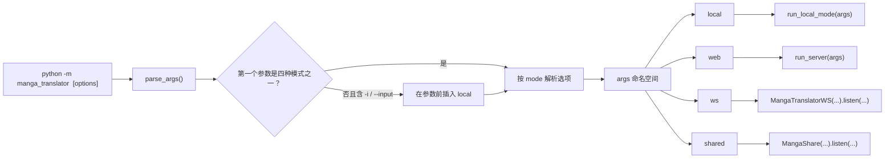
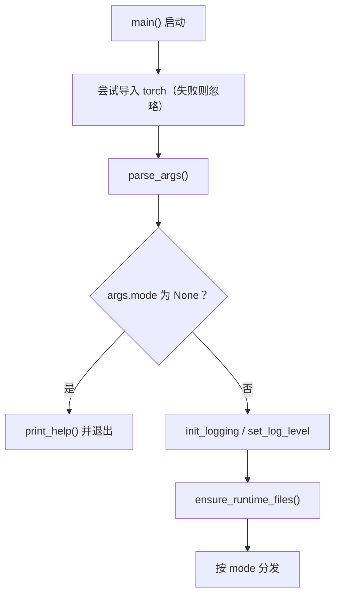

# 命令结构

当你不使用桌面界面、直接在终端中运行本工具时，先要知道正式入口和子命令。CLI 的正式入口只有一个：`python -m manga_translator <mode> [options]`；`parse_args()` 把命令行解析成同一个 `args` 命名空间，再按模式分发到 `local`、`web`、`ws`、`shared` 四条执行链。`--help` 由 `argparse` 自动提供，顶层帮助只列模式，选项要用 `<mode> --help` 查看。

本页只固定入口、子命令和 `--help` 契约。输入输出、配置覆盖、工作流、子进程内存、调试产物和三个服务模式的内部协议分别见[本地输入与输出](./local-input-output.md)、[配置覆盖](./configuration-overrides.md)、[工作流与文件模式](./workflow-and-file-modes.md)、[子进程内存与恢复](./subprocess-memory-and-recovery.md)、[输出、调试与退出码](./output-debugging-and-exit-codes.md)、[web/ws/shared 模式](./web-ws-and-shared-modes.md)。

## 功能边界 {#feature-boundary}

- 正式入口只有 `python -m manga_translator <mode> [options]`；在本仓库中，使用项目受管运行时的等价形式是 `uv run --no-sync python -m manga_translator <mode> [options]`。
- 顶层只注册 `local`、`web`、`ws`、`shared` 四个子命令；`local` 是唯一支持省略模式的快捷写法。
- `local` 是唯一带必填选项（`-i/--input`）的子命令，其余三个模式的选项都有默认值。
- 顶层没有可同时作用于四种模式的业务选项；`python -m manga_translator --help` 只列出模式和帮助选项。
- 本页不把独立模块入口（例如 `python -m manga_translator.mode.local`）或 `manga_translator/server/args.py` 的解析器当作正式顶层契约。

## 终端操作 {#terminal-operations}

### 查看顶层帮助 {#top-level-help}

在仓库根目录运行：

```powershell
uv run --no-sync python -m manga_translator --help
```

usage 显示为 `__main__.py [-h] {web,local,ws,shared} ...`；positional arguments 列出四个模式，options 只有 `-h, --help`。顶层使用默认 `argparse` formatter，不会把子命令的选项展开到根帮助中，也不会自动打印解析后的默认值。

### 查看子命令帮助 {#subcommand-help}

每个子命令都提供 `-h/--help`：

```powershell
uv run --no-sync python -m manga_translator local --help
uv run --no-sync python -m manga_translator web --help
uv run --no-sync python -m manga_translator ws --help
uv run --no-sync python -m manga_translator shared --help
```

`local` 还支持隐式省略模式：当第一个用户参数不是四个模式且参数列表含 `-i` 或 `--input` 时，解析器会在解析前插入 `local`。例如 `uv run --no-sync python -m manga_translator -i placeholder.png --help` 的 usage 会变成 `__main__.py local ...`；任意位置参数本身不会触发该回退。

### 桌面设置中的 CLI 分组 {#cli-settings-group}

CLI 选项不是图形界面控件，`--help` 文案是源码中的固定中文，不经过 i18n。但 CLI 覆盖的配置键与桌面设置“基础设置”（`Basic Settings`）分组里的行一一对应；该分组使用 `label_*` 和 `desc_cli_*` 两个 key 族显示文案，下列三列记录实际显示值：

| UI 调用 key | English 实际值 | 简体中文实际值 |
| --- | --- | --- |
| `label_verbose` | Verbose Logging | 详细日志 |
| `label_attempts` | Retry Attempts | 重试次数 |
| `label_ignore_errors` | Ignore Errors | 忽略错误 |
| `label_use_gpu` | Use GPU | 使用 GPU |
| `label_disable_onnx_gpu` | Disable ONNX GPU Acceleration | 禁用 ONNX GPU 加速 |
| `label_context_size` | Context Pages | 上下文页数 |
| `label_format` | Output Format | 输出格式 |
| `label_overwrite` | Overwrite Existing Files | 覆盖已存在文件 |
| `label_skip_no_text` | Skip Images Without Text | 跳过无文本图像 |
| `label_save_text` | Editable Image | 图片可编辑 |
| `label_load_text` | Import Translation | 导入翻译 |
| `label_translate_json_only` | Translate JSON Only | 仅翻译（JSON） |
| `label_template` | Export Original Text | 导出原文 |
| `label_save_quality` | Image Save Quality | 图像保存质量 |
| `label_batch_size` | Batch Size | 批量大小 |
| `label_batch_concurrent` | Concurrent Batch Processing | 并发批量处理 |
| `label_generate_and_export` | Export Translation | 导出翻译 |
| `label_export_editable_psd` | Export Editable PSD | 导出可编辑PSD |
| `label_save_to_source_dir` | Save to Source Directory | 输出到原图目录 |
| `label_psd_script_only` | Generate PSD Script Only | 仅生成PSD脚本 |

行描述文案的调用 key 为 `desc_cli_<name>`（设置行键是 `cli.<name>`，点号替换为下划线），例如 `desc_cli_attempts`（EN=“Retry count when an API call fails. Set to -1 for unlimited retries.”，ZH=“调用 API 出错时的重试次数。设为 -1 表示无限重试。”）。未列出的 `desc_cli_*` 可在两个 locale 中按同名 key 核对。

## 子命令与选项 {#subcommands-and-options}

### 顶层子命令 {#subcommand-overview}

顶层解析器只注册下列四个子命令。`__main__.py` 解析完成后把同一个 `args` 命名空间分发到相应执行链。

| 子命令 | 用途 | 顶层分发目标 | 默认网络端点（如适用） |
| --- | --- | --- | --- |
| `local` | 本地图片/文件夹翻译 | `mode.local.run_local_mode(args)` | 不监听端口 |
| `web` | HTTP API 和 Web 界面服务器 | `server.run_server(args)` | `0.0.0.0:8000`，可由 `MT_WEB_HOST` / `MT_WEB_PORT` 改写 |
| `ws` | 内部 WebSocket 后端 | `MangaTranslatorWS(...).listen(...)` | 本地监听 `127.0.0.1:5003`；上游地址 `ws://localhost:5000` |
| `shared` | 内部 shared/API 实例 | `MangaShare(...).listen(...)` | `127.0.0.1:5003` |



### local 选项 {#local-options}

| 选项 | 类型 / 默认值 | 实际 `--help` 和解析语义 |
| --- | --- | --- |
| `-i INPUT [INPUT ...]`, `--input INPUT [INPUT ...]` | 必填，1 个或多个字符串 | 输入图片或文件夹路径 |
| `-o OUTPUT`, `--output OUTPUT` | 字符串；`None` | 输出目录（默认：同目录加 `-translated` 后缀） |
| `--config CONFIG` | 字符串；`None` | 配置文件路径（默认：`config/config.json`） |
| `-v`, `--verbose` | 开关；`False` | 显示详细日志 |
| `--overwrite` | 开关；`False` | 覆盖已存在的文件 |
| `--use-gpu` | 开关；`None` | 使用 GPU 加速（覆盖配置文件） |
| `--disable-onnx-gpu` | 开关；`None` | 禁用 ONNX Runtime GPU 加速（覆盖配置文件） |
| `--format FORMAT` | 字符串；`None` | 输出格式：`png/jpg/jpeg/jfif/webp/avif/bmp/tiff/tif/heic/heif`（覆盖配置文件）；解析阶段不设置 `choices` |
| `--batch-size BATCH_SIZE` | 整数；`None` | 批量处理大小（覆盖配置文件） |
| `--attempts ATTEMPTS` | 整数；`None` | 翻译失败重试次数，`-1` 表示无限重试（覆盖配置文件） |
| `--subprocess` | 开关；`False` | 启用子进程模式（支持内存管理和断点续传） |
| `--memory-limit MEMORY_LIMIT` | 整数；`0` | 绝对内存限制（MB），超过后自动重启子进程；`0` 表示不限制 |
| `--memory-percent MEMORY_PERCENT` | 整数；`0` | 内存百分比限制，超过系统总内存的该百分比时重启；`0` 表示不限制 |
| `--batch-per-restart BATCH_PER_RESTART` | 整数；`0` | 每处理 N 张图片后重启子进程释放内存；`0` 表示不限制 |

非子进程路径会把显式的 `--use-gpu`、`--disable-onnx-gpu`、`--format`、`--batch-size`、`--attempts` 写入 `cli_config`（对应 `cli.*` 配置键）；`--memory-limit`、`--memory-percent`、`--batch-per-restart` 只在 `--subprocess` 路径传给 `translate_with_subprocess`。

### web 选项 {#web-options}

| 选项 | 类型 / 默认值 | 实际 `--help` 和解析语义 |
| --- | --- | --- |
| `--host HOST` | 字符串；`MT_WEB_HOST` 或 `0.0.0.0` | 服务器主机（环境变量：`MT_WEB_HOST`） |
| `--port PORT` | 整数；`MT_WEB_PORT` 或 `8000` | 服务器端口（环境变量：`MT_WEB_PORT`） |
| `--use-gpu` | 开关；`MT_USE_GPU` 为 `true`、`1`、`yes`、`on` 时为真 | 使用 GPU（环境变量：`MT_USE_GPU=true`） |
| `--disable-onnx-gpu` | 开关；`MT_DISABLE_ONNX_GPU` 采用同一真值规则 | 禁用 ONNX Runtime GPU 加速（环境变量：`MT_DISABLE_ONNX_GPU=true`） |
| `--models-ttl MODELS_TTL` | 整数；`MT_MODELS_TTL` 或 `0` | 上次使用后将模型保留在内存中的秒数；`0` 表示永远（环境变量：`MT_MODELS_TTL`） |
| `--retry-attempts RETRY_ATTEMPTS` | 整数；未设 `MT_RETRY_ATTEMPTS` 时为 `None` | 翻译失败重试次数；`-1` 表示无限重试，`None` 表示使用 API 传入的配置（环境变量：`MT_RETRY_ATTEMPTS`） |
| `-v`, `--verbose` | 开关；`MT_VERBOSE` 为 `true`、`1`、`yes` 时为真 | 显示详细日志（环境变量：`MT_VERBOSE=true`） |

### ws 选项 {#ws-options}

| 选项 | 类型 / 默认值 | 实际 `--help` 和解析语义 |
| --- | --- | --- |
| `--host HOST` | 字符串；`127.0.0.1` | WebSocket 服务的主机 |
| `--port PORT` | 整数；`5003` | WebSocket 服务的端口 |
| `--nonce NONCE` | 字符串；`None` | 用于保护内部 WebSocket 通信的 Nonce |
| `--ws-url WS_URL` | 字符串；`ws://localhost:5000` | WebSocket 模式的服务器 URL |
| `--models-ttl MODELS_TTL` | 整数；`0` | 上次使用后将模型保留在内存中的秒数；`0` 表示永远 |
| `--retry-attempts RETRY_ATTEMPTS` | 整数；`None` | 翻译失败重试次数；`-1` 表示无限重试，`None` 表示使用 API 传入的配置 |
| `-v`, `--verbose` | 开关；`False` | 显示详细日志 |
| `--use-gpu` | 开关；`False` | 使用 GPU |
| `--disable-onnx-gpu` | 开关；`MT_DISABLE_ONNX_GPU` 采用顶层真值规则 | 禁用 ONNX Runtime GPU 加速 |

### shared 选项 {#shared-options}

| 选项 | 类型 / 默认值 | 实际 `--help` 和解析语义 |
| --- | --- | --- |
| `--host HOST` | 字符串；`127.0.0.1` | API 服务的主机 |
| `--port PORT` | 整数；`5003` | API 服务的端口 |
| `--nonce NONCE` | 字符串；`None` | 用于保护内部 API 服务器通信的 Nonce |
| `--models-ttl MODELS_TTL` | 整数；`0` | 模型在内存中的 TTL（秒）；`0` 表示永远 |
| `--retry-attempts RETRY_ATTEMPTS` | 整数；`None` | 翻译失败重试次数；`-1` 表示无限重试，`None` 表示使用 API 传入的配置 |
| `-v`, `--verbose` | 开关；`False` | 显示详细日志 |
| `--use-gpu` | 开关；`False` | 使用 GPU |
| `--disable-onnx-gpu` | 开关；`MT_DISABLE_ONNX_GPU` 采用顶层真值规则 | 禁用 ONNX Runtime GPU 加速 |

## 运行机理 {#runtime-behavior}

### 参数解析与隐式 local {#parse-and-implicit-local}

`args.py#parse_args()` 先创建带四个子解析器的顶层解析器，再检查 `sys.argv`：第一个参数不是四种模式且参数列表含 `-i` 或 `--input` 时，在第一个参数前插入 `local`。解析完成后若 `args.mode` 仍为 `None`，打印顶层帮助并退出；否则返回 `args`。`__main__.py` 在解析前先尝试导入 `torch`（导入失败时忽略），因此缺少或 DLL 不兼容 PyTorch 的环境中，连 `--help` 也可能在解析前失败。



### 模式分发与共享初始化 {#dispatch-and-shared-init}

解析成功后，`__main__.py` 把 `args.disable_onnx_gpu` 统一导出为环境变量 `MT_DISABLE_ONNX_GPU=1`，初始化日志（`-v` 时为 DEBUG，否则 INFO），并在分发前调用 `ensure_runtime_files()` 统一释放外部配置表和 AI 提示词表。之后按 `args.mode` 分发：`local` 走 `asyncio.run(run_local_mode(args))`；`web` 走 `run_server(args)`；`ws` 构造 `MangaTranslatorWS(vars(args))` 并 `listen`；`shared` 构造 `MangaShare(vars(args))` 并 `listen`。`ws`/`shared` 的 host、port、nonce 与连接字段由 `vars(args)` 传入构造器，默认端点见[顶层子命令](#subcommand-overview)。`web` 各选项的默认值来自 `MT_*` 环境变量，在进程启动时求值，因此 `--help` 文本中的基准值（如 `0.0.0.0`、`8000`）不等于当次运行必然生效的值。

## 依赖与冲突 {#dependencies-and-conflicts}

- `python -m manga_translator.mode.local --help` 能返回 `0`，但这是独立模块入口，不属于正式顶层契约：它的解析器额外公开 `--resume`、`--concurrent`，没有顶层 `local` 的 GPU、ONNX、格式、批量大小和 attempts 选项，且内存参数默认值为 `8000`、`80`、`50` 而非 `0`、`0`、`0`。`__main__.py` 不调用这份解析器。
- `manga_translator/server/args.py` 的另一套 `parse_arguments()` 未接入顶层分发；`server/main.py` 的直接模块守卫还导入不存在的 `manga_translator.args.parse_arguments`（正式顶层定义的是 `parse_args`）。它不能替代正式 `web` 命令。
- `local` 的子进程路径只把 `--use-gpu`、`--disable-onnx-gpu` 写入 `cli_config`，再把原配置交给 `translate_with_subprocess`；`--subprocess` 与 `--format`、`--batch-size` 或 `--attempts` 组合时，“覆盖配置文件”的行为尚未进入该分支。这是源码差异，不是已完成的运行验证。
- 独立 `local.py` 解析器声明的 `--resume` 没有从 `run_local_mode()` 传给 `translate_with_subprocess(..., resume=...)`；其帮助存在不等于该恢复行为已经接通。
- `--memory-limit`、`--memory-percent`、`--batch-per-restart` 只在 `--subprocess` 路径消费；不启用子进程时这些值不参与翻译。
- `web` 选项的帮助文字写的是源码基准值；真实默认值可被启动时的 `MT_*` 环境变量改写，不能只从帮助文本反推当次运行的生效值。
- 完整服务启动、真实输入翻译、模型/API 依赖、端口占用和内部协议均不属于本页验证范围；它们由对应功能页和运行验证处理。

## 关联文件与格式 {#related-files-and-formats}

| 文件 | 本页实际作用 | 手改与兼容注意 |
| --- | --- | --- |
| `manga_translator/args.py` | 顶层四个子解析器、全部正式选项、默认值和隐式 `local` 规则 | 修改后必须重新运行各 `<mode> --help` 核对 |
| `manga_translator/__main__.py` | 解析前的 PyTorch 导入、日志初始化、`ensure_runtime_files()` 和四模式分发 | 新增模式需要同步修改 `args.py` 与分发逻辑 |
| `manga_translator/image_formats.py` | `local --format` 帮助列出的单一格式来源 `OUTPUT_IMAGE_FORMATS` | 支持格式变化时同步更新该文件 |
| `manga_translator/mode/local.py` | `run_local_mode()` 与 CLI 覆盖写入 | 非子进程/子进程两分支的覆盖行为不同 |
| `manga_translator/mode/subprocess_manager.py` | `translate_with_subprocess` 的内存参数与 `resume` 接口 | 正式 `local` 未传入 `resume` |
| `manga_translator/server/main.py` | `web` 分发的 `run_server` | 直接模块守卫的导入差异见依赖与冲突 |
| `manga_translator/mode/ws.py`、`manga_translator/mode/share.py` | `ws`、`shared` 的构造与 `listen` | 端口/协议细节见[web/ws/shared 模式](./web-ws-and-shared-modes.md) |
| `config/config-example.json` 等配置模板 | 被 CLI 覆盖的 `cli.*` 默认值来源 | 三类默认值差异见 `doc/wiki/research/default-sources.md` |

## Mermaid 数据流限制 {#mermaid-limits}

上面两张图描述的是源码中真实存在的解析分支与分发顺序，不代表本次验证启动了服务器、翻译了图片或发起了网络请求。`args.mode` 为 `None`、`-i` 缺失、独立模块入口和 `server/args.py` 都会走各自旁路；验证记录只覆盖 `--help` 阶段，不伪造运行截图或私有任务产物。

## 源码依据 {#source-evidence}

| 层级 | 文件 | 本页核对内容 |
| --- | --- | --- |
| 入口与分发 | `manga_translator/__main__.py` | 解析前的 PyTorch 导入、`parse_args()` 调用、`ensure_runtime_files()` 和四模式分发 |
| 参数解析 | `manga_translator/args.py` | 四个子解析器、全部正式选项、默认值、`_env_true` 真值规则和隐式 `local` |
| local 执行 | `manga_translator/mode/local.py` | `run_local_mode()`、CLI 覆盖写入、独立模块解析器差异 |
| 子进程 | `manga_translator/mode/subprocess_manager.py` | `translate_with_subprocess` 的内存参数与 `resume` 接口 |
| web 分发 | `manga_translator/server/main.py` | `run_server` 与直接模块守卫 |
| ws/shared | `manga_translator/mode/ws.py`、`manga_translator/mode/share.py` | 构造目标、`listen` 和连接字段 |
| 格式来源 | `manga_translator/image_formats.py` | `OUTPUT_IMAGE_FORMATS` 生成 `local --format` 帮助列表 |

## 验证记录 {#verification}

| 验证内容 | 状态 | 说明 |
| --- | --- | --- |
| BLUEPRINT、PAGE_GUIDELINES、TODO | 完成 | 已完整读取并按页面合同编写 |
| 实际 `--help` 输出 | 完成 | 本机运行 `uv run --no-sync python -m manga_translator --help` 及 `local`/`web`/`ws`/`shared --help`、`-i placeholder.png --help`，均退出 `0`，与 `research/cli-command-inventory.md` 一致；无参数时打印顶层帮助 |
| 源码核对 | 完成 | 静态核对 `args.py`、`__main__.py`、`mode/local.py`、`mode/subprocess_manager.py`、`server/main.py`、`mode/ws.py`、`mode/share.py`、`image_formats.py` |
| i18n 文案 | 完成 | `label_*` 与 `desc_cli_*` 逐项核对 `en_US.json` 与 `zh_CN.json` 实际值 |
| 脱敏运行验证 | 待后续 | 未启动服务器、未翻译真实图片、未读取 `.env`、API key/token、用户文件或私有提示词 |
| VitePress | 待运行 | 由协调代理在合并前运行 `npm run docs:build --prefix doc/wiki` 及镜像/源码检查 |
