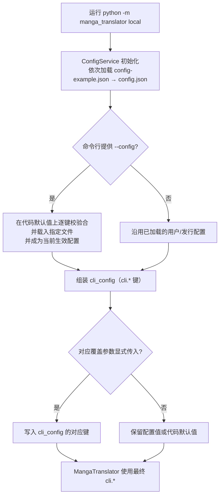
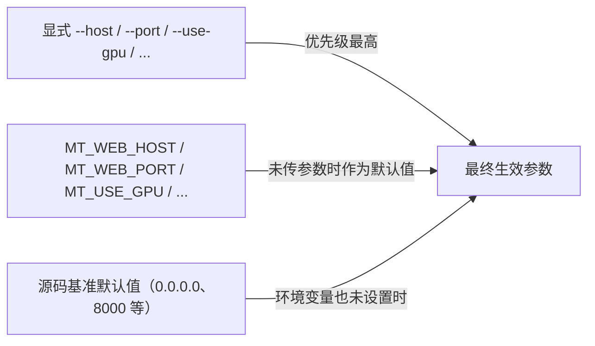
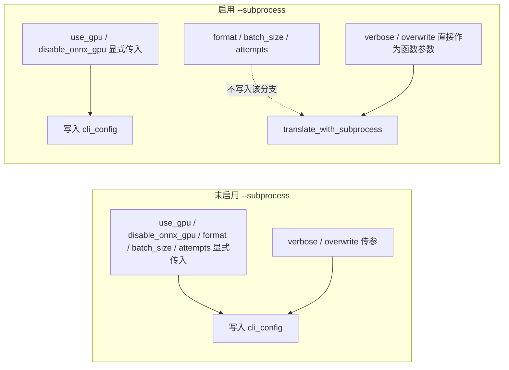

# CLI 配置覆盖

当你在命令行运行 `local` 模式，希望这次运行使用另一份配置文件，或临时调整几个参数而不编辑 `config/config.json` 时，使用本页介绍的三条途径：`--config` 选择配置文件，显式 CLI 参数覆盖配置文件中的 `cli.*` 值，`MT_*` 环境变量为 `web`/`ws`/`shared` 提供参数默认值。

本页只说明“配置从哪里读、谁覆盖谁”。命令结构见[命令结构](./command-structure.md)，输入输出见[本地输入输出](./local-input-output.md)，子进程与内存参数见[子进程、内存与恢复](./subprocess-memory-and-recovery.md)，服务模式启动见[Web/WS/Shared 模式](./web-ws-and-shared-modes.md)。

## 功能边界 {#feature-boundary}

- `--config` 只存在于 `local` 子命令；`web`、`ws`、`shared` 没有配置文件选项。
- 显式 CLI 参数只会覆盖配置文件中的 `cli.*` 键；未传值时保留配置文件或默认值，帮助文本所称“覆盖配置文件”只有在显式传参时才成立。
- `MT_*` 环境变量只参与 `web`/`ws`/`shared` 参数默认值的计算；`local` 模式没有 `MT_*` 参数默认值。
- CLI 覆盖只影响本次运行，不会把新值写回任何配置文件。
- API 密钥等凭据通过 `.env` 与 API 管理页解析，不属于本页的覆盖范围。

## 用 --config 指定配置文件 {#config-flag}

`local` 模式用 `--config` 指定本次运行的配置文件：

```powershell
uv run --no-sync python -m manga_translator local -i input.png --config path/to/my-config.json
```

`local --help` 中该选项的帮助原文为：`--config CONFIG` 配置文件路径（默认：config/config.json）。提供 `--config` 后，`run_local_mode` 会调用 `load_config_file()` 载入该文件；载入失败时打印“无法加载配置文件: {path}”并以退出码 `1` 结束。

### 配置文件加载链 {#config-load-chain}

`ConfigService` 初始化时按以下顺序逐键校验并深合并：

| 顺序 | 来源 | 说明 |
| --- | --- | --- |
| 1 | 用户配置 `config/config.json` | 优先加载，覆盖下面的默认配置 |
| 2 | 发行模板 `config/config-example.json` | 用户配置不存在时作为基底 |
| 3 | Qt 代码默认值 `AppSettings()` | 文件缺失或键无效时的兜底 |

提供 `--config` 时，指定文件会在代码默认值之上整体载入，并成为当前生效配置；之前已加载的用户 `config/config.json` 不再叠加到该文件之上。每个文件按键校验，无效键回退默认值并写入日志（最多打印前 5 个键）。

### 指定文件失败时 {#config-load-failure}

| 失败原因 | 命令行表现 |
| --- | --- |
| 文件不存在 | `load_config_file` 返回失败，打印“无法加载配置文件: {path}”，退出码 `1` |
| JSON 解析失败 | 同上 |
| 最终模型校验失败 | 回退默认配置并返回失败，命令行表现同上 |

## 参数覆盖优先级 {#override-priority}

生效优先级从高到低：

1. 显式 CLI 参数（只在显式传入时覆盖）。
2. 配置文件：`--config` 指定的文件 > 用户 `config/config.json` > 发行 `config/config-example.json`。
3. 代码默认值：Qt `AppSettings()` / 核心 `Config()`。

CLI 覆盖发生在翻译启动前的 `cli_config` 组装阶段，不改变文件内容。

### 哪些参数会覆盖配置 {#overridable-options}

| CLI 参数 | 写入的配置键 | 解析默认值 | 覆盖条件 |
| --- | --- | --- | --- |
| `--use-gpu` | `cli.use_gpu` | `None` | 显式传入时覆盖 |
| `--disable-onnx-gpu` | `cli.disable_onnx_gpu` | `None` | 显式传入时覆盖 |
| `--format` | `cli.format` | `None` | 显式传入时覆盖 |
| `--batch-size` | `cli.batch_size` | `None` | 显式传入时覆盖 |
| `--attempts` | `cli.attempts` | `None` | 显式传入时覆盖；`-1` 表示无限重试 |
| `-v` / `--verbose` | `cli.verbose` | `False` | 传参强制开启；不传沿用配置 |
| `--overwrite` | `cli.overwrite` | `False` | 传参强制开启；不传沿用配置 |

`-i/--input`、`-o/--output`、`--config`、`--subprocess`、`--memory-limit`、`--memory-percent`、`--batch-per-restart` 是本次运行的参数，不属于 `cli.*` 覆盖。

### 未传值不覆盖 {#explicit-only}

- `--use-gpu`、`--disable-onnx-gpu`、`--format`、`--batch-size`、`--attempts` 的解析默认值是 `None`，只有显式传入才会写入 `cli_config`；不传时保留配置文件或默认值。
- `-v` 与 `--overwrite` 是 `store_true` 开关，传参只会“开启”。若配置文件里 `cli.verbose` 或 `cli.overwrite` 为 `true`，不传参也会生效，命令行无法用“不传参”来关闭。
- `--format` 的帮助列出 `png/jpg/jpeg/jfif/webp/avif/bmp/tiff/tif/heic/heif`，但解析阶段不设置 `choices`；传入列表外的值会在后续保存阶段失败，而不是在解析阶段被拒绝。

### 子进程模式差异 {#subprocess-difference}

启用 `--subprocess` 后，`run_local_mode` 只把显式传入的 `--use-gpu`、`--disable-onnx-gpu` 写入 `cli_config`，再把配置交给 `translate_with_subprocess`；`--format`、`--batch-size`、`--attempts` 的“覆盖配置文件”行为没有进入该分支。`-v`/`--overwrite` 在子进程分支作为函数参数直接传入。这是源码差异，尚未做运行验证；不启用 `--subprocess` 时，上述五个覆盖参数才按帮助语义生效。

## 环境变量 {#environment-variables}

`args.py` 在创建解析器时读取进程环境变量作为参数默认值，argparse 只在未显式传参时使用它们：

| 环境变量 | 影响选项 | 默认值 | 适用模式 |
| --- | --- | --- | --- |
| `MT_WEB_HOST` | `--host` | `0.0.0.0` | `web` |
| `MT_WEB_PORT` | `--port` | `8000` | `web` |
| `MT_USE_GPU` | `--use-gpu` | `false` | `web` |
| `MT_DISABLE_ONNX_GPU` | `--disable-onnx-gpu` | `false` | `web`/`ws`/`shared` |
| `MT_MODELS_TTL` | `--models-ttl` | `0`（永久保留） | `web` |
| `MT_RETRY_ATTEMPTS` | `--retry-attempts` | 未设置时为 `None`（使用 API 传入配置） | `web` |
| `MT_VERBOSE` | `-v` / `--verbose` | `false` | `web` |

优先级为：显式 CLI 参数 > 环境变量 > 帮助/源码中的基准默认值。`MT_WEB_PORT`、`MT_MODELS_TTL`、`MT_RETRY_ATTEMPTS` 使用 `int()` 解析，非法值会在创建解析器时抛错。任意模式传入 `--disable-onnx-gpu` 后，`__main__.py` 会把 `MT_DISABLE_ONNX_GPU` 设为 `1` 再分发，保证运行时代码可见。

### 环境变量真值规则 {#env-truth-rule}

- `MT_USE_GPU`、`MT_DISABLE_ONNX_GPU` 使用统一的 `_env_true` 规则：值小写后属于 `true`、`1`、`yes`、`on` 即为真。
- `MT_VERBOSE` 使用内联判断：只认 `true`、`1`、`yes`，**不包含 `on`**。这是源码差异，需保留。

### 环境变量与 .env 的边界 {#env-dotenv-boundary}

- `local` 模式：`ConfigService` 初始化时以 `override=True` 读取项目根目录 `.env`（打包后位于可执行文件同级），主要用于 API 密钥等凭据，不参与 `cli.*` 覆盖。
- `web` 模式：`.env` 在 `server` 包导入时以 `override=False` 加载，晚于 `parse_args()` 计算 `MT_*` 默认值的时刻。因此只在 `.env` 中写 `MT_WEB_HOST`/`MT_WEB_PORT` 不会改变已经计算好的 `--host`/`--port` 默认值；应在启动进程的环境中设置，或改用显式参数。（源码结论，未做运行验证）
- `MT_WEB_NONCE` 不在 `args.py` 顶层默认值中，由服务器启动时读取，详见[Web/WS/Shared 模式](./web-ws-and-shared-modes.md)。

## 参数与选项 {#parameters-and-options}

命令行参数本身没有 i18n 条目，`--help` 文本在源码中固定为中文。下表列出这些参数写入的 `cli.*` 存储键对应的桌面设置界面文案（UI 调用 key 为 `label_*`）。每个 `cli.*` 参数的控件、生效阶段与最终消费者见[CLI 批量与输出参数](../desktop/settings/cli-batch-and-output.md)。

### 存储值 / English / 简体中文 {#option-matrix}

| 存储值 | English 实际值 | 简体中文实际值 |
| --- | --- | --- |
| `cli.use_gpu` | Use GPU | 使用 GPU |
| `cli.disable_onnx_gpu` | Disable ONNX GPU Acceleration | 禁用 ONNX GPU 加速 |
| `cli.format` | Output Format | 输出格式 |
| `cli.batch_size` | Batch Size | 批量大小 |
| `cli.attempts` | Retry Attempts | 重试次数 |
| `cli.verbose` | Verbose Logging | 详细日志 |
| `cli.overwrite` | Overwrite Existing Files | 覆盖已存在文件 |
| `cli.batch_concurrent` | Concurrent Batch Processing | 并发批量处理 |
| `cli.context_size` | Context Pages | 上下文页数 |
| `cli.save_quality` | Image Save Quality | 图像保存质量 |

### 三层默认值 {#default-layers}

| 存储键 | 核心 `Config()` | Qt `AppSettings()` | 发行 `config/config-example.json` |
| --- | --- | --- | --- |
| `cli.use_gpu` | `true` | `true` | `true` |
| `cli.disable_onnx_gpu` | `false` | `false` | `false` |
| `cli.format` | `None` | `"不指定"` | `"不指定"` |
| `cli.batch_size` | `1` | `1` | `3` |
| `cli.attempts` | `-1` | `-1` | `3` |
| `cli.verbose` | `false` | `false` | `false` |
| `cli.overwrite` | `false` | `true` | `true` |

## 覆盖优先级图示 {#priority-diagram}

下图回答“传或不传参数、给不给 `--config`，用户看到的 `cli.*` 值会怎么变”（`local` 非子进程路径）：



限制：该图只描述 `local` 非子进程路径；`--subprocess` 分支的覆盖范围见下。`-i`、`-o`、`--config` 和内存参数不是 `cli.*` 覆盖。

`web`/`ws`/`shared` 的参数默认值优先级：



限制：环境变量默认值在 `parse_args()` 阶段按进程环境计算一次；`.env` 加载发生在 web 服务导入时，晚于该阶段。

子进程与非子进程的覆盖差异：



限制：该图来自静态源码；子进程分支中 `--format`/`--batch-size`/`--attempts` 是否真的不生效尚未运行验证，帮助文本与源码存在差异。

## 依赖与冲突 {#dependencies-and-conflicts}

- `--config` 只存在于 `local`；`web`、`ws`、`shared` 没有配置文件参数。
- CLI 覆盖只影响本次运行，不回写 `config/config.json`；下次运行仍按文件内容加载。
- `cli.verbose`/`cli.overwrite` 为 `true` 时，不传 `-v`/`--overwrite` 也会生效；开关参数无法反向关闭配置中的开启值。
- `--use-gpu`/`--disable-onnx-gpu` 在 `local` 未传时是 `None`（不覆盖），与 `web` 模式由环境变量提供默认值的语义不同。
- `--attempts`（`local`）与 `--retry-attempts`（`web`）都接受 `-1` 表示无限重试，但分属不同子命令，默认值来源不同。
- 配置文件中的 `cli.batch_concurrent` 在特殊工作流下会被强制关闭（见[工作流与文件模式](./workflow-and-file-modes.md)）；正式 `local` 解析器没有 `--concurrent` 参数，无法通过 CLI 覆盖它。
- 本页不处理 API 密钥、`.env` 凭据解析和候选轮换；相关内容见 API 管理页与[翻译器选择](../desktop/translator/selection-and-languages.md)。

## 关联文件与格式 {#related-files-and-formats}

| 文件/格式 | 本页实际作用 | 手改与兼容注意 |
| --- | --- | --- |
| `config/config.json` | `--config` 未指定时的默认用户配置路径 | 不读取或展示真实用户文件；提交文档时不得包含私有绝对路径 |
| `config/config-example.json` | 发行默认模板，无用户配置时作为基底 | 只引用脱敏默认值 |
| `.env` | 凭据与部分 `MT_*` 运行时读取 | 不展示真实密钥；`local` 的 `cli.*` 覆盖不经过 `.env` |
| `config/custom_api_params.json` | 自定义 API 请求参数 | 与本页覆盖无关，见 API 管理页 |

## 源码依据 {#source-evidence}

| 层级 | 文件 | 本页核对内容 |
| --- | --- | --- |
| 参数解析 | `manga_translator/args.py` | 四个子命令；`local --config` 与覆盖参数默认 `None`；`web` 的 `MT_*` 环境变量默认值与真值规则 |
| 入口分发 | `manga_translator/__main__.py` | 解析前导入 `torch`、模式分发、`MT_DISABLE_ONNX_GPU` 环境变量导出 |
| 配置加载 | `desktop_qt_ui/services/config_service.py` | `.env` 加载、用户/发行/代码默认优先级、`load_config_file` 逐键校验合并与失败路径 |
| 覆盖应用 | `manga_translator/mode/local.py` | 非子进程与子进程分支的覆盖写入；`--config` 失败退出码 `1` |
| 配置模型 | `manga_translator/config.py`、`desktop_qt_ui/core/config_models.py` | `cli.*` 核心与 Qt 默认值 |
| 发行模板 | `config/config-example.json` | `cli.*` 发行默认值 |
| UI/i18n | `desktop_qt_ui/locales/en_US.json`、`zh_CN.json` | `label_*` 实际显示值 |
| 帮助验证 | `python -m manga_translator local --help`、`web --help` | 2026-08-07 实测，退出码 `0`，输出与解析器定义一致 |

## 验证记录 {#verification}

| 验证内容 | 状态 | 说明 |
| --- | --- | --- |
| BLUEPRINT、PAGE_GUIDELINES、TODO | 完成 | 已完整读取并按页面合同编写 |
| 参数解析与默认值 | 完成 | 静态核对 `args.py`，并用实际 `local --help` / `web --help` 复核 |
| 配置加载链与覆盖应用 | 完成 | 静态核对 `config_service.py` 与 `mode/local.py` 两个分支 |
| `en_US` / `zh_CN` 实际 locale | 完成 | `label_*` 键逐项记录 English 与简体中文实际值 |
| 脱敏运行验证 | 待后续 | 未读取真实 `.env`、用户 `config.json`、API key/token、用户名、用户图片或私有提示词；未实际运行翻译与子进程 |
| VitePress | 待运行 | 由协调代理在合并前运行 `npm run docs:build --prefix doc/wiki` 及镜像/源码检查 |

