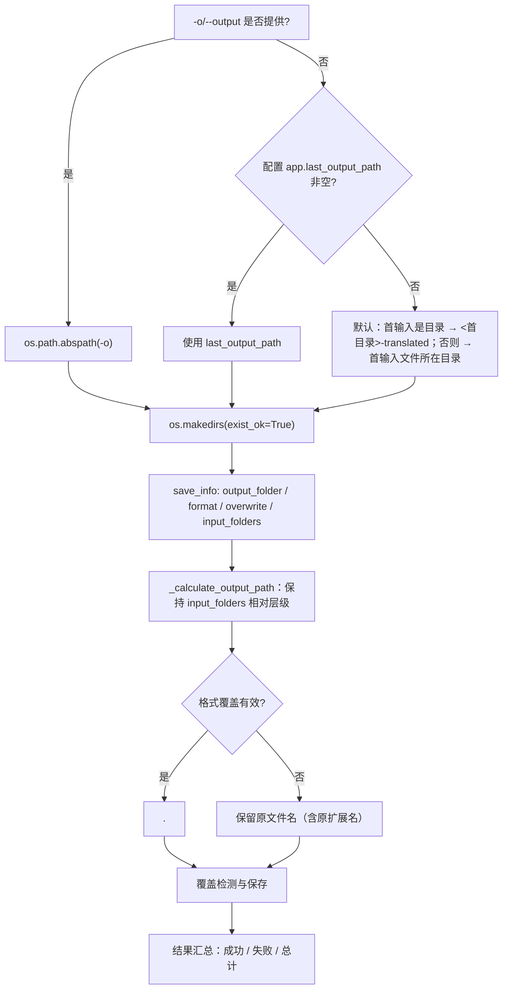

# 本地输入与输出

本页介绍 `local` 模式（本地图片/文件夹翻译）的输入与输出：`-i/--input` 接受哪些路径、`-o/--output` 如何决定输出目录、每张图片最终写到哪里，以及控制台如何汇总结果。它不覆盖翻译流水线内部算法（见检测、OCR、翻译、修复、排版各页），不覆盖 `--config` 与显式参数覆盖（见[配置覆盖](./configuration-overrides.md)），也不覆盖批量并发与子进程内存管理（见相应 CLI 页）。四个顶层子命令的结构见[命令结构](./command-structure.md)。桌面版的文件列表与输出目录控件见[文件列表与输入](../desktop/translation/file-list-and-input.md)与[输出目录与工作流](../desktop/translation/output-directory-and-workflow.md)。

## 功能边界 {#feature-boundary}

- `-i/--input` 是必填参数，接受一个或多个图片文件或文件夹；文件夹会递归扫描图片，并跳过名为 `manga_translator_work` 的工作目录。
- `-o/--output` 是可选的输出目录；未提供时按“`-o` → `app.last_output_path` → 默认规则”三级回退。
- 本页只写 `local` 的输入输出与结果汇总；GPU/ONNX、`--format`、`--batch-size`、`--attempts` 等显式覆盖见[配置覆盖](./configuration-overrides.md)。
- 控制台汇总行（成功/失败/总计）来自 `manga_translator/mode/local.py` 的硬编码输出，不属于 i18n 文案；页面中的三列表只记录与输入/输出共享概念的 UI 调用 key。

## UI 操作 {#ui-operations}

### 运行 local 命令 {#run-local-command}

正式入口（项目受管运行时）：

```powershell
uv run --no-sync python -m manga_translator local -i <输入图片或文件夹>... [-o <输出目录>] [选项]
```

1. 在 `-i` 后传入一个或多个路径：图片文件或文件夹。文件夹递归扫描受支持扩展名的图片。
2. 需要时用 `-o` 指定输出目录；省略时按默认规则推导（见[输出目录判定](#output-directory-resolution)）。
3. 要重新翻译已存在的输出文件时加 `--overwrite`；保持默认（按配置 `cli.overwrite`）则跳过已存在文件。
4. 第一个参数不是 `local/web/ws/shared` 且参数列表包含 `-i`/`--input` 时，解析器会隐式插入 `local`，因此 `python -m manga_translator -i page.png` 等价于显式 `local`。

### 与桌面界面共享的输入/输出文案 {#shared-input-output-copy}

`local` 自身的控制台行（例如 `📤 输出目录: ...`）是代码硬编码，不经过 locales；以下 key 来自桌面界面并涉及相同概念，逐项列出三列证据：

| UI 调用 key | English 实际值 | 简体中文实际值 |
| --- | --- | --- |
| `Add Files` | Add Files | 添加文件 |
| `Add Folder` | Add Folder | 添加文件夹 |
| `Input Files` | Input Files | 输入文件 |
| `Output Directory:` | Output Directory: | 输出目录: |
| `Select Output Directory` | Select Output Directory | 选择输出目录 |
| `Invalid Output Directory` | Invalid Output Directory | 输出目录不合法 |
| `label_last_output_path` | Last Output Path | 最后输出路径 |
| `label_format` | Output Format | 输出格式 |
| `label_overwrite` | Overwrite Existing Files | 覆盖已存在文件 |
| `label_batch_size` | Batch Size | 批量大小 |
| `label_verbose` | Verbose Logging | 详细日志 |
| `📁 Output directory: {dir}` | 📁 Output directory: {dir} | 📁 输出目录：{dir} |
| `💾 Files saved to: {dir}` | 💾 Files saved to: {dir} | 💾 文件已保存到：{dir} |

## 输入与输出选项 {#input-output-options}

| 选项 | 类型/默认值 | 存储/实际值 | 行为 |
| --- | --- | --- | --- |
| `-i INPUT [INPUT ...]` | 必填，1 个或多个字符串 | 命令行参数 | 输入图片或文件夹路径；文件夹递归、自然排序 |
| `-o OUTPUT` | 字符串；`None` | 命令行参数 | 输出目录；省略时按三级回退 |
| `--format FORMAT` | 字符串；`None` | `png/jpg/jpeg/jfif/webp/avif/bmp/tiff/tif/heic/heif` | 输出格式覆盖；`不指定`/空/`none` 保留原扩展名 |
| `--overwrite` | 开关；`False` | `True`/`False` | 覆盖已存在文件；关闭时跳过已存在输出 |
| `-v`/`--verbose` | 开关；`False` | `True`/`False` | 详细日志（DEBUG） |

支持的输入扩展名（唯一来源 `manga_translator/image_formats.py`）：

| 类别 | 扩展名 |
| --- | --- |
| 位图 | `.png` `.jpg` `.jpeg` `.jfif` `.bmp` `.tiff` `.tif` |
| Web/现代格式 | `.webp` `.avif` `.heic` `.heif` |

`local` 的文件夹扫描只收集图片扩展名；压缩包/文档（`.pdf/.epub/.cbz/.cbr/.zip`）不会作为 `local` 输入自动解包，这与桌面文件列表不同。

## 运行机理 {#runtime-behavior}

### 输入收集 {#input-collection}

1. 每个 `-i` 路径先转绝对路径：文件加入单独文件列表，目录加入文件夹列表。
2. 文件夹按自然排序，逐个调用 `get_image_files_from_folder(folder, recursive=True)` 递归扫描；扫描会跳过名为 `manga_translator_work` 的目录，目录与文件都按自然排序（`file2` 排在 `file10` 前）。
3. 单独文件按自然排序追加到文件夹文件之后，因此多个 `-i` 混合输入时，文件夹图片整体排在单独文件之前。
4. 逐个校验存在且是文件；找不到任何图片时打印“未找到图片文件”并退出（子进程模式返回非零）。

### 输出目录判定 {#output-directory-resolution}



图说明：这是源码确认的三级输出回退与逐图输出路径计算，不是通用“配置→算法→输出”占位图。`-o` 永远最高优先；`app.last_output_path` 是桌面保存的“最后输出路径”，CLI 未提供 `-o` 且该值非空时也会使用它。文件夹输入默认在首输入目录旁生成 `<目录名>-translated`；文件输入默认写到该文件所在目录。输出目录内按输入文件夹的相对层级保持目录结构（`<输出>/<文件夹名>/<相对路径>/<文件名>`）。

### 结果与汇总 {#results-and-summary}

- 每张图片打印 `✅ 完成: <文件名>` 或 `❌ 翻译失败: <文件名>`；`-v` 下额外打印错误详情。
- 结束时打印 `✅ 成功: N`、`❌ 失败: M`、`📊 总计: T` 与输出目录；非子进程路径还会列出输出目录文件数（`-v` 下列出前 10 个文件名和大小）。
- 非子进程路径在 `result/` 下写 `log_<时间戳>.txt`，`-v` 时日志级别为 DEBUG。
- 成功/取消返回码为 0；配置加载失败或未捕获异常返回 1。

## 依赖与冲突 {#dependencies-and-conflicts}

- 输入文件必须存在且可读，扩展名必须属于支持集合。文件夹递归跳过 `manga_translator_work`，不要把工作目录当作普通输入目录。
- 关闭覆盖时，输出文件已存在的图片会被跳过（计入“成功（跳过）”）；只有 `--overwrite` 或配置 `cli.overwrite=true` 才会重新翻译。
- 多个输入文件夹写入同一输出目录时按各自相对层级落盘；`input_folders` 只记录目录型输入。
- `cli.save_to_source_dir` 由桌面 `app_logic.py` 构造的 `save_info` 传入；`local` 的 `save_info` 只含 `output_folder/format/overwrite/input_folders`，因此 CLI 输出始终写入解析出的输出目录，不会跳到原图旁的 `manga_translator_work/result`。
- 特殊工作流（仅翻译 JSON、导出原文/翻译、替换翻译等）改变输入/输出文件类型，但逐图输出路径仍走 `_calculate_output_path`；详见[工作流](../workflows/translate-json-only.md)各页。

## 关联文件与格式 {#related-files-and-formats}

| 文件/目录 | 本页作用 | 注意事项 |
| --- | --- | --- |
| `config/config.json` | `app.last_output_path`、`cli.format`、`cli.overwrite` 来源 | 不展示真实用户配置与私有绝对路径 |
| `config/config-example.json` | 发行默认参考 | 与核心/Qt 默认不同（`format`/`overwrite` 等） |
| `result/log_<时间戳>.txt` | 非子进程路径的运行日志 | `-v` 时为 DEBUG；分享前脱敏 |
| `manga_translator_work/json/*_translations.json` | `cli.save_text` 开启时的项目数据 | 不复制用户内容 |
| `manga_translator_work/originals/`、`translations/` | 导出原文/译文 sidecar | 特殊工作流写入，文件名须与输入 `<stem>` 匹配 |

## 源码依据 {#source-evidence}

| 层级 | 文件 | 本页核对内容 |
| --- | --- | --- |
| 解析器 | `manga_translator/args.py` | `local` 子解析器、`-i` 必填、`-o` 默认 `None`、隐式 `local` 回退 |
| CLI 执行 | `manga_translator/mode/local.py` | 输入分类与自然排序、三级输出回退、`save_info`、覆盖预检、结果汇总 |
| 输入扫描 | `desktop_qt_ui/services/file_service.py` | 支持扩展名、递归扫描、自然排序、`manga_translator_work` 排除 |
| 输出路径 | `manga_translator/manga_translator.py` | `_calculate_output_path` 的相对层级与格式覆盖 |
| 格式/保存 | `manga_translator/image_formats.py`、`manga_translator/save.py` | 扩展名唯一来源、格式解析、保存质量 |
| 路径 | `manga_translator/utils/path_manager.py`、`manga_translator/runtime_paths.py` | 工作目录与 sidecar 路径 |
| i18n | `desktop_qt_ui/locales/en_US.json`、`zh_CN.json` | 输入/输出相关 UI key 的实际中英文 |

## 验证记录 {#verification}

| 验证内容 | 状态 | 说明 |
| --- | --- | --- |
| BLUEPRINT、PAGE_GUIDELINES、TODO | 完成 | 已完整读取并按页面合同编写 |
| `local --help` | 完成 | 实际运行 `uv run --no-sync python -m manga_translator local --help`，选项与本文一致 |
| i18n 三列 | 完成 | 逐项核对 `en_US.json`/`zh_CN.json` 实际值 |
| 输入/输出运行链 | 完成 | 静态核对 `args.py`、`mode/local.py`、`manga_translator.py`、`file_service.py`、`image_formats.py` |
| 脱敏运行验证 | 待后续 | 未运行真实翻译，未读取用户图片、配置、密钥或私有路径 |
| 静态检查 | 完成 | `verify-route-mirror.mjs` PASS、`verify-source-evidence.mjs` PASS |
