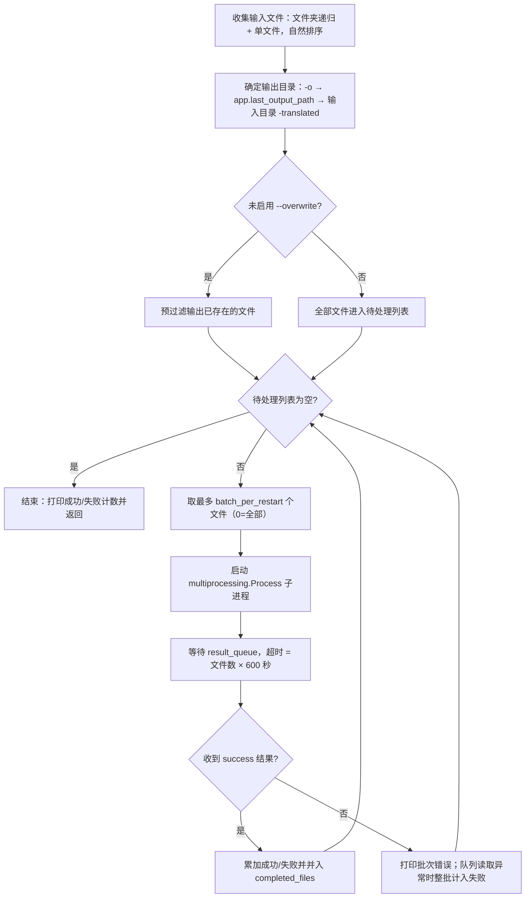
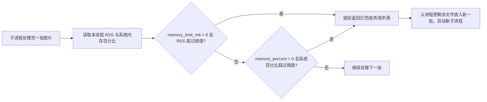

# CLI 子进程、内存与恢复

当一次要翻译大量图片、且长任务中模型与中间结果占用内存持续增长时，可以使用 `local` 子进程模式。`--subprocess` 让每个批次在一个独立子进程中运行，父进程只负责收集文件、分配批次和收集结果；达到 `--memory-limit`、`--memory-percent` 或 `--batch-per-restart` 阈值后，当前子进程提前结束，剩余文件由新子进程继续处理，已经完成的文件不会重复翻译。

本页只覆盖 `local --subprocess` 的子进程、内存限制与恢复机制。普通（非子进程）本地翻译见[本地输入与输出](./local-input-output.md)，命令结构与正式入口见[命令结构](./command-structure.md)，配置覆盖见[配置覆盖](./configuration-overrides.md)，输出与退出码见[输出、调试与退出码](./output-debugging-and-exit-codes.md)。

## 功能边界 {#feature-boundary}

- `--subprocess` 只改变 `local` 的执行路径：文件收集、输出目录和“跳过已存在”逻辑与普通模式一致，但翻译在 `multiprocessing.Process` 子进程中逐批进行。
- `--memory-limit`、`--memory-percent`、`--batch-per-restart` 只在启用 `--subprocess` 时被消费；普通 `local` 路径会忽略这三个参数。
- “恢复”在本页包含三层：同一次运行内内存超限后换新子进程继续；子进程异常时同一批文件自动重试；重新运行且未启用 `--overwrite` 时跳过输出已存在的文件。正式顶层 `local` 不提供可用的跨运行 `--resume` 选项，见[`--resume` 参数](#resume)。
- 本页不负责 `cli.attempts`（API 调用失败重试）、API 候选槽轮换（见 API 管理页面）、`cli.batch_size`/`cli.batch_concurrent`（批量并发，见[CLI 批量与输出](../desktop/settings/cli-batch-and-output.md)），以及 `web`/`ws`/`shared` 服务模式（见[Web、WS 与 Shared 模式](./web-ws-and-shared-modes.md)）。

## 命令行操作 {#command-line-operations}

### 启用子进程模式

在仓库根目录，用项目受管运行时调用：

```powershell
uv run --no-sync python -m manga_translator local -i ./manga_folder/ --subprocess
```

- `-i`/`--input` 必填，可给出多个；文件夹会递归收集图片，单个文件按名称自然排序后处理。
- `-o`/`--output` 指定输出目录；未指定时依次使用配置中的 `app.last_output_path`、输入文件夹加 `-translated` 后缀或首个输入文件所在目录。
- `--config` 指定配置文件；加载失败时打印错误并退出（码 1）。
- 未启用 `--overwrite` 时，父进程先预过滤输出已存在的文件，只有剩余文件进入子进程。

### 设置内存与重启阈值

- 只限制子进程自身内存，超过 4000 MB 就重启：`--memory-limit 4000`。
- 只限制系统内存占比，超过 85% 就重启：`--memory-percent 85`。
- 每 20 张重启一次子进程释放内存：`--batch-per-restart 20`。
- 同时设置绝对内存与每批张数：`--memory-limit 6000 --batch-per-restart 30`。

```powershell
uv run --no-sync python -m manga_translator local -i ./manga_folder/ --subprocess --memory-limit 4000
uv run --no-sync python -m manga_translator local -i ./manga_folder/ --subprocess --memory-percent 85
uv run --no-sync python -m manga_translator local -i ./manga_folder/ --subprocess --batch-per-restart 20
uv run --no-sync python -m manga_translator local -i ./manga_folder/ --subprocess --memory-limit 6000 --batch-per-restart 30
```

阈值语义与正式默认值见[参数与选项](#parameters-and-options)。绝对限制与百分比限制可以同时设置并都被检查，两者不是同一个指标。

### 控制台输出与界面文案

子进程模式的进度输出由 `manga_translator/mode/subprocess_manager.py` 直接 `print`，是写死在代码里的中文文案，不经过 `en_US.json`/`zh_CN.json` 本地化。例如启动时打印 `🚀 子进程翻译模式`、`📊 总文件数: N`，每批打印 `🔄 批次 k: 处理 N 个文件`，每张图处理后打印 `📊 进程内存: ... | 系统内存: ...%`（仅当 psutil 可用时）。这些日志不是界面文案，不应被当作需要翻译的 UI 字符串。

本页四个选项都是 CLI 专用参数，Qt 设置页没有对应控件，`en_US.json` 与 `zh_CN.json` 中也没有 `subprocess`/`memory` 相关 UI key。设置页中与批量、内存和模型卸载相关、确实有 locale key 的文案如下，完整参数文档见[CLI 批量与输出](../desktop/settings/cli-batch-and-output.md)：

| UI 调用 key | English 实际值 | 简体中文实际值 |
| --- | --- | --- |
| `label_batch_size` | Batch Size | 批量大小 |
| `label_batch_concurrent` | Concurrent Batch Processing | 并发批量处理 |
| `label_unload_models_after_translation` | Unload Models After Translation | 翻译完成后卸载模型 |
| `desc_app_unload_models_after_translation` | Unload all models after translation to free VRAM and memory. Good for low VRAM, but requires reloading for next translation. | 翻译完成后卸载所有模型以释放显存和内存。适合显存不足的场景，但下次翻译需要重新加载。 |
| `🚀 Starting translation (loading images in batches to save memory)...` | 🚀 Starting translation (loading images in batches to save memory)... | 🚀 开始翻译（按批次加载图片以节省内存）... |

## 参数与选项 {#parameters-and-options}

#### `--subprocess` — 子进程模式 / Subprocess mode {#subprocess}

- 控件：CLI 开关（`local` 子命令）。
- 所在界面：`python -m manga_translator local --help`。
- 存储值：布尔开关；帮助文本为“启用子进程模式（支持内存管理和断点续传）”。
- 可选值：`--subprocess`（启用）或不传（关闭，默认）。
- 默认值：正式 `args.py` 中为 `False`；`run_local_mode()` 用 `getattr(args, 'subprocess', False)` 读取。
- 生效阶段：`local` 分发到 `run_local_mode()` 后、翻译前切换执行分支。
- 原理：父进程收集文件并分批，把每批文件、配置、内存阈值与结果队列交给 `multiprocessing.Process` 运行 `worker_translate_batch`；子进程内重新加载 `MangaTranslator` 并逐张调用 `translate_batch`，见[运行机理](#runtime-behavior)。
- 依赖与冲突：Windows 冻结（PyInstaller）发行依赖 `multiprocessing.freeze_support()`；`--format`/`--batch-size`/`--attempts` 在子进程分支不会写入配置（源码差异，见[依赖与冲突](#dependencies-and-conflicts)）。
- 关联文件与调试产物：不额外生成文件；进度与统计直接打印到控制台。
- 源码依据：定义 `manga_translator/args.py`；分发 `manga_translator/mode/local.py`；实现 `manga_translator/mode/subprocess_manager.py`。
- 验证状态：完成（静态核对 `--help` 与源码）。

#### `--memory-limit MEMORY_LIMIT` — 绝对内存限制（MB）/ Absolute memory limit (MB) {#memory-limit}

- 控件：CLI 整数输入（`local` 子命令）。
- 所在界面：`python -m manga_translator local --help`。
- 存储值：整数（MB）。
- 可选值：正整数；`0` 表示不限制。
- 默认值：正式 `args.py` 为 `0`；`subprocess_manager.py` 函数签名常量 `DEFAULT_MEMORY_THRESHOLD_MB` 为 `0`；`manga_translator/mode/local.py` 独立解析器为 `8000`（不属于正式顶层契约，不可混用）。
- 生效阶段：子进程内每处理完一张图片后。
- 原理：worker 用 psutil 读取**本子进程**的 RSS，`RSS > 阈值` 时提前返回已完成列表，剩余文件交给新子进程。阈值判断是 `> 0`，因此负值与 `0` 一样表示不限制。
- 依赖与冲突：依赖 psutil，缺失时读取返回 `0`、检查被跳过；与 `--memory-percent` 可同时生效，但两者指标不同（自身 RSS vs 整机内存）。
- 关联文件与调试产物：无额外文件；超限前会打印 `⚠️ 进程内存超过限制`。
- 源码依据：定义 `manga_translator/args.py`；检查 `manga_translator/mode/subprocess_manager.py`。
- 验证状态：完成（静态核对；未做真实 OOM 运行验证）。

#### `--memory-percent MEMORY_PERCENT` — 系统内存百分比限制 / System memory percent limit {#memory-percent}

- 控件：CLI 整数输入（`local` 子命令）。
- 所在界面：`python -m manga_translator local --help`。
- 存储值：整数（百分比）。
- 可选值：正整数；`0` 表示不限制。
- 默认值：正式 `args.py` 为 `0`；`subprocess_manager.py` 模块常量 `DEFAULT_MEMORY_THRESHOLD_PERCENT` 为 `80`；`manga_translator/mode/local.py` 独立解析器为 `80`（不属于正式顶层契约）。
- 生效阶段：子进程内每处理完一张图片后。
- 原理：worker 读取**整机** `psutil.virtual_memory().percent`，超过阈值时提前返回。系统内存使用率超过 100 不可能，因此 `> 100` 的取值实际等于永不触发。
- 依赖与冲突：依赖 psutil；适合与其它程序共享内存的机器；不反映本子进程自身占用，不能替代 `--memory-limit`。
- 关联文件与调试产物：无额外文件；超限前打印 `⚠️ 系统内存超过限制`。
- 源码依据：定义 `manga_translator/args.py`；检查 `manga_translator/mode/subprocess_manager.py`。
- 验证状态：完成（静态核对；未做真实运行验证）。

#### `--batch-per-restart BATCH_PER_RESTART` — 每批重启张数 / Images per restart {#batch-per-restart}

- 控件：CLI 整数输入（`local` 子命令）。
- 所在界面：`python -m manga_translator local --help`。
- 存储值：整数（张）。
- 可选值：正整数；`0` 表示不按张数重启（一次处理全部待处理文件）。
- 默认值：正式 `args.py` 为 `0`；`subprocess_manager.py` 模块常量 `DEFAULT_BATCH_SIZE_PER_RESTART` 为 `50`；`manga_translator/mode/local.py` 独立解析器为 `50`（不属于正式顶层契约）。
- 生效阶段：父进程每次从待处理列表取一批文件时。
- 原理：父进程每轮最多把 `N` 个文件交给一个子进程；子进程正常结束或内存超限提前返回后，剩余文件进入下一轮。该值与 `cli.batch_size` 无关：后者是单次翻译请求包含的图片数（见[CLI 批量与输出](../desktop/settings/cli-batch-and-output.md)）。
- 依赖与冲突：`0` 且文件很多时，单个子进程处理全部文件，父进程等待结果队列的超时是“文件数 × 600 秒”，可能非常长。
- 关联文件与调试产物：无额外文件；每批启动前打印 `🔄 批次 k: 处理 N 个文件`。
- 源码依据：定义 `manga_translator/args.py`；调度循环 `manga_translator/mode/subprocess_manager.py`。
- 验证状态：完成（静态核对）。

#### `--resume` — 断点续传 / Resume {#resume}

- 控件：CLI 开关，**仅存在于** `manga_translator/mode/local.py` 的独立模块解析器。
- 所在界面：`python -m manga_translator.mode.local --help`（非正式顶层入口）。
- 存储值：布尔开关；帮助文本为“从上次中断的位置继续（需要配合 --subprocess 使用）”。
- 可选值：`--resume`（声明存在）或不传。
- 默认值：`False`；正式 `args.py` 的 `local` 解析器根本没有该选项。
- 生效阶段：无。`run_local_mode()` 从未把 `resume` 传给 `translate_with_subprocess(..., resume=...)`，帮助文本存在不等于行为已接通。
- 原理：正式顶层 `local` 的跨运行恢复实际靠“未启用 `--overwrite` 时跳过输出已存在文件”的预过滤实现；同一次运行内的断点由 `completed_files` 集合保证。
- 依赖与冲突：不要依赖 `--resume` 完成跨运行续传；需要重新翻译已存在文件时使用 `--overwrite`。
- 关联文件与调试产物：无。
- 源码依据：声明 `manga_translator/mode/local.py:78`；未转发 `manga_translator/mode/local.py:761`；下游接口 `manga_translator/mode/subprocess_manager.py`。
- 验证状态：完成（静态核对；结论与 `research/cli-command-inventory.md` 一致）。

## 运行机理 {#runtime-behavior}

### 父进程调度循环

`run_local_mode()` 的子进程分支把全部输入交给 `translate_with_subprocess()`。它维护一个 `completed_files` 集合作为本次运行的“断点”：每轮从待处理列表取出最多 `batch_per_restart` 个文件（`0` 表示全部），启动一个子进程，等待结果队列，把完成文件并入集合，再进入下一轮，直到没有待处理文件。



子进程内逐张调用 `translate_batch`：构造 `Config` 时只取 `render`/`upscale`/`translator`/`detector`/`colorizer`/`inpainter`/`ocr` 以及 `kernel_size`、`mask_dilation_offset`、`force_simple_sort` 等显式键；把 `cli.verbose`/`cli.overwrite` 写回配置，`font_family` 复制到顶层；每张图片处理完立即 `close()` 释放句柄。

### 内存检查与提前退出

worker 在每张图片处理完后读取“本进程 RSS”和“系统内存百分比”（都依赖 psutil），再独立检查两个阈值；任一超限就提前返回已完成的文件列表，不再处理剩余文件。父进程把剩余文件交给下一轮的新子进程，`restart_count` 加一。



- 显示规则：`--memory-limit > 0` 时只显示绝对阈值；否则 `--memory-percent > 0` 时显示百分比并换算约多少 MB；`--batch-per-restart > 0` 时显示每批张数。
- 两者都设时同时生效：`--memory-limit` 看子进程自身 RSS，`--memory-percent` 看整机内存使用率，不是同一指标。
- psutil 不可用时两个读取函数都返回 `0`，内存检查整段被跳过，只保留按张数重启。

### 失败与恢复

子进程与父进程之间通过 `multiprocessing.Queue` 传递结果。不同失败位置的恢复行为如下表（均为静态源码核对结论，未做真实故障运行验证）：

| 事件 | 父进程行为 | 对结果的影响 |
| --- | --- | --- |
| 子进程顶层异常（返回 error 结果） | 打印“批次错误”与 traceback（`-v` 时） | 不计入失败；同一批文件留在待处理列表，下一轮自动重试 |
| 结果队列读取超时或异常 | 打印“无法获取子进程结果”，`failed_count` 直接加上本批文件数 | 本批文件既计入失败、又因未进入 `completed_files` 而被下一轮重试，存在重复计数风险 |
| 单张图片在子进程内失败 | 计入 `failed_count`，不加入 `completed_files` | 该文件留在待处理列表并反复进入后续批次；失败可复现时可能陷入重复处理 |
| 子进程未在 30 秒内退出 | `terminate()`，5 秒后仍存活则 `kill()` | 已完成文件保留，未完成文件按上表规则进入下一轮 |
| 内存超限提前返回 | 正常收下 `success` 结果 | 已完成文件保留，剩余文件进入新子进程（批次数 +1） |
| 用户 Ctrl+C | 终止当前子进程，退出码 0 | 已落盘输出保留；重跑且未加 `--overwrite` 时跳过已存在文件 |

“断点续传”的准确含义：

- 同一次运行内：`completed_files` 保证内存超限或重启后已完成文件不会重复进入新批次。
- 跨运行：正式顶层 `local` 没有可用的 `--resume`；跨运行恢复实际靠“未启用 `--overwrite` 时跳过输出已存在文件”的预过滤实现。
- worker 中还有一个每 5 张触发一次的 torch/CUDA 检查块，当前源码里是空操作（不释放显存），仅作静态观察记录。

## 依赖与冲突 {#dependencies-and-conflicts}

- psutil 是可选的：缺失时 RSS 与系统内存读取都返回 `0`，内存限制静默失效，只剩按张数重启。
- 三层默认值不能混用：正式 `local` 的 `--memory-limit`/`--memory-percent`/`--batch-per-restart` 默认是 `0/0/0`；`subprocess_manager.py` 的函数签名常量是 `0/80/50`；`manga_translator/mode/local.py` 独立解析器是 `8000/80/50`。只有正式 `args.py` 的 `0/0/0` 属于顶层 `local --help` 契约。
- `--format`、`--batch-size`、`--attempts` 的帮助文本写着“覆盖配置文件”，但在子进程分支中只有 GPU/ONNX 覆盖会被写入 `cli_config`，这三个值不会进入 `translate_with_subprocess`。这是源码差异，不是已完成的运行验证。
- 子进程模式一次只运行一个子进程，没有并行；`cli.batch_concurrent` 不参与子进程调度。
- 内存限制针对的是 RAM（子进程 RSS / 整机内存），与 GPU 显存（VRAM）无关；显存不足问题见[模型、GPU 与内存](../troubleshooting/model-gpu-and-memory.md)。
- `app.unload_models_after_translation`（“翻译完成后卸载模型”）是桌面端翻译结束后的卸载开关，与这里的运行时阈值不同。
- 父进程等待结果队列的超时是“本批文件数 × 600 秒”，`--batch-per-restart 0` 且文件很多时等待可能极长。

## 关联文件与格式 {#related-files-and-formats}

| 文件/格式 | 本页实际作用 | 手改与兼容注意 |
| --- | --- | --- |
| `manga_translator/args.py` | 正式 `local` 的 `--subprocess` 与三个阈值参数定义 | 默认 `0/0/0`；不修改解析器会改变 `--help` 契约 |
| `manga_translator/mode/local.py` | 子进程分支：收集文件、输出目录、跳过预过滤、调用 `translate_with_subprocess` | 独立模块解析器的 `--resume`/`--concurrent` 与 `8000/80/50` 默认不属于正式入口 |
| `manga_translator/mode/subprocess_manager.py` | 工作函数、内存检查、批处理循环、队列超时、terminate/kill、`completed_files` | 模块常量只是函数签名默认值，不是 argparse 默认 |
| `manga_translator/__main__.py` | 顶层分发与 Ctrl+C/异常退出码 | 分发前会尝试导入 `torch` |
| `config/config.json` 与 `--config` 指定文件 | 子进程翻译的配置来源 | 只记录脱敏结构；不展示真实用户文件与私有路径 |
| `result/log_*.txt` | CLI 文件日志（本地模式共用） | 日志可能含路径与请求信息，分享前清理 |
| `psutil` | RSS 与系统内存百分比读取 | 缺失时内存检查静默跳过，不报错 |

## 源码依据 {#source-evidence}

| 层级 | 文件 | 本页核对内容 |
| --- | --- | --- |
| 参数定义 | `manga_translator/args.py` | `local` 子进程/内存四个选项、正式默认 `0/0/0` 与帮助文本 |
| 顶层分发 | `manga_translator/__main__.py` | 模式分发、`--help` 前导入 `torch`、Ctrl+C/异常退出码 |
| 子进程实现 | `manga_translator/mode/subprocess_manager.py` | 工作函数、内存检查、批处理循环、队列超时、terminate/kill、`completed_files` 断点 |
| 本地模式 | `manga_translator/mode/local.py` | 文件收集/自然排序、输出目录、跳过预过滤、GPU/ONNX 覆盖、`--format` 等未进入子进程分支 |
| 独立解析器 | `manga_translator/mode/local.py` | `--resume`/`--concurrent` 与 `8000/80/50` 仅存在于独立入口 |
| i18n | `desktop_qt_ui/locales/en_US.json`、`zh_CN.json` | 相关设置文案 key→English→简体中文；子进程选项无 UI key |
| 调查产物 | `doc/wiki/research/cli-command-inventory.md` | 正式 `--help` 清单与实际帮助验证记录 |

## 验证记录 {#verification}

| 验证内容 | 状态 | 说明 |
| --- | --- | --- |
| BLUEPRINT、PAGE_GUIDELINES、TODO | 完成 | 已完整读取并按页面合同编写；只处理本页 TODO |
| 正式 `--help` 核对 | 完成 | `uv run --no-sync python -m manga_translator local --help` 与参数表一致 |
| 子进程/内存/恢复静态追踪 | 完成 | 父进程调度、内存检查、失败分支与恢复路径逐行核对 |
| i18n 文案三列 | 完成 | 仅相关设置文案有真实 key；子进程选项如实标记为无 UI key |
| 脱敏运行验证 | 待后续 | 未实际翻译批量图片；OOM 重启、真实故障恢复与长任务行为未运行验证 |
| VitePress | 待运行 | 由协调代理在合并前运行 `npm run docs:build --prefix doc/wiki` 及镜像/源码检查 |