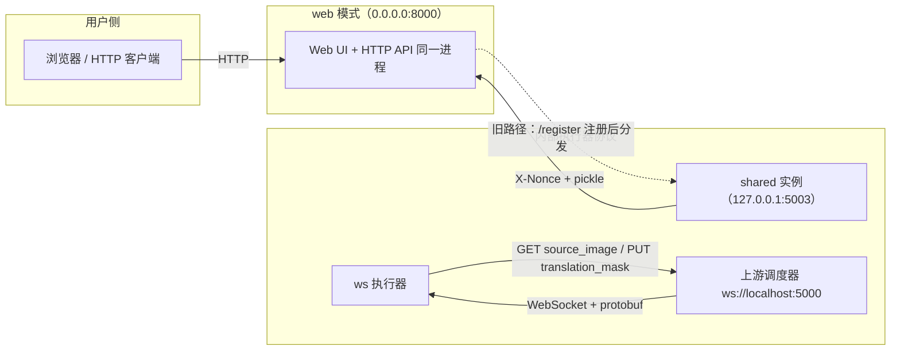
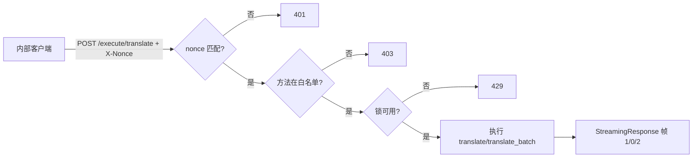
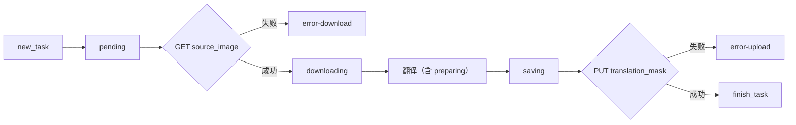

# Web、WS 与 Shared 模式

当需要把翻译能力作为服务暴露出去时，`local` 之外还有三个并列的服务子命令：`web` 提供浏览器界面和 HTTP API，`shared` 提供受 nonce 保护的内部执行器 API，`ws` 作为客户端连接上游 WebSocket 调度器处理任务。本页固定这三种模式的启动方式、默认端口和内部协议边界，并说明哪些端点属于用户/开发者接口、哪些绝不能直接暴露。

`local` 的输入输出见[本地输入与输出](./local-input-output.md)，`web` 的浏览器操作见[Web 启动与访问](../web/launch-and-access.md)，HTTP API 契约和内部协议细节见开发者页面。

## 功能边界 {#feature-boundary}

- `web` 是唯一面向用户和开发者 HTTP 客户端的服务：同一进程提供 `GET /` 主工作区、`GET /admin` 管理界面、`/static/*` 静态资源和全部 JSON/表单/流式 API。默认监听 `0.0.0.0:8000`，可用 `MT_WEB_HOST`/`MT_WEB_PORT` 或 `--host`/`--port` 覆盖。
- `shared` 是内部 shared/API 实例：默认 `127.0.0.1:5003`，只暴露三个受控端点，用 `X-Nonce` 头保护，返回 pickle 序列化结果。浏览器不直接访问。
- `ws` 是内部 WebSocket 执行器：默认连接上游 `ws://localhost:5000`，用 `x-secret` 头认证，接收 protobuf 任务并回传状态。解析器虽然为它声明了 `--host 127.0.0.1 --port 5003`，但当前实现不消费这两个字段。
- 三种模式互不占用默认端口：web 是 `8000`，shared/ws 的解析器默认是 `5003`，ws 的实际连接目标是 `ws://localhost:5000` 上游。不要把 `5000`、`5003`、`8000` 混写。
- CLI 选项是源码中的固定中文帮助文案，不经过 i18n；与桌面设置共享的 GPU/ONNX/重试/日志开关映射到 `label_*` key（见下文三列表）。

## 三种模式与端口 {#modes-and-ports}

| 模式 | 默认端点 | 角色 | 谁可以访问 |
| --- | --- | --- | --- |
| `web` | 监听 `0.0.0.0:8000`（`MT_WEB_HOST`/`MT_WEB_PORT` 或 `--host`/`--port` 可覆盖） | HTTP API + Web 界面 | 浏览器用户、HTTP API 客户端 |
| `shared` | 监听 `127.0.0.1:5003` | 内部 shared/API 实例 | 持有 nonce 的内部客户端 |
| `ws` | 不绑定监听端口；解析器默认 `127.0.0.1:5003`；连接上游 `ws://localhost:5000` | 内部 WebSocket 执行器 | 上游 WebSocket 调度器 |



说明：shared 执行器分发是源码中保留的旧路径，当前 `run_server()` 强制 `args.start_instance=False`，web 模式不会自动拉起独立 shared 实例；`ws` 模式只作为客户端连向上游。

## 终端操作 {#terminal-operations}

### 启动 web 模式 {#start-web-mode}

```powershell
uv run --no-sync python -m manga_translator web
```

等价于 `--host 0.0.0.0 --port 8000`。启动后浏览器访问 `http://127.0.0.1:8000`（或服务器 LAN 地址）；`0.0.0.0` 表示监听所有网卡，默认对外暴露。完整启动步骤、Docker 和网络注意事项见[Web 启动与访问](../web/launch-and-access.md)。

### 启动 shared 模式 {#start-shared-mode}

```powershell
uv run --no-sync python -m manga_translator shared --host 127.0.0.1 --port 5003 --nonce <nonce>
```

把 `<nonce>` 换成调用方协商好的值；设置 nonce 后，所有 `/simple_execute/*` 和 `/execute/*` 请求必须带匹配的 `X-Nonce` 请求头，否则返回 `401`。

### 启动 ws 模式 {#start-ws-mode}

```powershell
uv run --no-sync python -m manga_translator ws --ws-url ws://localhost:5000
```

当前仓库缺少 `manga_translator/server/ws_pb2.py`（protobuf 生成模块），`listen()` 中的 `from ..server import ws_pb2` 会直接 `ImportError`，因此 `ws` 模式目前无法实际启动；`ws --help` 不受影响。这是源码差异，不是已验证的运行行为。

## 参数与选项 {#options}

选项默认值来自 `manga_translator/args.py`；web 模式中的 `MT_*` 环境变量在进程启动时求值，优先级高于帮助文本里的基准值。

### web 选项 {#web-options}

| 选项 | 类型 / 默认值 | 实际 `--help` 和解析语义 |
| --- | --- | --- |
| `--host HOST` | 字符串；`MT_WEB_HOST` 或 `0.0.0.0` | 服务器主机 |
| `--port PORT` | 整数；`MT_WEB_PORT` 或 `8000` | 服务器端口 |
| `--use-gpu` | 开关；`MT_USE_GPU` 为 `true`/`1`/`yes`/`on` 时为真 | 使用 GPU |
| `--disable-onnx-gpu` | 开关；`MT_DISABLE_ONNX_GPU` 采用同一真值规则 | 禁用 ONNX Runtime GPU |
| `--models-ttl MODELS_TTL` | 整数；`MT_MODELS_TTL` 或 `0` | 上次使用后保留模型的秒数；`0` 表示永久 |
| `--retry-attempts RETRY_ATTEMPTS` | 整数；未设 `MT_RETRY_ATTEMPTS` 时为 `None` | 请求失败重试次数；`-1` 无限；`None` 使用 API 传入配置 |
| `-v`, `--verbose` | 开关；`MT_VERBOSE` 为 `true`/`1`/`yes` 时为真 | 显示详细日志 |

### shared 选项 {#shared-options}

| 选项 | 类型 / 默认值 | 实际 `--help` 和解析语义 |
| --- | --- | --- |
| `--host HOST` | 字符串；`127.0.0.1` | API 服务主机 |
| `--port PORT` | 整数；`5003` | API 服务端口 |
| `--nonce NONCE` | 字符串；`None` | 保护内部 API 通信的 nonce；设置后客户端必须带 `X-Nonce` 头 |
| `--models-ttl MODELS_TTL` | 整数；`0` | 模型在内存中的 TTL（秒）；`0` 表示永久 |
| `--retry-attempts RETRY_ATTEMPTS` | 整数；`None` | 翻译失败重试次数；`-1` 无限；`None` 使用 API 传入配置 |
| `-v`, `--verbose` | 开关；`False` | 显示详细日志 |
| `--use-gpu` | 开关；`False` | 使用 GPU |
| `--disable-onnx-gpu` | 开关；`MT_DISABLE_ONNX_GPU` 采用顶层真值规则 | 禁用 ONNX Runtime GPU |

### ws 选项 {#ws-options}

| 选项 | 类型 / 默认值 | 实际 `--help` 和解析语义 |
| --- | --- | --- |
| `--host HOST` | 字符串；`127.0.0.1` | 解析器默认；当前 `MangaTranslatorWS` 不消费该值 |
| `--port PORT` | 整数；`5003` | 解析器默认；当前 `MangaTranslatorWS` 不消费该值 |
| `--nonce NONCE` | 字符串；`None` | 解析器默认；当前实现不使用，密钥来自 `WS_SECRET` 环境变量或 `ws_secret` 参数 |
| `--ws-url WS_URL` | 字符串；`ws://localhost:5000` | 上游 WebSocket 服务器 URL（实际连接目标） |
| `--models-ttl MODELS_TTL` | 整数；`0` | 模型在内存中的 TTL（秒）；`0` 表示永久 |
| `--retry-attempts RETRY_ATTEMPTS` | 整数；`None` | 翻译失败重试次数；`-1` 无限；`None` 使用 API 传入配置 |
| `-v`, `--verbose` | 开关；`False` | 显示详细日志 |
| `--use-gpu` | 开关；`False` | 使用 GPU |
| `--disable-onnx-gpu` | 开关；`MT_DISABLE_ONNX_GPU` 采用顶层真值规则 | 禁用 ONNX Runtime GPU |

### 与桌面设置对应的文案 {#ui-copy}

CLI 选项本身是源码固定中文，不经过 i18n；与这些服务选项共享同一配置键的桌面“基础设置”行使用 `label_*` key，三列实际显示值如下（`--models-ttl` 与 `--retry-attempts` 在桌面没有独立行）：

| UI 调用 key | English 实际值 | 简体中文实际值 |
| --- | --- | --- |
| `label_use_gpu` | Use GPU | 使用 GPU |
| `label_disable_onnx_gpu` | Disable ONNX GPU Acceleration | 禁用 ONNX GPU 加速 |
| `label_attempts` | Retry Attempts | 重试次数 |
| `label_verbose` | Verbose Logging | 详细日志 |

## 运行机理 {#runtime-behavior}

### web 模式 {#web-runtime}

`__main__.py` 把 `web` 分发给 `server.run_server(args)`：读取应用目录 `.env`、初始化服务器配置和数据目录，再以 `args.host`/`args.port` 启动 Uvicorn（`timeout_keep_alive=1800`，优雅关闭超时 30 秒）。启动时生成内部 nonce（`MT_WEB_NONCE` 或 `secrets.token_hex(16)`）并在日志打印。翻译任务在当前进程内通过 `request_extraction.py` 的 `_run_translate_sync`/`_run_translate_batch_sync` 在翻译线程中执行；源码保留 shared 执行器注册/分发旧路径，但 `run_server()` 强制 `args.start_instance=False`，不会自动拉起独立 shared 实例，外部实例可通过 `POST /register`（带 `X-Nonce`）注册。

### shared 内部协议 {#shared-protocol}

`MangaShare` 包装一个 `MangaTranslator`，用 FastAPI 暴露三个端点：

| 端点 | 行为 |
| --- | --- |
| `GET /is_locked` | 返回 `{"locked": true/false}` |
| `POST /simple_execute/{method_name}` | 同步执行，成功返回 pickle 字节流；失败返回 4xx/5xx |
| `POST /execute/{method_name}` | 流式执行，返回 `application/octet-stream`，帧格式为 1 字节状态 + 4 字节大端长度 + 载荷 |

所有执行端点在处理前依次做：nonce 校验（设置 nonce 后 `X-Nonce` 必须匹配，否则 `401`）、方法白名单（只允许 `translate`、`translate_batch`，否则 `403`）、方法存在性（`404`）、非阻塞锁（忙时 `429`）。请求 JSON 中图片是 PNG base64，配置是 `Config.model_dump(mode="json")`；非法图片/配置/批量请求分别返回 `422`。流式帧状态：`0` 结果（pickle）、`1` 进度（UTF-8 状态串）、`2` 错误。结果对象带 `use_placeholder` 时，只传一个 1×1 白色占位图片，避免传输大图。



### ws 内部协议 {#ws-protocol}

`MangaTranslatorWS` 继承 `MangaTranslator`，`listen()` 以客户端身份连接 `--ws-url` 上游：`websockets.connect(url, extra_headers={'x-secret': secret}, max_size=1_000_000)`。secret 来自 `ws_secret` 参数或 `WS_SECRET` 环境变量（默认为空串）。消息是 `ws_pb2.WebSocketMessage` protobuf：上游发来 `new_task`（含任务 id、`source_image`、`translation_mask` 和翻译参数），执行器回发 `status` 和 `finish_task`。

单任务流程：`pending` → HTTP GET `source_image` 下载（失败发 `error-download`）→ `downloading` → 翻译 → `preparing` → `saving`（结果转 PNG，verbose 时另存 `result/<id>/ws_final.png`）→ `uploading` → HTTP PUT `translation_mask` 上传（失败发 `error-upload`）→ `finish_task(success, has_translation_mask)`。状态帧用 0.2 秒节流器合并发送，任务用 `PriorityLock` 调度；图片长宽超过 1200 像素时强制 `upscale_ratio=1`。Windows 上会先调用 `WSAStartup` 并设置 `ProactorEventLoopPolicy`。



## 依赖与冲突 {#dependencies-and-conflicts}

- 端口边界：web 默认 `8000`，shared/ws 解析器默认 `5003`，ws 连接目标是 `ws://localhost:5000`；三者不互相覆盖。端口被占用时启动失败，属环境问题。
- `ws --host/--port/--nonce` 在解析器中存在，但 `MangaTranslatorWS` 当前不消费这些字段；不要根据帮助文本推断 ws 会监听 `5003`。
- 当前仓库缺少 `ws_pb2.py`，`ws` 模式无法启动；这是源码差异，不是运行验证结论。
- shared/ws 是内部协议：不要用浏览器直接访问，不要暴露到公网；nonce/secret 和 pickle 反序列化都有安全风险，日志里打印的 nonce 不得复制进公开报告。
- 本页不读取或展示真实 `.env`、`WS_SECRET`、nonce、API key、令牌、用户名或私有路径。

## 关联文件与格式 {#related-files-and-formats}

| 文件/格式 | 本页实际作用 | 注意 |
| --- | --- | --- |
| `manga_translator/args.py` | 三个服务子命令的正式选项与默认值 | `server/args.py` 的独立解析器不是正式入口 |
| `manga_translator/__main__.py` | 模式分发：`web`→`run_server`，`ws`→`MangaTranslatorWS`，`shared`→`MangaShare` | 解析参数前导入 torch |
| `manga_translator/mode/share.py` | shared 实例端点、nonce、锁和 pickle 帧 | `X-Nonce` 头、方法白名单 |
| `manga_translator/mode/ws.py` | ws 执行器、上游连接、protobuf 任务与状态 | `ws_pb2` 模块缺失 |
| `manga_translator/server/main.py` | web 启动、nonce、`/register`、`start_instance` | 强制 `start_instance=False` |
| `manga_translator/server/instance.py`、`sent_data_internal.py` | shared 客户端调用与帧解析 | 图片 PNG base64、pickle 往返 |
| `manga_translator/server/request_extraction.py` | web 进程内翻译执行 | `_run_translate_sync`/`_run_translate_batch_sync` |
| `desktop_qt_ui/locales/en_US.json`、`zh_CN.json`、`data/i18n.generated.json` | 桌面设置 `label_*` 实际中英文 | 不包含真实密钥 |

## 源码依据 {#source-evidence}

| 层级 | 文件 | 本页核对内容 |
| --- | --- | --- |
| 参数与默认值 | `manga_translator/args.py` | `web`/`ws`/`shared` 子解析器、默认端点、`MT_*` 环境变量 |
| 模式分发 | `manga_translator/__main__.py` | 四个模式分发到 `run_server`/`MangaTranslatorWS`/`MangaShare` |
| shared 服务 | `manga_translator/mode/share.py` | `/is_locked`、`/simple_execute/*`、`/execute/*`、nonce、锁、pickle 与帧格式 |
| ws 执行器 | `manga_translator/mode/ws.py` | 上游 `ws_url`、`x-secret`、protobuf 任务/状态、下载上传、节流与锁 |
| web 服务 | `manga_translator/server/main.py` | Uvicorn 启动、nonce、`/register`、`args.start_instance=False` |
| shared 客户端 | `manga_translator/server/instance.py`、`sent_data_internal.py` | 端到端调用、base64 图片、pickle、流帧解析 |
| 进程内执行 | `manga_translator/server/request_extraction.py` | `_run_translate_sync`/`_run_translate_batch_sync` 翻译线程 |
| i18n | `desktop_qt_ui/locales/en_US.json`、`zh_CN.json`、`doc/wiki/data/i18n.generated.json` | `label_use_gpu` 等 key 的实际中英文 |
| 调查基线 | `doc/wiki/research/cli-command-inventory.md`、`phase0-web-user-http.md` | `--help` 退出码与端口/协议边界 |

## 验证记录 {#verification}

| 验证内容 | 状态 | 说明 |
| --- | --- | --- |
| BLUEPRINT、PAGE_GUIDELINES、TODO | 完成 | 已完整读取并按页面合同编写 |
| `local/web/ws/shared` 与 `--help` | 完成 | 静态核对 `args.py` 与 `research/cli-command-inventory.md` 的实际帮助输出 |
| 端口区分 | 完成 | web `0.0.0.0:8000`、shared `127.0.0.1:5003`、ws 上游 `ws://localhost:5000` 已逐项区分 |
| shared/ws 内部协议 | 完成 | 静态核对 `mode/share.py`、`mode/ws.py`、`instance.py`、`sent_data_internal.py` |
| `en_US` / `zh_CN` 实际 locale | 完成 | 三列表逐项记录 key 与实际显示值 |
| 脱敏运行验证 | 待后续 | 未读取真实 `.env`、nonce/secret、API key/token、用户名或私有内容；未启动服务或截图 |
| VitePress | 待运行 | 由协调代理在合并前运行 `npm run docs:build --prefix doc/wiki` 及镜像/源码检查 |
