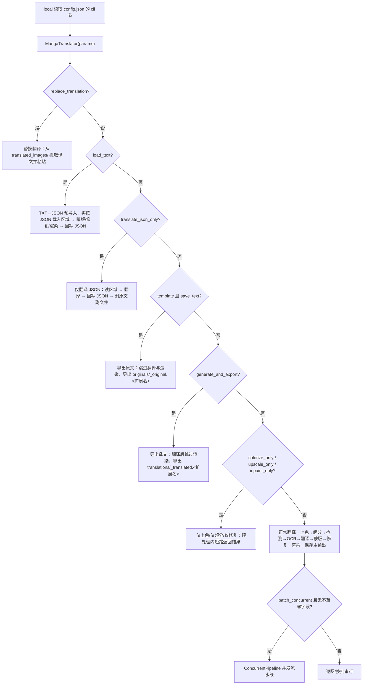

# 工作流与文件模式

CLI 的 `local` 模式没有“工作流”命令行开关；九个工作流通过配置文件 `cli` 节的布尔字段表达，与桌面“翻译流程模式：”下拉框写入的是同一组字段。本页解释这些字段如何进入 `MangaTranslator`、每个字段改变哪些处理阶段和输出文件，以及每张图片的主输出图与 `manga_translator_work` 副文件（工程 JSON、原文/译文模板导出、修复图、编辑器底图、替换翻译配对图）的读写规则。

本页不重复 `local` 的输入收集与输出目录判定（见[本地输入与输出](./local-input-output.md)），不解释 `--config` 与显式参数覆盖（见[配置覆盖](./configuration-overrides.md)），也不逐个展开九种工作流的完整 UI 操作（见[输出目录与工作流](../desktop/translation/output-directory-and-workflow.md)与 `workflows/` 各页，汇总表见[工作流矩阵](../reference/workflow-matrix.md)）。四个顶层子命令的结构见[命令结构](./command-structure.md)。

## 功能边界 {#feature-boundary}

- CLI 正式 `local` 子命令的选项里没有工作流开关；工作流字段来自配置文件的 `cli` 节（Qt `CliSettings` 或发行配置示例），`MangaTranslator` 从合并后的参数字典读取它们。
- 九个工作流字段分别是 `cli.load_text`、`cli.translate_json_only`、`cli.template`、`cli.generate_and_export`、`cli.colorize_only`、`cli.upscale_only`、`cli.inpaint_only`、`cli.replace_translation`，以及配合 `cli.template` 使用的 `cli.save_text`。
- 主输出图写入 `-o/--output` 解析出的输出目录（CLI 的 `save_info` 不携带 `save_to_source_dir`）；工程 JSON、原文/译文模板文件、修复图、编辑器底图和替换翻译配对图始终写入原图所在目录旁的 `manga_translator_work/`，与 `-o` 无关。
- 子进程模式（`--subprocess`）消费相同的 `cli` 工作流字段；内存管理和断点恢复见[子进程内存与恢复](./subprocess-memory-and-recovery.md)。
- 每个字段的具体分支、跳过阶段和文件输出以 `workflows/` 各页为准；本页只写 CLI 视角的分发顺序与文件读写边界。

## 工作流参数 {#workflow-parameters}

### 九个工作流与存储值 {#workflow-mapping}

桌面“翻译流程模式：”下拉框的索引与 `cli` 字段一一对应；`local` 读取配置后按同一字段分发。切换下拉框时，界面先把八个互斥字段全部清为 `false`，再只设置所选模式对应的一个字段（“导出原文”额外依赖 `cli.save_text=true`），因此一次配置最多只会有一行生效。

| 索引 | 存储值 `cli.*` | English 实际值 | 简体中文实际值 | 开始按钮（English / 简体中文） | 主要输出/旁路 |
| ---: | --- | --- | --- | --- | --- |
| 0 | 八个字段均为 `false` | Normal Translation | 正常翻译流程 | Start Translation / 开始翻译 | 主输出图；`save_text` 开启时另写工程 JSON 和修复图 |
| 1 | `generate_and_export=true` | Export Translation | 导出翻译 | Export Translation / 导出翻译 | 工程 JSON + `translations/<stem>_translated.<模板扩展名>`，跳过渲染 |
| 2 | `template=true`（配合 `save_text=true`） | Export Original Text | 导出原文 | Generate Original Text Template / 仅生成原文模板 | 工程 JSON + `originals/<stem>_original.<模板扩展名>`，跳过翻译与渲染 |
| 3 | `translate_json_only=true` | Translate JSON Only | 仅翻译（JSON） | Start JSON Translation / 开始仅翻译（JSON） | 回写工程 JSON，删除原文副文件；不写主输出图 |
| 4 | `load_text=true` | Import Translation and Render | 导入翻译并渲染 | Import Translation and Render / 导入翻译并渲染 | 从 JSON 载入区域并渲染主输出图，回写工程 JSON |
| 5 | `colorize_only=true` | Colorize Only | 仅上色 | Start Colorizing / 开始上色 | 主输出图（上色结果），跳过检测/OCR/翻译/渲染 |
| 6 | `upscale_only=true` | Upscale Only | 仅超分 | Start Upscaling / 开始超分 | 主输出图（超分结果），跳过检测/OCR/翻译/渲染 |
| 7 | `inpaint_only=true` | Inpaint Only | 仅修复 | Start Inpainting / 开始修复 | 主输出图（修复图），跳过翻译/渲染 |
| 8 | `replace_translation=true` | Replace Translation | 替换翻译 | Start Replace Translation / 开始替换翻译 | 主输出图（粘贴译文）；配对图来自 `translated_images/` |

上表的 English/简体中文实际值来自 `desktop_qt_ui/locales/en_US.json` 与 `zh_CN.json` 的实际条目（调用 key 即英文文案），不是猜测翻译。逐项三列证据如下：

| UI 调用 key | English 实际值 | 简体中文实际值 |
| --- | --- | --- |
| `Translation Workflow Mode:` | Translation Workflow Mode: | 翻译流程模式： |
| `Normal Translation` | Normal Translation | 正常翻译流程 |
| `Export Translation` | Export Translation | 导出翻译 |
| `Export Original Text` | Export Original Text | 导出原文 |
| `Translate JSON Only` | Translate JSON Only | 仅翻译（JSON） |
| `Import Translation and Render` | Import Translation and Render | 导入翻译并渲染 |
| `Colorize Only` | Colorize Only | 仅上色 |
| `Upscale Only` | Upscale Only | 仅超分 |
| `Inpaint Only` | Inpaint Only | 仅修复 |
| `Replace Translation` | Replace Translation | 替换翻译 |
| `Start Translation` | Start Translation | 开始翻译 |
| `Generate Original Text Template` | Generate Original Text Template | 仅生成原文模板 |
| `Start JSON Translation` | Start JSON Translation | 开始仅翻译（JSON） |
| `Start Colorizing` | Start Colorizing | 开始上色 |
| `Start Upscaling` | Start Upscaling | 开始超分 |
| `Start Inpainting` | Start Inpainting | 开始修复 |
| `Start Replace Translation` | Start Replace Translation | 开始替换翻译 |
| `label_save_text` | Editable Image | 图片可编辑 |
| `label_format` | Output Format | 输出格式 |
| `label_overwrite` | Overwrite Existing Files | 覆盖已存在文件 |
| `label_batch_concurrent` | Concurrent Batch Processing | 并发批量处理 |
| `label_save_to_source_dir` | Save to Source Directory | 输出到原图目录 |
| `format_not_specified` | Not Specified | 不指定 |

`local` 控制台自身的工作流提示（例如“⚠️ 并发流水线已禁用：当前模式 [...]”）是代码硬编码，不经过 locales，不列入上表。

### 互斥与优先级 {#exclusive-and-priority}

- 桌面正常切换保证互斥：`on_workflow_mode_changed()` 先把 `load_text`、`translate_json_only`、`template`、`generate_and_export`、`colorize_only`、`upscale_only`、`inpaint_only`、`replace_translation` 全部清为 `false`，再只设一个；从配置回读时按 `replace_translation → inpaint_only → upscale_only → colorize_only → load_text → translate_json_only → template → generate_and_export → 正常` 的优先级选下拉框索引。
- 手工编辑配置文件把多个字段设为 `true` 不是受支持的组合；核心 `translate_batch()` 有固定分发顺序：`replace_translation` 最早整体返回，批内循环依次优先 `load_text`、`translate_json_only`，随后才进入“模板导出 / 生成导出 / 正常链”。
- “导出原文”只有在 `template=true` 且 `save_text=true` 同时成立时才进入 `is_template_save_mode`；仅设 `template` 而不设 `save_text` 不会导出原文模板。

### 与并发流水线的关系 {#concurrency-relationship}

`batch_concurrent`（桌面“并发批量处理”）只对“正常翻译”生效。`local` 和核心 `translate_batch()` 都把 `load_text`、`translate_json_only`、`template and save_text`、`generate_and_export`、`colorize_only`、`upscale_only`、`inpaint_only`、`replace_translation` 视为不兼容模式：`local` 发现这些字段会把 `cli.batch_concurrent` 置回 `false` 并打印“并发流水线已禁用”；核心 `translate_batch()` 遇到不兼容字段也不会创建 `ConcurrentPipeline`，改走逐图/串行路径。换句话说，工作流字段不是“让并发也跑起来的开关”，而是会强制关闭并发的旁路。

图说明：这是 `translate_batch()` 的源码分发顺序；`load_text` 预导入只做 TXT→JSON 转换，随后仍按批内分支处理。多个字段同时为 `true` 时按上述顺序而非 GUI 互斥规则生效。

## 文件模式 {#file-modes}

### 主输出图 {#main-output-image}

- 输出路径由 `MangaTranslator._calculate_output_path()` 计算：在 `-o` 解析出的输出目录内保持输入文件夹的相对层级；`cli.format` 为空、`none` 或“不指定”（`Not Specified`）时保留原文件名（含原扩展名），否则使用 `<stem>.<format>`。
- CLI 的 `save_info` 只含 `output_folder`、`format`、`overwrite`、`input_folders`，不含 `save_to_source_dir`，因此 CLI 不会跳到原图旁的 `manga_translator_work/result`；该行为与桌面不同。
- `--overwrite` 关闭时，主输出图已存在或按工作流检查到对应副文件已存在的图片会被跳过；`local` 在启动时做覆盖预检。

### 每图工作目录 {#per-image-work-directory}

工程 JSON、模板导出、修复图、编辑器底图和替换翻译配对图都以“原图所在目录旁的 `manga_translator_work/`”为根，按 `<stem>`（输入图片不带扩展名的文件名）命名：

| 资源 | 相对路径 / 文件名 | 读取/生成规则 |
| --- | --- | --- |
| 工程 JSON | `manga_translator_work/json/<stem>_translations.json` | 查找先新位置，再回退旧位置 `<图片目录>/<stem>_translations.json` |
| 原文导出 | `manga_translator_work/originals/<stem>_original.<模板扩展名>` | 模板未指定或不可读时回退 `json` |
| 译文导出 | `manga_translator_work/translations/<stem>_translated.<模板扩展名>` | 同上 |
| 修复图 | `manga_translator_work/inpainted/<stem>_inpainted.<原扩展名>` | `save_text` 开启且修复完成时写入 |
| 编辑器底图 | `manga_translator_work/editor_base/<原文件名>` | 执行过上色或超分时写入 |
| 替换翻译配对图 | `manga_translator_work/translated_images/<stem><ext>` | 先同扩展名，后遍历受支持扩展名 |
| 画笔涂鸦层 | `manga_translator_work/paint_overlay/<stem>_overlay.png` | 编辑器保存彩色涂鸦时写入 |
| YOLO 标签 | `manga_translator_work/yolo_labels/<stem>.txt` | 启用导入/导出 YOLO 标签时写入 |

这些目录名是 `manga_translator/utils/path_manager.py` 的保留名；文件夹扫描会跳过整个 `manga_translator_work`，不要把工作目录当作普通输入。

### 工程 JSON {#translation-json}

- 工程 JSON 记录每张图的区域、原文/译文、蒙版与渲染后字段；`save_text`（桌面“图片可编辑”）开启、模板导出或 JSON-only 回写时写入 `manga_translator_work/json/`。
- `_save_text_to_file()` 会根据模式写 `skip_font_scaling` 与 `skip_text_replacements`：导出原文/JSON-only 写 `false`（导入渲染时重新智能排版），导出译文写 `true`（按已生成结果回放），渲染过的图写 `skip_text_replacements=true` 防止二次替换。
- JSON-only 或导入渲染等模式要求 JSON 可解析；解析失败的保险丝逻辑会跳过回写，避免覆盖工程文件时永久丢失区域。字段结构详见 `workflows/` 各页与编辑器的导入导出页。

### 原文与译文模板导出 {#template-exports}

- 模板文件默认 `config/translation_template.json`（可由环境变量 `MANGA_TEMPLATE_PATH` 或界面选择改写）。
- 模板文本使用 `<original>`、`<translated>` 占位符；`translation_template.py` 解析首个 `output_format:` 行得到导出扩展名（合法值为 1–32 字符的安全扩展名），缺失或非法回退 `json`。
- “导出原文”调用 `generate_original_text`，“导出译文”调用 `generate_translated_text`；“导入翻译并渲染”的 `load_text` 预导入用 `safe_update_large_json_from_text` 把 TXT 按同一模板写回 JSON。

### 替换翻译配对图 {#replace-translation-pairs}

`replace_translation` 需要一个已翻译图作为“译文来源”：`find_translated_image()` 固定查找 `manga_translator_work/translated_images/`，先匹配同扩展名，再遍历受支持扩展名；译文 JSON 也在该目录内或旧位置查找。找到后用 OCR 得到配对区域，按 `render.enable_template_alignment` 选择“直接粘贴”或“重新渲染”两条分支；详见[替换翻译](../workflows/replace-translation.md)。

## 运行机理 {#runtime-behavior}

### 工作流分发顺序 {#workflow-dispatch}

分发顺序已在[互斥与优先级](#exclusive-and-priority)和上图说明。要点：

- `local` 把 `config_service.get_config().model_dump()` 的 `cli` 节拷入 `translator_params`，`MangaTranslator` 用 `params.get('load_text', False)` 等方式读取九个字段；因此配置文件里的字段名就是存储值。
- 批处理中 `translate_batch()` 先做 `load_text` 的 TXT→JSON 预导入；随后 `replace_translation` 最早整体返回；批内循环按 `load_text → translate_json_only → 常规预处理 → template+save_text → generate_and_export → 正常渲染保存` 分支。
- `template+save_text` 强制 `batch_size=1`（逐张落盘）；其余工作流按 `cli.batch_size` 分批。
- 仅上色/仅超分/仅修复在常规预处理内短路：`colorize_only` 返回上色结果、`upscale_only` 返回超分结果、`inpaint_only` 在蒙版细化后返回修复图，全部跳过翻译与渲染阶段。

### 三类默认值 {#default-values}

工作流字段没有“每次运行都开”的默认；三类默认值只影响 `save_text`、`format`、`overwrite`、`batch_size`、`batch_concurrent` 等基础字段：

| 字段 | 核心 `Config.cli` | Qt `CliSettings` | 发行 `config-example.json` |
| --- | --- | --- | --- |
| `save_text` | `false` | `true` | `true` |
| `format` | `None` | `不指定` | `不指定` |
| `overwrite` | `false` | `true` | `true` |
| `batch_size` | `1` | `1` | `3` |
| `batch_concurrent` | `false` | `false` | `false` |
| `attempts` | `-1` | `-1` | `3` |
| `save_to_source_dir` | `false` | `false` | `false` |
| 六个 GUI 工作流布尔 | 无该字段（消费者按 `False` 兜底） | 全 `false` | 全 `false` |

`load_text`、`template`、`generate_and_export`、`colorize_only`、`upscale_only`、`inpaint_only` 不是核心 `CliConfig` 的形式字段；`MangaTranslator` 通过参数字典读取并在缺失时按 `False` 兜底。`replace_translation` 与 `translate_json_only` 在核心 `CliConfig` 中存在且默认为 `false`。

## 依赖与冲突 {#dependencies-and-conflicts}

- 工作流字段与 `batch_concurrent` 冲突：八个特殊分支（含 `template and save_text`）都会强制禁用并发流水线。
- `cli.format` 只影响主输出图扩展名，不影响工程 JSON（固定 `.json`）与模板导出扩展名（由模板 `output_format` 决定）。
- `--subprocess` 分支只把 `use_gpu`/`disable_onnx_gpu` 显式写入 `cli_config`，其余工作流字段仍来自配置文件；`--format`/`--batch-size`/`--attempts` 在该分支不进入覆盖写入（源码差异，见[配置覆盖](./configuration-overrides.md)）。
- 手工叠加多个工作流字段时按核心分发顺序执行，桌面不保证这种组合；JSON 解析失败时 JSON-only/导入渲染会跳过回写以保护工程文件。
- 副文件写在原图目录旁，即使 `-o` 指向其他位置；删除、迁移或分享 `manga_translator_work/` 前要检查其中是否含用户图片与文本。

## 关联文件与格式 {#related-files-and-formats}

| 文件/格式 | 本页实际作用 | 注意事项 |
| --- | --- | --- |
| `config/config.json` | `cli` 节的工作流字段来源 | 不展示真实用户配置或私有绝对路径 |
| `config/config-example.json` | 发行默认参考 | 与核心/Qt 默认差异见[三类默认值](#default-values) |
| `config/translation_template.json` | 原文/译文导出模板与 `output_format` | 只记录占位符结构与脱敏样例，不收录真实文本 |
| `manga_translator_work/json/*_translations.json` | 工程 JSON 读写 | 分享前删除用户文本与路径 |
| `manga_translator_work/originals/`、`translations/` | 模板导出 sidecar | 文件名必须与输入 `<stem>` 匹配 |
| `manga_translator_work/inpainted/`、`editor_base/`、`paint_overlay/`、`translated_images/` | 修复图、底图、涂鸦层、替换配对图 | 由对应工作流条件写入 |
| `manga_translator_work/yolo_labels/` | YOLO 标签 | 导入/导出启用时参与 |

## 源码依据 {#source-evidence}

| 层级 | 文件 | 本页核对内容 |
| --- | --- | --- |
| 解析器 | `manga_translator/args.py` | `local` 选项无工作流开关；`--format`/`--overwrite` 帮助文本 |
| CLI 执行 | `manga_translator/mode/local.py` | `cli_config` 读取、`batch_concurrent` 不兼容禁用、覆盖预检、`save_info` 字段 |
| 配置模型 | `manga_translator/config.py`、`desktop_qt_ui/core/config_models.py` | 核心 `CliConfig` 与 Qt `CliSettings` 字段差异和默认值 |
| 工作流分发 | `manga_translator/manga_translator.py` | 九个字段读取、`translate_batch()` 分支、模板导出、JSON 回写、修复图/底图保存 |
| 路径/文件 | `manga_translator/utils/path_manager.py`、`manga_translator/utils/translation_template.py`、`desktop_qt_ui/services/workflow_service.py` | `manga_translator_work` 子目录、命名规则、占位符与 `output_format` |
| 桌面映射 | `desktop_qt_ui/ui/main_page/runtime.py`、`desktop_qt_ui/ui/main_page/pages/translation_page.py` | 下拉框索引、互斥写入、开始按钮文案 |
| i18n | `desktop_qt_ui/locales/en_US.json`、`zh_CN.json` | 工作流与按钮 key 的实际中英文 |
| 调研 | `doc/wiki/research/cli-command-inventory.md`、`doc/wiki/research/workflow-matrix-source-evidence.md` | 正式子命令契约与九工作流矩阵 |

## 验证记录 {#verification}

| 验证内容 | 状态 | 说明 |
| --- | --- | --- |
| BLUEPRINT、PAGE_GUIDELINES、TODO | 完成 | 已完整读取并按页面合同编写 |
| `local --help` | 完成 | 实际运行 `uv run --no-sync python -m manga_translator local --help`，选项与本文一致 |
| i18n 三列 | 完成 | 逐项核对 `en_US.json`/`zh_CN.json` 实际值 |
| 工作流分发与文件路径 | 完成 | 静态核对 `manga_translator.py`、`path_manager.py`、`config.py`、`mode/local.py` |
| 脱敏运行验证 | 待后续 | 未运行真实翻译任务，未读取用户图片、配置、密钥或私有路径 |
| 静态检查 | 完成 | `verify-route-mirror.mjs` 与 `verify-source-evidence.mjs` 对本页 PASS（全仓库其他页的既有问题单独记录） |
