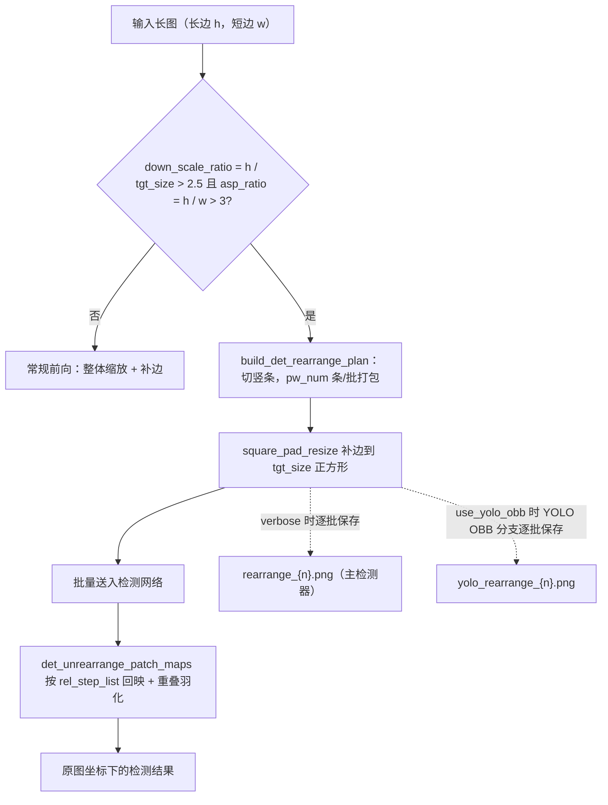
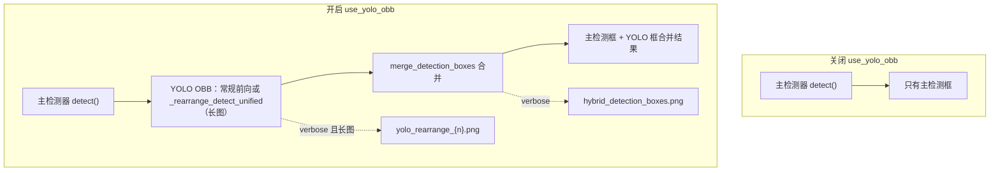

# 输入、检测与长图重排调试产物

当某张图“检测不到文字”“框位置不对”或“长图被切得奇怪”时，通常需要打开“设置 → 通用 → 详细日志”（`cli.verbose`）重新运行，然后在 `result/` 的单图调试目录里核对输入图、检测框调试图和长图重排批次。本页说明这些产物的生成条件、画面含义和排查用途，重点区分输入/检测产物与 `rearrange_{n}.png`、`yolo_rearrange_{n}.png` 两个长图重排分支。

调试目录整体命名与结构见[调试目录与总览](./folder-naming-and-overview.md)，OCR 与文本区域产物见[OCR 与文本区域](./ocr-and-text-regions.md)，蒙版、修复与排版产物见[蒙版、修复与排版](./mask-inpainting-and-rendering.md)。本页不展示真实 `.env`、用户图片、私有绝对路径或真实 API 密钥；调试图与路径分享前必须脱敏。

## 功能边界 {#feature-boundary}

- 本页所有产物都以 `verbose=True` 为总开关：不开启时 `_result_path()` 不生成图片级子目录，检测阶段不写调试图。
- `input.png`、`mask_raw.png`、`bboxes_with_scores.png`、`mask_binary.png`、`hybrid_detection_boxes.png`、`bboxes_unfiltered.png`、`bboxes_unfiltered_labeled.png`、`bboxes.png` 属于“输入/检测阶段”调试产物。
- `rearrange_{n}.png` 与 `yolo_rearrange_{n}.png` 只在图片满足长图重排条件时产生，是条件产物；普通图片每次运行都不一定有。
- 两个重排产物分属不同分支：主检测器（默认/DBConvNext/CTD）调用 `det_rearrange_forward()` 产生 `rearrange_{n}.png`；YOLO OBB 辅助检测在 `use_yolo_obb=True` 时走 `_rearrange_detect_unified()` 产生 `yolo_rearrange_{n}.png`。
- 这些文件是终端诊断写入：静态搜索未发现仓库内对这些文件名的后续读回；消费者是排查问题的操作者或问题报告接收者。

## UI 操作 {#ui-operations}

### 开启详细日志并收集输入/检测产物 {#enable-verbose-and-collect}

1. 打开“设置”（`Settings`），进入“通用”（`General`）分组。
2. 启用“详细日志”（`Verbose Logging`），该开关保存到 `cli.verbose`。
3. 开始翻译。verbose 开启后，每张输入图在 `result/` 下建立 `{时间戳}-{图片MD5}-{检测尺寸}-{目标语言}-{翻译器}` 子目录，检测阶段写入 `input.png` 与检测框调试图。
4. 排查时按“输入图 → 检测框 → 重排批次”的顺序打开对应文件，对照本页表格判断问题阶段。

### 调整检测与长图重排参数 {#tune-detection-parameters}

打开“设置”（`Settings`）→“检测”（`Detection`）分组。“检测大小”（`Detection Size`）同时是常规检测缩放尺寸与长图重排的目标尺寸；“长图重排最低有效短边”（`Long Image Rearrange Min Short Side`）控制打包时保留的有效短边分辨率；“启用YOLO辅助检测”（`Enable YOLO Detection`）决定是否产生 `yolo_rearrange_{n}.png` 与 `hybrid_detection_boxes.png`。

| UI 调用 key | English 实际值 | 简体中文实际值 |
| --- | --- | --- |
| `Settings` | Settings | 设置 |
| `General` | General | 通用 |
| `Detection` | Detection | 检测 |
| `label_verbose` | Verbose Logging | 详细日志 |
| `label_detector` | Text Detector | 文本检测器 |
| `label_detection_size` | Detection Size | 检测大小 |
| `label_det_rearrange_min_effective_short_side` | Long Image Rearrange Min Short Side | 长图重排最低有效短边 |
| `label_use_yolo_obb` | Enable YOLO Detection | 启用YOLO辅助检测 |
| `label_yolo_obb_conf` | YOLO Confidence Threshold | YOLO置信度阈值 |
| `label_yolo_obb_overlap_threshold` | YOLO Overlap Removal Threshold | YOLO辅助检测重叠率删除阈值 |
| `label_import_yolo_labels` | Import Fixed YOLO Boxes | 导入固定YOLO框 |

参数说明面板中的 `desc_cli_verbose` 与 `desc_detector_det_rearrange_min_effective_short_side` 使用对应 key 的说明文本。其中 `desc_cli_verbose` 对调试目录的写法仍是“时间戳-图片名-目标语言-翻译器”，与当前源码 `_set_image_context()` 的“时间戳-MD5-检测尺寸-目标语言-翻译器”不一致，属 UI 文案滞后，命名以源码为准（详见[调试目录与总览](./folder-naming-and-overview.md)）。

## 输入图与检测框调试产物 {#input-and-detection-artifacts}

下表按检测阶段先后列出本页负责的调试产物。文件名、写入点与触发条件来自 `research/phase0-debug-artifact-path-trace.md` 的静态核对。

| 产物 | 写入点 | 触发条件 | 画面/内容 | 排查用途 |
| --- | --- | --- | --- | --- |
| `input.png` | `manga_translator/manga_translator.py` `_translate_until_translation()` | `verbose=True` | 处理前的输入图（保存时 RGB 转 BGR） | 确认喂给管线的原图；检测/OCR 异常时先核对它 |
| `mask_raw.png` | `manga_translator/manga_translator.py`（检测返回 `ctx.mask_raw` 后） | `verbose=True` 且检测返回原始蒙版 | 带置信度颜色映射与 “Confidence” 颜色条的热力图（`_create_confidence_heatmap`） | 检测阈值/漏检排查 |
| `bboxes_with_scores.png` | `manga_translator/manga_translator.py`（检测器第三返回值为调试元组或图像时） | `verbose=True`，检测器返回评分框调试图 | 检测器返回的评分框叠加图 | 检测器内部调试输出 |
| `mask_binary.png` | 同上（二元/三元调试元组） | 同上 | 与评分框图配套的二值掩码 | 检测输出排查 |
| `hybrid_detection_boxes.png` | 同上（第三返回值为图像且 `use_yolo_obb=True`） | `verbose=True`、`use_yolo_obb=True` | 主检测与 YOLO OBB 合并后的框图（来自检测调度的 `draw_detection_debug_image`） | 混合检测合并排查 |
| `bboxes_unfiltered.png` | `manga_translator/manga_translator.py`（检测后、OCR 前） | `verbose=True` 且检测后仍有文本行 | 原图上未过滤文本行框（跳过 `other` 标签） | 检测/OCR 过滤排查 |
| `bboxes_unfiltered_labeled.png` | `manga_translator/manga_translator.py` → `_save_labeled_textline_debug_image()` | 上一条件成立、`ocr.merge_special_require_full_wrap=True`、存在非空文本行 | 带 `序号:标签` 字幕的彩色文本行框（按标签着色） | 模型辅助合并/标签分流排查 |
| `bboxes.png` | `manga_translator/manga_translator.py`（文本行合并后） | `verbose=True` 且存在 `ctx.text_regions` | 最终文本块可视化（是否显示 panel 取决于 `force_simple_sort`） | 合并/排序排查 |

## 长图重排触发与切块机制 {#rearrange-trigger-and-splitting}

`build_det_rearrange_plan()` 先按长边方向归一化：若 `h < w` 则转置，使 `h` 为长边。它计算 `down_scale_ratio = h / tgt_size`（`tgt_size` 即 `detector.detection_size`，默认 `2048`）与 `asp_ratio = h / w`；只有 `down_scale_ratio > 2.5` 且 `asp_ratio > 3` 时才要求重排，否则返回 `None` 走常规前向。

重排时把长条切成若干条带，并按 `pw_num` 打包：`pw_num` 由“不缩放的条带数 `floor(tgt_size / w)`”、“按 `det_rearrange_min_effective_short_side` 计算的分辨率上限”与“legacy 上限 `floor(2 * tgt_size / w)`”共同决定，每个组成批次包含 `pw_num` 个竖条并排。每个批次再经 `square_pad_resize()` 补边缩放到 `tgt_size × tgt_size` 正方形后送入网络。检测输出由 `det_unrearrange_patch_maps()` 按 `rel_step_list` 回映到原图坐标，条带重叠区按“离条带切割边缘的距离”羽化加权合并，避免被切断文字在接缝处丢框。

重排避免把超长图整体缩到检测尺寸导致文字过小；打包批次同时控制单次送入网络的显存占用。`det_rearrange_min_effective_short_side` 越高，每个批次打包的竖条越少、保留的有效短边分辨率越高，文字更清晰但检测更慢（与设置面板说明一致）。

## 重排产物分支 {#rearrange-artifact-branches}

### `rearrange_{n}.png`：主检测器的方形补边批次 {#rearrange-artifact-main}

写入点是 `manga_translator/utils/generic.py` 的 `det_rearrange_forward()` → `_patch2batches()`。触发条件：默认、DBConvNext 或 CTD 检测器调用 `det_rearrange_forward()`，图片满足 `build_det_rearrange_plan()` 的重排条件，且 `verbose=True`。内容：送入检测网络前的方形补边批次——每个 `{n}` 对应一个组成批次（`pw_num` 个竖条并排并补边到 `tgt_size` 后的图像），供长图重排排查：核对切块/打包是否正确、竖条是否完整、补边方向是否符合预期。verbose 时控制台会打印 “Input image will be rearranged to square batches...” 提示。

### `yolo_rearrange_{n}.png`：YOLO OBB 的单个重排 patch {#rearrange-artifact-yolo}

写入点是 `manga_translator/detection/yolo_obb.py` 的 `_rearrange_detect_unified()`。触发条件：`use_yolo_obb=True`、YOLO OBB 也得到长图重排计划、当前 patch 有效（非全零 padding、非空）、`verbose=True`。内容：YOLO OBB 的单个重排 patch——与主检测器使用同一 `build_det_rearrange_plan()` 切块逻辑，因此切割应与 `rearrange_{n}.png` 一致，供混合检测长图排查。全零 padding patch 会被跳过，因此编号 `{n}` 可能不连续。

## 路径与回退 {#paths-and-fallbacks}

- 普通检测调度在 `_run_detection()` 把 `self._result_path` 作为 `result_path_fn` 传给检测器，所以两个重排产物默认落在图片级调试目录：`result/<时间戳>-<MD5>-<检测尺寸>-<目标语言>-<翻译器>/rearrange_{n}.png` 与同目录 `yolo_rearrange_{n}.png`。
- 未提供回调时，`det_rearrange_forward()` 的兜底路径是仓库根 `result/rearrange_{n}.png`（`generic.py`），YOLO OBB 的兜底路径是 `result/yolo_rearrange_{n}.png`（`yolo_obb.py`）。当前源码中 `manga_translator/utils/ctd_replace.py` 的调用未传回调；普通检测调度会传回调。
- 调试目录名含输入图片 MD5；不要把含用户图片 MD5 的路径写进公开报告。调试 PNG 可能直接包含用户原图像素，分享前必须逐文件检查。

## 关键参数与选项 {#parameters-and-options}

#### `detector.detection_size` — 检测大小 / Detection Size {#detection-size}

- 控件：整数输入框。
- 所在界面：设置 → 检测；UI 调用 key `label_detection_size`。
- 存储值：整数像素（检测缩放尺寸）。
- 默认值：核心代码 `manga_translator/config.py#DetectorConfig.detection_size` 为 `2048`；Qt 模型与发行配置以对应设置为准，详见[检测设置](../desktop/settings/detection.md)。
- 生效阶段：检测；同时也是长图重排的 `tgt_size`。
- 原理：常规检测把图片缩放到该尺寸附近；`build_det_rearrange_plan()` 用它计算 `down_scale_ratio = h / tgt_size` 与 `pw_num`，因此它直接决定是否触发重排以及 `rearrange_{n}.png`/`yolo_rearrange_{n}.png` 的批次数量。
- 图示：不需要：该值只是重排判定与切块的输入，分支与画面变化已由“长图重排触发与切块机制”一节的 Mermaid 表达。
- 源码依据：`manga_translator/config.py`（定义）、`desktop_qt_ui/locales/en_US.json`、`zh_CN.json`（`label_detection_size`）、`manga_translator/utils/generic.py`（消费者）。

#### `detector.det_rearrange_min_effective_short_side` — 长图重排最低有效短边 / Long Image Rearrange Min Short Side {#det-rearrange-min-effective-short-side}

- 控件：整数输入框。
- 所在界面：设置 → 检测；UI 调用 key `label_det_rearrange_min_effective_short_side`。
- 存储值：整数像素。
- 默认值：核心代码 `DetectorConfig.det_rearrange_min_effective_short_side` 为 `341`；Qt 模型与发行配置见[检测设置](../desktop/settings/detection.md)。
- 生效阶段：检测（仅长图重排路径）。
- 原理：参与 `max_pw_num_by_resolution = floor(tgt_size / min_effective_short_side)`。值越高，每个批次打包的竖条越少、保留的有效短边分辨率越高，文字越清晰但检测越慢；值过低会压扁极窄长图的条带宽度。
- 图示：不需要：它只改变 `pw_num` 与批次内容，不改变重排分支本身；分支见“长图重排触发与切块机制”。
- 源码依据：`manga_translator/config.py`（定义）、`manga_translator/utils/generic.py#build_det_rearrange_plan`（消费者）、`desktop_qt_ui/locales/*.json`（UI）。

#### `detector.use_yolo_obb` — 启用YOLO辅助检测 / Enable YOLO Detection {#use-yolo-obb}

- 控件：开关。
- 所在界面：设置 → 检测；UI 调用 key `label_use_yolo_obb`。
- 存储值：布尔；默认关闭。
- 生效阶段：检测（主检测后的 YOLO OBB 辅助检测与合并）。
- 原理：关闭时只运行主检测器并直接返回；开启时检测调度额外运行 YOLO OBB 检测，用 `merge_detection_boxes()` 与主检测框合并。长图满足重排条件时，YOLO OBB 走 `_rearrange_detect_unified()`，产生 `yolo_rearrange_{n}.png`；verbose 时还产生 `hybrid_detection_boxes.png`。
- 图示：开关前后对照（见下），体现“关闭只有主框，开启多出 YOLO 分支与两个调试产物”。

- 限制：开启并不改变 OCR、翻译、修复或排版阶段；YOLO 检测失败时调度回退到主检测器结果。完整参数说明见[检测设置](../desktop/settings/detection.md)。

#### `cli.verbose` — 详细日志 / Verbose Logging {#cli-verbose}

- 控件：开关。
- 所在界面：设置 → 通用；UI 调用 key `label_verbose`。
- 存储值：布尔；核心默认 `False`。
- 生效阶段：整个翻译流程的调试产物与日志级别。
- 原理：`MangaTranslator.parse_init_params()` 读取 `verbose` 参数；开启后 `_result_path()` 使用图片级子目录，本页所有写入点由 `self.verbose` 分支保护。它只增加调试产物与日志，不改变翻译结果本身。
- 图示：不需要：它是所有调试产物的总开关，不引入新的处理分支；具体产物见“输入图与检测框调试产物”。
- 源码依据：`manga_translator/config.py#CliConfig.verbose`、`manga_translator/manga_translator.py#parse_init_params`、`desktop_qt_ui/locales/*.json`（`label_verbose`/`desc_cli_verbose`）。

## 依赖与冲突 {#dependencies-and-conflicts}

- 所有产物依赖 `verbose=True`；关闭时 `result/` 不写单图调试目录。
- 无文本早退（检测后无文本行）会跳过 `bboxes_unfiltered*.png` 与后续 `bboxes.png`；`bboxes_unfiltered_labeled.png` 还依赖 `ocr.merge_special_require_full_wrap`。
- `hybrid_detection_boxes.png` 与 `yolo_rearrange_{n}.png` 依赖 `use_yolo_obb`；`import_yolo_labels` 会替换最终检测框，但检测调度仍会先运行（verbose 时仍可能有重排产物）。
- 长图重排产物是条件产物：普通图片、`detection_size` 足够大或长宽比不极端时不产生。
- 不要把“某次运行实际存在的产物”写成“每次必有”；调试目录不能直接打包上传，`mask_raw` 热力图与重排批次都可能含用户图像内容。

## 关联文件与格式 {#related-files-and-formats}

| 文件/目录 | 本页作用 | 注意事项 |
| --- | --- | --- |
| `result/<时间戳>-<MD5>-<检测尺寸>-<目标语言>-<翻译器>/` | verbose 单图调试目录（本页产物所在目录） | 名称字段来自 `_set_image_context()`；含用户图片 MD5 |
| `input.png`、`mask_raw.png`、`bboxes*.png`、`mask_binary.png`、`hybrid_detection_boxes.png` | 输入/检测阶段调试图 | 均为 PNG；分享前脱敏 |
| `rearrange_{n}.png`、`yolo_rearrange_{n}.png` | 长图重排调试图 | 条件产物；`{n}` 为批次/补丁索引 |
| `result/rearrange_{n}.png`、`result/yolo_rearrange_{n}.png` | 未传回调时的兜底路径 | 普通检测调度传回调，兜底供独立调用/异常调用路径 |
| `config/config.json`、`config/config-example.json` | `cli.verbose`、`detector.*` 配置来源 | 不展示真实用户配置与私有绝对路径 |
| `manga_translator_work/yolo_labels/` | `import_yolo_labels` 的标注读取目录 | 见[检测设置](../desktop/settings/detection.md) |

## Mermaid 数据流限制 {#mermaid-limits}

上图描述源码确认的触发判定、切块打包、坐标回映与两个重排产物分支；它们不代表每次运行都产生全部文件。`verbose=False`、无文本早退、不满足重排条件、`use_yolo_obb=False`、YOLO 推理失败等都会走对应旁路。本页未伪造运行截图或私有任务产物。

## 源码依据 {#source-evidence}

| 层级 | 文件 | 本页核对内容 |
| --- | --- | --- |
| 调度 | `manga_translator/manga_translator.py` | `_set_image_context()`、`_get_image_subfolder()`、`_result_path()`、`_run_detection()`、`input.png`/`mask_raw.png`/`bboxes*.png` 写入点、`_save_labeled_textline_debug_image()`、`_create_confidence_heatmap()` |
| 检测 | `manga_translator/detection/__init__.py`、`default.py`、`dbnet_convnext.py`、`ctd.py`、`yolo_obb.py` | `dispatch()`/`detect()` 回调传递、`det_rearrange_forward()` 转发点、`_rearrange_detect_unified()`、`yolo_rearrange_{n}.png` 写入 |
| 重排 | `manga_translator/utils/generic.py` | `build_det_rearrange_plan()`、`det_rearrange_patch_array()`、`square_pad_resize()`、`_patch2batches()`、`det_unrearrange_patch_maps()` |
| 配置 | `manga_translator/config.py` | `DetectorConfig.detection_size`、`det_rearrange_min_effective_short_side`、`use_yolo_obb`；`CliConfig.verbose` |
| UI/i18n | `desktop_qt_ui/locales/en_US.json`、`zh_CN.json` | 三列实际显示值与 `desc_*` 说明 |
| 调查 | `doc/wiki/research/phase0-debug-artifact-path-trace.md`、`phase0-related-files-formats-debug-safety.md` | 路径契约、触发条件与脱敏规则 |

## 验证记录 {#verification}

| 验证内容 | 状态 | 说明 |
| --- | --- | --- |
| BLUEPRINT、PAGE_GUIDELINES、TODO | 完成 | 已完整读取并按页面合同编写；覆盖 TODO 6.3 长图重排项 |
| 路径与写入点 | 完成 | 静态核对 `_result_path()`/`_set_image_context()` 与 `research/phase0-debug-artifact-path-trace.md` |
| 重排机制 | 完成 | 静态核对 `build_det_rearrange_plan()`、切块打包、`det_unrearrange_patch_maps()` 回映与羽化 |
| `rearrange_{n}.png`/`yolo_rearrange_{n}.png` 分支 | 完成 | 主检测器 `generic.py` 与 YOLO OBB `yolo_obb.py` 两条写入链分别核对 |
| UI 与 i18n 文案 | 完成 | `label_*` 三列与 `desc_*` 实际值核对；`desc_cli_verbose` 目录命名与源码不一致已记录 |
| 脱敏运行验证 | 待后续 | 未运行真实翻译，未读取真实 `.env`、用户 `config.json`、API key、用户图片或私有路径 |
| 静态检查 | 完成 | `verify-route-mirror.mjs` PASS、`verify-source-evidence.mjs` PASS |
