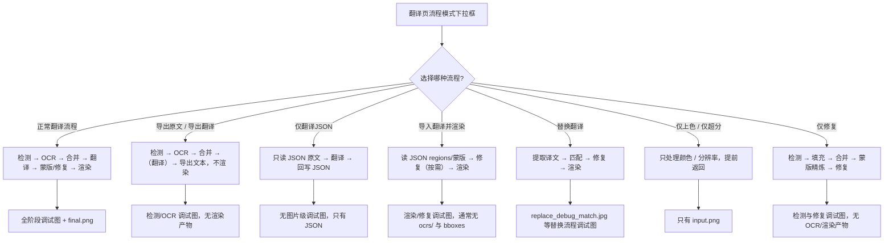
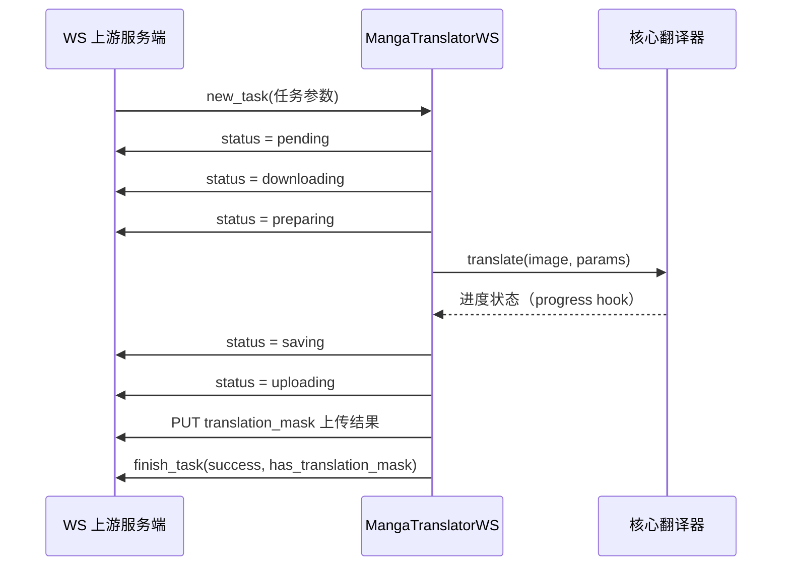

# 特殊工作流与 WebSocket 调试产物

当“导出原文”“导出翻译”“仅翻译（JSON）”“导入翻译并渲染”“替换翻译”或“仅上色/仅超分/仅修复”等流程跳过标准流水线的部分阶段时，本页说明它们会（或不会）产生哪些调试产物；`ws` 与 `shared` 两种内部传输模式除了普通调试图外，还有自己的 `ws_*` 调试图与传输相关文件。普通翻译流程的逐阶段调试图片见[调试目录与总览](./folder-naming-and-overview.md)、[OCR 与文本区域](./ocr-and-text-regions.md)、[蒙版、修复与排版](./mask-inpainting-and-rendering.md)；`ws`/`shared` 的完整协议契约见[内部 shared 与 WebSocket 协议](../developer/internal-shared-and-websocket.md)。

## 功能边界

- 调试产物分为三类：特殊工作流跳过阶段后的“条件产物”、`ws` 模式渲染回调写入的 `ws_*` 图片、以及 `shared`/`ws` 模式运行产生的日志与目录。
- 除特别说明外，所有调试产物都需要 `verbose` 开启；不开启时只写最终输出图、JSON/文本导出等业务文件。
- “某次运行实际存在的产物”和“当前源码在该模式下可能生成的完整产物”不同：例如导入翻译并渲染只在缺少蒙版或需要重新检测时才会触发检测分支。
- 本页不重复 `shared`/`ws` 的端点、端口、鉴权和 pickle/protobuf 序列化细节，那些属于[内部 shared 与 WebSocket 协议](../developer/internal-shared-and-websocket.md)。

## UI 操作

### 在翻译页选择流程模式

打开“翻译”（`Translation`）页面。页面上方是“翻译流程模式：”（`Translation Workflow Mode:`）下拉框，下方“开始任务前请选择翻译流程模式。”（`Choose translation workflow mode before starting the task.`）是提示文字。下拉框共 9 个选项，选中后会把对应后端标志写入 `cli.*` 配置并立即保存；开始按钮文案也会随模式变化。

### 在设置页开启详细日志

打开“设置”（`Settings`）→“General”分组，勾选“详细日志”（`Verbose Logging`，存储键 `cli.verbose`）。开启后 Qt UI 会在 `result/` 下写运行日志 `log_<时间戳>.txt`，并在每次翻译时为单张图片建立调试子目录；关闭后不写这些调试文件。CLI 的 `local`、`ws`、`shared`、`web` 子命令各自提供 `-v/--verbose` 开关。

## 选项中英对照

| UI 调用 key | English 实际值 | 简体中文实际值 |
| --- | --- | --- |
| `Translation Workflow Mode:` | Translation Workflow Mode: | 翻译流程模式： |
| `Choose translation workflow mode before starting the task.` | Choose translation workflow mode before starting the task. | 开始任务前请选择翻译流程模式。 |
| `Normal Translation` | Normal Translation | 正常翻译流程 |
| `Export Translation` | Export Translation | 导出翻译 |
| `Export Original Text` | Export Original Text | 导出原文 |
| `Translate JSON Only` | Translate JSON Only | 仅翻译（JSON） |
| `Import Translation and Render` | Import Translation and Render | 导入翻译并渲染 |
| `Colorize Only` | Colorize Only | 仅上色 |
| `Upscale Only` | Upscale Only | 仅超分 |
| `Inpaint Only` | Inpaint Only | 仅修复 |
| `Replace Translation` | Replace Translation | 替换翻译 |
| `Start Translation` | Start Translation | 开始翻译 |
| `Start Replace Translation` | Start Replace Translation | 开始替换翻译 |
| `Start Inpainting` | Start Inpainting | 开始修复 |
| `Start Upscaling` | Start Upscaling | 开始超分 |
| `Start Colorizing` | Start Colorizing | 开始上色 |
| `Start JSON Translation` | Start JSON Translation | 开始仅翻译（JSON） |
| `Generate Original Text Template` | Generate Original Text Template | 仅生成原文模板 |
| `label_verbose` | Verbose Logging | 详细日志 |
| `desc_cli_verbose` | Output detailed debug info to logs for troubleshooting. … | 输出详细的调试信息到日志，方便排查问题。… |
| `🔧 Translation workflow: {mode}` | 🔧 Translation workflow: {mode} | 🔧 翻译流程：{mode} |

## 特殊工作流调试产物

下拉框中的 8 个非默认模式对应一组后端标志：`template`（配合 `save_text`）、`generate_and_export`、`translate_json_only`、`load_text`、`replace_translation`、`colorize_only`、`upscale_only`、`inpaint_only`。这些模式都会跳过标准流水线的部分阶段，因此下表是“verbose 开启时该模式可能产生的条件产物”，不是每次运行都有。

| 流程模式（UI） | 后端标志 | 跳过/改变阶段 | verbose 条件产物 |
| --- | --- | --- | --- |
| 正常翻译流程 | （无） | 无 | 标准流水线全套：`input.png`、`mask_raw.png`、`bboxes*.png`、`ocrs/`、`mask_final.png`、`inpaint_input.png`、`inpainted.png`、渲染类调试图、`final.png` |
| 导出原文 | `template` + `save_text` | 跳过翻译与渲染；强制单图批次 | `input.png`、`mask_raw.png`、`bboxes*.png`、`ocrs/`、`bboxes.png`；无修复/渲染/`final.png`；另导出原文文本 |
| 导出翻译 | `generate_and_export` | 跳过渲染 | 检测/OCR 类产物（同上）；无修复/渲染/`final.png`；另导出译文文本 |
| 仅翻译（JSON） | `translate_json_only` | 跳过检测/OCR/渲染；只读写 JSON | 无图片级调试图；成功后回写 JSON 并删除 `imagename_original.txt` |
| 导入翻译并渲染 | `load_text` | 跳过检测/OCR/翻译；直接渲染 | 通常只有渲染/修复类产物（`inpaint_input.png`、`mask_final.png`、`inpainted.png`、`final.png`）；缺少蒙版或开启导入 YOLO 框时才触发检测分支 |
| 替换翻译 | `replace_translation` | 不走普通翻译；提取译文→匹配→修复→渲染 | `replace_debug_match.jpg`、`inpainted.png`、`debug_extracted_text.png` |
| 仅上色 | `colorize_only` | 只上色 | `input.png`；无检测/OCR/渲染/`final.png` |
| 仅超分 | `upscale_only` | 只超分 | `input.png`；无检测/OCR/渲染/`final.png` |
| 仅修复 | `inpaint_only` | 检测→填充→合并→蒙版精炼→修复；无 OCR/翻译/渲染 | `input.png`、检测类调试图（`bboxes_with_scores.png` 等）、`inpaint_input.png`、`mask_final.png`、`inpainted.png` |



上图描述的是源码中的真实分支；没有伪造运行截图。每个分支的实际产物还依赖检测器是否返回调试图、是否有文本区域、是否缺少蒙版等条件，不能把条件产物写成每次必有。

### 导出类流程

- “导出原文”（`template` + `save_text`）：预处理照常（因此 verbose 时仍有 `input.png`、`mask_raw.png`、`bboxes*.png`、`ocrs/`、`bboxes.png`），随后直接导出原文文本，跳过翻译、蒙版、修复和渲染，所以没有 `final.png`。JSON 中写入 `skip_font_scaling: false`，提示下次导入渲染时重新智能排版。
- “导出翻译”（`generate_and_export`）：照常检测/OCR/翻译，但跳过渲染并导出译文文本。JSON 中写入 `skip_font_scaling: true`，便于按已生成结果回放。
- “仅翻译（JSON）”（`translate_json_only`）：从 JSON 读原文翻译后回写 JSON，成功后删除对应的 `imagename_original.txt`；该分支不进入逐图调试写入，因此 verbose 也不产生图片级调试图。
- 三类流程都写入 `manga_translator_work/` 下的 `json/`、`originals/`、`translations/` 子目录；这些是业务文件，不是调试产物。模板格式由 `config/translation_template.json` 决定，注意该文件按文本模板解析，不能假定为严格 JSON。

### 导入与替换流程

- “导入翻译并渲染”（`load_text`）：从 `_translations.json`（或内存载荷）读 regions 与蒙版后直接渲染，跳过检测/OCR/翻译。JSON 已带精炼蒙版时不再生成检测类调试图；JSON 缺蒙版、或开启“导入 YOLO 框”需要重新检测生成蒙版时，才会触发检测分支。修复图可能来自编辑器内存载荷、磁盘 `manga_translator_work/inpainted/` 或重新运行修复，只有真正运行修复时才有 `inpaint_input.png`/`mask_final.png`/`inpainted.png`。
- “替换翻译”（`replace_translation`）：把同名的翻译图放到 `manga_translator_work/translated_images/`，程序提取译文文字、在生肉图上匹配区域、修复原文区域并渲染译文。verbose 时依次写 `replace_debug_match.jpg`（生肉框/翻译框/匹配线与重叠率）、`inpainted.png`（修复后的生肉图）、`debug_extracted_text.png`（直接粘贴模式下提取的译文文字）。

### 单阶段流程

- “仅上色”/“仅超分”：在逐图入口保存 `input.png`（verbose）后立即返回，不进入检测/OCR/翻译/渲染，因此没有 `mask_raw.png`、`ocrs/`、`inpainted.png`、`final.png`。
- “仅修复”：执行“检测 → 填充占位文本 → 文本行合并 → 蒙版精炼 → 修复”，跳过 OCR、翻译与渲染。verbose 时产生 `input.png`、检测器返回的调试图（如 `bboxes_with_scores.png`/`mask_binary.png`/`hybrid_detection_boxes.png`）和修复类产物（`inpaint_input.png`、`mask_final.png`、`inpainted.png`），不产生 `ocrs/` 与渲染调试图，也没有 `final.png`。

## WebSocket 与共享传输调试产物

`ws` 模式（`MangaTranslatorWS`）在 verbose 时除了普通流水线产物，还会在图片级调试子目录写入以下渲染相关图片；`shared` 模式本身不写专属文件，但 verbose 时同样走普通 `_result_path()` 调试目录。

| 产物 | 写入点 | 触发条件 | 内容与消费者 |
| --- | --- | --- | --- |
| `ws_render_in.png` | `manga_translator/mode/ws.py#_run_text_rendering` | `ws` 模式且 verbose | 渲染前的图像 `ctx.img_rgb` |
| `ws_render_out.png` | 同上 | `ws` 模式且 verbose | 渲染后的输出，未裁蒙版 |
| `ws_mask.png` | 同上 | `ws` 模式且 verbose | 最终渲染蒙版（白色 255），由“渲染前后有差异的像素”与 `ctx.mask` 合并得到 |
| `ws_inmask.png` | 同上 | `ws` 模式且 verbose | 仅保留蒙版区域的输入图（RGBA × mask） |
| `ws_output.png` | 同上 | `ws` 模式且 verbose | 仅保留蒙版区域的渲染输出（RGBA × mask），即真正上传的结果内容 |
| `ws_final.png` | `manga_translator/mode/ws.py#server_process_inner` | `ws` 模式且 verbose，且翻译成功 | 还原到原尺寸（LANCZOS）后的最终结果 |
| `result/<task_id>/` | `manga_translator/mode/ws.py#server_process_inner` | `ws` 模式且 verbose | 处理前先清理并重建该目录；当前源码中 `ws_*` 调试图实际经 `_result_path()` 写入图片级子目录，`result/<task_id>/` 与图片级子目录的关系需运行验证确认 |

`shared` 模式的传输相关文件只有运行日志与调试子目录本身：`MangaShare` 用 `MangaTranslator(params)` 创建翻译器，`verbose` 由参数透传，调试图写入与普通模式相同的 `result/<image-subfolder>/` 位置。`result/log_<时间戳>.txt` 是桌面 Qt UI 在 `desktop_qt_ui/main.py` 启动时配置的全局 DEBUG 日志，不属于单图调试子目录。

## 运行机理

### 调试目录与触发条件

`MangaTranslator._set_image_context()` 在每张输入图开始处理时生成子目录名：

```text
{毫秒时间戳}-{图片MD5前8位}-{detection_size}-{目标语言}-{翻译器}
```

MD5 是对 PNG 归一化后的图片内容计算并截取前 8 位，计算失败时回退为 `fallback_<时间戳>`。`_result_path()` 在 verbose 且有图片上下文时返回 `BASE_PATH/result/<图片子目录>/<产物>` 并创建父目录；`BASE_PATH` 在打包版为可执行文件所在目录，开发环境为仓库根目录。设置页“详细日志”的描述文案把它简写为“时间戳-图片名-目标语言-翻译器”，实际中间字段是 MD5 与检测尺寸，以源码为准。

所有 `_result_path()` 直接写入的终端诊断文件（如 `input.png`、`mask_raw.png`、`bboxes*.png`、`ocrs/`、`inpaint_*.png`、`inpainted.png`、`final.png`）的消费者是开启 verbose 的操作者或问题报告接收者；静态搜索未发现仓库内对这些文件名的后续读回。

### WebSocket 模式协议与产物

`MangaTranslatorWS` 是翻译器的子类，作为内部执行器客户端主动连接上游（CLI 默认 `ws://localhost:5000`），用 `x-secret` 头携带密钥（来自 `ws_secret` 参数或 `WS_SECRET` 环境变量；CLI 没有 `--ws-secret` 参数）。消息是 protobuf `WebSocketMessage`，`oneof` 包含 `new_task`、`status`、`finish_task`。任务从 `source_image` URL 下载图片，结果 `PUT` 回 `translation_mask` URL；长边超过 1200 像素时强制 `upscale_ratio=1`。`--host`/`--port`/`--nonce` 在 `ws` 子命令中可解析，但 `MangaTranslatorWS` 当前不消费。



状态还有 `error-download`（下载失败）与 `error-upload`（上传失败）。verbose 时 `_run_text_rendering()` 写入 `ws_render_in/out`、`ws_mask`、`ws_inmask`、`ws_output`，上传前还会保存 `ws_final.png`。`sync_state` 通过 0.2 秒节流的 `Throttler` 把进度状态转发回 `status` 消息。

### 共享传输协议与产物

`MangaShare` 用 uvicorn 启动内部 FastAPI，默认监听 `127.0.0.1:5003`，只放行 `translate` 与 `translate_batch` 两个方法；`X-Nonce` 头不匹配返回 401，锁被占用返回 429，其他方法名返回 403。`/execute/{method}` 的流式响应使用“1 字节状态 + 4 字节大端长度 + 负载”的帧格式：

| 状态字节 | 含义 | 负载 |
| --- | --- | --- |
| `0` | 结果 | pickle 序列化的 `Context`（`use_placeholder` 时是 1×1 白色最小结果） |
| `1` | 进度 | UTF-8 状态字符串（如 `detection`、`ocr`、`translation`、`rendering` 等） |
| `2` | 错误 | 错误文本 |

`/simple_execute/{method}` 则一次性返回 pickle 字节。pickle 反序列化不可信输入有任意代码执行风险，`X-Nonce` 只是弱鉴权且以明文传输，因此 shared/ws 必须视为内部协议、只绑定回环或受控网络。`timeout_keep_alive=1800`（30 分钟）用于支持批量翻译长连接。

## 依赖与冲突

- 所有调试产物都以 `verbose` 为前提；`desc_cli_verbose` 描述的是 Qt UI 行为，CLI 各模式用 `-v` 单独控制，两者不要混写。
- 特殊工作流与 `batch_concurrent` 不兼容：`load_text`、`translate_json_only`、`template+save_text`、`generate_and_export`、`colorize_only`、`upscale_only`、`inpaint_only`、`replace_translation` 任一开启时，`batch_concurrent` 会被忽略并回退顺序处理；`template+save_text` 还会强制 `batch_size=1`。
- `ws`/`shared` 是内部执行链路，不是对外 Web API；Web 模式的 `0.0.0.0:8000`、shared 的 `127.0.0.1:5003`、ws 上游的 `ws://localhost:5000` 三个端口不能混写。
- 调试图片、`ocrs/` 裁切图、`replace_debug_match.jpg`、`ws_*` 图片、JSON 和日志都可能包含用户图像、原文/译文文本或本机路径；对外分享前必须逐文件脱敏，`mask_raw` base64 或 PNG 调试图都不等于已脱敏。

## 关联文件与格式

| 文件/目录 | 本页实际作用 | 注意 |
| --- | --- | --- |
| `result/<图片子目录>/` | verbose 单图调试产物（含 `ws_*`） | 命名规则见上文；不是每次运行都产生全部文件 |
| `result/<task_id>/` | `ws` 模式 verbose 时创建 | 当前源码与图片级子目录的关系待运行验证 |
| `result/log_<时间戳>.txt` | 桌面 Qt UI 全局运行日志 | `desktop_qt_ui/main.py` 配置；不属于单图调试目录 |
| `manga_translator_work/json/` | `_translations.json` 工作文件 | 导出/导入流程读写；包含 `mask_raw` base64 与 `mask_is_refined` 等字段 |
| `manga_translator_work/originals/`、`translations/` | 原文/译文模板导出 | 由 `config/translation_template.json` 决定扩展名 |
| `manga_translator_work/translated_images/` | 替换翻译输入 | 与生肉图同名的翻译图 |
| `manga_translator_work/inpainted/` | 历史修复图 | `load_text` 缺修复图时优先复用 |
| `<stem>_photoshop_script.jsx` | 可编辑 PSD 导出脚本 | verbose 或 `psd_script_only` 时生成；可能含图层文本与本地路径，分享前须脱敏 |
| `manga_translator/mode/ws.py`、`mode/share.py` | 内部执行器实现 | 协议细节见[内部 shared 与 WebSocket 协议](../developer/internal-shared-and-websocket.md) |

## 源码依据 {#source-evidence}

| 层级 | 文件 | 本页核对内容 |
| --- | --- | --- |
| UI/流程模式 | `desktop_qt_ui/ui/main_page/pages/translation_page.py`、`ui/main_page/runtime.py`、`desktop_qt_ui/app_logic.py` | 下拉框 9 个选项、标志写入、开始按钮文案、`batch_concurrent` 禁用清单 |
| UI/详细日志 | `desktop_qt_ui/ui/main_page/settings_tab_layout.json`、`desktop_qt_ui/core/config_models.py`、`locales/en_US.json`、`zh_CN.json` | `cli.verbose` 位置、`label_verbose`/`desc_cli_verbose` 中英文案 |
| 调试目录 | `manga_translator/manga_translator.py#_set_image_context`、`_get_image_subfolder`、`_result_path` | 子目录命名、MD5、`BASE_PATH` 分支 |
| 特殊工作流 | `manga_translator/manga_translator.py#translate_batch` | 各模式跳过阶段、单图批次、JSON 标志（`skip_font_scaling` 等） |
| 替换翻译产物 | `manga_translator/utils/replace_translation.py` | `replace_debug_match.jpg`、`inpainted.png`、`debug_extracted_text.png` 触发条件 |
| ws 产物 | `manga_translator/mode/ws.py` | `ws_*` 写入点、状态帧、`x-secret`、`result/<task_id>/` |
| shared 产物 | `manga_translator/mode/share.py` | 端点、`X-Nonce`、0/1/2 帧格式、pickle 与 `use_placeholder` |
| 运行日志 | `desktop_qt_ui/main.py` | `result/log_<时间戳>.txt` 生成 |

## 验证记录 {#verification}

| 验证内容 | 状态 | 说明 |
| --- | --- | --- |
| BLUEPRINT、PAGE_GUIDELINES、TODO | 完成 | 已完整读取 1.3 节、5.15 小节、6.3 小节并按页面合同编写 |
| 流程模式与 i18n | 完成 | 静态核对翻译页下拉框、runtime、app_logic 与 `en_US`/`zh_CN` 实际值 |
| 特殊工作流分支 | 完成 | 静态核对 `translate_batch` 各模式跳过阶段与 JSON 标志 |
| ws/shared 产物 | 完成 | 静态核对 `mode/ws.py`、`mode/share.py` 的写入点、帧格式与鉴权 |
| 脱敏运行验证 | 待后续 | 未读取真实 `.env`、用户配置、API key/token、用户图片或私有任务产物；`result/<task_id>/` 与图片级子目录的关系、各模式实际产物组合需脱敏运行确认 |
| VitePress 校验 | 待运行 | 由协调代理在合并前运行 `node scripts/verify-route-mirror.mjs .`、`node scripts/verify-source-evidence.mjs .` 与构建检查 |
