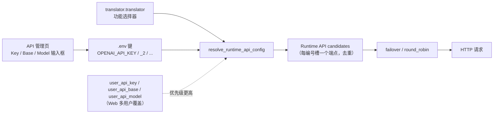

# API 凭据、地址与模型

当使用 OpenAI、Gemini 或 Sakura 等远程 API 时，本页说明如何填写各提供商的密钥（Key）、API 地址（Base）与模型名（Model）三个字段，它们如何保存到 `.env`、如何通过编号通道（`_2`、`_3` …）复用，以及界面如何隐藏和脱敏这些值。本页不负责提供商页签、功能选择器、槽轮换策略、连接测试、自定义请求参数和预设；它们分别在[提供商页签](./provider-tabs.md)、[功能选择器](./feature-selectors.md)、[通道与轮询策略](./slots-and-rotation.md)、[连接测试与模型列表](./connection-tests-and-model-list.md)、[自定义请求参数](./custom-request-parameters.md) 和[预设与持久化](./presets-and-persistence.md) 中说明。

## 功能边界

- Key/Base/Model 是“API 通道”卡片的三个字段：Key 保存密钥、Base 保存请求地址、Model 保存模型名，三者各自对应一个 `.env` 键。
- 只有被当前功能选择器激活的提供商分组才显示凭据卡片。OpenAI/Gemini 使用 Key/Base/Model；Sakura 只有地址和词典路径，没有 Key 与 Model。
- `.env` 是桌面端唯一凭据持久化位置；`config.json` 与 `config/config-example.json` 不保存 API 密钥。Web 多用户场景的 `user_api_key`/`user_api_base`/`user_api_model` 是配置覆盖，不属于本页输入框。
- `_2`、`_3` 等编号后缀是同一提供商内部的候选通道，不是新翻译器；切换翻译器仍由 `translator.translator` 决定。

## UI 操作

### 在 API 管理页填写凭据

1. 打开左侧导航“API 管理”（`API Management`）。页面副标题为“管理每个翻译器的 API 密钥和环境变量”（`Manage API keys and environment variables for each translator`）。
2. 在顶部页签中选择“翻译”（`Translation`）、“文字识别”（`OCR`）、“上色”（`Colorization`）或“渲染”（`Render`）。
3. 每个页签顶部是功能选择器行（标签如“翻译器：”）和“测试当前页”（`Test Current Tab`）按钮。切换功能会刷新下方凭据分组，详细边界见[功能选择器](./feature-selectors.md)。
4. 被激活的提供商显示一张或多张“API 通道”卡片。卡片标题左侧是两位编号徽标（例如 `01`、`02`），右侧是“API 通道”（`API slot`），右上角是删除按钮（`Delete`）。编号只显示在徽标中，不拼进标题文字。
5. 卡片内按顺序显示三个字段：Key（例如“OpenAI API Key”）、Model（例如“OpenAI Model”）、Base（例如“OpenAI API Base”）。
6. 密钥输入框默认以掩码显示（密码回显模式），点击行内眼睛图标可在“显示密钥”（`Show key`）与“隐藏密钥”（`Hide key`）之间切换。
7. Key 行右侧有“测试”（`Test`）按钮，Model 行右侧有“获取模型”（`Get Models`）按钮，Base 行没有按钮。
8. 点击“+ 添加 API 通道”（`+ Add API slot`）会为当前提供商创建编号为 `_2` 的下一个通道；达到界面上限后按钮隐藏。
9. 任一字段修改后立即更新内存与 `os.environ`，并在 250ms 合并后由后台线程原子写回 `.env`。

### 页面、页签与操作文案

| 调用 key | English 实际值 | 简体中文实际值 |
| --- | --- | --- |
| `API Management` | API Management | API 管理 |
| `Manage API keys and environment variables for each translator` | Manage API keys and environment variables for each translator | 管理每个翻译器的 API 密钥和环境变量 |
| `Translation` | Translation | 翻译 |
| `OCR` | OCR | 文字识别 |
| `Colorization` | Colorization | 上色 |
| `Render` | Render | 渲染 |
| `label_translator` | Translator | 翻译器 |
| `label_ocr` | OCR Model | OCR模型 |
| `label_colorizer` | Colorization Model | 上色模型 |
| `label_renderer` | Renderer | 渲染器 |
| `Test Current Tab` | Test Current Tab | 测试当前页 |
| `Test` | Test | 测试 |
| `Get Models` | Get Models | 获取模型 |
| `Show Secret` | Show key | 显示密钥 |
| `Hide Secret` | Hide key | 隐藏密钥 |
| `Delete` | Delete | 删除 |
| `+ Add API slot` | + Add API slot | + 添加 API 通道 |
| `API slot {index}` | API slot | API 通道 |
| `placeholder_paste_key` | Paste your key | 粘贴你的密钥 |
| `placeholder_paste_token` | Paste your token | 粘贴你的令牌 |
| `API rotation strategy:` | Rotation strategy: | 轮询策略： |
| `No translation API required` | The current translator does not require an OpenAI/Gemini API key. | 当前翻译器不需要 OpenAI/Gemini API Key。 |
| `No OCR API required` | The current OCR does not require an OpenAI/Gemini API key. | 当前 OCR 不需要 OpenAI/Gemini API Key。 |
| `No colorization API required` | The current colorizer does not require an OpenAI/Gemini API key. | 当前上色器不需要 OpenAI/Gemini API Key。 |
| `No render API required` | The current renderer does not require an OpenAI/Gemini API key. | 当前渲染器不需要 OpenAI/Gemini API Key。 |

### 凭据字段文案

| 调用 key | English 实际值 | 简体中文实际值 |
| --- | --- | --- |
| `label_OPENAI_API_KEY` | OpenAI API Key | OpenAI API 密钥 |
| `label_OPENAI_MODEL` | OpenAI Model | OpenAI 模型 |
| `label_OPENAI_API_BASE` | OpenAI API Base | OpenAI API 地址 |
| `label_GEMINI_API_KEY` | Gemini API Key | Gemini API 密钥 |
| `label_GEMINI_MODEL` | Gemini Model | Gemini 模型 |
| `label_GEMINI_API_BASE` | Gemini API Base | Gemini API 地址 |
| `label_OCR_OPENAI_API_KEY` | OCR OpenAI API Key | 文字识别 OpenAI API 密钥 |
| `label_OCR_OPENAI_MODEL` | OCR OpenAI Model | 文字识别 OpenAI 模型 |
| `label_OCR_OPENAI_API_BASE` | OCR OpenAI API Base | 文字识别 OpenAI API 地址 |
| `label_OCR_GEMINI_API_KEY` | OCR Gemini API Key | 文字识别 Gemini API 密钥 |
| `label_OCR_GEMINI_MODEL` | OCR Gemini Model | 文字识别 Gemini 模型 |
| `label_OCR_GEMINI_API_BASE` | OCR Gemini API Base | 文字识别 Gemini API 地址 |
| `label_COLOR_OPENAI_API_KEY` | Colorization OpenAI API Key | 上色 OpenAI API 密钥 |
| `label_COLOR_OPENAI_MODEL` | Colorization OpenAI Model | 上色 OpenAI 模型 |
| `label_COLOR_OPENAI_API_BASE` | Colorization OpenAI API Base | 上色 OpenAI API 地址 |
| `label_COLOR_GEMINI_API_KEY` | Colorization Gemini API Key | 上色 Gemini API 密钥 |
| `label_COLOR_GEMINI_MODEL` | Colorization Gemini Model | 上色 Gemini 模型 |
| `label_COLOR_GEMINI_API_BASE` | Colorization Gemini API Base | 上色 Gemini API 地址 |
| `label_RENDER_OPENAI_API_KEY` | Rendering OpenAI API Key | 渲染 OpenAI API 密钥 |
| `label_RENDER_OPENAI_MODEL` | Rendering OpenAI Model | 渲染 OpenAI 模型 |
| `label_RENDER_OPENAI_API_BASE` | Rendering OpenAI API Base | 渲染 OpenAI API 地址 |
| `label_RENDER_GEMINI_API_KEY` | Rendering Gemini API Key | 渲染 Gemini API 密钥 |
| `label_RENDER_GEMINI_MODEL` | Rendering Gemini Model | 渲染 Gemini 模型 |
| `label_RENDER_GEMINI_API_BASE` | Rendering Gemini API Base | 渲染 Gemini API 地址 |
| `label_SAKURA_API_BASE` | SAKURA API Base | SAKURA API 地址 |
| `label_SAKURA_DICT_PATH` | SAKURA Dictionary Path | SAKURA 词典路径 |

## 字段与 .env 键映射

界面字段名来自 `app_logic.py` 的 `labels` 映射，再经 i18n 翻译；`.env` 键是实际存储键。运行时允许 OCR/上色/渲染使用未加作用域前缀的翻译器键作为回退。

| 界面字段（实际文案） | `.env` 键 | 说明 |
| --- | --- | --- |
| OpenAI API Key | `OPENAI_API_KEY` | 密钥；输入框掩码；占位符“粘贴你的密钥” |
| OpenAI Model | `OPENAI_MODEL` | 模型名；占位符 `gpt-4o`；“获取模型”可写回 |
| OpenAI API Base | `OPENAI_API_BASE` | API 地址；占位符 `https://api.openai.com/v1` |
| Gemini API Key | `GEMINI_API_KEY` | 密钥；输入框掩码 |
| Gemini Model | `GEMINI_MODEL` | 模型名；占位符 `gemini-1.5-flash-002` |
| Gemini API Base | `GEMINI_API_BASE` | API 地址；占位符 `https://generativelanguage.googleapis.com` |
| OCR OpenAI API Key | `OCR_OPENAI_API_KEY` | 密钥；运行时回退 `OPENAI_API_KEY` |
| OCR OpenAI Model | `OCR_OPENAI_MODEL` | 模型名；占位符 `gpt-4o` |
| OCR OpenAI API Base | `OCR_OPENAI_API_BASE` | API 地址；占位符 `https://api.openai.com/v1`；回退 `OPENAI_API_BASE` |
| OCR Gemini API Key | `OCR_GEMINI_API_KEY` | 密钥；运行时回退 `GEMINI_API_KEY` |
| OCR Gemini Model | `OCR_GEMINI_MODEL` | 模型名；占位符 `gemini-1.5-flash` |
| OCR Gemini API Base | `OCR_GEMINI_API_BASE` | API 地址；占位符 `https://generativelanguage.googleapis.com`；回退 `GEMINI_API_BASE` |
| Colorization OpenAI API Key | `COLOR_OPENAI_API_KEY` | 密钥；运行时回退 `OPENAI_API_KEY` |
| Colorization OpenAI Model | `COLOR_OPENAI_MODEL` | 模型名；占位符 `gpt-image-1` |
| Colorization OpenAI API Base | `COLOR_OPENAI_API_BASE` | API 地址；占位符 `https://api.openai.com/v1`；回退 `OPENAI_API_BASE` |
| Colorization Gemini API Key | `COLOR_GEMINI_API_KEY` | 密钥；运行时回退 `GEMINI_API_KEY` |
| Colorization Gemini Model | `COLOR_GEMINI_MODEL` | 模型名；占位符 `gemini-2.0-flash-preview-image-generation` |
| Colorization Gemini API Base | `COLOR_GEMINI_API_BASE` | API 地址；占位符 `https://generativelanguage.googleapis.com`；回退 `GEMINI_API_BASE` |
| Rendering OpenAI API Key | `RENDER_OPENAI_API_KEY` | 密钥；运行时回退 `OPENAI_API_KEY` |
| Rendering OpenAI Model | `RENDER_OPENAI_MODEL` | 模型名；占位符 `gpt-image-1` |
| Rendering OpenAI API Base | `RENDER_OPENAI_API_BASE` | API 地址；占位符 `https://api.openai.com/v1`；回退 `OPENAI_API_BASE` |
| Rendering Gemini API Key | `RENDER_GEMINI_API_KEY` | 密钥；运行时回退 `GEMINI_API_KEY` |
| Rendering Gemini Model | `RENDER_GEMINI_MODEL` | 模型名；占位符 `gemini-2.0-flash-preview-image-generation` |
| Rendering Gemini API Base | `RENDER_GEMINI_API_BASE` | API 地址；占位符 `https://generativelanguage.googleapis.com`；回退 `GEMINI_API_BASE` |
| SAKURA API Base | `SAKURA_API_BASE` | 地址；占位符 `http://127.0.0.1:8080/v1`；没有 Key/Model |
| SAKURA Dictionary Path | `SAKURA_DICT_PATH` | 术语表路径；占位符 `./dict/sakura_dict.txt` |

占位符只是输入框提示，不是写入值；`_get_env_default_placeholder()` 会把 `OCR_`/`COLOR_`/`RENDER_` 前缀去掉后复用基础默认值。`keys.py` 还定义 `BAIDU_*`、`YOUDAO_*`、`DEEPL_AUTH_KEY`、`CAIYUN_TOKEN`、`GROQ_*`、`DEEPSEEK_*`、`TOGETHER_*` 等历史环境变量，但当前 `API_GROUP_SPECS` 与 `Translator` 枚举只驱动 OpenAI/Gemini/Sakura 的凭据卡片，未激活的键不会在 API 管理页显示。

## 编号通道字段

同一个提供商的三个字段可以按编号组成多个候选通道。编号从 `1` 开始，`1` 对应基础键本身，`2` 及以上在键名末尾追加 `_<编号>`：

- `OPENAI_API_KEY`、`OPENAI_MODEL`、`OPENAI_API_BASE` 是 1 号通道。
- `OPENAI_API_KEY_2`、`OPENAI_MODEL_2`、`OPENAI_API_BASE_2` 是 2 号通道，以此类推。

- `get_indexed_env_key(base_key, index)` 负责生成编号键：`index <= 1` 返回基础键，否则返回 `f"{base_key}_{index}"`。
- `get_rotation_slot_count()` 扫描当前 `.env` 中所有形如 `<base>_<编号>` 的键，取最大编号作为通道数量；空槽的卡片会照常显示。
- 界面上限 `API_ROTATION_UI_MAX_SLOTS = min(10, MAX_ROTATION_SLOTS)`，其中引擎层 `MAX_ROTATION_SLOTS = 30`；达到上限后“+ 添加 API 通道”按钮隐藏。
- “+ 添加 API 通道”先为新编号的三个键写入空值再刷新；删除某张卡片时 `_delete_api_rotation_slot()` 会把后续槽整体前移，保持卡片编号连续，再删除最后一个槽的键。
- 每个提供商组还有一个策略键，例如 `OPENAI_API_ROTATION_STRATEGY`、`OCR_OPENAI_API_ROTATION_STRATEGY`，由“轮询策略：”下拉框写入；策略如何决定请求顺序见[通道与轮询策略](./slots-and-rotation.md)。
- 运行时按 1..通道数读取每个编号的 Key/Base/Model，并去掉 `(api_key, base_url, model)` 完全相同的重复端点。

## 隐藏与脱敏

- `_is_secret_env_key()` 把包含 `API_KEY`、`AUTH_KEY` 或 `TOKEN` 的键视为机密，例如 `OPENAI_API_KEY`、`DEEPL_AUTH_KEY`、`CAIYUN_TOKEN`。
- 机密字段使用密码回显模式（`QLineEdit.EchoMode.Password`），行内眼睛图标在“显示密钥”（`Show key`）与“隐藏密钥”（`Hide key`）之间切换；工具提示文案来自 `Show Secret` / `Hide Secret` 两个 locale key。
- 密钥与令牌的占位符分别是“粘贴你的密钥”（`Paste your key`）和“粘贴你的令牌”（`Paste your token`），不包含真实值。
- `.env` 是明文本地文件，位于打包后的 exe 目录或开发时的项目根目录；不要提交、导出或截图真实密钥。预设可以保存 API 环境变量，但导出的配置 JSON 明确排除 API 密钥，见[预设与持久化](./presets-and-persistence.md)。

## 运行机理

`ConfigService` 启动时把 `.env` 读入内存并加载到 `os.environ`（`load_app_dotenv(override=True)`）。输入框每次修改都会立即更新内存和 `os.environ`，并由 `QTimer` 以 250ms 合并，之后在“config-writer”后台线程中把整个 `.env` 原子重写为 `KEY="value"` 行。翻译器、OCR、上色器和渲染器在 `parse_args()` 时调用 `resolve_runtime_api_config()`，按编号槽读取环境变量并构造候选端点，最后交给 `failover`/`round_robin` 策略发起实际请求。

对 OpenAI 兼容的本地端点（`localhost`、私有 IP、`.local` 等），空密钥会被规范化为 `ollama` 占位值，使 Ollama 等本地服务无需填写密钥即可工作；非本地端点仍要求真实密钥。

## 依赖与冲突

- 功能选择器决定显示哪个提供商分组；在 API 管理页切换翻译器会写同一个 `translator.translator` 键，并刷新所需凭据组。
- 开启混合 OCR（`ocr.use_hybrid_ocr`）时，主 OCR 与副 OCR 对应的 OpenAI/Gemini 分组可能同时显示。
- Sakura 分组只有地址与词典路径；没有 Key/Model，也就没有“获取模型”按钮，但“测试”仍按地址执行。
- Web 服务场景下，`translator.user_api_key`/`user_api_base`/`user_api_model` 以及服务器端 `_runtime_api_overrides` 的优先级高于 `.env`；桌面端默认不存在这些覆盖。
- 本页字段与自定义请求参数（`config/custom_api_params.json`）无关；模型名会成为请求体中的 `model` 字段，自定义参数按模型名匹配预设。
- 未激活的历史环境变量（DeepL、彩云、百度、有道、Groq、DeepSeek、Together 等）不会在界面显示，但代码仍保留其读取逻辑。

## 关联文件与格式

| 文件/格式 | 本页实际作用 | 手改与兼容注意 |
| --- | --- | --- |
| `.env` | 桌面端唯一凭据持久化位置 | `KEY="value"` 格式；含真实密钥，禁止提交或展示 |
| `config/config-example.json` | 发行配置示例 | 不包含 API 密钥；`translator.translator` 默认 `openai` |
| `config/config.json` | 用户设置持久化 | 不保存凭据；导入/导出会保留敏感信息 |
| `manga_translator/translators/keys.py` | 历史环境变量默认值 | 部分键当前没有 API 管理卡片 |
| `desktop_qt_ui/services/preset_service.py` | 预设可保存 API 环境变量 | 预设应用会整体替换 `.env`，见预设页 |

## 源码依据 {#source-evidence}

| 层级 | 文件 | 本页核对内容 |
| --- | --- | --- |
| UI 控件 | `desktop_qt_ui/ui/main_page/env_management.py` | 字段创建、掩码与眼睛切换、Test/Get Models、编号槽增删与压缩 |
| UI 分组与页签 | `desktop_qt_ui/ui/main_page/dynamic_settings.py`、`desktop_qt_ui/ui/main_page/pages/env_page.py` | `API_GROUP_SPECS`、`SIMPLE_API_GROUP_SPECS`、四个页签与副标题 |
| UI/i18n | `desktop_qt_ui/app_logic.py`、`desktop_qt_ui/locales/en_US.json`、`zh_CN.json` | `labels` 映射、key 与实际中英文显示值 |
| 持久化 | `desktop_qt_ui/services/config_service.py`、`manga_translator/utils/dotenv_utils.py` | `.env` 路径、250ms 合并、原子重写 |
| 候选解析 | `manga_translator/runtime_api_resolver.py`、`manga_translator/api_key_rotation.py` | 编号读取、去重、策略键、最大槽数 |
| 最终消费者 | `manga_translator/translators/openai.py`、`gemini.py`、`ocr/model_api_ocr.py`、`colorization/model_api_colorizer.py`、`rendering/model_api_renderer.py` | 默认地址/模型、fallback 键、本地空密钥占位 |

## 验证记录 {#verification}

| 验证内容 | 状态 | 说明 |
| --- | --- | --- |
| BLUEPRINT、PAGE_GUIDELINES、TODO | 完成 | 已读取 1.3 节与 5.6 小节并按页面合同编写 |
| UI 布局与调用 | 完成 | 静态核对 env_page、dynamic_settings、env_management |
| `en_US` / `zh_CN` 实际 locale | 完成 | 表格逐项记录 key、English、简体中文实际值 |
| 字段与 `.env` 映射 | 完成 | 核对 `API_GROUP_SPECS`、`runtime_api_resolver.py`、`keys.py` |
| 脱敏运行验证 | 待后续 | 未读取真实 `.env`、用户配置、API key/token、用户名、用户图片或私有提示词 |
| VitePress | 待运行 | 由协调代理在合并前运行 `npm run docs:build --prefix doc/wiki` 及镜像/源码检查 |