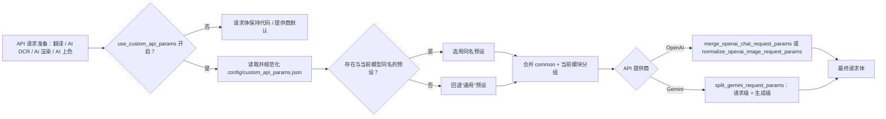
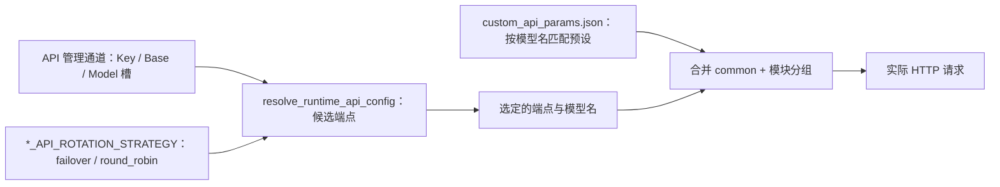

# 自定义请求参数

当需要给翻译、AI OCR、AI 渲染或 AI 上色请求附加 `temperature`、`top_p`、`max_tokens` 等请求体字段时，本页说明 `config/custom_api_params.json` 的文件结构、模型预设匹配、按模块分组合并进 OpenAI/Gemini 请求体的规则，以及与 `*_API_ROTATION_STRATEGY` 轮询策略的边界。本页不负责连接凭据、模型选择或 API 通道轮询；它们分别在[API 凭据、地址与模型](./credentials-addresses-models.md)和[通道与轮询策略](./slots-and-rotation.md)中说明。总开关位于[设置 → 通用](../settings/general-and-app.md)。

## 功能边界

- `config/custom_api_params.json` 是请求体额外参数文件：它只向 OpenAI/Gemini 请求体追加字段，不保存连接凭据（Key/Base/Model 在 `.env`）、不选择模型、不参与 `*_API_ROTATION_STRATEGY` 的候选通道轮询。
- 顶层布尔键 `use_custom_api_params` 决定是否读取该文件；旧版本放在 `translator.use_custom_api_params` 的值会在加载时迁移到顶层。
- 文件顶层是“模型预设”对象；默认预设名为“通用”，该字符串是存储值，不随界面语言翻译。
- 每个预设固定包含 `common`、`translator`、`ocr`、`colorizer`、`render` 五个分组；运行时只合并 `common` 与当前 API 模块分组，其他模块分组不会混入请求。
- 预设按请求实际使用的模型名匹配：存在同名顶层预设时优先，否则回退“通用”。

## UI 操作

### 打开自定义参数编辑器 {#open-editor}

1. 打开“设置”（`Settings`），选择“通用”（`General`）分组。
2. 找到“使用自定义API参数”（`Use Custom API Params`）开关；它绑定顶层配置键 `use_custom_api_params`。
3. 点击行内“编辑”（`Edit`）按钮，打开“编辑自定义 API 参数”（`Edit Custom API Params`）对话框；文件不存在时后端会先创建默认文件。
4. 对话框顶部“模型预设”（`Model Preset`）下拉框选择当前编辑的预设；默认选中“通用”，可“添加预设”（`Add Preset`）、“重命名”（`Rename`）或“删除”（`Delete`）除“通用”外的预设。
5. 在“分类 API 参数”（`Grouped API Params`）页签中，按分组页签编辑字段行：Key 参数名、Type 类型、Value 值、删除按钮；类型下拉框固定为字符串（`String`）、数值（`Number`）、布尔值（`Boolean`）、空值（`Null`）和 JSON。
6. 或切换到“源码编辑”（`Raw Edit`）页签直接编辑整个 JSON 文件内容。
7. 点击“保存”（`Save`）写回文件，状态栏显示“保存成功”（`Saved successfully`）；JSON 语法或结构错误时显示对应错误信息，不写回文件。

### 编辑器文案 {#editor-copy}

| UI 调用 key | English 实际值 | 简体中文实际值 |
| --- | --- | --- |
| `Settings` | Settings | 设置 |
| `General` | General | 通用 |
| `label_use_custom_api_params` | Use Custom API Params | 使用自定义API参数 |
| `desc_use_custom_api_params` | Match a parameter preset by the current model and fall back to General; each API module reads only common and its own section. Applies to translation, AI OCR, AI rendering, and AI colorization. | 按当前模型匹配参数预设，找不到时回退“通用”；每个 API 模块只读取 common 和自身分组。适用于翻译、AI 识别、AI 渲染、AI 上色。 |
| `Edit` | Edit | 编辑 |
| `Edit Custom API Params` | Edit Custom API Params | 编辑自定义 API 参数 |
| `At runtime, each API module selects the preset named after its current model and falls back to General. Only common and that module's section are merged.` | At runtime, each API module selects the preset named after its current model and falls back to General. Only common and that module's section are merged. | 运行时，各 API 模块按当前模型名自动选择同名预设；找不到时回退“通用”。只合并 common 与当前模块分组。 |
| `Model Preset` | Model Preset | 模型预设 |
| `Add Preset` | Add Preset | 添加预设 |
| `Rename` | Rename | 重命名 |
| `Delete` | Delete | 删除 |
| `Grouped API Params` | Grouped API Params | 分类 API 参数 |
| `Each preset contains common, translator, OCR, colorizer, and render sections. Parameters are never sent across modules.` | Each preset contains common, translator, OCR, colorizer, and render sections. Parameters are never sent across modules. | 每个预设固定包含 common、translator、ocr、colorizer、render，模块之间不会互相发送参数。 |
| `Raw Edit` | Raw Edit | 源码编辑 |
| `label_translator` | Translator | 翻译器 |
| `label_ocr` | OCR Model | OCR模型 |
| `label_colorizer` | Colorization Model | 上色模型 |
| `label_renderer` | Renderer | 渲染器 |
| `Key` | Key | 参数名 |
| `Type` | Type | 类型 |
| `Value` | Value | 值 |
| `String` | String | 字符串 |
| `Number` | Number | 数值 |
| `Boolean` | Boolean | 布尔值 |
| `Null` | Null | 空值 |
| `JSON`（硬编码，不经 i18n） | JSON | JSON |
| `Add Row` | Add Row | 添加行 |
| `Refresh` | Refresh | 刷新 |
| `Cancel` | Cancel | 取消 |
| `Save` | Save | 保存 |
| `Loaded successfully` | Loaded successfully | 加载成功 |
| `Saved successfully` | Saved successfully | 保存成功 |
| `Load failed` | Load failed | 加载失败 |
| `Save failed` | Save failed | 保存失败 |
| `JSON format error` | JSON format error | JSON 格式错误 |
| `JSON root must be an object` | JSON root must be an object | JSON 顶层必须是对象 |
| `Duplicate parameter name: {name}` | Duplicate parameter name: {name} | 参数名重复：{name} |
| `Number value is empty` | Number value is empty | 数值不能为空 |
| `Number value is invalid` | Number value is invalid | 数值无效 |
| `JSON value is empty` | JSON value is empty | JSON 值不能为空 |
| `Parameter name cannot be empty` | Parameter name cannot be empty | 参数名不能为空 |
| `Enter preset name:` | Enter preset name: | 输入预设名称： |
| `OK` | OK | 确定 |
| `Warning` | Warning | 警告 |
| `Preset name cannot be empty` | Preset name cannot be empty | 预设名称不能为空 |
| `Preset '{name}' already exists` | Preset '{name}' already exists | 预设“{name}”已存在 |
| `Rename Preset` | Rename Preset | 重命名预设 |
| `Confirm` | Confirm | 确认 |
| `Are you sure you want to delete preset '{name}'?` | Are you sure you want to delete preset '{name}'? | 确定要删除预设 '{name}' 吗？ |

分组页签标题来自 `CUSTOM_API_PARAM_SECTIONS` 顺序：`common` 显示“通用”（`General`），`translator` 显示“翻译器”（`Translator`），`ocr` 显示“OCR模型”（`OCR Model`），`colorizer` 显示“上色模型”（`Colorization Model`），`render` 显示“渲染器”（`Renderer`）。输入框占位符（`temperature`、`gpt-4o-mini`、`0.2`、`{"type": "json"}`）是硬编码示例，不是可选项。

## 文件结构与默认值

### 文件位置与生成 {#file-location}

- 路径：`get_custom_api_params_path()` 返回 `get_config_dir()/custom_api_params.json`，即可执行文件旁的 `config/` 目录（开发仓库中为 `config/custom_api_params.json`）。
- 桌面端启动时 `ConfigService` 与运行时文件工厂调用 `ensure_custom_api_params_file()`：文件缺失时用代码默认内容创建；内容与旧版默认 MD5 一致时重建；旧版“无预设包装”结构会迁移到“通用”预设。已有用户修改不会被覆盖。
- 编辑器“保存”（`Save`）以 UTF-8、2 空格缩进写回该文件；后端创建默认文件使用临时文件加原子替换。

### 默认结构与分组 {#default-structure}

文件顶层是“预设名 → 预设对象”。代码在文件缺失时生成的默认内容（脱敏示例，不含密钥）：

```json
{
  "通用": {
    "common": {},
    "translator": {
      "temperature": 0.3,
      "top_p": 0.95
    },
    "ocr": {
      "temperature": 0.0
    },
    "colorizer": {},
    "render": {}
  }
}
```

| 分组 | 合并进哪个模块请求 | 代码默认内容 | 说明 |
| --- | --- | --- | --- |
| `common` | 全部模块 | `{}` | 每个预设都会先复制该分组 |
| `translator` | 翻译 | `{"temperature": 0.3, "top_p": 0.95}` | 只进入翻译请求 |
| `ocr` | AI OCR | `{"temperature": 0.0}` | 只进入 AI OCR 请求 |
| `colorizer` | AI 上色 | `{}` | 只进入 AI 上色请求 |
| `render` | AI 渲染 | `{}` | 只进入 AI 渲染请求 |

规范化只保留上述 5 个分组；其他顶层分组名不会被任何模块读取，也不会进入请求体。字段名和值由各 API 决定，例如 OpenAI 聊天常见的 `temperature`、`top_p`、`max_tokens`、`frequency_penalty`、`response_format`，Gemini 常见的 `top_p`、`top_k`、`max_output_tokens`、`safety_settings`、`response_modalities`；不在列表中的键按“原样合并”或“驼峰转换”规则处理，见下文。

## 参数与选项

#### `use_custom_api_params` — 使用自定义API参数 / Use Custom API Params {#use-custom-api-params}

- 控件：开关 + “编辑”（`Edit`）文件编辑按钮。
- 所在界面：设置 → 通用；UI 调用 key 为 `label_use_custom_api_params`，说明 key 为 `desc_use_custom_api_params`。
- 存储值：顶层布尔键 `use_custom_api_params`；旧版本写入 `translator.use_custom_api_params` 的值会在加载时迁移到顶层。
- 可选值：`true` / `false`；没有枚举下拉选项。
- 默认值：核心代码 `manga_translator/config.py#Config.use_custom_api_params` 为 `false`；Qt 模型 `desktop_qt_ui/core/config_models.py#AppSettings.use_custom_api_params` 为 `false`；发行配置 `config/config-example.json` 为 `true`。
- 生效阶段：翻译、AI OCR、AI 渲染、AI 上色的 API 请求构造。
- 原理：开启后，各消费者在每次请求时调用 `resolve_custom_api_params()`：按模型名选择预设，合并 `common` 与当前模块分组，再交给 OpenAI/Gemini 合并器写进请求体；关闭时直接返回空参数，请求体保持代码/提供商默认。
- 依赖与冲突：需要 `config/custom_api_params.json` 可解析且结构合法；它不保存凭据、不选择模型、不参与通道轮询。Web 模式下该键是服务器端配置，`SERVER_HIDDEN_CONFIG_KEYS` 会把它从用户配置接口隐藏。
- 性能/API 成本：额外字段会改变采样或请求体大小；例如更高的 `temperature` 可能提高重试概率，更大的图像输出配置增加 token 与带宽成本。
- 关联文件和调试产物：`config/custom_api_params.json`、`config/config-example.json`；日志中会出现“已启用自定义API参数[分组]”的脱敏行。
- 图示：必须有预设匹配与请求体合并 Mermaid，见[预设匹配与合并](#preset-resolution)。
- 源码依据：定义 `manga_translator/config.py`、`desktop_qt_ui/core/config_models.py`；UI `desktop_qt_ui/ui/main_page/dynamic_settings.py`、`env_management.py`、`ui/secondary_pages/custom_api_params_editor.py`；解析 `manga_translator/custom_api_params.py`；消费者 `manga_translator/translators/openai.py`、`gemini.py`、`ocr/model_api_ocr.py`、`colorization/model_api_colorizer.py`、`rendering/model_api_renderer.py`。
- 验证状态：源码/i18n 静态核对完成；脱敏运行验证待后续。

## 运行机理

### 预设匹配与合并 {#preset-resolution}

每次 API 请求按以下顺序解析自定义参数：

1. `is_custom_api_params_enabled(config)` 读取顶层 `use_custom_api_params`，旧值回退 `translator.use_custom_api_params`；关闭时直接返回空参数。
2. `load_custom_api_params_file()` 读取并规范化文件；JSON 非法时记录错误并返回空预设。
3. `resolve_custom_api_params_for_model()` 取请求使用的模型名（去掉首尾空白）；若存在同名顶层预设则选用，否则回退“通用”。
4. 合并 = 预设的 `common` + 当前模块分组；`section` 只能是 `translator` / `ocr` / `colorizer` / `render`，其他值抛 `ValueError`。
5. 消费者按提供商调用合并器，把结果写进最终请求体。



模型名来自 API 管理通道或翻译器默认，不由本文件决定；因此同一配置文件在不同模型上可能匹配不同预设。

### OpenAI 请求体合并 {#openai-merge}

| 消费者 | 合并器 | 基础请求字段 | 自定义参数行为 |
| --- | --- | --- | --- |
| 翻译（`openai.py`、`openai_hq.py`） | `merge_openai_chat_request_params` | `model`、`messages`、可选 `max_tokens` | 除 `model`、`messages`、`stream` 外的键全部覆盖/追加；自定义 `max_tokens` 可覆盖代码值；`stream` 由流式开关控制，不能覆盖 |
| AI OCR（`ocr/model_api_ocr.py`） | `merge_openai_chat_request_params` | `model`、`messages` | 同上 |
| AI 渲染 / AI 上色（`rendering/model_api_renderer.py`、`colorization/model_api_colorizer.py`） | `normalize_openai_image_request_params` | 由图片接口拼接 `model`、`prompt`、图片等 | `extra_body` 展开到顶层（已存在的顶层键优先）；`model`、`prompt`、`image`、`images`、`messages`、`input` 被丢弃 |

示例：翻译基础参数是 `model` + `messages`（+ 可选 `max_tokens`）；预设写入 `temperature: 0.7` 后，最终请求体为 `{"model": ..., "messages": ..., "temperature": 0.7}`。

### Gemini 请求体合并 {#gemini-merge}

`split_gemini_request_params` 把自定义参数分成请求级与生成级：

- 请求级键（映射到 REST 请求字段）：`safety_settings` → `safetySettings`、`system_instruction` → `systemInstruction`、`tool_config` → `toolConfig`、`cached_content` → `cachedContent`、`automatic_function_calling` → `automaticFunctionCalling`、`tools`。
- 生成级键（映射到 `generationConfig`）：`top_p` → `topP`、`top_k` → `topK`、`max_output_tokens` → `maxOutputTokens`、`stop_sequences` → `stopSequences`、`candidate_count` → `candidateCount`、`response_modalities` → `responseModalities`、`response_mime_type` → `responseMimeType`、`response_schema` → `responseSchema`、`presence_penalty` → `presencePenalty`、`frequency_penalty` → `frequencyPenalty`、`thinking_budget` → `thinkingBudget`；其他 snake_case 键按驼峰转换。
- `model`、`contents` 永远跳过；`generationConfig` / `generation_config` 嵌套对象会被展开进生成级。
- 翻译（SDK 路径，`gemini.py`、`gemini_hq.py`）：`apply_gemini_sdk_generation_params` 只把生成级字段写入 `GenerateContentConfig`（属性名转回 snake_case）；请求级字段不通过 SDK 注入，代码自行设置 `safety_settings` 等基础配置。
- AI OCR / 渲染 / 上色（REST 路径）：请求级覆盖写进请求 kwargs，生成级写进 `generationConfig`。

### 优先级与覆盖规则 {#priority-rules}

- 关闭开关优先于一切：`use_custom_api_params=false` 时完全不读取文件。
- 同名预设优先于“通用”：模型名精确匹配才启用同名预设。
- 只合并 `common` + 当前分组：其他模块分组不参与，字段名在同一个预设内也不能重复。
- 保留字段不可覆盖：OpenAI `model`、`messages`、`stream`；Gemini `model`、`contents`；图像请求 `model`、`prompt`、`image`、`images`、`messages`、`input`。
- 其余字段覆盖代码默认：例如 Gemini 代码默认 `top_p=0.95`、`top_k=64`，预设写入 `top_p` 会覆盖；OpenAI 翻译预设的 `max_tokens` 覆盖基础 `max_tokens`。
- OpenAI 图像请求的 `extra_body` 展开时“已存在的顶层键优先”，即顶层自定义键优先于 `extra_body` 内同名键。

## 与 API 轮询策略的边界 {#rotation-boundary}

| 配置 | 作用 | 注意事项 |
| --- | --- | --- |
| `.env` 中的 Key/Base/Model 及编号通道 | 保存连接凭据与端点 | 见[API 凭据、地址与模型](./credentials-addresses-models.md) |
| `*_API_ROTATION_STRATEGY`（例如 `OPENAI_API_ROTATION_STRATEGY`） | 在候选端点间 `failover` / `round_robin` | 只决定“用哪个端点”，不改变请求体字段 |
| `config/custom_api_params.json` | 请求体额外参数 | 不负责连接凭据、模型选择或 API 通道轮询 |



自定义参数按“本轮实际使用的模型名”匹配预设；模型名本身来自通道与轮询选中的端点，不由该文件决定。轮询策略改变的是候选端点的顺序与选择，不是请求体字段；通道重试、冷却、不可用和恢复也不会改动已合并的自定义参数。

## 依赖与冲突

- 预设匹配依赖请求使用的模型名；模型名来自 API 管理通道或翻译器默认，同一文件在不同模型上可能选中不同预设。
- JSON 语法或结构错误时自定义参数不可用：解析失败记录错误并返回空预设，翻译等流程仍按默认参数继续。
- 翻译的普通重试、质量重试与 API 通道轮询不会修改已合并的自定义参数；每次请求都会重新解析，模型名随轮询变化时预设可能改变。
- 不要把 API Key、Token、私有提示词写进该文件：这些值会被原样放入请求体并可能出现在日志/调试产物中。
- 该文件与上下文页数、提示词文件、RPM、流式开关相互独立；它们控制请求的不同维度，详见翻译器与设置页面。
- Web 模式下 `use_custom_api_params` 是服务器端键，不在 Web 用户配置接口显示。

## 关联文件与格式

| 文件/格式 | 本页实际作用 | 手改与兼容注意 |
| --- | --- | --- |
| `config/custom_api_params.json` | 请求体额外参数唯一持久化文件 | UTF-8 JSON，顶层为预设对象；只使用脱敏示例 |
| `config/config-example.json` | 发行默认 `use_custom_api_params: true` | 不包含密钥；导入会覆盖内存设置 |
| `config/config.json` | 用户设置持久化 | 保存开关值，不保存该文件内容 |
| `desktop_qt_ui/locales/en_US.json`、`zh_CN.json` | 设置与编辑器文案 | key 与实际显示值见上文表格 |

## Mermaid 数据流限制

上图描述源码确认的预设解析、请求体合并与轮询边界，不代表每次运行都必然携带自定义参数或发起网络请求。`use_custom_api_params=false`、文件缺失/非法、无同名预设、非 OpenAI/Gemini 模块都会走各自旁路；文档没有伪造运行截图或私有任务产物。

## 源码依据 {#source-evidence}

| 层级 | 文件 | 本页核对内容 |
| --- | --- | --- |
| 设置 UI | `desktop_qt_ui/ui/main_page/dynamic_settings.py`、`desktop_qt_ui/ui/main_page/settings_tab_layout.json` | General 分组、开关与 Edit 按钮 |
| 编辑器 UI | `desktop_qt_ui/ui/secondary_pages/custom_api_params_editor.py`、`desktop_qt_ui/ui/main_page/env_management.py`、`view.py` | 预设/分组/行编辑、Raw 编辑、保存与错误状态 |
| UI/i18n | `desktop_qt_ui/app_logic.py`、`desktop_qt_ui/locales/en_US.json`、`zh_CN.json` | key 映射与实际中英文显示值 |
| 配置模型 | `desktop_qt_ui/core/config_models.py`、`manga_translator/config.py` | Qt/发行/核心默认值与旧键迁移 |
| 文件解析 | `manga_translator/custom_api_params.py`、`manga_translator/runtime_files.py` | 默认内容、创建/迁移/规范化、预设匹配 |
| 请求合并 | `manga_translator/api_request_params.py` | OpenAI/Gemini 合并规则与保留字段 |
| 最终消费者 | `manga_translator/translators/openai.py`、`gemini.py`、`openai_hq.py`、`gemini_hq.py`、`ocr/model_api_ocr.py`、`colorization/model_api_colorizer.py`、`rendering/model_api_renderer.py` | 各模块按 section 解析并合并 |
| 轮询边界 | `manga_translator/runtime_api_resolver.py`、`manga_translator/api_key_rotation.py` | 策略键、候选端点与自定义参数的边界 |

## 验证记录 {#verification}

| 验证内容 | 状态 | 说明 |
| --- | --- | --- |
| BLUEPRINT、PAGE_GUIDELINES、TODO | 完成 | 已读取 1.3 节与 5.6 小节并按页面合同编写 |
| UI 布局与调用 | 完成 | 静态核对 dynamic_settings、env_management、custom_api_params_editor |
| `en_US` / `zh_CN` 实际 locale | 完成 | 表格逐项记录 key、English、简体中文实际值 |
| 预设解析与请求合并 | 完成 | 静态核对 custom_api_params.py、api_request_params.py 与各消费者 |
| 脱敏运行验证 | 待后续 | 未读取真实 `.env`、用户配置、API key/token、用户名、用户图片或私有提示词 |
| VitePress | 待运行 | 由协调代理在合并前运行 `npm run docs:build --prefix doc/wiki` 及镜像/源码检查 |