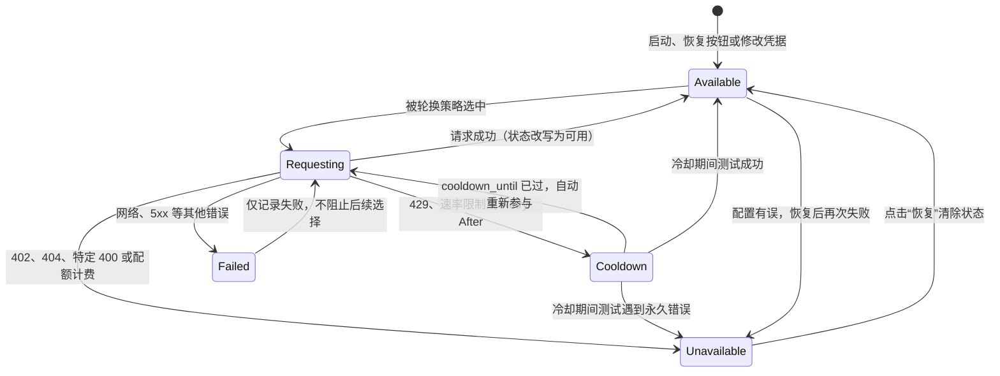
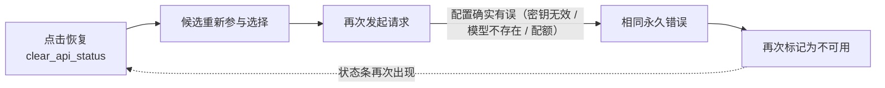

# 故障、冷却与恢复

当某个 API 候选通道（翻译、OCR、上色或渲染的某个编号槽）请求失败时，程序会在进程内为它记录一个状态，并用它决定后续请求是否继续选择这个候选。本页说明失败后的状态机：冷却、不可用、恢复到可用，以及“配置本身有误时恢复后仍会再失败”的原因；同时列出冷却与超时参数。

本页不负责候选通道的添加删除、编号徽标与两种轮换策略（见[API 通道与轮询策略](./slots-and-rotation.md)），不负责连接测试的对话框流程（见[连接测试与模型列表](./connection-tests-and-model-list.md)），也不负责普通请求重试的完整参数（见[重试、限流与质量](../translator/retry-rate-limit-and-quality.md)）。

## 功能边界 {#feature-boundary}

- 本页覆盖的是“候选端点”级别的状态：每个候选由 feature、provider、槽号、地址、模型和密钥指纹共同标识；状态保存在内存中，不写入 `.env` 或 `config.json`。
- 只有限流类错误会进入“冷却中”，只有永久错误会进入“不可用”；其他错误只记录为“失败”，不会阻止该候选被再次选中。
- 状态机对翻译、OCR、上色和渲染的 API 组同样生效，因为四类消费者都调用同一个轮换入口 `run_with_api_candidates`。
- 状态是进程内的：重启程序、修改 Key/Base/Model（状态身份变化）都会让旧状态失效；点击卡片上的“恢复”按钮则主动清除某个候选的状态。

## 界面状态与操作 {#ui-status-and-operations}

打开“API 管理”（`API Management`），某个通道卡片标题下方会出现状态条。状态条只在“冷却中”或“不可用”时出现，普通“失败”不会显示状态条。状态条右侧的“恢复”（`Restore`）按钮调用 `clear_api_status`，只清除当前进程内的失败状态，不修改任何 `.env` 值。

1. 用“测试当前页”（`Test Current Tab`）或行内“测试”（`Test`）验证通道；测试成功会把该候选标记为可用，失败则按错误类型进入冷却、不可用或仅失败记录。
2. 冷却中的候选会在冷却到期后自动重新参与候选选择；不可用的候选会一直被排除，直到手动点击“恢复”或修改凭据。
3. 开始翻译前，程序会先做候选可用性检查：如果某个必需功能组的所有候选都不可用，会阻止启动并提示“没有可用的 API 候选”（`No available API candidates`），详情列出对应通道，并建议重新启用对应 Key/通道或使用「测试当前页」确认后再开始。

| UI 调用 key | English 实际值 | 简体中文实际值 |
| --- | --- | --- |
| `API slot cooldown marker` | Cooling down | 冷却中 |
| `API slot unavailable marker` | Unavailable | 不可用 |
| `Restore API channel` | Restore | 恢复 |
| `Test` | Test | 测试 |
| `Test Current Tab` | Test Current Tab | 测试当前页 |
| `API batch test summary` | {total} total, {available} available, {unavailable} unavailable | 共 {total} 个，可用 {available} 个，不可用 {unavailable} 个 |
| `API candidate availability failed` | No available API candidates | 没有可用的 API 候选 |
| `API candidate availability failed details` | The following API channels have no available candidates: {details}  Re-enable the corresponding key/channel in API Management, or use "Test Current Tab" before starting. | 以下 API 通道当前没有可用候选： {details}  请在 API 管理里重新启用对应 Key/通道，或使用「测试当前页」确认后再开始。 |
| `No API channels to test` | No API channels to test | 没有可测试的 API 通道 |
| `API test unavailable` | unavailable | 不可用 |
| `No unavailable API` | No unavailable API | 无不可用 API |

状态条文案只区分“冷却中”和“不可用”两种；冷却剩余时间不会显示在界面上。

## 状态机：冷却、不可用、恢复与再失败 {#state-machine}

- **可用（`Available`）**：没有状态记录，或上次请求/测试成功。可参与后续候选选择。
- **冷却中（`Cooldown`）**：状态记录含 `cooldown_until`；在此时间之前 `is_endpoint_unavailable` 返回真，候选被跳过。到期后自动重新参与，但状态字段仍写“冷却中”，直到下一次成功才改写为“可用”。
- **不可用（`Unavailable`）**：永久错误；进程内一直被排除，只有 `clear_api_status`（恢复按钮）、修改凭据或进程重启能解除。
- **失败记录（`Failed`）**：其他错误只记录 `last_error`，不影响后续选择；同一候选在下次请求中仍可能被选中。
- **请求中（`Requesting`）**：候选被选中并实际发送请求；成功、限流、永久错误或普通错误分别把状态改写为上述状态。

`run_with_api_candidates` 在一次调用开始时用 `iter_api_candidates` 生成候选列表：不可用或冷却中的候选从一开始就被过滤，因此状态机主要影响“下一次请求”，而不是正在执行的这一次。

## 冷却与超时参数 {#cooldown-and-timeout-parameters}

冷却时长**没有界面设置项**，完全由服务端响应和代码常量决定；界面能配置的只有同一候选上的普通重试次数（`cli.attempts`）。

| 参数/常量 | 来源与存储 | 默认值 | 作用 |
| --- | --- | --- | --- |
| `cli.attempts`（UI：重试次数 / Retry Attempts） | `manga_translator/config.py`、设置页输入框 | 核心 `-1`、Qt `-1`、发行 `3` | 同一候选失败后先重试多少次；`-1` 表示无限重试，耗尽后才记录失败并切换候选。完整说明见[重试、限流与质量](../translator/retry-rate-limit-and-quality.md) |
| `Retry-After` 响应头 | 服务端 HTTP 响应 | 无（服务端决定） | 限流时优先使用的冷却秒数；支持整数秒或 HTTP 日期，钳制到 `[1, 600]` 秒 |
| `DEFAULT_RATE_LIMIT_COOLDOWN_SECONDS` | `manga_translator/api_key_rotation.py` 常量 | `60` | 服务端未返回 `Retry-After` 时的默认冷却秒数 |
| `MAX_RATE_LIMIT_COOLDOWN_SECONDS` | `manga_translator/api_key_rotation.py` 常量 | `600` | 冷却秒数上限（10 分钟） |
| 同候选重试退避 | `run_with_api_candidates` | `min(1.0 * 尝试次数, 3.0)` 秒 | 同一候选重试之间的等待，按 1 秒、2 秒递增并封顶 3 秒 |
| `DEFAULT_ROTATION_STRATEGY` | `manga_translator/api_key_rotation.py` 常量 | `failover` | 策略键缺失或非法时的回退值 |
| `MAX_ROTATION_SLOTS` / `API_ROTATION_UI_MAX_SLOTS` | 常量 | `30` / `10` | 候选槽总数上限与界面显示上限（`min(10, 30)`） |
| 状态身份 | `make_endpoint_status_key` | `feature:provider:slot:base_url:model:key指纹` | 身份之一变化即视为新候选，旧冷却/不可用状态不再适用 |

“普通重试”（`cli.attempts`）、“冷却”和“不可用”是三个不同层级：普通重试在同一候选内进行，冷却和不可用决定后续请求是否还会选择该候选。不要把普通重试次数误当成冷却时长。

## 恢复到可用的条件 {#recovery-conditions}

| 恢复方式 | 触发 | 效果 | 说明 |
| --- | --- | --- | --- |
| 冷却到期 | `cooldown_until` 已过 | 候选自动重新参与选择 | 状态字段仍为“冷却中”，直到下一次成功改写为“可用” |
| 请求/测试成功 | `record_api_success` | 状态改写为“可用” | 任何成功的请求或连接测试都会触发 |
| 手动恢复 | 点击状态条右侧“恢复”（`Restore`） | `clear_api_status` 删除状态记录 | 只清除状态，不修改 Key/Base/Model |
| 修改凭据 | 编辑 Key/Base/Model | 状态身份变化，旧状态不适用 | 例如更换密钥后，旧的“不可用”记录不会作用于新密钥 |
| 进程重启 | 程序退出并重启 | 全部状态清空 | `_API_STATUS` 与状态密钥均为进程内随机值 |

## 配置本身有误时：恢复后仍会再失败 {#refailure-after-recovery}

“恢复”按钮、修改凭据或进程重启只会清除**状态记录**，不会修复 `.env` 里的连接信息。如果失败原因是真实的（密钥无效、模型不存在、配额耗尽、计费错误），恢复后再次发起请求仍会得到同样的错误，候选会被再次标记为“不可用”，状态条会重新出现。冷却到期也一样：冷却只是暂时跳过，不代表候选恢复健康；如果服务端仍然限流，候选会再次进入“冷却中”。

因此排查顺序是：先确认 Key、地址和模型确实正确，再点击“恢复”并运行“测试当前页”；不要用反复点击“恢复”来代替修配置。

## 依赖与冲突 {#dependencies-and-conflicts}

- 冷却/不可用状态按 `feature:provider` 分组独立保存：翻译组冷却不会影响 OCR、上色或渲染组，反之亦然。
- 状态只影响“候选选择”；它不会改变翻译器实现（`translator.translator`），也不会被 `translator_chain` 使用。边界见[功能选择器](./feature-selectors.md)与[翻译器串联](../translator/translation-chain.md)。
- 普通重试、HQ/质量重试、区域重试和 API 候选切换是四层不同机制，不要混写；普通重试的完整说明在[重试、限流与质量](../translator/retry-rate-limit-and-quality.md)。
- 测试产生的状态与真实请求共享同一份 `_API_STATUS`：测试失败会把候选标记为冷却/不可用，之后真实请求也会跳过它（除非点击恢复）。
- Web/服务器场景的 `_runtime_api_overrides` 会把候选固定为单端点 `failover`，不存在多候选轮换，但该单端点仍会记录冷却/不可用状态；桌面端默认不存在这些覆盖。

## 关联文件与格式 {#related-files-and-formats}

| 文件/格式 | 本页实际作用 | 手改与兼容注意 |
| --- | --- | --- |
| `.env` | 保存 Key/Base/Model 与 `*_API_ROTATION_STRATEGY` | 不保存冷却/不可用状态；含真实密钥，禁止提交或展示 |
| `manga_translator/api_key_rotation.py` | 状态记录、冷却/不可用判定、恢复与候选迭代 | 状态全部在进程内，重启即清空 |
| `manga_translator/runtime_api_resolver.py` | 从 `.env` 构造候选并生成状态身份 | 身份包含密钥指纹，密钥变化即产生新候选 |
| `config/config-example.json` | 发行默认 `cli.attempts: 3` | 只影响普通重试次数，不决定冷却时长 |
| `desktop_qt_ui/ui/main_page/env_management.py` | 状态条、恢复按钮、批量测试与启动前可用性检查 | 界面文案以 `en_US.json` / `zh_CN.json` 为准 |

## 源码依据 {#source-evidence}

| 层级 | 文件 | 本页核对内容 |
| --- | --- | --- |
| UI 状态条与恢复 | `desktop_qt_ui/ui/main_page/env_management.py` | `_add_api_slot_status_notice`、`_restore_api_slot_status`、`_api_slot_status_style`、`validate_api_candidate_availability` |
| UI/i18n | `desktop_qt_ui/locales/en_US.json`、`zh_CN.json` | 冷却中/不可用/恢复等 key 与实际中英文显示值 |
| 状态记录 | `manga_translator/api_key_rotation.py` | `record_api_failure`、`record_api_success`、`clear_api_status`、`is_endpoint_unavailable`、`is_permanent_api_unavailable_error`、`is_rate_limit_cooldown_error`、`_extract_retry_after_seconds` |
| 候选迭代 | `manga_translator/api_key_rotation.py` | `iter_api_candidates`、`run_with_api_candidates`、退避与 `APIRotationExhaustedError` |
| 候选解析 | `manga_translator/runtime_api_resolver.py` | `make_endpoint_status_key`、候选去重与策略解析 |
| 最终消费者 | `manga_translator/translators/openai.py`、`gemini.py`、`ocr/model_api_ocr.py`、`colorization/model_api_colorizer.py`、`rendering/model_api_renderer.py` | `run_with_api_candidates` 调用与 `retry_attempts` 来源 |

## 验证记录 {#verification}

| 验证内容 | 状态 | 说明 |
| --- | --- | --- |
| BLUEPRINT、PAGE_GUIDELINES、TODO | 完成 | 已读取 1.3 节与 5.6 小节并按页面合同编写 |
| UI 与 i18n 实际值 | 完成 | 三列表逐项核对 `en_US.json` / `zh_CN.json` |
| 状态机与恢复逻辑 | 完成 | 静态核对 `api_key_rotation.py` 状态记录、冷却/不可用判定、恢复入口与再失败路径 |
| 脱敏运行验证 | 待后续 | 未读取真实 `.env`、用户配置、API key/token、用户名、用户图片或私有提示词 |
| VitePress | 待运行 | 由协调代理在合并前运行 `npm run docs:build --prefix doc/wiki` 及镜像/源码检查 |
