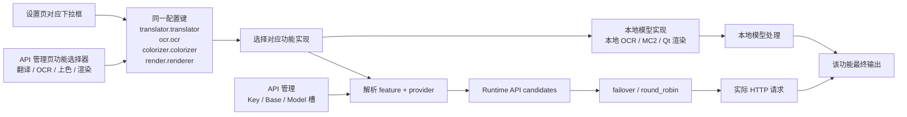
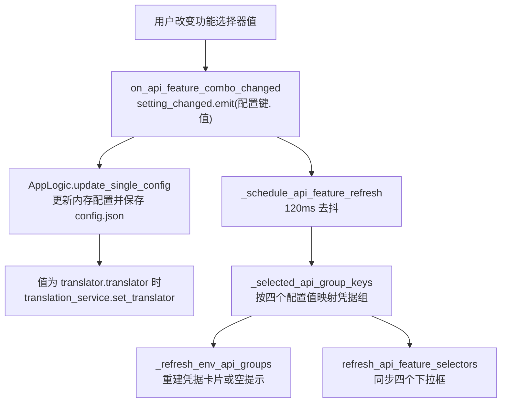

# API 功能选择器

需要在不翻设置页的情况下快速切换翻译、OCR、上色或渲染的实现时，使用 API 管理页每个页签顶部的功能选择器。它们不是独立的“API 配置”，而是直接写入对应功能的同一个配置键，因此在这里把“翻译器”从 OpenAI 换成 Gemini 也会真的切换翻译器，并立即刷新当前页所需的凭据组。

本页说明四个功能选择器分别写入哪个配置键、切换后如何刷新凭据分组、以及如何真正改变对应功能的实现。翻译实现之间的详细差异见[翻译器选择与目标语言](../translator/selection-and-languages.md)；候选槽与轮换策略见[候选槽与轮换](./slots-and-rotation.md)；凭据字段编辑与连接测试分别见[凭据、地址与模型](./credentials-addresses-models.md)和[连接测试与模型列表](./connection-tests-and-model-list.md)。

## 功能边界 {#feature-boundary}

- API 管理页的“翻译”“OCR”“上色”“渲染”四个页签顶部各有一个功能选择器，分别绑定 `translator.translator`、`ocr.ocr`、`colorizer.colorizer`、`render.renderer` 四个配置键。
- 与“翻译器选择”的区别：设置页“Translation”的翻译器下拉框与 API 管理页翻译页签顶部的翻译器下拉框写入同一个 `translator.translator` 键，选项和显示值来源也相同；因此在 API 管理页修改“翻译器”会真正改变翻译实现，并刷新所需凭据组，而不是只改连接信息。
- 与“API 候选槽轮换”的区别：Key/Base/Model 槽与 `failover`/`round_robin` 只在已经选定的实现内部挑选请求端点，处理重试、冷却、不可用和恢复，不改变实现本身。
- `translator_chain` 把上一翻译器的输出交给下一翻译器继续翻译，与本页四个选择器无关。

## UI 操作 {#ui-operations}

### 在 API 管理页切换功能实现 {#api-tab-selectors}

1. 打开“API 管理”（`API Management`）。页面头部显示标题和说明，下方是四个页签：“翻译”“文字识别”“上色”“渲染”。
2. 每个页签顶部有一行功能选择器：左侧标签、中间下拉框、右侧“测试当前页”（`Test Current Tab`）按钮。
3. 在下拉框选择新值。选择后立即写入对应配置键并保存到 `config/config.json`；约 120ms 去抖后刷新当前页的凭据分组，并同步四个选择器的显示值。
4. 选中需要 API 的实现（如 OpenAI/Gemini 翻译、AI OCR、AI 上色、AI 渲染）时，页签内出现对应的 Key/Base/Model 槽；选中本地或无 API 的实现时显示“当前……不需要 OpenAI/Gemini API Key。”的提示卡片。
5. 点击“测试当前页”会对该页签所有已配置的候选槽执行连接测试；测试目标由当前选择器的值和环境变量前缀共同推导，具体流程见[连接测试与模型列表](./connection-tests-and-model-list.md)。

### UI 调用与实际文案 {#ui-i18n}

| UI 调用 key | English 实际值 | 简体中文实际值 |
| --- | --- | --- |
| `API Management` | API Management | API 管理 |
| `Manage API keys and environment variables for each translator` | Manage API keys and environment variables for each translator | 管理每个翻译器的 API 密钥和环境变量 |
| `Translation` | Translation | 翻译 |
| `OCR` | OCR | 文字识别 |
| `Colorization` | Colorization | 上色 |
| `Render` | Render | 渲染 |
| `label_translator` | Translator | 翻译器 |
| `label_ocr` | OCR Model | OCR模型 |
| `label_colorizer` | Colorization Model | 上色模型 |
| `label_renderer` | Renderer | 渲染器 |
| `Test Current Tab` | Test Current Tab | 测试当前页 |
| `No translation API required` | The current translator does not require an OpenAI/Gemini API key. | 当前翻译器不需要 OpenAI/Gemini API Key。 |
| `No OCR API required` | The current OCR does not require an OpenAI/Gemini API key. | 当前 OCR 不需要 OpenAI/Gemini API Key。 |
| `No colorization API required` | The current colorizer does not require an OpenAI/Gemini API key. | 当前上色器不需要 OpenAI/Gemini API Key。 |
| `No render API required` | The current renderer does not require an OpenAI/Gemini API key. | 当前渲染器不需要 OpenAI/Gemini API Key。 |
| `translator_openai_hq` | OpenAI High Quality | OpenAI高质量翻译 |
| `translator_gemini_hq` | Gemini High Quality | Gemini高质量翻译 |
| `translator_none` | None | 无 |
| `translator_original` | Original | 原文 |

`OpenAI`、`Google Gemini`、`Sakura`、`Manga Colorization v2`、`OpenAI Colorizer`、`Gemini Colorizer`、`OpenAI Renderer`、`Gemini Renderer`、`Default` 以及 OCR 引擎名（如 `openai_ocr`）是 `app_logic.py` 的硬编码显示值或枚举原值，不是 locale key；OCR 下拉没有显示映射，直接显示存储值。

## 枚举与全部选项 {#option-matrix}

每个下拉的选项来自 `AppLogic.get_options_for_key()`，显示值来自 `get_display_mapping()`；API 管理页与设置页复用同一来源。下表“激活凭据组”列对应 `dynamic_settings.py` 的 `API_GROUP_SPECS` 分组。

### 翻译器（`translator.translator`）

| 存储值 | English | 简体中文 | 激活凭据组 | 实现 |
| --- | --- | --- | --- | --- |
| `openai` | OpenAI | OpenAI | `translator_openai` | OpenAI 翻译器 |
| `openai_hq` | OpenAI High Quality | OpenAI高质量翻译 | `translator_openai` | OpenAI 高质量翻译 |
| `gemini` | Google Gemini | Google Gemini | `translator_gemini` | Gemini 翻译器 |
| `gemini_hq` | Gemini High Quality | Gemini高质量翻译 | `translator_gemini` | Gemini 高质量翻译 |
| `sakura` | Sakura | Sakura | `translator_sakura` | Sakura 翻译器 |
| `none` | None | 无 | 无 | 不执行翻译 |
| `original` | Original | 原文 | 无 | 保留原文 |

### OCR 模型（`ocr.ocr`）

| 存储值 | English | 简体中文 | 激活凭据组 | 实现 |
| --- | --- | --- | --- | --- |
| `32px` | 32px | 32px | 无 | 本地 32px OCR |
| `48px` | 48px | 48px | 无 | 本地 48px OCR |
| `48px_ctc` | 48px_ctc | 48px_ctc | 无 | 本地 48px CTC OCR |
| `mocr` | mocr | mocr | 无 | Manga OCR |
| `paddleocr` | paddleocr | paddleocr | 无 | PaddleOCR |
| `paddleocr_korean` | paddleocr_korean | paddleocr_korean | 无 | PaddleOCR Korean |
| `paddleocr_latin` | paddleocr_latin | paddleocr_latin | 无 | PaddleOCR Latin |
| `paddleocr_thai` | paddleocr_thai | paddleocr_thai | 无 | PaddleOCR Thai |
| `paddleocr_vl` | paddleocr_vl | paddleocr_vl | 无 | PaddleOCR-VL |
| `openai_ocr` | openai_ocr | openai_ocr | `ocr_openai` | OpenAI 视觉 OCR |
| `gemini_ocr` | gemini_ocr | gemini_ocr | `ocr_gemini` | Gemini 视觉 OCR |

### 上色模型（`colorizer.colorizer`）

| 存储值 | English | 简体中文 | 激活凭据组 | 实现 |
| --- | --- | --- | --- | --- |
| `none` | None | 无 | 无 | 不上色 |
| `mc2` | Manga Colorization v2 | Manga Colorization v2 | 无 | 本地 MC2 上色 |
| `openai_colorizer` | OpenAI Colorizer | OpenAI Colorizer | `color_openai` | OpenAI 上色 |
| `gemini_colorizer` | Gemini Colorizer | Gemini Colorizer | `color_gemini` | Gemini 上色 |

### 渲染器（`render.renderer`）

| 存储值 | English | 简体中文 | 激活凭据组 | 实现 |
| --- | --- | --- | --- | --- |
| `default` | Default | Default | 无 | Qt 离屏渲染器 |
| `openai_renderer` | OpenAI Renderer | OpenAI Renderer | `render_openai` | OpenAI 渲染 |
| `gemini_renderer` | Gemini Renderer | Gemini Renderer | `render_gemini` | Gemini 渲染 |
| `none` | None | 无 | 无 | 不渲染，直接输出原图 |

## 功能选择器参数 {#parameters}

#### `translator.translator` — 翻译器 / Translator {#translator-translator}

- 控件：下拉框。
- 所在界面：API 管理 → 翻译页签顶部；设置 → Translation 第一行；编辑器属性面板复用同一显示映射。
- 存储值：`openai`、`openai_hq`、`gemini`、`gemini_hq`、`sakura`、`none`、`original`。
- 可选值：与核心 `Translator` 枚举一致，见[选项矩阵](#option-matrix)。
- 默认值：核心 `manga_translator/config.py#TranslatorConfig.translator` 为 `openai_hq`；Qt 模型 `desktop_qt_ui/core/config_models.py#TranslatorSettings.translator` 为 `openai_hq`；发行配置 `config/config-example.json` 为 `openai`。
- 生效阶段：翻译调度（含批量翻译）；HQ 变体额外加载高质量提示词。
- 原理：选择器把新值写入 `translator.translator` 并保存；`AppLogic.update_single_config()` 对 `translator.translator` 还会调用 `translation_service.set_translator(value)` 立即更新桌面翻译服务的当前实现。运行时 `manga_translator/translators/__init__.py` 的 `TRANSLATORS` 注册表把值映射到 `OpenAITranslator`、`OpenAIHighQualityTranslator`、`GeminiTranslator`、`GeminiHighQualityTranslator`、`SakuraTranslator`、`NoneTranslator` 或 `OriginalTranslator`。
- 依赖与冲突：与设置页翻译器下拉框同键，最后修改者生效；`openai`/`openai_hq` 共用 OpenAI 凭据组，`gemini`/`gemini_hq` 共用 Gemini 凭据组，`sakura` 使用 `SAKURA_API_BASE` 与 `SAKURA_DICT_PATH`，`none`/`original` 不要求 API 凭据。
- 关联文件：`config/config.json`（持久化）、`.env`（凭据组）、`manga_translator/translators/`（实现）。
- 图示：需要，见[从选择器到实现](#selector-to-implementation)。
- 源码依据：`env_management.py#API_FEATURE_SELECTOR_SPECS`、`app_logic.py#update_single_config`、`translators/__init__.py#TRANSLATORS`、`config.py#TranslatorConfig`。
- 验证状态：源码/i18n 静态核对完成；真实切换效果需脱敏运行验证。

#### `ocr.ocr` — OCR 模型 / OCR Model {#ocr-ocr}

- 控件：下拉框。
- 所在界面：API 管理 → OCR 页签顶部；设置 → OCR 分组；编辑器属性面板复用同一映射。
- 存储值：`32px`、`48px`、`48px_ctc`、`mocr`、`paddleocr`、`paddleocr_korean`、`paddleocr_latin`、`paddleocr_thai`、`paddleocr_vl`、`openai_ocr`、`gemini_ocr`。
- 可选值：与核心 `Ocr` 枚举一致；下拉无显示映射，直接显示存储值。
- 默认值：核心、Qt 模型、发行配置均为 `48px`。
- 生效阶段：OCR 识别与文本行提取；`paddleocr_vl` 还参与语言提示处理。
- 原理：`manga_translator/ocr/__init__.py` 的 `OCRS` 注册表把值映射到本地模型或 API 模型；`openai_ocr`/`gemini_ocr` 通过 `model_api_ocr.py` 走 OpenAI/Gemini 视觉请求，本地引擎走离线识别。运行时 `dispatch_ocr(config.ocr.ocr, ...)` 使用该键选择引擎。
- 依赖与冲突：`ocr.ocr` 只代表主 OCR；开启混合 OCR（`ocr.use_hybrid_ocr`）后，`ocr.secondary_ocr` 的 AI 引擎也会要求对应凭据组，两个引擎会同时出现在 OCR 页签。`openai_ocr`/`gemini_ocr` 分别激活 `ocr_openai`/`ocr_gemini` 组，其余引擎不要求 API。
- 关联文件：`.env`（`OCR_OPENAI_*`、`OCR_GEMINI_*`）、`manga_translator/ocr/`（实现）。
- 图示：需要，见[从选择器到实现](#selector-to-implementation)。
- 源码依据：`config.py#OcrConfig`、`ocr/__init__.py#OCRS`、`manga_translator.py#dispatch_ocr` 调用处。
- 验证状态：源码/i18n 静态核对完成；真实识别效果需脱敏运行验证。

#### `colorizer.colorizer` — 上色模型 / Colorization Model {#colorizer-colorizer}

- 控件：下拉框。
- 所在界面：API 管理 → 上色页签顶部；设置 → 上色相关分组。
- 存储值：`none`、`mc2`、`openai_colorizer`、`gemini_colorizer`。
- 可选值：与核心 `Colorizer` 枚举一致。
- 默认值：核心、Qt 模型、发行配置均为 `none`。
- 生效阶段：流水线的上色阶段；`none` 时跳过上色。
- 原理：`manga_translator/colorization/__init__.py` 的 `COLORIZERS` 注册表把值映射到 `MangaColorizationV2`（本地）或 `OpenAIColorizer`/`GeminiColorizer`（API）；`dispatch_colorization(config.colorizer.colorizer, ...)` 使用该键。API 上色器通过 `resolve_runtime_api_config` 读取 `COLOR_OPENAI_*` 或 `COLOR_GEMINI_*` 候选。
- 依赖与冲突：`openai_colorizer`/`gemini_colorizer` 分别激活 `color_openai`/`color_gemini` 组；`none`/`mc2` 不要求 API。AI 上色还受 `ai_colorizer_history_pages` 影响，见上色相关设置页。
- 关联文件：`.env`（`COLOR_*`）、`manga_translator/colorization/`（实现）。
- 图示：需要，见[从选择器到实现](#selector-to-implementation)。
- 源码依据：`config.py#ColorizerConfig`、`colorization/__init__.py#COLORIZERS`、`manga_translator.py#_run_colorizer`。
- 验证状态：源码/i18n 静态核对完成；真实上色效果需脱敏运行验证。

#### `render.renderer` — 渲染器 / Renderer {#render-renderer}

- 控件：下拉框。
- 所在界面：API 管理 → 渲染页签顶部；设置 → 排版/渲染相关分组。
- 存储值：`default`、`openai_renderer`、`gemini_renderer`、`none`。
- 可选值：与核心 `Renderer` 枚举一致；`_missing_` 兼容旧的 `manga2eng`/`manga2eng_pillow` 字符串并归一为 `default`。
- 默认值：核心、Qt 模型、发行配置均为 `default`。
- 生效阶段：修复之后的排版渲染阶段；`none` 时直接输出基底图，不渲染文字。
- 原理：`manga_translator/rendering/__init__.py#dispatch()` 在 `openai_renderer`/`gemini_renderer` 时转入 `dispatch_api_rendering()`，由 `model_api_renderer.py` 的 `get_api_renderer()` 选择 OpenAI/Gemini 渲染器；其余值走 Qt 离屏渲染路径。选择 AI 渲染器时，流水线用 `_should_skip_inpainting_for_ai_renderer()` 跳过修复阶段并使用原图作为渲染基底。
- 依赖与冲突：`openai_renderer`/`gemini_renderer` 分别激活 `render_openai`/`render_gemini` 组；`default`/`none` 不要求 API。AI 渲染受 `ai_renderer_concurrency` 与修复跳过逻辑影响。
- 关联文件：`.env`（`RENDER_*`）、`manga_translator/rendering/`（实现）。
- 图示：需要，见[从选择器到实现](#selector-to-implementation)。
- 源码依据：`config.py#RenderConfig`、`rendering/__init__.py#dispatch`、`rendering/model_api_renderer.py`、`manga_translator.py#_should_skip_inpainting_for_ai_renderer`。
- 验证状态：源码/i18n 静态核对完成；真实渲染效果需脱敏运行验证。

## 运行机理 {#runtime-behavior}

### 从选择器到实现 {#selector-to-implementation}

四个选择器共享同一条链路：把配置值交给对应功能的注册表，再决定走 API 候选还是本地模型。只有 OpenAI/Gemini 类实现才需要凭据解析；本地模型（如 32px OCR、MC2、Default 渲染器）不经过候选解析。

`translator_chain` 在翻译阶段把上一个翻译器的结果串联给下一个翻译器，不参与端点轮换，也不写入这四个配置键。

### 联动刷新凭据组 {#credential-group-refresh}

功能选择器变化后，界面先写配置，再用 120ms 去抖合并“凭据组重建 + 选择器同步”两次刷新，避免连续切换时反复重建控件。

`_selected_api_group_keys(config)` 读取四个配置值并返回每个页签要显示的凭据组，例如翻译器为 `openai`/`openai_hq` 时返回 `translator_openai`，OCR 为 `openai_ocr` 时返回 `ocr_openai`。`_refresh_env_api_groups` 据此重建当前页的 Key/Base/Model 槽；没有 API 要求的实现显示“No … API required”空提示。设置页修改 `translator.translator`、`ocr.ocr`、`ocr.secondary_ocr`、`ocr.use_hybrid_ocr`、`colorizer.colorizer`、`render.renderer` 中的任一个后约 100ms 也会调用同一个刷新函数，所以设置页的修改同样会更新 API 管理页的凭据组。

### 与翻译器选择的同步 {#translator-selector-sync}

- 设置页“Translation”的翻译器下拉框与 API 管理页翻译页签顶部的翻译器下拉框绑定同一个 `translator.translator` 键，选项与显示值来自同一 `get_options_for_key("translator")` / `get_display_mapping("translator")`。
- 任一处切换都会写回配置，并在键为 `translator.translator` 时调用 `translation_service.set_translator()`；因此“在 API 管理页改翻译器也会真的切换翻译器”。
- API 候选槽轮换不写这个键，只影响已选实现内部的请求端点；`translator_chain` 也不写这个键。

## 依赖与冲突 {#dependencies-and-conflicts}

- 四个选择器与设置页对应下拉框共享配置键；它们不是互相独立的设置，最后修改者生效，没有“API 页覆盖设置页”的优先级。
- 凭据值本身存在 `.env`（或运行时覆盖），不写入这四个配置键；见[凭据、地址与模型](./credentials-addresses-models.md)。
- 启用混合 OCR 后，OCR 页签会同时考虑 `ocr.secondary_ocr` 的 AI 引擎并显示对应凭据组；`ocr.ocr` 选择器只代表主 OCR。
- `render.renderer` 为 `openai_renderer`/`gemini_renderer` 时跳过修复并使用原图作为渲染基底；`none` 时不执行排版渲染。
- `sakura` 翻译不需要 Key/Model 槽，只需要 `SAKURA_API_BASE` 与字典路径。
- 切换实现不会重置该功能的请求参数、自定义参数或提示词；这些由对应功能页管理。

## 关联文件与格式 {#related-files}

| 文件/格式 | 本页实际作用 | 手改与兼容注意 |
| --- | --- | --- |
| `config/config.json` | 持久化四个选择器写入的配置键 | 不读取或展示真实用户文件 |
| `config/config-example.json` | 发行默认值证据 | 只使用脱敏示例 |
| `.env` | 各凭据组（`OPENAI_*`、`GEMINI_*`、`OCR_OPENAI_*`、`OCR_GEMINI_*`、`COLOR_*`、`RENDER_*`、`SAKURA_*`） | 不记录真实密钥 |
| `manga_translator/translators/__init__.py` | 翻译器注册表 | 存储值到实现类的映射 |
| `manga_translator/ocr/__init__.py` | OCR 注册表 | 存储值到 OCR 实现的映射 |
| `manga_translator/colorization/__init__.py` | 上色注册表 | 存储值到上色实现的映射 |
| `manga_translator/rendering/__init__.py`、`rendering/model_api_renderer.py` | 渲染调度与 AI 渲染器 | AI 渲染走 API 候选 |

## 源码依据 {#source-evidence}

| 层级 | 文件 | 本页核对内容 |
| --- | --- | --- |
| 功能选择器 UI | `desktop_qt_ui/ui/main_page/env_management.py` | `API_FEATURE_SELECTOR_SPECS`、下拉填充、`on_api_feature_combo_changed`、120ms 去抖、`Test Current Tab` |
| 凭据组刷新 | `desktop_qt_ui/ui/main_page/dynamic_settings.py` | `_selected_api_group_keys`、`_refresh_env_api_groups`、`_on_setting_changed` 的 100ms 刷新 |
| 设置写入与翻译服务 | `desktop_qt_ui/app_logic.py` | `update_single_config`、`set_translator`、`get_options_for_key`/`get_display_mapping` |
| 页面结构与 i18n | `desktop_qt_ui/ui/main_page/pages/env_page.py`、`desktop_qt_ui/locales/en_US.json`、`zh_CN.json` | 四个页签、标签与空提示实际文案 |
| 配置模型与核心枚举 | `desktop_qt_ui/core/config_models.py`、`manga_translator/config.py` | Qt/核心默认值与 `Translator`/`Ocr`/`Colorizer`/`Renderer` |
| 实现注册与调度 | `manga_translator/translators/__init__.py`、`ocr/__init__.py`、`colorization/__init__.py`、`rendering/__init__.py`、`rendering/model_api_renderer.py` | 存储值到实现类及流水线消费者 |
| 运行时 API 解析 | `manga_translator/runtime_api_resolver.py` | feature/provider 到候选端点 |
| 发行默认 | `config/config-example.json` | 四个键的发行默认值 |

## 验证记录 {#verification}

| 验证内容 | 状态 | 说明 |
| --- | --- | --- |
| BLUEPRINT、PAGE_GUIDELINES、TODO | 完成 | 已完整读取并按页面合同编写 |
| UI 布局与调用 | 完成 | 静态核对 `env_page.py`、`env_management.py`、`dynamic_settings.py` |
| `en_US` / `zh_CN` 实际 locale | 完成 | 页面表格逐项记录 key、English、简体中文实际值 |
| 选择器运行链 | 完成 | 静态核对配置写入、凭据组刷新与实现注册/调度 |
| 脱敏运行验证 | 待后续 | 未读取真实 `.env`、用户 `config.json`、API key/token 或私有内容 |
| 路由镜像与源码依据 | 完成 | `node scripts/verify-route-mirror.mjs .`、`node scripts/verify-source-evidence.mjs .` 通过 |
| VitePress 构建 | 待运行 | 由协调代理在合并前运行 `npm run docs:build --prefix doc/wiki` |