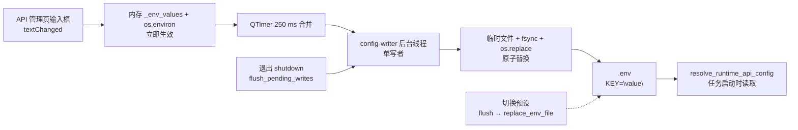

# 预设与持久化

当你想在多套服务配置之间快速切换整组 API 凭据，或者想弄清楚 API 管理页输入框里的 Key/Base/Model 到底在什么时候真正写入磁盘时，使用本页。它说明 `.env` 的读取与写入（`config_service.py`）、API 预设（`PresetService`）的新增、切换与删除、重新加载/恢复，以及导出、导入和截图/报告中的脱敏边界。Key/Base/Model 字段本身见[API 凭据、地址与模型](./credentials-addresses-models.md)，编号通道与轮询策略见[通道与轮询策略](./slots-and-rotation.md)。

## 功能边界

- `.env` 是桌面端唯一凭据持久化位置：API 管理页的 Key/Base/Model、编号通道、轮询策略都写入 `.env`；`config/config.json` 与 `config/config-example.json` 不保存 API 密钥。
- API 预设是 `.env` 环境变量的整组快照，保存为 `presets/<名称>.json` 的扁平 JSON；`config.json` 的 `app.current_preset` 只记录当前选中的预设名（默认 `"默认"`），不复制预设内容。
- 应用预设会整体替换 `.env`：只保留预设中包含的键，`.env` 里不在预设中的键会被删除；这不是增量合并。
- 本页负责预设的新增、删除与切换，`.env` 的自动保存（250 ms 防抖 + 后台原子写盘）、重新加载与退出前刷新，以及导出/导入配置时的凭据脱敏边界。
- 本页不负责：Key/Base/Model 输入与掩码（见[API 凭据、地址与模型](./credentials-addresses-models.md)）、编号通道增删与轮询策略（见[通道与轮询策略](./slots-and-rotation.md)）、失败冷却与恢复（见[失败、冷却与恢复](./failures-cooldown-and-recovery.md)）、连接测试与模型列表（见[连接测试与模型列表](./connection-tests-and-model-list.md)）、自定义请求参数里的“模型预设”（见[自定义请求参数](./custom-request-parameters.md)）。

## UI 操作

### 在 API 管理页管理预设

1. 打开左侧导航“API 管理”（`API Management`）。页头卡片副标题“管理每个翻译器的 API 密钥和环境变量”（`Manage API keys and environment variables for each translator`）下方是全局预设工具栏，对翻译、OCR、上色、渲染四个页签同时生效。
2. 预设工具栏由三部分组成：标签“预设：”（`Preset:`）、只读下拉框、`+`（添加新预设）与“删除”（`Delete`）按钮。`+` 与“删除”的具体提示分别来自“添加新预设”（`Add new preset`）和“删除选中的预设”（`Delete selected preset`）。
3. 点击 `+` 弹出“添加预设”（`Add Preset`）对话框，提示“输入预设名称：”（`Enter preset name:`）。名称为空时警告“预设名称不能为空”（`Preset name cannot be empty`）；同名时询问“预设 '{name}' 已存在。是否覆盖？”（`Preset '{name}' already exists. Overwrite?`）。新建预设默认是空白预设：包含全部已知 API 环境变量键、值全部为空，不会复制当前 `.env` 内容。
4. 在下拉框选择其他预设即开始切换：先等待（flush）未落盘的待写内容，把当前 `.env` 值保存回旧预设，再用新预设整体替换 `.env`，最后按新值刷新所有输入框和占位符。
5. 点击“删除”（`Delete`）会先询问“确定要删除预设 '{name}' 吗？”（`Are you sure you want to delete preset '{name}'?`），确认后删除 `presets/<名称>.json`，成功提示“预设删除成功”（`Preset deleted successfully`）。

### 在设置页导出与导入配置

1. 打开“设置”（`Settings`），页头右侧有“导出配置”（`Export Config`）与“导入配置”（`Import Config`）按钮。
2. 导出配置把当前设置写成 JSON，排除 `app` 段与 `cli.verbose`；因为 API 密钥只存在于 `.env`，导出结果不包含任何凭据，弹窗提示 “Sensitive information like API keys are not included.”（实际显示值以当前 locale 为准）。
3. 导入配置把所选 JSON 深度合并进当前设置，保留当前 `app` 段，不写 `.env`；弹窗提示 “Your API keys and sensitive information have been preserved.”，现有 API 密钥不受影响。
4. 导入成功后发送 `config_loaded` 信号，设置页重建并刷新说明面板；`.env` 中的 API 凭据不会被导入操作改写。

### 页面、预设与弹窗文案

| UI 调用 key | English 实际值 | 简体中文实际值 |
| --- | --- | --- |
| `API Management` | API Management | API 管理 |
| `Manage API keys and environment variables for each translator` | Manage API keys and environment variables for each translator | 管理每个翻译器的 API 密钥和环境变量 |
| `Preset:` | Preset: | 预设： |
| `Add new preset` | Add new preset | 添加新预设 |
| `Delete selected preset` | Delete selected preset | 删除选中的预设 |
| `Delete` | Delete | 删除 |
| `Add Preset` | Add Preset | 添加预设 |
| `Enter preset name:` | Enter preset name: | 输入预设名称： |
| `OK` | OK | 确定 |
| `Cancel` | Cancel | 取消 |
| `Warning` | Warning | 警告 |
| `Confirm` | Confirm | 确认 |
| `Error` | Error | 错误 |
| `Preset name cannot be empty` | Preset name cannot be empty | 预设名称不能为空 |
| `Preset '{name}' already exists. Overwrite?` | Preset '{name}' already exists. Overwrite? | 预设 '{name}' 已存在。是否覆盖？ |
| `Are you sure you want to delete preset '{name}'?` | Are you sure you want to delete preset '{name}'? | 确定要删除预设 '{name}' 吗？ |
| `Preset deleted successfully` | Preset deleted successfully | 预设删除成功 |
| `Failed to delete preset` | Failed to delete preset | 删除预设失败 |
| `Failed to create preset` | 缺失：两个 locale 均无翻译，回退显示 key 原文 | 缺失：两个 locale 均无翻译，回退显示 key 原文 |
| `Export Config` | Export Config | 导出配置 |
| `Import Config` | Import Config | 导入配置 |
| `Export Success` | Export Success | 导出成功 |
| `Import Success` | Import Success | 导入成功 |
| `Export Failed` | Export Failed | 导出失败 |
| `Import Failed` | Import Failed | 导入失败 |
| `API Keys Required` | API Keys Required | 需要填写 API 密钥 |

`Load selected preset`（加载选中的预设）、`Preset loaded successfully`、`Failed to load preset` 等 key 存在于两个 locale，但当前界面没有独立的“加载”按钮，切换预设直接由下拉框选择触发；`Failed to create preset` 在两个 locale 都缺失，界面会按 i18n 回退规则显示 key 原文。

## 运行机理

### 启动加载

`ConfigService.__init__` 先确定 `.env` 路径：打包后位于可执行文件同级目录，开发时位于项目根目录，并把路径写入 `MANGA_TRANSLATOR_ENV_PATH`。随后用 `read_dotenv_file()` 把 `.env` 读入内存 `_env_values`，再调用 `load_app_dotenv(override=True)` 把全部键加载到 `os.environ`（覆盖同名环境变量）。

`PresetService.__init__` 确保 `presets/` 目录存在；若 `默认.json` 不存在则创建默认预设：全部已知 API 键为空，`OPENAI_API_BASE=https://api.openai.com/v1`、`OPENAI_MODEL=gpt-4o`。配置加载优先级为用户配置 `config/config.json` > 默认配置 `config/config-example.json` > 代码默认值；`app.current_preset` 用于在启动和重建时定位当前预设。

### 编辑、防抖与原子写盘

输入框 `textChanged` → `_debounced_save_env_var` → `env_var_changed` 信号 → `MainAppLogic.save_env_var` → `ConfigService.save_env_var`。`save_env_vars` 立即更新内存 `_env_values` 与 `os.environ`，校验键名（`validate_env_key`）并去除值首尾空白；磁盘写入交给 250 ms 单发 `QTimer`（`SAVE_DEBOUNCE_MS = 250`）合并，因此连续输入只产生一次写盘。

定时器到期后，在唯一线程名 `config-writer` 的 `ThreadPoolExecutor(max_workers=1)` 上执行 `_write_snapshots`：`_merge_dotenv_updates` 保留 `.env` 中未修改的行（含注释与原始格式），只重写变更键并追加新键；最终用“临时文件 + `os.replace`”原子替换，写盘前 `fsync`。删除键（`delete_env_vars`）把值标记为 `None`，重写时移除对应行，并从内存与 `os.environ` 删除。写盘失败会发 `write_failed` 信号，后续保存自动切换为整文件替换以恢复一致性。

### 预设切换与整体替换

`load_preset` 读取 `presets/<名称>.json` 并规范化（补齐全部已知 API 键、保留额外自定义键），然后调用 `replace_env_file`。`replace_env_file` 用预设内容整体替换 `.env`：内存 `_env_values` 直接换成预设键集合，旧键中不在预设内的会从 `os.environ` 删除，磁盘待写内容标记为“整文件替换”。切换预设前先 `flush_pending_writes()`，保证正在防抖的编辑先落盘、再保存进旧预设。

### 重新加载与退出前刷新

`reload_config()` 强制完整重载：先 flush 待写内容，重新把 `.env` 加载到 `os.environ`，重建 `AppSettings`，按优先级重载配置，最后发 `config_changed` 让 UI 重建；`reload_from_disk()` 只从当前 `config_path` 重载配置。开始翻译前会排空待写内容（`_flush_all_pending_env_vars`），`flush_pending_writes()` 停止定时器、提交并等待全部写盘完成。应用退出时 `main.py` 调用 `ConfigService.shutdown()`，先 `flush_pending_writes()` 再关闭写线程，保证没有丢失 250 ms 待写内容。

上图只描述凭据与预设的写入生命周期。空键、本地空密钥占位、编号槽与轮询候选的解析见[API 凭据、地址与模型](./credentials-addresses-models.md)与[通道与轮询策略](./slots-and-rotation.md)；`config.json` 的 250 ms 防抖属于同一写线程，但本页不展开设置字段本身。

## 脱敏与文件安全

- `.env` 与 `presets/*.json` 都保存真实凭据（明文），两者均被 `.gitignore` 忽略；不要把其中任何一行、整个文件或截图提交到仓库或公开报告。
- 输入框对包含 `API_KEY`、`AUTH_KEY`、`TOKEN` 的键使用密码回显，可用眼睛图标切换“显示密钥/隐藏密钥”；显示密钥只是界面行为，不代表文件或日志安全。
- “导出配置”排除 `app` 段与 `cli.verbose`，且 `config.json` 本身不含 API 密钥，因此导出产物不含凭据；“导入配置”不写 `.env`，现有 API 密钥保留。
- 切换预设会把当前 `.env` 值保存进旧预设，因此用户创建或更新过的预设文件可能随时间包含真实密钥；本页不展示任何预设内容或真实密钥值。

## 依赖与冲突

- `.env`、`presets/*.json`、`config/config.json`、`config/custom_api_params.json` 职责不同：分别是凭据/环境变量、预设快照、UI 设置、请求体参数。切换预设只影响 `.env`；导入配置只影响 `config.json`；`custom_api_params.json` 的“模型预设”与本页 API 预设无关（见[自定义请求参数](./custom-request-parameters.md)）。
- 应用预设会整体替换 `.env`，因此手动编辑过 `.env` 或写入过预设不认识的键时，应用预设会删除这些键；不要在应用仍有待写操作时手改同一文件。
- Web 多用户场景下 `translator.user_api_key`/`user_api_base`/`user_api_model` 等覆盖优先级高于 `.env`（见[API 凭据、地址与模型](./credentials-addresses-models.md)）；桌面端默认不存在这些覆盖。
- 预设名会经 `_sanitize_filename` 清洗（`< > : " / \ | ? *` 替换为 `_`）；预设下拉框只显示 `presets/` 下 `*.json` 文件去掉后缀的名称。
- 退出前 `shutdown` 只保证“已提交的写入”完成，不负责再次读取输入框；正常输入已随 250 ms 防抖提交到内存。

## 关联文件与格式

| 文件/格式 | 本页实际作用 | 手改与兼容注意 |
| --- | --- | --- |
| `.env` | 桌面端唯一凭据持久化位置，`KEY="value"` 引号格式 | 含真实密钥，禁止提交或展示；不要在有待写操作时手改 |
| `presets/<名称>.json` | API 预设快照：扁平 `{env_key: value}` JSON | 含真实密钥；名称经非法字符清洗；应用预设会整体替换 `.env` |
| `config/config.json` | 用户设置持久化，`app.current_preset` 记录当前预设名 | 不保存 API 密钥；导出排除 `app` 段，导入保留现有 `app` 段 |
| `config/config-example.json` | 发行默认配置，`app.current_preset` 默认 `"默认"` | 只使用脱敏示例，不包含任何 API 密钥 |
| `config/custom_api_params.json` | 请求体“模型预设”，common/translator/ocr/colorizer/render 分区 | 与本页 API 预设无关；按模型名匹配，见自定义请求参数页 |

## 源码依据 {#source-evidence}

| 层级 | 文件 | 本页核对内容 |
| --- | --- | --- |
| UI 预设工具栏 | `desktop_qt_ui/ui/main_page/dynamic_settings.py` | `Preset:` 标签、下拉框、`+`/`Delete` 按钮与悬浮提示 |
| UI 预设操作 | `desktop_qt_ui/ui/main_page/env_management.py` | 增删、切换、刷新输入框、flush 时机、脱敏回显 |
| 控制器 | `desktop_qt_ui/app_logic.py` | save/load/delete preset、导出/导入配置、任务启动前排空待写内容 |
| `.env` 持久化 | `desktop_qt_ui/services/config_service.py` | 250 ms 防抖、单写线程、原子写、整文件替换、退出刷新 |
| 预设服务 | `desktop_qt_ui/services/preset_service.py` | `presets/` 目录、默认预设、名称清洗、规范化补齐 |
| dotenv 工具 | `manga_translator/utils/dotenv_utils.py` | `KEY="value"` 行格式、加载/合并/删除 |
| 运行读取 | `manga_translator/runtime_api_resolver.py` | 任务启动时按槽读取 `os.environ` 构造候选 |
| i18n | `desktop_qt_ui/locales/en_US.json`、`zh_CN.json` | 预设与导入导出 key 及实际中英文显示值 |

## 验证记录 {#verification}

| 验证内容 | 状态 | 说明 |
| --- | --- | --- |
| BLUEPRINT、PAGE_GUIDELINES、TODO | 完成 | 已读取 1.3 节与 5.6 小节并按页面合同编写 |
| UI 布局与调用 | 完成 | 静态核对 dynamic_settings、env_management、settings_page、app_logic |
| `en_US` / `zh_CN` 实际 locale | 完成 | 表格逐项记录 key、English、简体中文实际值；缺失项已如实标记 |
| 持久化生命周期 | 完成 | 静态核对 config_service 防抖/单写线程/原子写/整文件替换/shutdown |
| 脱敏运行验证 | 待后续 | 未读取真实 `.env`、`presets/*.json`、用户 `config.json`、API key/token、用户名、用户图片或私有提示词 |
| VitePress | 待运行 | 由协调代理在合并前运行 `npm run docs:build --prefix doc/wiki` 及镜像/源码检查 |