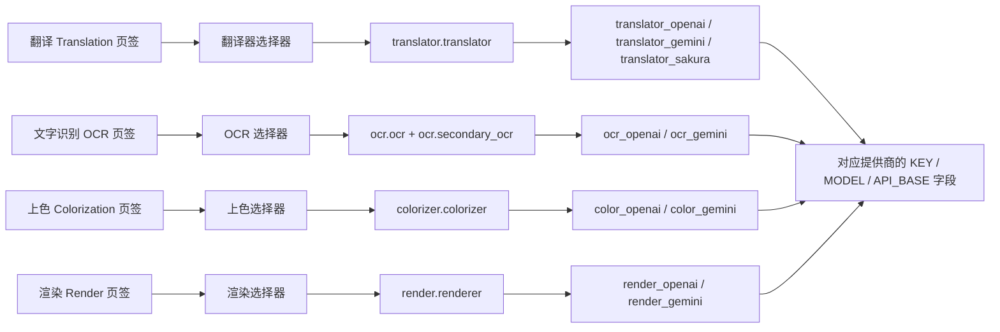

# API 管理页签与提供商字段

当你需要分别配置翻译、文字识别（OCR）、上色和渲染各自使用的 API 凭据时，打开“API 管理”（`API Management`）。该页按功能分成四个页签，每个页签对应一个功能；页签顶部是该功能的选择器，下方只显示当前选中提供商的凭据字段组。

本页只说明四个页签的布局、切换，以及每个页签展示哪个提供商的哪组字段。功能选择器的完整选项与写入行为见[功能选择器](./feature-selectors.md)，Key/Base/Model 字段含义见[凭据、地址与模型](./credentials-addresses-models.md)，候选槽与轮询见[API 通道与轮询策略](./slots-and-rotation.md)，连接测试与模型列表见[连接测试与模型列表](./connection-tests-and-model-list.md)。

## 功能边界

- API 管理页固定包含四个页签，路由键分别为 `env_translation`、`env_ocr`、`env_colorization`、`env_render`，对应翻译、文字识别、上色和渲染四个功能。
- 每个页签顶部有一个功能选择器下拉框，分别写入 `translator.translator`、`ocr.ocr`、`colorizer.colorizer`、`render.renderer`；文字识别页签在启用混合 OCR 时还读取 `ocr.secondary_ocr`。
- 页签本身只是导航容器：点击页签只切换右侧的堆叠页面，不修改任何配置。真正改变配置的是页签内的功能选择器。
- 每个页签显示的提供商组由该功能选择器的当前值决定；未命中任何 API 提供商时显示“不需要 API”的空状态提示，不渲染凭据卡片。
- 翻译器选择、API 功能选择器、API 候选槽轮换是三个不同边界：本页与[功能选择器](./feature-selectors.md)负责页签、选择器与字段组；`translator.translator` 的翻译实现选择见[翻译器选择](../translator/selection-and-languages.md)；槽轮换见[API 通道与轮询策略](./slots-and-rotation.md)。

## UI 操作

### 打开 API 管理并切换页签 {#open-and-switch-tabs}

1. 在左侧导航选择“API 管理”（`API Management`）。标题下方显示副标题“管理每个翻译器的 API 密钥和环境变量”，副标题下方是全局 API 预设工具栏（“预设：”下拉框、“添加新预设”和“删除选中的预设”按钮），预设的增删与加载见[预设与持久化](./presets-and-persistence.md)。
2. 在页签栏点击“翻译”、“文字识别”、“上色”或“渲染”切换页签；打开页面时默认停在“翻译”页签。
3. 切换页签不会保存或丢弃任何输入，也不会改变任何配置键；四个页签的凭据字段相互独立。

| UI 调用 key | English 实际值 | 简体中文实际值 |
| --- | --- | --- |
| `API Management` | API Management | API 管理 |
| `Manage API keys and environment variables for each translator` | Manage API keys and environment variables for each translator | 管理每个翻译器的 API 密钥和环境变量 |
| `Translation` | Translation | 翻译 |
| `OCR` | OCR | 文字识别 |
| `Colorization` | Colorization | 上色 |
| `Render` | Render | 渲染 |
| `Test Current Tab` | Test Current Tab | 测试当前页 |
| `Preset:` | Preset: | 预设： |
| `Add new preset` | Add new preset | 添加新预设 |
| `Delete selected preset` | Delete selected preset | 删除选中的预设 |

### 页签内的功能选择器行 {#feature-selector-row}

每个页签的内容是一张区块卡片，第一行固定是“功能选择器行”：左侧标签、中间下拉框、右侧“测试当前页”按钮。四个页签的标签与写入配置键如下；下拉框选项复用设置页的同一组枚举与显示映射，改动会立即写入对应配置键并刷新字段组。

| UI 调用 key | English 实际值 | 简体中文实际值 | 写入配置键 |
| --- | --- | --- | --- |
| `label_translator` | Translator | 翻译器 | `translator.translator` |
| `label_ocr` | OCR Model | OCR模型 | `ocr.ocr` |
| `label_colorizer` | Colorization Model | 上色模型 | `colorizer.colorizer` |
| `label_renderer` | Renderer | 渲染器 | `render.renderer` |

“测试当前页”只对当前页签对应功能的所有已配置密钥执行批量连接测试，见[连接测试与模型列表](./connection-tests-and-model-list.md)。

### 提供商字段组与空状态 {#provider-groups-and-empty-state}

- 选择器命中的每个提供商对应一张凭据卡片。OpenAI/Gemini 卡片包含“轮询策略：”下拉框、编号通道卡片（Key/Model/Base 三个字段）和“+ 添加 API 通道”按钮；Sakura 是简化的两字段卡片（地址与词典路径），没有轮询策略和通道槽。
- 每个通道卡片左侧显示两位编号徽标（例如 `01`），标题固定为“API 通道”（`API slot`），字段标签本身不带编号；批量测试结果列表里才使用“OpenAI API Key #2”这种带编号的显示名。
- 密钥字段（API Key / AUTH Key / Token）默认掩码显示，可用眼睛按钮的“显示密钥/隐藏密钥”切换；每个密钥行右侧有“测试”按钮，模型行右侧有“获取模型”按钮。
- 当选择器当前值不需要 OpenAI/Gemini 凭据时（例如翻译器为 `none`/`original`、OCR 为 `48px`、上色器为 `none`、渲染器为 `default`），卡片区显示对应的“不需要 API”提示，不渲染任何凭据字段。

| UI 调用 key | English 实际值 | 简体中文实际值 |
| --- | --- | --- |
| `API rotation strategy:` | Rotation strategy: | 轮询策略： |
| `API slot {index}` | API slot {index} | API 通道 {index} |
| `+ Add API slot` | + Add API slot | + 添加 API 通道 |
| `Show Secret` | Show key | 显示密钥 |
| `Hide Secret` | Hide key | 隐藏密钥 |
| `Test` | Test | 测试 |
| `Get Models` | Get Models | 获取模型 |
| `Delete` | Delete | 删除 |
| `API slot cooldown marker` | Cooling down | 冷却中 |
| `API slot unavailable marker` | Unavailable | 不可用 |
| `Restore API channel` | Restore | 恢复 |
| `No translation API required` | The current translator does not require an OpenAI/Gemini API key. | 当前翻译器不需要 OpenAI/Gemini API Key。 |
| `No OCR API required` | The current OCR does not require an OpenAI/Gemini API key. | 当前 OCR 不需要 OpenAI/Gemini API Key。 |
| `No colorization API required` | The current colorizer does not require an OpenAI/Gemini API key. | 当前上色器不需要 OpenAI/Gemini API Key。 |
| `No render API required` | The current renderer does not require an OpenAI/Gemini API key. | 当前渲染器不需要 OpenAI/Gemini API Key。 |

## 页签结构 {#tab-structure}

下图表示“页签 → 功能选择器 → 配置键 → 提供商字段组”的固定映射；OpenAI/Gemini 组内具体显示 KEY / MODEL / API_BASE 三列字段。

| 页签 | 功能选择器存储值 | 提供商组 | 组内字段（环境变量键） |
| --- | --- | --- | --- |
| 翻译 | `openai` / `openai_hq` | `translator_openai` | `OPENAI_API_KEY`、`OPENAI_MODEL`、`OPENAI_API_BASE` |
| 翻译 | `gemini` / `gemini_hq` | `translator_gemini` | `GEMINI_API_KEY`、`GEMINI_MODEL`、`GEMINI_API_BASE` |
| 翻译 | `sakura` | `translator_sakura` | `SAKURA_API_BASE`、`SAKURA_DICT_PATH` |
| 文字识别 | `openai_ocr` | `ocr_openai` | `OCR_OPENAI_API_KEY`、`OCR_OPENAI_MODEL`、`OCR_OPENAI_API_BASE` |
| 文字识别 | `gemini_ocr` | `ocr_gemini` | `OCR_GEMINI_API_KEY`、`OCR_GEMINI_MODEL`、`OCR_GEMINI_API_BASE` |
| 上色 | `openai_colorizer` | `color_openai` | `COLOR_OPENAI_API_KEY`、`COLOR_OPENAI_MODEL`、`COLOR_OPENAI_API_BASE` |
| 上色 | `gemini_colorizer` | `color_gemini` | `COLOR_GEMINI_API_KEY`、`COLOR_GEMINI_MODEL`、`COLOR_GEMINI_API_BASE` |
| 渲染 | `openai_renderer` | `render_openai` | `RENDER_OPENAI_API_KEY`、`RENDER_OPENAI_MODEL`、`RENDER_OPENAI_API_BASE` |
| 渲染 | `gemini_renderer` | `render_gemini` | `RENDER_GEMINI_API_KEY`、`RENDER_GEMINI_MODEL`、`RENDER_GEMINI_API_BASE` |

字段标签按“环境变量键 → 界面文案”映射，键前缀决定所属功能：无前缀属于翻译，`OCR_` 属于文字识别，`COLOR_` 属于上色，`RENDER_` 属于渲染。实际显示值如下：

| UI 调用 key | English 实际值 | 简体中文实际值 |
| --- | --- | --- |
| `label_OPENAI_API_KEY` | OpenAI API Key | OpenAI API 密钥 |
| `label_OPENAI_MODEL` | OpenAI Model | OpenAI 模型 |
| `label_OPENAI_API_BASE` | OpenAI API Base | OpenAI API 地址 |
| `label_GEMINI_API_KEY` | Gemini API Key | Gemini API 密钥 |
| `label_GEMINI_MODEL` | Gemini Model | Gemini 模型 |
| `label_GEMINI_API_BASE` | Gemini API Base | Gemini API 地址 |
| `label_OCR_OPENAI_API_KEY` | OCR OpenAI API Key | 文字识别 OpenAI API 密钥 |
| `label_OCR_OPENAI_MODEL` | OCR OpenAI Model | 文字识别 OpenAI 模型 |
| `label_OCR_OPENAI_API_BASE` | OCR OpenAI API Base | 文字识别 OpenAI API 地址 |
| `label_OCR_GEMINI_API_KEY` | OCR Gemini API Key | 文字识别 Gemini API 密钥 |
| `label_OCR_GEMINI_MODEL` | OCR Gemini Model | 文字识别 Gemini 模型 |
| `label_OCR_GEMINI_API_BASE` | OCR Gemini API Base | 文字识别 Gemini API 地址 |
| `label_COLOR_OPENAI_API_KEY` | Colorization OpenAI API Key | 上色 OpenAI API 密钥 |
| `label_COLOR_OPENAI_MODEL` | Colorization OpenAI Model | 上色 OpenAI 模型 |
| `label_COLOR_OPENAI_API_BASE` | Colorization OpenAI API Base | 上色 OpenAI API 地址 |
| `label_COLOR_GEMINI_API_KEY` | Colorization Gemini API Key | 上色 Gemini API 密钥 |
| `label_COLOR_GEMINI_MODEL` | Colorization Gemini Model | 上色 Gemini 模型 |
| `label_COLOR_GEMINI_API_BASE` | Colorization Gemini API Base | 上色 Gemini API 地址 |
| `label_RENDER_OPENAI_API_KEY` | Rendering OpenAI API Key | 渲染 OpenAI API 密钥 |
| `label_RENDER_OPENAI_MODEL` | Rendering OpenAI Model | 渲染 OpenAI 模型 |
| `label_RENDER_OPENAI_API_BASE` | Rendering OpenAI API Base | 渲染 OpenAI API 地址 |
| `label_RENDER_GEMINI_API_KEY` | Rendering Gemini API Key | 渲染 Gemini API 密钥 |
| `label_RENDER_GEMINI_MODEL` | Rendering Gemini Model | 渲染 Gemini 模型 |
| `label_RENDER_GEMINI_API_BASE` | Rendering Gemini API Base | 渲染 Gemini API 地址 |
| `label_SAKURA_API_BASE` | SAKURA API Base | SAKURA API 地址 |
| `label_SAKURA_DICT_PATH` | SAKURA Dictionary Path | SAKURA 词典路径 |

## 页签与功能选择器的关系 {#tab-selector-relationship}

- 页签代表功能，功能选择器代表该功能当前选中的实现/提供商；两者合起来决定页签下方渲染哪组字段。
- 选择器改动时，界面发出 `setting_changed`（携带配置键与存储值），再通过 120ms 去抖定时器重建四个页签的字段组并重新填充所有选择器。
- 四个页签的选择器都从同一份配置读取：在设置页或编辑器里修改 `translator.translator`、`ocr.ocr`、`colorizer.colorizer`、`render.renderer` 后，回到 API 管理页会按新值重建字段组。
- 文字识别页签的特殊性：启用混合 OCR 后，主 OCR（`ocr.ocr`）和备用 OCR（`ocr.secondary_ocr`）可以分别是 `openai_ocr`/`gemini_ocr`，此时两套提供商组会同时显示在同一个页签里。
- 未命中任何提供商时显示空状态提示（见上文三列表），而不是空白的崩溃态。

## 依赖与冲突

- 页签切换不写配置；只有功能选择器和字段编辑会写入配置。不要期望“只看一眼页签”会改动任何设置。
- 凭据字段是 `.env` 键，编辑会立即进入内存并按统一节奏合并落盘；字段组按当前选择器值重建，未选中的提供商组即使 `.env` 里有值也不会显示。
- 同一功能的选择器与设置页共用配置键，二者是同一设置的两个编辑入口，不是两份独立配置。
- Sakura 翻译没有 Key/Model/Base 通道槽，只有地址与词典路径；“轮询策略：”下拉框和“+ 添加 API 通道”只出现在 OpenAI/Gemini 组。
- 冷却/不可用/恢复标记属于通道状态，见[故障、冷却与恢复](./failures-cooldown-and-recovery.md)；本页不展开轮询细节。

## 关联文件与格式

| 文件/格式 | 本页实际作用 | 手改与兼容注意 |
| --- | --- | --- |
| `.env` | 保存各提供商 Key/Model/Base 及编号通道 | 文档和截图中不得展示真实密钥、令牌或用户值 |
| `config/config.json` | 持久化功能选择器值（`translator`、`ocr`、`colorizer`、`render`） | 不读取或展示真实用户文件 |
| `config/config-example.json` | 发行示例：`translator=openai`、`ocr=48px`、`use_hybrid_ocr=false`、`colorizer=none`、`renderer=default` | 仅作脱敏示例；Qt 默认与发行默认分开记录 |
| `desktop_qt_ui/core/config_models.py` | Qt 默认：`openai_hq`、`48px`、混合 OCR 开启、`mocr`、`none`、`default` | 与核心/发行默认不合并成一个默认 |

## 源码依据 {#source-evidence}

| 层级 | 文件 | 本页核对内容 |
| --- | --- | --- |
| 页签布局 | `desktop_qt_ui/ui/main_page/pages/env_page.py` | 四个页签的创建、标题 key、默认页签与堆叠切换 |
| 页签内容 | `desktop_qt_ui/ui/main_page/dynamic_settings.py` | `API_GROUP_SPECS`、`SIMPLE_API_GROUP_SPECS`、`_selected_api_group_keys`、`_add_api_section_panel`、空状态 |
| 选择器与字段 | `desktop_qt_ui/ui/main_page/env_management.py` | 功能选择器行、轮询/通道/字段控件、测试与取模型按钮、密钥显隐、去抖刷新 |
| UI/i18n | `desktop_qt_ui/app_logic.py`、`desktop_qt_ui/locales/en_US.json`、`zh_CN.json` | 标签映射与中英文实际显示值 |
| 配置模型 | `desktop_qt_ui/core/config_models.py`、`config/config-example.json` | Qt 与发行默认 |
| 消费者 | `manga_translator/config.py`、`manga_translator/api_key_rotation.py` | 枚举值、策略键、槽键命名 |

## 验证记录 {#verification}

| 验证内容 | 状态 | 说明 |
| --- | --- | --- |
| BLUEPRINT、PAGE_GUIDELINES、TODO | 完成 | 已完整读取并按页面合同编写 |
| 页签布局与切换 | 完成 | 静态核对 `env_page.py` 的四个页签与 `dynamic_settings.py` 的分组重建 |
| UI/i18n 实际值 | 完成 | 三列表逐项核对 `en_US.json` / `zh_CN.json` |
| 提供商组映射 | 完成 | 静态核对 `_selected_api_group_keys` 与 `API_GROUP_SPECS` |
| 脱敏运行验证 | 待后续 | 未读取真实 `.env`、用户 `config.json`、API key/token、用户名、用户图片或私有提示词 |
| VitePress | 待运行 | 由协调代理在合并前运行 `npm run docs:build --prefix doc/wiki` 及镜像/源码检查 |
