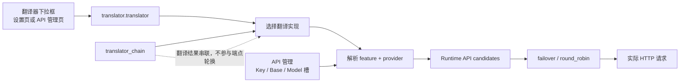
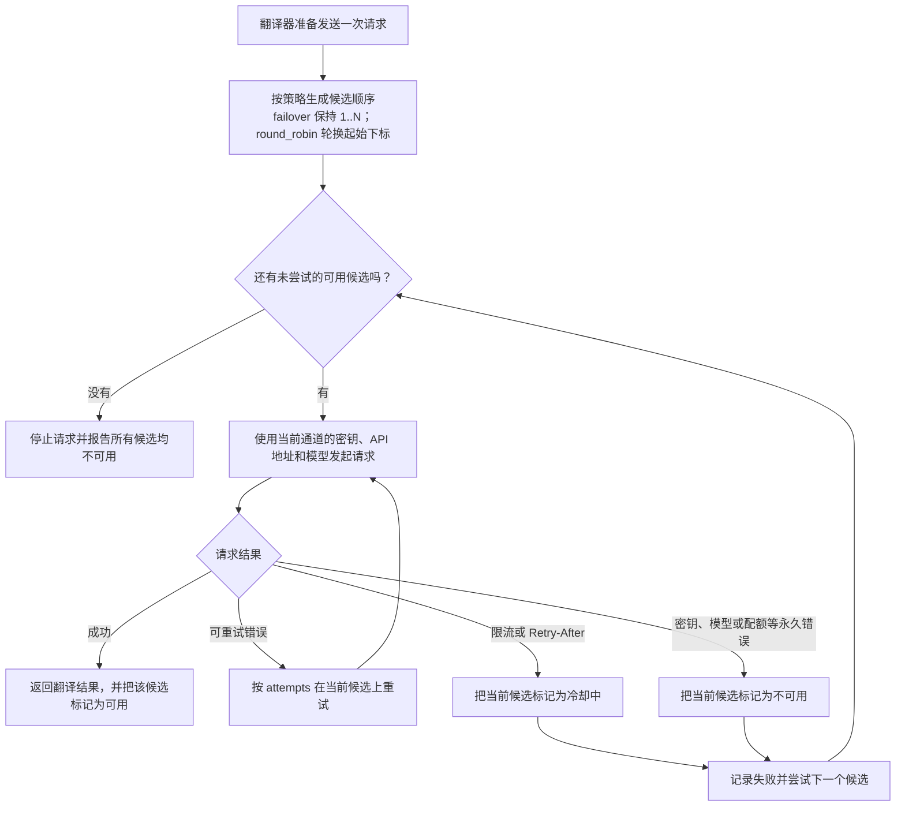

# API 通道与轮询策略

当一组 API 密钥容易触发限流，或者你同时使用官方地址和兼容服务时，可以为同一个提供商添加多个 API 通道。每个通道保存一组密钥、API 地址和模型；翻译器仍然是原来的翻译器，变化的只是下一次请求使用哪个 API 候选。

本页介绍候选通道的添加、删除、编号徽标和两种轮询策略，以及它们如何组成运行时的候选列表。OpenAI 与 Gemini 翻译器之间的切换见[翻译器选择](../translator/selection-and-languages.md)，`translator_chain` 见[翻译器串联](../translator/translation-chain.md)。页签布局见[API 管理页签与提供商字段](./provider-tabs.md)，Key/Base/Model 字段与 `.env` 键映射见[凭据、地址与模型](./credentials-addresses-models.md)，冷却/不可用/恢复的完整说明见[故障、冷却与恢复](./failures-cooldown-and-recovery.md)，连接测试见[连接测试与模型列表](./connection-tests-and-model-list.md)。

## 在界面中配置备用 API {#configure-api-slots}

打开“API 管理”（`API Management`），选择实际使用 API 的功能页签，例如“翻译”。页面上方的功能选择器决定当前使用 OpenAI、Gemini 还是其他实现；下方的 API 通道只配置这个实现所使用的连接信息。

以 OpenAI 翻译为例，每张通道卡片显示以下三个字段。切换到 Gemini、OCR、上色或渲染时，字段会换成对应功能和提供商的 i18n 文案。

| UI 调用 key | English 实际值 | 简体中文实际值 |
| --- | --- | --- |
| `label_OPENAI_API_KEY` | OpenAI API Key | OpenAI API 密钥 |
| `label_OPENAI_MODEL` | OpenAI Model | OpenAI 模型 |
| `label_OPENAI_API_BASE` | OpenAI API Base | OpenAI API 地址 |
| `API slot {index}` | API slot | API 通道 |
| `+ Add API slot` | + Add API slot | + 添加 API 通道 |
| `API rotation strategy:` | Rotation strategy: | 轮询策略： |
| `Test Current Tab` | Test Current Tab | 测试当前页 |

通道标题由两部分组成：左侧徽标显示两位编号（例如 `01`），右侧显示“API 通道”（`API slot`）。代码没有把编号直接拼进标题文字，编号只出现在徽标中。

1. 在编号 `01` 的“API 通道”卡片中填写“OpenAI API 密钥”“OpenAI 模型”和“OpenAI API 地址”。
2. 点击“+ 添加 API 通道”（`+ Add API slot`），创建第二组候选。新通道的三个 `.env` 键会先写入空值再刷新界面。
3. 为编号 `02` 的“API 通道”填写完整的连接信息。留空的通道不会成为有效候选（本地 OpenAI 兼容端点除外：空密钥会被规范化为 `ollama` 占位值）。
4. 在“轮询策略：”（`Rotation strategy:`）下拉框中选择“按顺序故障切换”（`Ordered failover`）或“轮询”（`Round robin`）。
5. 使用“测试当前页”（`Test Current Tab`）确认至少有一个候选可以连接。

“测试当前页”只测试当前功能页签内所有已配置的通道（并发数为 3），不会测试其他页签；结果弹窗显示“共 N 个，可用 X 个，不可用 Y 个”，并把每个通道标记为可用、冷却中或不可用，状态条随即刷新在对应卡片上。如果当前功能没有可测试的通道，会提示“没有可测试的 API 通道”。

删除中间通道时，后面的通道会向前补位，因此编号始终连续；被删除通道的 `.env` 键会被清理。删除通道不会切换翻译器，也不会修改其他功能页签中的 OCR、上色或渲染 API。界面上限为 10 个通道（`API_ROTATION_UI_MAX_SLOTS = min(10, 30)`），达到上限后“+ 添加 API 通道”按钮隐藏。

## 两种轮换策略有什么区别 {#rotation-strategies}

| 存储值 | English | 简体中文 | 实际行为 |
| --- | --- | --- | --- |
| `failover` | Ordered failover | 按顺序故障切换 | 正常情况下优先使用靠前的可用通道；当前通道重试仍失败后，再尝试后面的通道 |
| `round_robin` | Round robin | 轮询 | 每次请求轮换起始通道，让多个可用候选分担请求；失败时仍会继续寻找其他候选 |

如果只有一个有效通道，两种策略的结果基本相同。轮询不会把一次翻译拆给多个模型，也不会在请求过程中更改翻译器。

## 候选解析与轮换调用图 {#candidate-resolution}

下面的调用图把本页与翻译器选择、功能选择器和 `translator_chain` 的边界放在一起：API 管理页的 Key/Base/Model 槽只参与“解析 feature + provider”和候选列表的构建，轮换发生在已选定的提供商内部，最终才发起 HTTP 请求。

运行时 `resolve_runtime_api_config()` 按以下顺序构造候选：

- 先读取当前 feature/provider 的策略键（例如 `OPENAI_API_ROTATION_STRATEGY`）和 `_2`、`_3` 等编号 `.env` 键，得到通道数量与策略。
- 对每个编号 `1..N` 读取 Key、Base、Model；三个字段齐全（Key 对本地 OpenAI 兼容端点可为空）才成为一个候选端点，完全重复的 `(key, base_url, model)` 会被去重。
- 只有被当前功能选择器激活的提供商分组才会出现在界面和候选池中；`translator.translator` 的取值决定最终请求由哪个实现发出。
- Web 多用户场景下，`user_api_key`/`user_api_base`/`user_api_model` 作为配置覆盖存在时，解析器只构造单个候选端点并把策略固定为 `failover`，编号通道轮换不参与。

## 一次请求怎样选择候选 {#candidate-selection}

系统先在当前候选内部执行普通请求重试；只有当前候选无法继续使用时，才会根据轮询策略选择下一个通道。因此“重试次数”（`cli.attempts`，见[重试、限流与质量](../translator/retry-rate-limit-and-quality.md)）和“API 通道数量”控制的是两个不同层级。

## 冷却、不可用和恢复 {#status-and-recovery}

| 界面状态 | 常见原因 | 系统行为 | 用户可以做什么 |
| --- | --- | --- | --- |
| 冷却中 | 429、速率限制、服务返回 `Retry-After` | 暂时跳过该候选，冷却结束后允许再次使用 | 等待冷却结束，或检查请求频率 |
| 不可用 | Key 无效、模型不存在、配额或计费错误 | 后续请求跳过该候选 | 修正配置后点击恢复按钮，再执行连接测试 |
| 可用 | 连接成功，或失败状态已被清除 | 可以参与后续候选选择 | 无需操作 |

状态条和恢复按钮显示在通道卡片标题下方；“恢复 API 通道”（`Restore`）只清除当前进程中的失败状态，不会替你修改 Key、地址或模型。配置本身有误时，恢复后仍会再次失败。完整状态机见[故障、冷却与恢复](./failures-cooldown-and-recovery.md)。

## 与翻译器切换的关系 {#translator-boundary}

- 把 OpenAI 翻译切换为 Gemini 翻译，是更换翻译实现和提供商。
- 在 `OPENAI_API_KEY`、`OPENAI_API_KEY_2` 之间切换，是 OpenAI 提供商内部的候选轮询。
- `translator_chain` 会把一个翻译器的结果交给下一个翻译器，和 API 候选通道没有关系。

API 管理页顶部的翻译器选择器绑定 `translator.translator`，因此在那里切换选项会真正改变翻译器；API 通道和轮询策略本身不会改变该值。详细边界见[功能选择器](./feature-selectors.md)与[翻译器串联](../translator/translation-chain.md)。

## 关联配置 {#related-configuration}

| 配置 | 作用 | 注意事项 |
| --- | --- | --- |
| `.env` 中的 Key/Base/Model 及编号通道 | 保存各 API 候选 | 文档和截图中不得展示真实密钥 |
| `*_API_ROTATION_STRATEGY` | 保存当前提供商的轮换策略 | 只影响对应 feature/provider 组 |
| `translator.translator` | 决定使用哪个翻译实现 | 槽和策略不改变该值 |
| `config/custom_api_params.json` | 保存请求体额外参数 | 不负责连接凭据、模型选择或 API 通道轮询 |

## 源码依据 {#source-evidence}

| 层级 | 文件 | 本页核对内容 |
| --- | --- | --- |
| UI | `desktop_qt_ui/ui/main_page/env_management.py` | 通道增删与编号徽标、策略下拉、测试当前页、状态条与恢复 |
| 分组与刷新 | `desktop_qt_ui/ui/main_page/dynamic_settings.py` | `API_GROUP_SPECS`、`_selected_api_group_keys`、`_refresh_env_api_groups` |
| 持久化 | `desktop_qt_ui/services/config_service.py` | `.env` 读取、内存写入与 250ms 合并落盘 |
| 候选解析 | `manga_translator/runtime_api_resolver.py` | Key、Base、Model 和编号通道如何组成候选 |
| 请求轮换 | `manga_translator/api_key_rotation.py` | failover、round robin、冷却、不可用和恢复 |
| 最终消费者 | `manga_translator/translators/openai.py`、`gemini.py` 等 | `run_with_api_candidates` 与端点切换 |

## 验证记录 {#verification}

| 验证内容 | 状态 | 说明 |
| --- | --- | --- |
| BLUEPRINT、PAGE_GUIDELINES、TODO | 完成 | 已完整读取并按页面合同编写 |
| UI 与 i18n 实际值 | 完成 | 三列表逐项核对 `en_US.json` / `zh_CN.json` |
| 候选解析与轮换 | 完成 | 静态核对 `runtime_api_resolver.py`、`api_key_rotation.py` 与调用图 |
| 多通道连接测试 | 待后续 | 使用脱敏测试配置验证增删和测试结果 |
| 轮换与恢复 | 待后续 | 用可控失败端点验证候选状态变化 |
| VitePress | 完成 | 已运行 `npm run docs:build --prefix doc/wiki` 且构建通过；镜像/源码检查已通过，合并前仍由协调代理复核 |