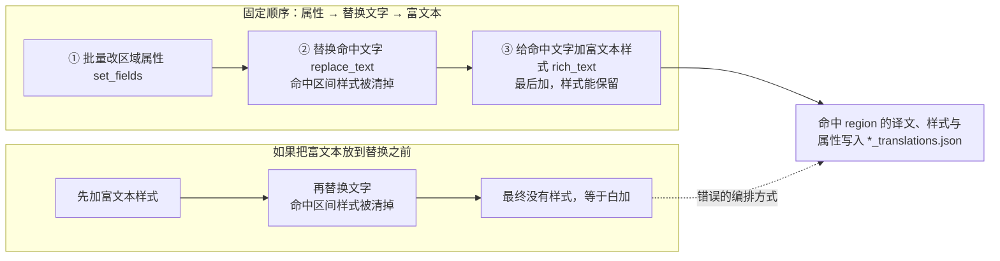

# 批量动作与执行顺序

当需要跨主页文件列表批量修改已翻译区域时，“批量动作”（`Batch actions`）决定对命中的区域做什么：改属性、替换文字、加富文本样式。本页说明三种动作块的用法、它们保存到方案文件后的结构，以及为什么必须按“属性 → 替换文字 → 富文本”的固定顺序执行。

方案的新建、复制、重命名与删除见[方案管理](./schemes-crud.md)，条件字段、运算符与 `all`/`any` 逻辑见[匹配条件](./conditions.md)，预览命中、勾选、写回与恢复见[预览、应用与恢复](./preview-apply-restore.md)。富文本样式的具体字段含义与富文本规则共用同一个样式编辑器，见[富文本样式与预设](../rich-text-rules/styles-and-presets.md)。

## 功能边界 {#feature-boundary}

- “批量动作”卡片内只有三个动作块：`set_fields`（批量改区域属性）、`replace_text`（替换命中文字）、`rich_text`（给命中文字加富文本样式）。
- 动作执行顺序固定为 `set_fields` → `replace_text` → `rich_text`，界面不提供拖拽或上下移动排序；同一个块内多条条目按从上到下依次执行。
- 顺序固定的原因：替换文字会清掉命中区间的富文本样式，所以样式必须放最后；把样式放在替换之前等于白加。
- “批量改区域属性”一个方案只产出一条动作（所有字段打包成一个 `fields` 字典）；“替换命中文字”和“给命中文字加富文本样式”每条条目各产出一条动作。
- 条件负责筛选 region，动作各自带 pattern 负责在译文里定位子串，两者分开，不存在“哪条条件的命中区间才是目标”的歧义。
- 本页不覆盖条件编辑（见[匹配条件](./conditions.md)）、预览/勾选/写回/恢复（见[预览、应用与恢复](./preview-apply-restore.md)），也不解释富文本样式的每个字段（见[富文本样式与预设](../rich-text-rules/styles-and-presets.md)）。

## UI 操作 {#ui-operations}

### 在批量管理页配置动作

1. 打开“批量管理”（`Batch Management`）页面。页面标题为“批量管理”，副标题为“跨主页文件列表匹配区域，批量修改文字、富文本样式与属性”。
2. 在“批量动作”（`Batch actions`）卡片中，三个动作块各有启用开关。勾选空的“替换命中文字”或“给命中文字加富文本样式”块会自动补一条空白条目；取消勾选会停用该块，预览和执行都会忽略它。
3. “批量改区域属性”块中点击“添加属性”（`Add property`）新增一行：字段下拉框 + 值编辑器 + 删除按钮。字段下拉只列出可写字段；只读/派生字段只能用于条件，不能在此写入。
4. “替换命中文字”块中点击“添加替换”（`Add replacement`）新增一条：`匹配文字`（`Match text`）输入 pattern，`正则`（`Regex`）开关切换是否按正则解释，`替换为`（`Replace with`）输入替换文本；开启正则时支持 `\1` 这样的反向引用。
5. “给命中文字加富文本样式”块中点击“添加样式条目”（`Add style entry`）新增一条：模式下拉框、`匹配文字`、可选的“匹配富文本”（`Match rich text`）条件、目标样式“编辑样式”（`Edit Style`）。
6. 卡片标题下方的提示文字直接说明固定顺序：“固定按此顺序执行：改属性 → 替换文字 → 富文本。改文字会清掉命中区间的样式，所以样式必须放最后。同一块内的条目从上往下依次执行。”

| UI 调用 key | English 实际值 | 简体中文实际值 |
| --- | --- | --- |
| `Batch Management` | Batch Management | 批量管理 |
| `Match regions across the main file list and edit their text, styling, and properties in bulk` | Match regions across the main file list and edit their text, styling, and properties in bulk | 跨主页文件列表匹配区域，批量修改文字、富文本样式与属性 |
| `Batch actions` | Batch actions | 批量动作 |
| `Applied in a fixed order: properties, then text replacement, then rich text. Changing the text clears styling on the changed range, so styling must come last. Within a block, entries run top to bottom.` | Applied in a fixed order: properties, then text replacement, then rich text. Changing the text clears styling on the changed range, so styling must come last. Within a block, entries run top to bottom. | 固定按此顺序执行：改属性 → 替换文字 → 富文本。改文字会清掉命中区间的样式，所以样式必须放最后。同一块内的条目从上往下依次执行。 |
| `Set region properties` | Set region properties | 批量改区域属性 |
| `Add property` | Add property | 添加属性 |
| `Remove property` | Remove property | 移除属性 |
| `Replace matched text` | Replace matched text | 替换命中文字 |
| `Add replacement` | Add replacement | 添加替换 |
| `Remove replacement` | Remove replacement | 删除这条替换 |
| `Match text` | Match text | 匹配文字 |
| `Text or regular expression` | Text or regular expression | 文字或正则表达式 |
| `Regex` | Regex | 正则 |
| `Replace with` | Replace with | 替换为 |
| `Supports backreferences like \1 when regex is on` | Supports backreferences like \1 when regex is on | 开启正则时支持 \1 这样的反向引用 |
| `Apply rich text style to matched text` | Apply rich text style to matched text | 给命中文字加富文本样式 |
| `Add style entry` | Add style entry | 添加样式条目 |
| `Remove style entry` | Remove style entry | 删除这条样式 |
| `Overwrite` | Overwrite | 覆盖 |
| `Fill in` | Fill in | 添加 |
| `Replace` | Replace | 替换 |
| `Match rich text` | Match rich text | 匹配富文本 |
| `Match all` | Match all | 全部满足 |
| `Match any` | Match any | 任一满足 |
| `Edit Style` | Edit Style | 编辑样式 |
| `No style set` | No style set | 未设置样式 |
| `No style filter` | No rich text filter | 未设置富文本条件 |
| `Leave the pattern empty to target the whole region` | Leave the pattern empty to target the whole region | 匹配文字留空 = 整条 region 的全部文字 |

动作块的启用状态和条目会随方案一起保存；条件或动作任何一行变化都会让上一次的预览结果作废。

## 三种动作类型 {#action-types}

### 批量改区域属性

控件以“字段 + 值”行列出，`to_actions()` 把同一块内所有行打包成一条 `set_fields` 动作（`fields` 字典）。可写字段如下：

| 存储键 | English 实际值 | 简体中文实际值 | 说明 |
| --- | --- | --- | --- |
| `translation` | Translation | 翻译 | 整段改写译文，走同步管线，丢弃旧富文本 |
| `translation_raw` | Translation (pre-replacement) | 译文（替换前） | 替换前译文；单独写它时只更新该字段 |
| `font_family` | Font Family | 字体 | 字体族 |
| `target_lang` | Target Language | 目标语言 | 目标语言 |
| `source_lang` | Source Language | 源语言 | 源语言 |
| `direction` | Direction | 排版方向 | `h` / `v` / `hr` / `vr` / `auto` |
| `alignment` | Alignment | 对齐 | `left` / `center` / `right` / `auto` |
| `font_size` | Font Size | 字号 | 整数 |
| `angle` | Angle | 角度 | 数值 |
| `line_spacing` | Line Spacing | 行距 | 数值 |
| `letter_spacing` | Letter Spacing | 字距 | 数值 |
| `stroke_width` | Stroke Width | 描边宽度 | 数值 |
| `fg_colors` | Text Color | 文字颜色 | 颜色；兼容编辑器写入的 `font_color` 形态 |
| `bg_colors` | Stroke Color | 描边颜色 | 颜色；兼容编辑器写入的 `bg_color` 形态 |

只读/派生字段（`text` 原文、`prob` OCR 置信度、`has_rich_text` 含富文本、`line_count` 行数、`region_index` 区域序号）不出现在“添加属性”下拉中，只能用于[匹配条件](./conditions.md)。

写 `translation` 时按“整段改写”处理：旧 `translation_rich` 会被丢弃，`translation_raw` 同步为同一份文本；若同一块里也写了 `translation_raw`，则保留你写的值。

### 替换命中文字

每条条目产出一条 `replace_text` 动作，字段为 `pattern`、`regex`、`replace`。pattern 留空时该条不产出动作；引擎把连续换行先压成一个再定位子串。开启 `regex` 时替换串支持 `\1` 反向引用，非法引用按字面量处理，不会让整批任务崩溃。

替换通过编辑回放写回：未改动字符保留自己的富文本与 ruby/tcy 节点归属，只有被替换掉的那几个字失去样式；替换出的新字继承命中区间首字的样式（区间内原本有多种样式时只能取一种）。

### 给命中文字加富文本样式

每条条目产出一条 `rich_text` 动作。三种模式：

| 存储值 | English | 简体中文 | 实际行为 |
| --- | --- | --- | --- |
| `overwrite` | Overwrite | 覆盖 | 你设的项赢；命中区间上的其他项原样保留 |
| `fill` | Fill in | 添加 | 命中区间已有的同名项赢，只补它没有的；ruby/tcy 区间内已有任何节点就整段让位 |
| `replace` | Replace | 替换 | 先清掉命中区间原有的样式与节点，再应用新样式 |

pattern 留空 = 整条 region 的全部文字；可选 `match_style` 按“全部满足 / 任一满足”筛选命中文字现有的富文本样式。`style`、`ruby`、`tcy` 全空的动作会被丢弃。引擎从右到左依次应用命中区间，避免坐标错位。

## 固定执行顺序 {#execution-order}

方案文件里的 `actions` 列表不要求手工按顺序写：`normalize_scheme()` 用 `ACTION_ORDER = (set_fields, replace_text, rich_text)` 做稳定排序，同类型条目保持写下时的先后。

图里“命中区间样式被清掉”指的是替换动作对命中子串的重写，不是整条 region 一定会丢样式：未改动字符的样式会通过编辑回放保留下来。固定顺序保证最后加的富文本样式不会被同一方案里的替换动作再次清掉。

## 依赖与冲突 {#dependencies-and-conflicts}

- 条件决定哪些 region 进入预览，动作只在这些 region 内定位子串；条件本身不参与动作执行。
- 预览要求至少启用一个动作块（`Enable at least one batch action first.`），全空的方案不能预览。
- 预览结果在条件或动作任何一行变化后作废，需要重新点击“预览命中”。
- 富文本样式编辑器与富文本规则页共用 `RichTextStyleDialog`，样式字段和兼容性以富文本规则页为准。
- 批量写回与编辑器内存数据可能冲突：执行前会提示并自动重载编辑器，详见[预览、应用与恢复](./preview-apply-restore.md)。
- 批量管理只改桌面侧的 `*_translations.json` 与方案文件，不进入 `manga_translator` 的渲染管线，也不读取或写入 API 凭据。

## 关联文件与格式 {#related-files-and-formats}

| 文件/格式 | 本页实际作用 | 手改与兼容注意 |
| --- | --- | --- |
| `config/batch_edit_schemes.yaml` | 保存全部方案；顶层 `schemes` 列表，每个方案含 `match` 与 `actions` | `yaml.safe_load` / `safe_dump`；文件缺失时惰性创建默认示例 |
| `schemes[].actions[].type` | `set_fields` / `replace_text` / `rich_text` | 归一化时按 `ACTION_ORDER` 稳定排序；未知类型与旧 `clear` 模式被丢弃 |
| `rich_text` 动作的 `mode` | `overwrite` / `fill` / `replace` | 非法模式回退为 `overwrite` |
| `<image-dir>/manga_translator_work/json/<stem>_translations.json` | 动作写回的目标；region 含 `translation`、`translation_raw`、`translation_rich` 等 | 写入前默认在同目录生成 `.bak`；详见[预览、应用与恢复](./preview-apply-restore.md) |

## 源码依据 {#source-evidence}

| 层级 | 文件 | 本页核对内容 |
| --- | --- | --- |
| 页面入口 | `desktop_qt_ui/ui/main_page/pages/batch_edit_page.py` | “批量管理”页标题与副标题 |
| UI | `desktop_qt_ui/ui/secondary_pages/batch_edit_panel.py` | 动作卡片布局、启用开关、提示文字、`_collect_scheme()` 组装动作 |
| 动作控件 | `desktop_qt_ui/ui/secondary_pages/batch_edit_condition_widgets.py` | `SetFieldsActionCard`、`ReplaceTextActionCard`、`RichTextActionCard`、条目与模式下拉 |
| i18n | `desktop_qt_ui/locales/en_US.json`、`zh_CN.json` | 动作相关 key 的实际中英文显示值 |
| 持久化 | `desktop_qt_ui/services/batch_edit_schemes.py` | `ACTION_ORDER`、`normalize_scheme()` 稳定排序、`RICH_MODES` |
| 执行引擎 | `desktop_qt_ui/services/batch_edit_engine.py` | `_apply_set_fields`、`_apply_replace_text`、`_apply_rich_text`、`apply_scheme_to_region` |
| 调度 | `desktop_qt_ui/services/batch_edit_service.py` | 扫描/应用/恢复频道与取消的调度边界 |

## 验证记录 {#verification}

| 验证内容 | 状态 | 说明 |
| --- | --- | --- |
| BLUEPRINT、PAGE_GUIDELINES、TODO | 完成 | 已读取并按页面合同编写 |
| UI 布局与调用 | 完成 | 静态核对批量面板动作卡片与条目控件 |
| `en_US` / `zh_CN` 实际 locale | 完成 | 页面表格逐项记录 key、English、简体中文实际值 |
| 动作执行链 | 完成 | 静态核对 `ACTION_ORDER` 稳定排序与三种动作的引擎实现 |
| 脱敏运行验证 | 待后续 | 本页未读取真实 `.env`、用户 `config.json`、API key/token、用户名、用户图片或私有提示词 |
| VitePress | 待运行 | 由协调代理在合并前运行 `npm run docs:build --prefix doc/wiki` 及镜像/源码检查 |