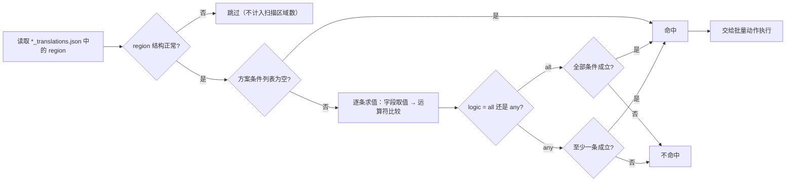

# 批量条件匹配

当一批图片里的文字区域需要按内容、排版或属性统一筛选后再批量修改时，在“批量管理”（`Batch Management`）页使用匹配条件。条件负责筛出命中的区域，批量动作再对这些区域改文字、富文本样式或属性；两者分开，不存在“哪条条件的命中区间才是目标”的歧义。

本页只讲条件字段与匹配规则。方案的增删改见[方案管理（增删改）](./schemes-crud.md)，批量动作见[批量动作与执行顺序](./actions-and-order.md)，预览、写回、备份与恢复见[预览、应用与恢复](./preview-apply-restore.md)。

## 功能边界 {#feature-boundary}

- 一个方案包含 `match`（`logic` + `conditions`）与 `actions` 两部分；条件是前半部分，只筛选区域。
- 条件为空时，范围内的所有区域都命中（“不填条件表示范围内的所有区域都命中。”）。
- 条件只在结构正常的区域上求值；结构异常的区域在扫描和执行阶段都会被跳过。
- 批量管理的条件处理的是主页文件列表中的 `*_translations.json` 区域数据，与翻译流水线的 `batch_size`、`batch_concurrent`（图片分批/并发翻译）没有关系。

## UI 操作 {#ui-operations}

### 在批量管理页配置匹配条件

1. 打开左侧主导航中的“批量管理”（`Batch Management`）页面。
2. 选择或新建一个方案（方案列表操作见[方案管理（增删改）](./schemes-crud.md)）。
3. 在“匹配条件”（`Match conditions`）卡片中，先用逻辑下拉框选择“全部满足”（`Match all`）或“任一满足”（`Match any`）。
4. 点击“添加条件”（`Add condition`）新建一行条件 `[字段 ▼] [运算符 ▼] [值] [×]`；字段下拉框列出全部可匹配字段，运算符随字段类型变化，值编辑器按“字段类型 + 运算符”动态生成。
5. 修改字段或运算符后，值编辑器会重建；不需要值的运算符（`empty`、`not_empty`、`is_true`、`is_false`）隐藏值编辑器。
6. 点击行尾 `×` 删除该条件（按钮提示为“移除条件”）。
7. 任何改动都会把方案标记为待保存，约 600 ms 后自动保存到 `config/batch_edit_schemes.yaml`，同时清空上一次的预览结果。

| UI 调用 key | English 实际值 | 简体中文实际值 |
| --- | --- | --- |
| `Batch Management` | Batch Management | 批量管理 |
| `Match regions across the main file list and edit their text, styling, and properties in bulk` | Match regions across the main file list and edit their text, styling, and properties in bulk | 跨主页文件列表匹配区域，批量修改文字、富文本样式与属性 |
| `Scheme:` | Scheme: | 方案: |
| `Match conditions` | Match conditions | 匹配条件 |
| `Match all` | Match all | 全部满足 |
| `Match any` | Match any | 任一满足 |
| `Add condition` | Add condition | 添加条件 |
| `Remove condition` | Remove condition | 移除条件 |
| `No conditions means every region in scope is selected.` | No conditions means every region in scope is selected. | 不填条件表示范围内的所有区域都命中。 |
| `Preview matches` | Preview matches | 预览命中 |

### 条件行与值编辑器

每条条件行 `[字段 ▼] [运算符 ▼] [值] [×]` 的值编辑器按字段类型和运算符现造：

| 字段类型 | 值编辑器 | 说明 |
| --- | --- | --- |
| 文本（`text`） | 单行输入框 | 占位文案为“值”（`Value`） |
| 枚举（`enum`） | 下拉框 | 直接显示存储值，不翻译；例如排版方向 `h`/`v`/`hr`/`vr`/`auto` |
| 数字（`number`） | 数值输入框 | 整数范围 -100000…100000；小数保留 3 位、步进 0.05 |
| 数字区间（`between`） | 低值 + “到”（`to`）+ 高值 | 两个数值输入框 |
| 颜色（`color`） | 颜色选择器 | 使用“接近颜色”（`color_near`）时附带“容差”（`Tolerance`），范围 0…442、默认 30 |
| 布尔（`bool`） | “是”（`Yes`）/“否”（`No`）下拉框 | 存储 `true`/`false` |
| 字体（`font_family`） | 字体下拉框 | 列出系统字体 |

## 条件字段 {#condition-fields}

以下字段出现在“字段”下拉框中。`存储值` 是写入方案 YAML 的字段键；标为“否”的字段只能用于条件，不能作为“改 region 属性”动作的写入目标。

| 存储值 | English 实际值 | 简体中文实际值 | 类型 | 可被动作写入 |
| --- | --- | --- | --- | --- |
| `translation` | Translation | 翻译 | 文本 | 是 |
| `text` | Source Text | 原文 | 文本 | 否 |
| `translation_raw` | Translation (pre-replacement) | 译文（替换前） | 文本 | 是 |
| `font_family` | Font Family | 字体 | 文本（字体） | 是 |
| `target_lang` | Target Language | 目标语言 | 文本 | 是 |
| `source_lang` | Source Language | 源语言 | 文本 | 是 |
| `direction` | Direction | 排版方向 | 枚举 | 是 |
| `alignment` | Alignment | 对齐 | 枚举 | 是 |
| `font_size` | Font Size | 绝对字号 | 数字（整数） | 是 |
| `angle` | Angle | 角度 | 数字 | 是 |
| `line_spacing` | Line Spacing | 行距 | 数字 | 是 |
| `letter_spacing` | Letter Spacing | 字距 | 数字 | 是 |
| `stroke_width` | Stroke Width | 描边宽度 | 数字 | 是 |
| `prob` | OCR Confidence | OCR 置信度 | 数字 | 否 |
| `fg_colors` | Text Color | 文字颜色 | 颜色 | 是 |
| `bg_colors` | Stroke Color | 描边颜色 | 颜色 | 是 |
| `has_rich_text` | Has Rich Text | 含富文本 | 布尔 | 否 |
| `line_count` | Line Count | 行数 | 数字（整数） | 否 |
| `region_index` | Region Index | 区域序号 | 数字（整数） | 否 |

字段取值说明：

- `translation` 匹配的是区域正文：优先取富文本文档的可见文字（换行为 `\n`），解析失败时回退到 `translation` 字段。匹配不跑在带 `[BR]` 的 `translation` 上，避免 `[BR]` 四个字符污染字符下标。
- `text`、`prob`、`has_rich_text`、`line_count`、`region_index` 是只读字段，不会出现在“改 region 属性”动作里。
- `direction` 取值会做别名归一化：`horizontal` → `h`、`vertical` → `v`，并接受 `h`/`v`/`hr`/`vr`/`auto`。
- `fg_colors`/`bg_colors` 为空时会回退读取 `font_color`/`bg_color`，兼容编辑器保存的历史形态。

## 匹配运算符与规则 {#operators-and-rules}

运算符由字段类型决定，逐类型列出：

| 存储值 | English 实际值 | 简体中文实际值 | 适用类型 | 需要值 |
| --- | --- | --- | --- | --- |
| `contains` | contains | 包含 | 文本 | 是 |
| `not_contains` | does not contain | 不包含 | 文本 | 是 |
| `eq` | equals | 等于 | 文本/枚举/数字 | 是 |
| `ne` | not equal to | 不等于 | 文本/枚举/数字 | 是 |
| `regex` | matches regex | 正则匹配 | 文本 | 是 |
| `not_regex` | does not match regex | 正则不匹配 | 文本 | 是 |
| `empty` | is empty | 为空 | 文本 | 否 |
| `not_empty` | is not empty | 不为空 | 文本 | 否 |
| `gt` | greater than | 大于 | 数字 | 是 |
| `gte` | at least | 大于等于 | 数字 | 是 |
| `lt` | less than | 小于 | 数字 | 是 |
| `lte` | at most | 小于等于 | 数字 | 是 |
| `between` | between | 介于 | 数字 | 是（两个值） |
| `color_eq` | equals color | 颜色等于 | 颜色 | 是 |
| `color_near` | close to color | 颜色接近 | 颜色 | 是（含容差） |
| `is_true` | is yes | 是 | 布尔 | 否 |
| `is_false` | is no | 否 | 布尔 | 否 |

匹配规则（来自 `batch_edit_engine` 的求值实现）：

- 文本：先 `str()` 归一，`contains`/`not_contains` 是子串判断，`eq`/`ne` 是整串相等；`empty`/`not_empty` 按去除首尾空白后的文本判断。
- 正则：使用 `re.search` 子串搜索；正则表达式非法时，`regex` 与 `not_regex` 都返回不匹配（不会因非法正则报错中断整批扫描）。
- 枚举：比较前去除首尾空白并转小写；排版方向再做别名归一化。
- 数字：数值解析失败时该条件不匹配；`eq`/`ne` 使用浮点近似比较（相对/绝对容差 `1e-9`）；`between` 包含两端，且低值大于高值时自动交换。
- 颜色：按 RGB 距离比较；`color_eq` 要求距离为 0，`color_near` 要求距离 ≤ 容差（未提供容差时默认 `30.0`，UI 范围 0…442）。
- 布尔：`is_true` 要求值为真，`is_false` 要求值为假。
- 未知字段、未知运算符或字段类型与运算符不匹配时，该条件一律不匹配（返回假）。

## 条件匹配流程 {#matching-flow}

下图是单条区域从文件到“是否命中”的判定流程（“执行动作”的具体内容见[批量动作与执行顺序](./actions-and-order.md)）：

限制说明：上图是源码中的真实判定路径；`translation` 的正文口径是富文本可见文字（`\n`），因此 `contains`/`regex` 等运算符看到的是 `\n` 换行而非 `[BR]` 标记。执行（应用）阶段会重新读盘并再次跑同一套条件，不会直接套用预览缓存。

## 依赖与冲突 {#dependencies-and-conflicts}

- 条件只负责筛区域，动作各自带 `pattern` 在译文里定位子串；条件与动作不共享“命中区间”。
- 条件的求值依赖区域里的 `texts`/`lines`/`translation`/富文本等字段；OCR 文本缺失或结构异常的区域会被跳过，不会被条件“选中”。
- 方案改动后上一次预览自动作废，需要重新点击“预览命中”（`Preview matches`）生成新的命中列表。
- 批量管理条件与翻译设置的 `context_size`、`batch_size`、`batch_concurrent` 完全无关：前者操作的是已翻译 JSON 的区域数据，后者控制翻译流水线的分批与并发。
- 本页不读取或展示真实 `.env`、用户 `config.json` 或任务产物；方案 YAML 只记录条件和动作结构，不包含凭据。

## 关联文件与格式 {#related-files-and-formats}

| 文件/格式 | 本页实际作用 | 手改与兼容注意 |
| --- | --- | --- |
| `config/batch_edit_schemes.yaml` | 保存方案，其中 `match.logic` 与 `match.conditions[]` 是本页内容 | `conditions[].field`/`op`/`value` 需与字段表和运算符表一致；未知字段或运算符会被判为不匹配 |
| `*_translations.json` | 条件读取的区域数据（`texts`、`lines`、`text`、`translation`、`direction`、`prob`、颜色等） | 只记录字段语义，不展示真实用户图片或译文 |
| `.bak` | 写回前备份 | 属于[预览、应用与恢复](./preview-apply-restore.md)，本页不展开 |

## 源码依据 {#source-evidence}

| 层级 | 文件 | 本页核对内容 |
| --- | --- | --- |
| 页面入口 | `desktop_qt_ui/ui/main_page/pages/batch_edit_page.py`、`desktop_qt_ui/ui/main_window.py` | 批量管理页注册、标题与副标题 |
| 条件 UI | `desktop_qt_ui/ui/secondary_pages/batch_edit_panel.py` | 匹配条件卡片、逻辑下拉框、添加/移除条件、自动保存 |
| 条件行与值编辑器 | `desktop_qt_ui/ui/secondary_pages/batch_edit_condition_widgets.py` | 字段/运算符/值三连、按类型造值编辑器 |
| 求值引擎 | `desktop_qt_ui/services/batch_edit_engine.py` | `FIELDS`、`OPS_BY_KIND`、`evaluate_conditions`、`region_field_value`、`region_is_sane` |
| 方案持久化 | `desktop_qt_ui/services/batch_edit_schemes.py` | `match.logic`/`conditions` 结构、读写与校验 |
| i18n | `desktop_qt_ui/locales/en_US.json`、`zh_CN.json` | 字段、运算符和面板文案的中英实际值 |

## 验证记录 {#verification}

| 验证内容 | 状态 | 说明 |
| --- | --- | --- |
| BLUEPRINT、PAGE_GUIDELINES、TODO | 完成 | 已读取并按页面合同编写；责任边界与 `BLUEPRINT.md` 5.4 批量管理一致 |
| 条件 UI 与 i18n | 完成 | 静态核对 `batch_edit_panel.py`、`batch_edit_condition_widgets.py` 与两个 locale 的实际值 |
| 匹配规则与字段取值 | 完成 | 静态核对 `batch_edit_engine.py` 的 `evaluate_conditions`、`region_field_value`、`region_is_sane` |
| 路由镜像与源码依据检查 | 待运行 | 由协调代理在合并前运行 `node scripts/verify-route-mirror.mjs .` 与 `node scripts/verify-source-evidence.mjs .` |
| 脱敏运行验证 | 待后续 | 本页未读取真实 `.env`、用户 `config.json`、API key/token、用户名、用户图片或私有译文 |
