# 浮动富文本编辑器

当你在编辑器里需要给某句译文加粗、变色、加注音或做竖排内横排等行内富文本修饰时，使用浮动富文本编辑器。它是一块绑定在画布当前单选文字区域旁的独立小窗口，提供正文编辑、按文字运行的样式卡片、注音输入和样式预设。本页介绍该窗口的打开、编辑与保存；每个样式的参数细节与渲染效果见[样式属性](./style-properties.md)，普通文本字段、查找替换与区域列表见[区域列表与文本编辑](./region-list-and-text-editing.md)，富文本规则的匹配与样式预设文件见[富文本样式与预设](../rich-text-rules/styles-and-presets.md)，快捷键与焦点冲突见[快捷键](./shortcuts.md)。

## 功能边界 {#feature-boundary}

- 浮动富文本编辑器是 `EditorView` 创建的独立顶层工具窗口（`Qt.Tool` + 无边框），不是画布的子覆盖层，因此不会被画布 viewport 裁剪，也可以被拖到其他面板或显示器。
- 它只在“恰好单选一个区域”且菜单开关“显示富文本编辑弹窗”（`Show Rich Text Editor Popup`）开启时显示；多选、点空白画布、开始拖动区域或关闭该开关时隐藏并清理绑定。
- 它编辑当前区域的三个字段：`translation`（最终译文）、`translation_raw`（替换前译文）和 `translation_rich`（`richtext.v1` 文档）。文档没有独立“保存”按钮：正文与样式变化经 180ms 防抖后自动写回模型，隐藏、关闭、切换区域或正文失焦时立即刷写。
- 顶栏“菜单”中的“编辑时自动应用富文本规则”（`Auto Apply Rich Text Rules While Editing`）控制输入时是否增量应用富文本规则（默认开启，只加样式不改字）。
- 不覆盖：文字区域级样式参数（字号、颜色、描边、间距、角度、对齐与方向）见[样式属性](./style-properties.md)；属性面板的普通文本编辑、查找替换与列表同步见[区域列表与文本编辑](./region-list-and-text-editing.md)；画布工具与选区见[画布工具与选区](./canvas-tools-and-selection.md)；快捷键注册与焦点优先级见[快捷键](./shortcuts.md)。

## UI 操作 {#ui-operations}

### 打开、定位与关闭浮动编辑器 {#open-position-close}

1. 打开编辑器并加载图片，使用选择工具在画布上点选一个文字区域；浮动窗口默认自动出现在该文本框上方（上方空间不足时移到下方），水平居中于文本框，并被限制在当前屏幕可用区域内。
2. 把鼠标移到窗口边缘（约 12px 的边框）按住左键，可以把整个窗口拖到其他位置；一旦手动拖动过，自动停靠位置会被记忆，之后的画布滚动、缩放或样式区高度变化不再移动它。
3. 窗口显示时不抢占画布焦点（`WA_ShowWithoutActivating`）：选中区域时不会调用 `focus_text()`，`Delete`、`A`/`D` 切图等画布快捷键仍按画布语义生效；点击正文框后才进入文字编辑。
4. 以下情况会隐藏窗口：取消选择或多选、点击空白画布、开始拖动当前区域、关闭“显示富文本编辑弹窗”开关。隐藏前会先提交待发内容（见[编辑到保存的写回流程](#edit-save-flow)）。
5. 拖动区域结束后，窗口会按文本框的新位置重新选择停靠侧并恢复显示；切换到其他页面再回到编辑器页时，也会按需恢复可见窗口。
6. 关闭“显示富文本编辑弹窗”后，窗口先刷写再解除绑定并隐藏；重新打开该开关时，会按当前模型选区立即重新绑定。

### 编辑译文正文 {#edit-translation-body}

1. 正文区是纯文本编辑框（14pt，高 120px），显示当前区域的译文正文。加载时 `[BR]`、` `、`【BR】` 与真实换行统一归一为换行；保存时换行合并回 `[BR]` 写入 `translation`。
2. 直接输入、删除或粘贴修改正文；每次修改在 180ms 防抖后自动提交，隐藏、关闭、切换区域或正文失焦时立即提交。
3. 正文框启用 Qt 撤销/重做；连续的富文本写回在控制器按 `merge_key` 合并为一次可撤销步骤。
4. 若“编辑时自动应用富文本规则”开启（默认开启），每次输入后把富文本规则增量应用到文档：规则只加样式、不改字符，命中区间已带手工富文本痕迹时整段跳过。

### 用工具栏与样式卡片应用样式 {#toolbar-and-style-cards}

1. 工具栏是一组 8 列的开关按钮，按钮文字就是样式存储键（`B`、`I`、`U`…），悬停提示与无障碍名显示翻译后的样式名。
2. 未选中文字时点击样式按钮作用于全文；选中文字时只作用于选区。再次点击同一样式按钮会清除该样式（`transform` 子键逐个清空，保留同组其他值）。
3. 样式卡片区为选中范围内每一段连续同样式文字显示一张卡片：卡片头部显示该段文字，点击头部把该段选为编辑目标；头部右侧有“保存样式”（`Save Style`）与“清除此段文字的全部样式”（`Clear all styles from this text`）。
4. 每张卡片按该段实际携带的样式列出属性行（键标签 + 样式名 + 控件 + 删除按钮）；数值、颜色、下拉等控件就地修改并即时提交。仅样式值变化时卡片就地刷新、不重建控件，避免打断正在输入或点击的控件。
5. 注音（Ruby）：对选中文字点工具栏 `R` 或卡片内的注音行，在“注音文本”（`Ruby text`）输入框中输入注音，按“应用”（`Apply`）或回车提交；切换选区、正文失焦或隐藏窗口时也会先提交未应用的注音草稿。
6. 竖排内横排（TCY）：点 `T` 把选中文字包成 `tcy` 节点，再点一次解除。

### 管理富文本样式预设 {#manage-style-presets}

1. 右侧“富文本预设”（`Rich Text Presets`）侧边栏列出已保存的样式预设；无预设时显示“暂无已保存样式”（`No saved styles`）。侧边栏可以收起/展开，宽度在展开 248px 与收起 38px 之间切换。
2. 点击预设名称应用：先清除选区全部样式，再套用预设的 style/ruby/tcy。
3. 卡片头部的“保存样式”（`Save Style`）用当前段落样式弹出命名框（“输入样式名称：”，默认名“富文本预设 N”）；名称不能为空，重名时确认“样式“{name}”已存在，是否覆盖？”。
4. 侧边栏每行提供重命名与删除按钮；删除需要确认。写配置失败时弹出“保存样式失败”错误框并回滚内存中的预设。

## 选项中英对照 {#option-matrix}

以下为浮动富文本编辑器用到的 UI 文案三列对照；`UI 调用 key` 是传给 `I18nManager.translate()` 的原始 key，English 与简体中文值直接来自 `desktop_qt_ui/locales/en_US.json` 与 `zh_CN.json`。

| UI 调用 key | English 实际值 | 简体中文实际值 |
| --- | --- | --- |
| `Show Rich Text Editor Popup` | Show Rich Text Editor Popup | 显示富文本编辑弹窗 |
| `Auto Apply Rich Text Rules While Editing` | Auto Apply Rich Text Rules While Editing | 编辑时自动应用富文本规则 |
| `Rich Text Presets` | Rich Text Presets | 富文本预设 |
| `No saved styles` | No saved styles | 暂无已保存样式 |
| `Choose a saved style to apply` | Choose a saved style to apply | 选择一个已保存样式并应用到当前选区 |
| `Rename preset` | Rename preset | 重命名预设 |
| `Delete preset` | Delete preset | 删除预设 |
| `Expand preset sidebar` | Expand preset sidebar | 展开预设侧边栏 |
| `Collapse preset sidebar` | Collapse preset sidebar | 收起预设侧边栏 |
| `Ruby text` | Ruby text | 注音文本 |
| `Apply` | Apply | 应用 |
| `Save Style` | Save Style | 保存样式 |
| `Clear all styles from this text` | Clear all styles from this text | 清除此段文字的全部样式 |
| `Remove this style` | Remove this style | 删除此样式 |
| `Half Advance` | Half Advance | 半格推进 |
| `Full Advance` | Full Advance | 全角推进 |
| `Enter style preset name:` | Enter style preset name: | 输入样式名称： |
| `Rich Text Preset` | Rich Text Preset | 富文本预设 |
| `Save` | Save | 保存 |
| `Rename` | Rename | 重命名 |
| `Cancel` | Cancel | 取消 |
| `Style preset name cannot be empty` | Style preset name cannot be empty | 样式名称不能为空 |
| `Style preset '{name}' already exists. Overwrite?` | Style preset '{name}' already exists. Overwrite? | 样式“{name}”已存在，是否覆盖？ |
| `Rename style preset` | Rename style preset | 重命名样式预设 |
| `Enter a new style preset name:` | Enter a new style preset name: | 输入新的样式名称： |
| `Delete style preset '{name}'?` | Delete style preset '{name}'? | 确定删除样式“{name}”？ |
| `Failed to save style preset` | Failed to save style preset | 保存样式失败 |
| `Error` | Error | 错误 |
| `Warning` | Warning | 警告 |
| `Confirm` | Confirm | 确认 |
| `Select rich text color` | Select rich text color | 选择富文本颜色 |
| `Select stroke color` | Select stroke color | 选择描边颜色 |
| `Select glow color` | Select glow color | 选择发光颜色 |
| `Select outer stroke color` | Select outer stroke color | 选择外描边颜色 |

工具栏按钮与样式卡片的属性行共用同一组 22 个样式键；工具栏按钮文字就是存储键，悬停提示与卡片属性行名称来自对应 i18n key。下表列出存储键与工具栏提示（悬停）的三列值：

| 存储键（按钮文字） | English 实际值 | 简体中文实际值 |
| --- | --- | --- |
| `B` | Bold | 加粗 |
| `I` | Italic Angle | 斜体角度 |
| `U` | Underline | 下划线 |
| `C` | Text Color | 文字颜色 |
| `S` | Font Size | 绝对字号 |
| `%` | Scale | 字号倍率 |
| `F` | Font Family | 字体 |
| `O` | Stroke | 描边 |
| `G` | Glow | 发光 |
| `OS` | Outer Stroke | 外描边 |
| `D` | Emphasis | 着重号 |
| `FA` | Force Advance | 强制推进 |
| `T` | Vertical-in-Horizontal (TCY) | 竖排内横排（纵中横） |
| `R` | Ruby Text | 注音文本 |
| `Rot` | Rotation | 局部旋转 |
| `K` | Kerning | 字后间距 |
| `PK` | Pre Kerning | 字前间距 |
| `LK` | Line Kerning | 与前一行间距 |
| `NK` | Next Kerning | 与后一行间距 |
| `XY` | X / Y Offset | X / Y 偏移 |
| `M` | Mirror Horizontal | 水平镜像 |
| `MV` | Mirror Vertical | 垂直镜像 |

样式卡片属性行名称使用另一组 name key（`Bold`、`Italic`、`Underline`、`Text Color`、`Font Size`、`Scale`、`Font`、`Stroke`、`Glow`、`Outer Stroke`、`Emphasis`、`Force Advance`、`TCY`、`Ruby`、`Rotation`、`Kerning`、`Pre Kerning`、`Line Kerning`、`Next Kerning`、`X / Y Offset`、`Mirror Horizontal`、`Mirror Vertical`），其中 `I`/`F`/`T`/`R` 与工具栏提示不同：`I`=Italic/斜体、`F`=Font/字体、`T`=TCY/纵中横、`R`=Ruby/注音。

## 运行机理 {#runtime-behavior}

### 编辑到保存的写回流程 {#edit-save-flow}

```mermaid
flowchart LR
    A["画布单选区域"] --> B["RichTextFloatingEditor.set_region"]
    B --> C["正文输入 / 工具栏 / 样式卡片 / 注音"]
    C --> D["状态机 apply_qt_contents_change / replace_document"]
    D -->|"自动规则开启"| E["apply_rich_text_rules 只加样式不改字"]
    D -->|"自动规则关闭"| F["180ms 防抖后 mark_document_emitted"]
    E --> F
    F -->|"rich_text_changed(region_index, document, plain_text)"| G["EditorController.update_translation_rich"]
    G --> H["UpdateRegionCommand 合并键 region:index:translation_rich"]
    H --> I["EditorModel 更新 translation / translation_raw / translation_rich"]
    I -->|"regions_changed"| J["视图 _on_regions_changed_for_rich_editor"]
    J -->|"跳过编辑器自身写回"| K["refresh_region_if_changed 刷新文档"]
```

上图是源码中的真实数据流：正文或样式修改先进入编辑器状态机，可选应用自动富文本规则，再经 180ms 防抖提交；控制器把整份文档写入模型并通过 `merge_key` 合并连续编辑；模型变化通知视图，视图跳过编辑器自己发出的写回，只按模型数据刷新文档。任何一步都不读取真实用户配置或任务产物。

写回触发时机汇总：

| 触发时机 | 行为 |
| --- | --- |
| 正文修改后 180ms 防抖到期 | 提交待发文档（`mark_document_emitted`） |
| 隐藏/关闭窗口（`hideEvent`/`closeEvent`） | 先提交注音草稿与正文防抖，再解除绑定 |
| 正文失焦（`focus_lost`） | `flush_pending_changes` 立即提交 |
| 切换区域（新的单选） | 先刷写上一区域，再绑定新区域数据 |
| 关闭“显示富文本编辑弹窗” | `clear_region`：先刷写再解除绑定并隐藏 |

### 存储字段与文档格式 {#storage-fields-and-format}

| 字段 | 存储值 | 写回规则 |
| --- | --- | --- |
| `translation` | 纯文本；换行以 `[BR]` 标记 | 正文变化时同步为文档正文 |
| `translation_raw` | 替换前译文 | 正文变化时同步（无法可靠反推替换前）；纯样式修改保留原 raw |
| `translation_rich` | `richtext.v1` 文档 dict | 每次写回保存完整文档 |

`translation_rich` 使用 `{"format": "richtext.v1", "blocks": [...]}` 文档结构：`blocks` 是段落列表（`type: paragraph`），段落内是 `text`（`text`+`style`）、`ruby`（`base`+`text`）与 `tcy`（`content`）三类内联节点；`style` 为扁平样式字段，`transform` 子对象保存 rotation/offsetX/offsetY/mirrorX/mirrorY。解析与序列化唯一实现在 `manga_translator/rendering/rich_text.py`。编辑器加载时严格解析 `translation_rich`，非法或缺省时回退为从 `translation` 纯文本构建的段落文档，不让编辑器崩溃。

### 焦点与快捷键优先级 {#focus-and-shortcuts}

- 浮动编辑器用 `WA_ShowWithoutActivating` 显示：选中区域时不抢画布焦点，画布快捷键（`Delete`、`A`/`D` 切图、`Q`/`W`/`E` 工具切换）继续按画布语义生效；点击正文框后才进入文字编辑。
- 焦点进入浮动编辑器（另一个顶层 `Qt.Tool` 窗口）后，`EditorShortcutManager` 检测 `QApplication.focusWidget()` 的窗口不再是编辑器主窗口，所有 context-aware 编辑器快捷键直接返回，不会用主窗口残留焦点误删画布区域。
- 正文框持焦点时，文本控件的撤销/重做、复制粘贴等由 Qt 文本控件处理；样式修改通过文档提交与控制器命令合并。

## 依赖与冲突 {#dependencies-and-conflicts}

- 浮动编辑器只在单选区域时工作；多选、无选区或弹窗开关关闭时不显示。区域列表与属性面板的选区变化会通过同一模型选区驱动浮动窗口的绑定与隐藏。
- “编辑时自动应用富文本规则”只影响编辑器内的增量样式应用；规则文件本身、匹配与预览归富文本规则页。规则只加样式不改字，命中区间带手工富文本痕迹时整段跳过。
- 富文本写回与属性面板的 `translation`/`translation_raw` 编辑共用同一组字段：富文本正文变化会覆盖 `translation` 与 `translation_raw`，纯样式修改保留 `translation_raw`；模型变化又通过 `regions_changed` 回刷编辑器文档（跳过自身写回），避免陈旧文档覆盖模型。
- 连续富文本编辑按 `merge_key`（`region:{index}:translation_rich`）合并成一次撤销步骤；正文框自身的 Qt 撤销/重做只作用于文本。
- 样式预设保存在应用配置 `app.saved_rich_text_presets`，不是区域数据的一部分；保存失败会回滚并弹出“保存样式失败”。
- 窗口定位是“屏幕感知”的：自动停靠只在当前屏幕可用区域内选择上方/下方；手动拖动后不再自动移动，拖动画布上的文本框后按新位置重新停靠。

## 关联文件与格式 {#related-files}

| 文件/格式 | 本页实际作用 | 手改与兼容注意 |
| --- | --- | --- |
| `<image-dir>/manga_translator_work/json/<stem>_translations.json` | 区域数据持久化：`translation`、`translation_raw`、`translation_rich` | 编辑器修改经导出/回写保存；文档不展示真实用户路径与图片 |
| `config/config.json` | 保存“显示富文本编辑弹窗”“编辑时自动应用富文本规则”开关与 `app.saved_rich_text_presets` | 不读取或展示真实用户文件，不提交私有绝对路径 |
| `config/config-example.json` | 发行默认：`editor_rich_text_popup_enabled: true`、`editor_auto_rich_text_rules: true`、`saved_rich_text_presets: null` | 只使用脱敏示例 |
| 富文本规则配置文件 | 自动富文本规则的规则定义 | 由“编辑时自动应用富文本规则”触发消费，归富文本规则页 |

## 源码依据 {#source-evidence}

| 层级 | 文件 | 本页核对内容 |
| --- | --- | --- |
| 浮动窗口 | `desktop_qt_ui/ui/widgets/rich_text_floating_editor.py` | 顶层 `Qt.Tool` 窗口、正文框/工具栏/样式卡片/预设侧边栏、180ms 防抖、`rich_text_changed` 信号、拖拽边界、hide/close 刷写 |
| 可组合控件 | `desktop_qt_ui/ui/widgets/rich_text_editor_components.py` | 样式键定义、工具栏按钮、`StyledRunList`/`StyleRunCard`、注音输入条、预设侧边栏 |
| 编辑器状态机 | `desktop_qt_ui/editor/rich_text_editor_state.py` | 绑定区域、选区、文档变更、自动规则注入、注音草稿、`mark_document_emitted` |
| 结构化编辑 | `desktop_qt_ui/editor/rich_text_editing.py` | `richtext.v1` 解析/序列化薄委托、样式补丁、ruby/tcy 包装、索引转换 |
| 文档协议 | `manga_translator/rendering/rich_text.py`、`rich_text_rules.py` | `richtext.v1` 唯一实现、`apply_rich_text_rules` 增量语义 |
| 视图接线 | `desktop_qt_ui/ui/editor/view.py` | 选区绑定、停靠定位、拖拽隐藏/恢复、模型变化回刷、开关持久化 |
| 控制器 | `desktop_qt_ui/editor/editor_controller.py`、`editor/commands.py` | `update_translation_rich` 字段写回、`merge_key` 合并 |
| 配置模型 | `desktop_qt_ui/core/config_models.py`、`services/config_service.py` | 两个开关与预设的默认值、持久化与回滚 |
| UI/i18n | `desktop_qt_ui/locales/en_US.json`、`zh_CN.json` | key 与两种语言实际显示值 |

## 验证记录 {#verification}

| 验证内容 | 状态 | 说明 |
| --- | --- | --- |
| BLUEPRINT、PAGE_GUIDELINES、TODO | 完成 | 已完整读取并按页面合同编写；本页 TODO 保持 `[未开工]`，由主代理统一勾选 |
| UI 布局与调用 | 完成 | 静态核对浮动窗口、工具栏、样式卡片、预设侧边栏与 view 接线 |
| `en_US` / `zh_CN` 实际 locale | 完成 | 页面表格逐项记录 key、English、简体中文实际值 |
| 编辑与保存运行链 | 完成 | 静态核对防抖提交、`update_translation_rich` 写回、`merge_key` 合并与模型回刷 |
| 脱敏运行验证 | 待后续 | 未启动 GUI、未截图；未读取真实用户图片、`.env`、密钥或私有任务产物 |
| VitePress | 待运行 | 由协调代理在合并前运行 `npm run docs:build --prefix doc/wiki` 及镜像/源码检查 |