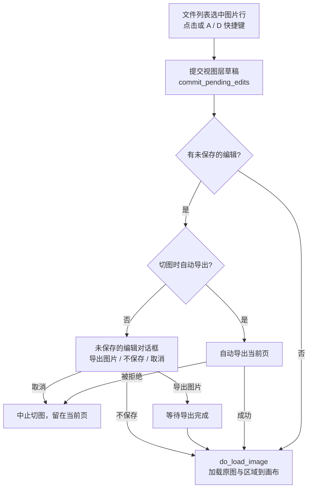

# 编辑器布局与文件列表

需要逐页调整翻译结果时，从左侧导航进入编辑器视图。编辑器一次只打开一张“当前页”，右侧文件列表就是这张页面的切换器：添加图片或文件夹、点击行切页、删除行，都会直接改变画布上的内容。本页说明进入编辑器的方式、四块布局分区，以及文件/页面列表的增删、选择、状态与切换流程。

顶栏菜单与常驻控件见[工具栏与菜单](./toolbar-and-menus.md)，画布工具与选区见[画布工具与选区](./canvas-tools-and-selection.md)，显示模式与排列见[显示、对比与排列](./display-compare-and-arrange.md)，左侧区域列表与文本编辑见[区域列表与文本编辑](./region-list-and-text-editing.md)，导入导出与回写见[导入导出与写回](./import-export-and-writeback.md)，快捷键见[快捷键](./shortcuts.md)。主页“翻译界面”的文件列表与编辑器文件列表的关系见[文件列表与输入](../translation/file-list-and-input.md)。

## 功能边界 {#feature-boundary}

- 本页负责编辑器视图的入口、布局分区和右侧文件/页面列表：添加文件、添加文件夹、清空列表、拖放、树形展开、行删除、已翻译/未翻译状态、当前页选择与 A/D 切页。
- 不负责顶栏三个下拉菜单、常驻控件和五个编辑开关的展开与持久化（归[工具栏与菜单](./toolbar-and-menus.md)）；不负责画布缩放、工具与选区（归[画布工具与选区](./canvas-tools-and-selection.md)）；不负责左侧区域列表的内容编辑（归[区域列表与文本编辑](./region-list-and-text-editing.md)）。
- 编辑器文件列表与主页文件列表共享同一套后台扫描服务，但运行时是两份独立列表：主页单项删除不会同步编辑器，只有主页“清空列表”才会清空编辑器。
- 一次只编辑一张图片；文件列表中的每个图片行就是一张“页”，点击或按快捷键切换的行会立刻加载到画布。

## UI 操作 {#ui-operations}

### 进入编辑器视图 {#enter-editor}

1. 点击左侧导航底部的“编辑器视图”（`Editor View`）：只切换视图，不重新加载文件列表；若还没有文件，列表显示空状态提示。
2. 在“翻译界面”（`Translation Interface`）的文件列表中双击任意图片：进入编辑器并直接加载该图片。
3. 翻译任务完成后，在弹出的“任务完成”（`Task Completed`）确认框中选择“是”：进入编辑器并打开结果对应的原图。该提示只在配置不处于 `translate_json_only`、`template`、`generate_and_export`、`colorize_only`、`upscale_only`、`inpaint_only` 等不兼容模式时显示；`replace_translation` 或 `load_text` 模式总是显示。

文件列表为空时显示占位提示；后台扫描期间显示“正在加载文件列表...”；扫描或解析出错时以红色文本显示错误信息。

### 布局分区 {#layout-zones}

编辑器视图由垂直排列的顶栏和下方横向分割器组成，分割器可拖动调整三块面板宽度。

| 分区 | 内容 | 布局行为 |
| --- | --- | --- |
| 顶栏 | “菜单”、“显示模式”、“排列”三个下拉菜单，以及“适应窗口”、“原图不透明度:”两个常驻控件 | 固定高度 `56` 像素；不随内容滚动 |
| 左栏 | “可编辑译文”与“属性编辑”两个路由页签；默认显示“属性编辑” | 最小宽度 `280` 像素，可拖动；属性编辑含文本、样式、操作与图像编辑区 |
| 中心 | 画布 `GraphicsView`；原图双栏对比预览容器 | 分割器伸展因子为 `1`，随窗口拉伸；对比预览默认隐藏，开启“显示模式 → 与原图对比（双栏）”后与画布并排 |
| 右栏 | “添加文件”、“添加文件夹”、“清空列表”三个按钮 + 文件树列表 | 宽度 `220`–`300` 像素；固定不随窗口拉伸 |

### 管理文件列表 {#manage-file-list}

1. 点击“添加文件”（`Add Files`）：弹出系统文件选择器，可多选图片；对话框标题“添加文件到编辑器”是源码中的硬编码中文，文件类型过滤器为 `Image Files (...)`（来自 `IMAGE_FILE_DIALOG_FILTER`）。
2. 点击“添加文件夹”（`Add Folder`）：弹出支持多选的文件夹选择器，选中后递归扫描文件夹内的全部支持图片并加入列表。
3. 点击“清空列表”（`Clear List`）：移除全部文件、清空画布并释放图片缓存。
4. 直接把文件或文件夹拖放到列表：等价于“添加文件/添加文件夹”。
5. 每一行显示：40×40 缩略图（未就绪时用文件夹/压缩包/文档图标代替）、文件名、状态点与“已翻译”/“未翻译”、行尾 `×` 删除按钮。文件夹节点可展开为树，子图片同样按已翻译/未翻译着色。
6. 点击图片行：该行成为当前页并加载到画布；点击文件夹行只展开/收起，不切页。

### 选择与切换页面 {#switch-page}

- 点击图片行切换页面；画布获得焦点时按 `A` / `D` 可切换到上一张 / 下一张（焦点在文本框时 `A` / `D` 被当作文字输入，见[快捷键](./shortcuts.md)）。
- 切换前如果有未保存的编辑：
  - “切图时自动导出”（`Auto Export on Image Switch`）开启（默认）：先自动导出当前页，导出被拒绝则中止切图；
  - 关闭：弹出“未保存的编辑”三按钮对话框，可“导出图片”（导出完成后继续切图）、“不保存”（丢弃后切图）或“取消”（留在当前页）。这三个按钮文字是源码中的硬编码中文，不随语言切换。

## 选项中英对照 {#options-i18n}

| UI 调用 key | English 实际值 | 简体中文实际值 |
| --- | --- | --- |
| `Editor View` | Editor View | 编辑器视图 |
| `Translation Interface` | Translation Interface | 翻译界面 |
| `Task Completed` | Task Completed | 任务完成 |
| `Translation completed, {count} files saved.\n\nOpen results in editor?` | Translation completed, {count} files saved.\n\nOpen results in editor? | 翻译完成，成功保存 {count} 个文件。\n\n是否在编辑器中打开结果？ |
| `Add Files` | Add Files | 添加文件 |
| `Add Folder` | Add Folder | 添加文件夹 |
| `Clear List` | Clear List | 清空列表 |
| `Editable Translation` | Editable Translation | 可编辑译文 |
| `Property Editor` | Property Editor | 属性编辑 |
| `Translated` | Translated | 已翻译 |
| `Untranslated` | Untranslated | 未翻译 |
| `Find` | Find | 查找 |
| `Replace with` | Replace with | 替换为 |
| `Replace All` | Replace All | 全部替换 |
| `Apply All Translation Changes` | Apply All Translation Changes | 应用所有译文修改 |
| `Fit to Window` | Fit to Window | 适应窗口 |
| `Original Image Opacity:` | Original Image Opacity: | 原图不透明度: |
| `Auto Export on Image Switch` | Auto Export on Image Switch | 切图时自动导出 |
| `Drag and drop files or folders here\nor click the buttons above to add` | （缺失，回退显示 key 原文） | （缺失，回退显示 key 原文） |
| `正在加载文件列表...` | （缺失，回退显示 key 原文） | （缺失，回退显示 key 原文） |

表中 `\n` 表示 key 里的换行符。空状态占位和加载提示两个 key 在 `en_US.json` 与 `zh_CN.json` 中都不存在，`I18nManager` 回退显示 key 原文：空状态提示因此以英文显示，加载提示以中文显示，且不随语言切换改变。“添加文件”对话框标题“添加文件到编辑器”和“未保存的编辑”三按钮文字是源码硬编码中文，不属于 locale key，同样不随语言切换。

## 运行机理 {#runtime-behavior}

### 文件快照与后台扫描 {#snapshot-and-scan}

- 文件列表由 `FileListDataService` 在后台线程构建不可变快照（`FileCatalogSnapshot`），GUI 线程只接收结果；扫描期间列表进入加载状态，取消或清空会递增代号并丢弃过期快照。
- 编辑器使用快照的 `images_only()` 投影：递归保留图片和文件夹节点，过滤掉压缩包节点；压缩包（`.pdf`、`.epub`、`.cbz`、`.cbr`、`.zip`）在主页文件列表中可见，但不会进入编辑器的页面列表。
- 支持的图片扩展名来自 `manga_translator/image_formats.py#SUPPORTED_IMAGE_EXTENSIONS`：`.png`、`.jpg`、`.jpeg`、`.jfif`、`.webp`、`.avif`、`.bmp`、`.tiff`、`.tif`、`.heic`、`.heif`。
- 排序使用文件名自然排序（数字段按数值比较，其余按大小写折叠的文本比较）。
- 缩略图按可见行异步加载（40×40，`QImageReader` 优先、PIL 兜底），结果缓存在内存中（上限 200 项）；行数据只来自内存快照，不在 GUI 线程访问磁盘。
- 图片行是否显示“已翻译”由该文件是否关联到 `*_translations.json` 元数据（`json_path`）决定，不是由图片内容决定。

### 页面加载与切换流程 {#load-and-switch-flow}

首次添加文件且列表为空时，`load_first` 标记会让第一张图片在快照就绪后自动加载；从主页双击文件或从“任务完成”进入时，则按目标路径加载。每次加载前还会提交浮动编辑器防抖期内的草稿，避免刚打完字就切页丢失内容。

### 删除与清空 {#remove-and-clear}

- 点击行尾 `×` 删除：先从视图移除，再把该路径加入排除集合（文件夹加入 `excluded_folders`，图片加入 `excluded_files`），后台重建快照后保持删除结果；删除的正是当前页时，画布状态会被清空。
- “清空列表”（`Clear List`）：取消后台扫描、清空源路径与排除集合、清空画布状态并释放图片缓存。
- 主页“翻译界面”清空文件列表时，主窗口会同步调用编辑器的 `clear_list()`；主页单项删除不会同步编辑器的文件列表，但如果删除的正是当前加载的图片（或包含它的文件夹），编辑器会清空画布状态。

## 依赖与冲突 {#dependencies-and-conflicts}

- 编辑器文件列表独立于主页列表，因此同一文件在元数据刷新后，“已翻译”状态与主页缩略图列表可能短暂不一致；快照重建后重新一致。
- 切页自动导出依赖导出队列：自动导出被拒绝会中止切图；手动选择“导出图片”时切图会等待导出完成。导出细节见[导入导出与写回](./import-export-and-writeback.md)。
- 文件列表只把图片行作为页面；压缩包与不支持扩展名的文件不会出现在编辑器页面列表，不能作为编辑器页面打开。
- 未翻译的图片可以正常加载到画布编辑，仅记录日志警告；再次运行翻译生成 JSON 后，行状态会变为“已翻译”。
- 空列表、加载中、错误三种列表状态分别显示占位提示、加载文字和红色错误信息；语言切换只刷新“已翻译/未翻译”等 locale 文案，占位与加载提示因缺 key 不刷新。
- 左栏默认显示“属性编辑”；切到“可编辑译文”页签会先刷新待提交的区域编辑，防止列表行与画布数据不一致。

## 关联文件与格式 {#related-files-and-formats}

| 文件/格式 | 本页实际作用 | 手改与兼容注意 |
| --- | --- | --- |
| `*.png`、`*.jpg`、`*.jpeg`、`*.jfif`、`*.webp`、`*.avif`、`*.bmp`、`*.tiff`、`*.tif`、`*.heic`、`*.heif` | 编辑器支持的页面图片格式 | 扩展名必须属于 `SUPPORTED_IMAGE_EXTENSIONS`，否则不会加入页面列表 |
| `*_translations.json` | 决定图片行“已翻译/未翻译”状态（`json_path`） | 元数据由翻译流水线生成；只记录存在性，不展示内容 |
| `.pdf`、`.epub`、`.cbz`、`.cbr`、`.zip` | 主页可见的压缩包；编辑器投影过滤 | 不进入编辑器页面列表，不能作为页面加载 |
| `config/config.json`（`app.editor_auto_export_on_switch` 等） | 切图自动导出开关的持久化 | 默认 `true`；Qt 模型与发行示例一致 |
| `desktop_qt_ui/locales/en_US.json` / `zh_CN.json` | 本页全部 UI 调用 key 的翻译 | 占位/加载提示缺 key，如实标记回退 |

## Mermaid 数据流限制 {#mermaid-limits}

上图描述的是源码确认的切页数据流，不代表每次切页都会触发导出或网络请求：没有未保存编辑时直接加载，自动导出被拒绝或用户选择“取消”都会中止切页。本页没有伪造运行截图或私有任务产物；布局分区表只说明源码中的固定宽度、最小宽度与伸展因子，不代表运行时窗口的实际像素值。

## 源码依据 {#source-evidence}

| 层级 | 文件 | 本页核对内容 |
| --- | --- | --- |
| 导航/入口 | `desktop_qt_ui/ui/main_window.py` | `Editor View` 底部导航注册、双击进编辑器、任务完成提示与 `enter_editor_mode` |
| 编辑器视图 | `desktop_qt_ui/ui/editor/view.py` | 顶栏/左栏/中心/右栏四块分区、分割器与伸展因子、文件按钮与列表接线、语言刷新 |
| 文件列表控件 | `desktop_qt_ui/ui/widgets/file_list_view.py` | 行内容（缩略图、状态、`×`）、空/加载/错误状态、`file_selected` 与 `files_dropped`、A/D 选择 |
| 列表逻辑 | `desktop_qt_ui/editor/editor_logic.py` | 添加文件/文件夹、清空、删除排除集合、`load_first`、快照应用 |
| 后台扫描 | `desktop_qt_ui/services/file_list_data_service.py`、`desktop_qt_ui/editor/file_list_model.py` | 不可变快照、`images_only()`、自然排序、图片/文件夹/压缩包分类 |
| 切页服务 | `desktop_qt_ui/editor/controller_document_service.py` | `load_image_and_regions`、脏检查、自动导出/三按钮对话框、延迟加载 |
| UI/i18n | `desktop_qt_ui/locales/en_US.json`、`zh_CN.json`、`desktop_qt_ui/services/i18n_service.py` | key 映射、缺失回退行为与实际中英文显示值 |
| 格式定义 | `manga_translator/image_formats.py` | `SUPPORTED_IMAGE_EXTENSIONS` 与文件对话框过滤器 |

## 验证记录 {#verification}

| 验证内容 | 状态 | 说明 |
| --- | --- | --- |
| BLUEPRINT、PAGE_GUIDELINES、TODO | 完成 | 已完整读取并按页面合同编写（1.3 节、5.10 小节） |
| UI 布局与调用 | 完成 | 静态核对 `main_window.py`、`view.py`、`file_list_view.py`、`editor_logic.py` |
| `en_US` / `zh_CN` 实际 locale | 完成 | 页面表格逐项记录 key、English、简体中文实际值；缺失 key 如实标记回退 |
| 切页运行链 | 完成 | 静态核对 `controller_document_service.py` 的脏检查、自动导出与三按钮对话框分支 |
| 脱敏运行验证 | 待后续 | 本页未读取真实用户图片、私有路径、密钥或任务产物；有头模式截图由后续阶段采集 |
| VitePress | 待运行 | 由协调代理在合并前运行 `npm run docs:build --prefix doc/wiki` 及镜像/源码检查 |
